# 08 — PCL Component System Architecture

This document provides Mermaid diagrams illustrating the PYRAMID Container Library (PCL)
component system: its layered architecture, communication patterns, and deployment
configurations with different communication bindings.

---

## 1. PCL Layer Stack

The PCL separates application logic from middleware through three distinct concerns:
**components** encapsulate business logic and own their ports/parameters, the
**executor** drives one or more components on a single thread, and **transport
adapters** are injected at composition time to bridge ports to external middleware.

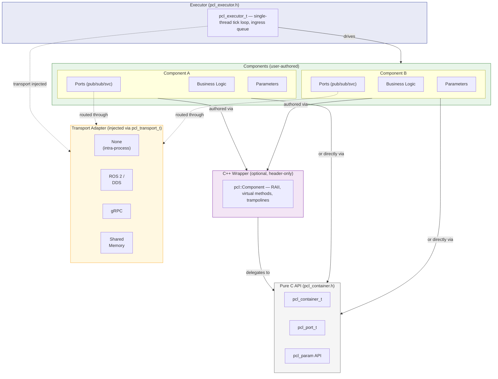

---

## 2. Container & Executor Internal Architecture

Each container encapsulates one component's business logic behind a lifecycle state
machine. The executor drives one or more containers on a single thread, guaranteeing
deterministic callback ordering.

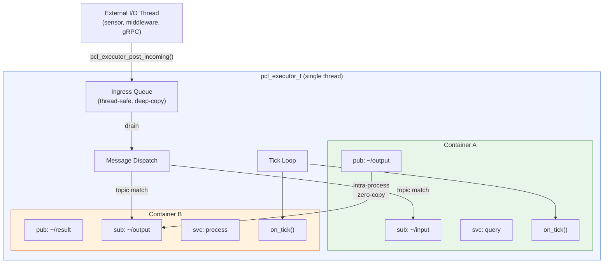

---

## 3. Component Lifecycle State Machine

All containers follow a strict lifecycle compatible with ROS 2 managed nodes.
Ports are created during `on_configure`; ticking only occurs while `ACTIVE`.

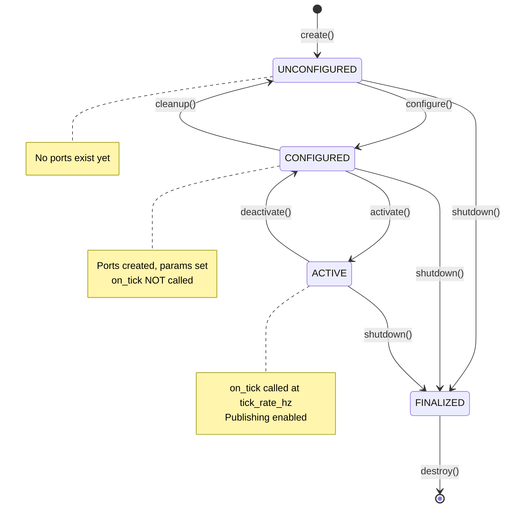

---

## 4. Port & Communication Model

Components communicate through typed ports. The transport adapter layer determines
whether messages stay in-process or cross a network boundary.

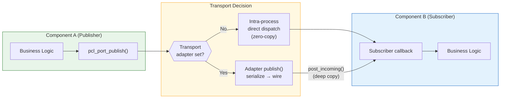

---

## 5. Bridge Pattern

A bridge is a managed container that subscribes to one topic, applies a transform,
and dispatches the result to a different topic — enabling unit conversion, encoding
changes, and protocol translation without modifying either endpoint.

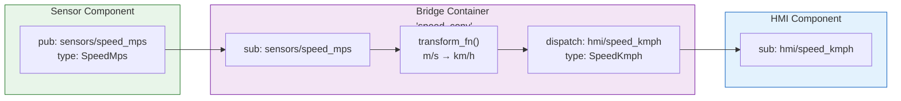

---

## 6. Deployment Example — Single Process, No Middleware

All components share one executor. Communication is intra-process
zero-copy. No transport adapter is set. This is the simplest deployment, suitable
for testing, simulation, and embedded targets.

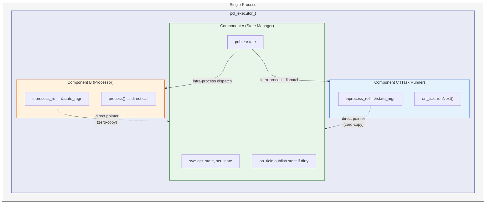

---

## 7. Deployment Example — ROS 2 Transport Binding

Each component runs in its own executor (potentially in separate processes or nodes).
A ROS 2 transport adapter bridges PCL ports to DDS topics and services. Components
use service callbacks instead of direct pointers, receiving state snapshots over the wire.

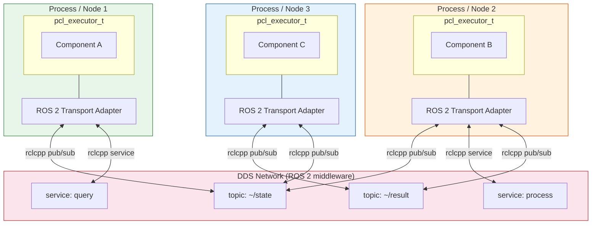

---

## 8. Deployment Example — Mixed Bindings with Bridges

A realistic deployment where some components are co-located (sharing an executor for
zero-copy speed) while others are distributed over different transports. Bridges
handle protocol translation at system boundaries.

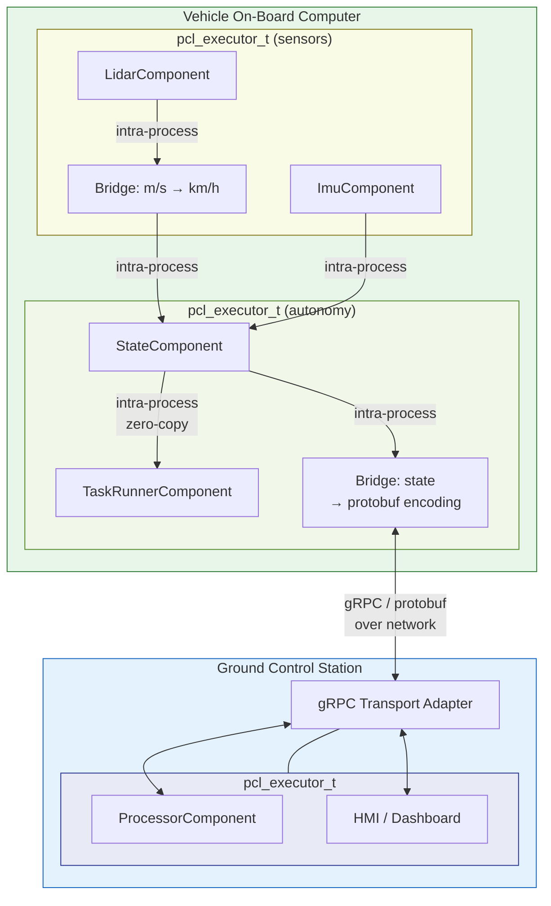

---

## 9. Deployment Example — Ada / C Cross-Language Binding

The pure-C ABI enables components written in different languages to share an executor.
An Ada sensor component links against the same `libpcl` as the C++ autonomy components.

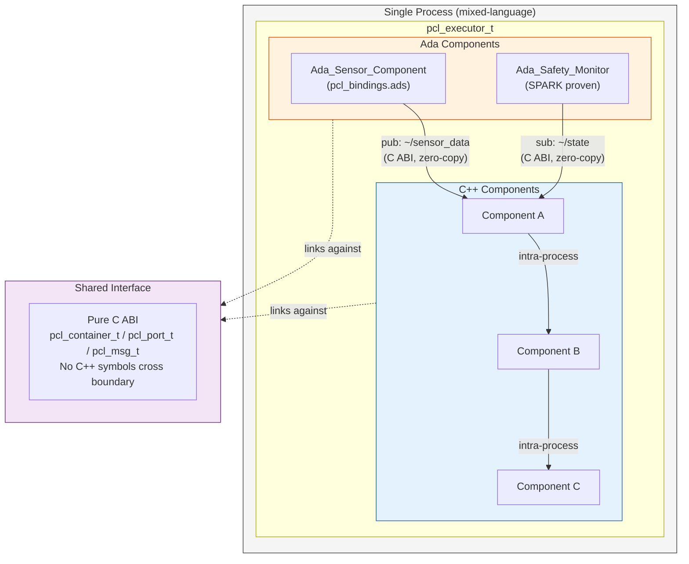

---

## 10. Transport Adapter Vtable

The transport adapter is a simple vtable of four function pointers. Implementing a
new transport binding requires only filling in this struct.

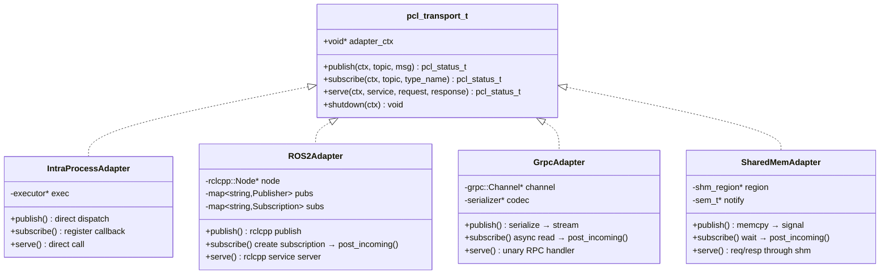

---

## 11. Message Flow Through the Stack

End-to-end message flow from a publisher in one component to a subscriber in another,
showing how the transport adapter layer intercepts when present.

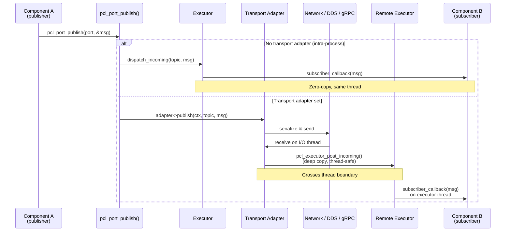

---

## 12. Implementation References

| Concept | Implementation |
|---------|----------------|
| PCL C API | `include/pcl/pcl_container.h`, `src/pcl/pcl_container.c` |
| C++ wrapper | `include/pcl/component.hpp` |
| AME components using PCL | `include/ame/world_model_component.h`, `include/ame/planner_component.h` |
| ROS2 node wrappers | `ros2/src/nodes/world_model_node.cpp`, `ros2/src/nodes/planner_node.cpp` |
| In-process ROS2 example | `ros2/src/apps/combined_main.cpp` — all nodes share one executor, zero-copy |
| ROS2 integration docs | `doc/architecture/06-ros2.md` |
