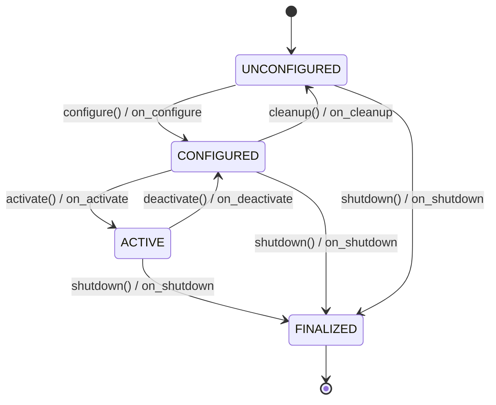

# Component Container Design — ROS2-Compatible, C-ABI Deployable

## 1. Problem Statement

The mujin codebase currently has two deployment modes:

1. **Standalone** (`src/main.cpp`) — direct library calls, no middleware
2. **ROS2** (`ros2/src/combined_main.cpp`) — lifecycle nodes, `SingleThreadedExecutor`, service IPC

Both share the same core libraries (`WorldModel`, `Planner`, `PlanCompiler`), but the node/container abstraction is entirely ROS2-specific (`rclcpp_lifecycle::LifecycleNode`). This means:

- Deploying without ROS2 requires ad-hoc `main()` wiring
- Ada and bare-metal C++ consumers cannot use the ROS2 node model
- The lifecycle state machine (configure → activate → deactivate → cleanup) is tightly coupled to `rclcpp`

**Goal:** Define a standard **Component Container** that:

- Provides a lifecycle state machine and single-threaded executor for business logic
- Treats service I/O (ROS2, DDS, shared memory, sockets) as a pluggable adapter
- Exposes a **C-ABI** so that Ada, C++, and C consumers can all use it
- Can be wrapped trivially as a ROS2 node (backward-compatible)

---

## 2. Design Principles

| # | Principle | Rationale |
|---|-----------|-----------|
| P1 | **Logic owns the thread** | Business logic runs on exactly one thread (the executor). No internal mutexes needed. |
| P2 | **I/O is injected** | Transport adapters (ROS2, DDS, sockets, shared-mem) are set via function pointers / vtable, not compiled in. |
| P3 | **C-ABI at the boundary** | All public symbols are `extern "C"` with opaque handles. C++ internals are hidden behind the ABI wall. |
| P4 | **Lifecycle is explicit** | Components follow a state machine: `UNCONFIGURED → CONFIGURED → ACTIVE → FINALIZED`. Same states as ROS2 lifecycle but no rclcpp dependency. |
| P5 | **Zero-copy where possible** | Intra-process communication between containers in the same executor uses pointer handoff, not serialization. |

---

## 3. Architecture Overview

```
┌─────────────────────────────────────────────────────────┐
│                    Executor (single thread)              │
│                                                         │
│  ┌──────────────┐  ┌──────────────┐  ┌──────────────┐  │
│  │  Container A  │  │  Container B  │  │  Container C  │  │
│  │ ┌──────────┐ │  │ ┌──────────┐ │  │ ┌──────────┐ │  │
│  │ │  Logic   │ │  │ │  Logic   │ │  │ │  Logic   │ │  │
│  │ │ (user)   │ │  │ │ (user)   │ │  │ │ (user)   │ │  │
│  │ └────┬─────┘ │  │ └────┬─────┘ │  │ └────┬─────┘ │  │
│  │      │       │  │      │       │  │      │       │  │
│  │ ┌────▼─────┐ │  │ ┌────▼─────┐ │  │ ┌────▼─────┐ │  │
│  │ │ Port I/O │ │  │ │ Port I/O │ │  │ │ Port I/O │ │  │
│  │ └──────────┘ │  │ └──────────┘ │  │ └──────────┘ │  │
│  └──────────────┘  └──────────────┘  └──────────────┘  │
│                                                         │
│  ┌─────────────────────────────────────────────────┐    │
│  │         Transport Adapter (pluggable)            │    │
│  │   ROS2 / DDS / SharedMem / Socket / Lattice     │    │
│  └─────────────────────────────────────────────────┘    │
└─────────────────────────────────────────────────────────┘
```

---

## 4. Core C API

### 4.1 Opaque Handles

```c
/* mujin_container.h */
#include <stdint.h>
#include <stdbool.h>

#ifdef __cplusplus
extern "C" {
#endif

/* Opaque handles */
typedef struct mcl_executor_t  mcl_executor_t;
typedef struct mcl_container_t mcl_container_t;
typedef struct mcl_port_t      mcl_port_t;

/* Return codes */
typedef enum {
    MCL_OK             = 0,
    MCL_ERR_INVALID    = -1,
    MCL_ERR_STATE      = -2,   /* wrong lifecycle state for this operation */
    MCL_ERR_TIMEOUT    = -3,
    MCL_ERR_CALLBACK   = -4,   /* user callback returned error */
    MCL_ERR_NOMEM      = -5,
} mcl_status_t;

/* Lifecycle states */
typedef enum {
    MCL_STATE_UNCONFIGURED = 0,
    MCL_STATE_CONFIGURED   = 1,
    MCL_STATE_ACTIVE       = 2,
    MCL_STATE_FINALIZED    = 3,
} mcl_state_t;
```

### 4.2 Lifecycle Callbacks (User Implements)

```c
/* User-provided callbacks — all called on the executor thread */
typedef struct {
    mcl_status_t (*on_configure)(mcl_container_t* self, void* user_data);
    mcl_status_t (*on_activate)(mcl_container_t* self, void* user_data);
    mcl_status_t (*on_deactivate)(mcl_container_t* self, void* user_data);
    mcl_status_t (*on_cleanup)(mcl_container_t* self, void* user_data);
    mcl_status_t (*on_shutdown)(mcl_container_t* self, void* user_data);

    /* Periodic tick — called at configured rate while ACTIVE */
    mcl_status_t (*on_tick)(mcl_container_t* self, double dt_seconds,
                            void* user_data);
} mcl_callbacks_t;
```

### 4.3 Container Lifecycle

```c
/* Create / destroy */
mcl_container_t* mcl_container_create(const char* name,
                                       const mcl_callbacks_t* callbacks,
                                       void* user_data);
void mcl_container_destroy(mcl_container_t* c);

/* Lifecycle transitions */
mcl_status_t mcl_container_configure(mcl_container_t* c);
mcl_status_t mcl_container_activate(mcl_container_t* c);
mcl_status_t mcl_container_deactivate(mcl_container_t* c);
mcl_status_t mcl_container_cleanup(mcl_container_t* c);
mcl_status_t mcl_container_shutdown(mcl_container_t* c);

mcl_state_t  mcl_container_state(const mcl_container_t* c);
const char*  mcl_container_name(const mcl_container_t* c);

/* Parameters (key-value config) */
mcl_status_t mcl_container_set_param_str(mcl_container_t* c,
                                          const char* key, const char* value);
mcl_status_t mcl_container_set_param_f64(mcl_container_t* c,
                                          const char* key, double value);
mcl_status_t mcl_container_set_param_i64(mcl_container_t* c,
                                          const char* key, int64_t value);
mcl_status_t mcl_container_set_param_bool(mcl_container_t* c,
                                           const char* key, bool value);

const char*  mcl_container_get_param_str(const mcl_container_t* c,
                                          const char* key,
                                          const char* default_val);
double       mcl_container_get_param_f64(const mcl_container_t* c,
                                          const char* key, double default_val);
```

### 4.4 Port I/O (Service & Pub/Sub)

```c
/* Port types */
typedef enum {
    MCL_PORT_PUBLISHER   = 0,
    MCL_PORT_SUBSCRIBER  = 1,
    MCL_PORT_SERVICE     = 2,   /* request-reply server */
    MCL_PORT_CLIENT      = 3,   /* request-reply client */
} mcl_port_type_t;

/* Message buffer — user owns the data, container borrows it */
typedef struct {
    const void*  data;
    uint32_t     size;
    const char*  type_name;      /* e.g. "WorldState", "GetFact_Request" */
} mcl_msg_t;

/* Subscriber callback — called on executor thread */
typedef void (*mcl_sub_callback_t)(mcl_container_t* c,
                                    const mcl_msg_t* msg,
                                    void* user_data);

/* Service handler — called on executor thread, must fill response */
typedef mcl_status_t (*mcl_service_handler_t)(mcl_container_t* c,
                                               const mcl_msg_t* request,
                                               mcl_msg_t* response,
                                               void* user_data);

/* Create ports (during on_configure or on_activate) */
mcl_port_t* mcl_container_add_publisher(mcl_container_t* c,
                                         const char* topic,
                                         const char* type_name);
mcl_port_t* mcl_container_add_subscriber(mcl_container_t* c,
                                          const char* topic,
                                          const char* type_name,
                                          mcl_sub_callback_t cb,
                                          void* user_data);
mcl_port_t* mcl_container_add_service(mcl_container_t* c,
                                       const char* service_name,
                                       const char* type_name,
                                       mcl_service_handler_t handler,
                                       void* user_data);

/* Publish (from on_tick or service handler) */
mcl_status_t mcl_port_publish(mcl_port_t* port, const mcl_msg_t* msg);
```

### 4.5 Executor

```c
/* Executor — runs one or more containers on a single thread */
mcl_executor_t* mcl_executor_create(void);
void            mcl_executor_destroy(mcl_executor_t* e);

mcl_status_t mcl_executor_add(mcl_executor_t* e, mcl_container_t* c);

/* Spin — blocks, runs all containers' ticks and I/O callbacks in round-robin */
mcl_status_t mcl_executor_spin(mcl_executor_t* e);

/* Spin once — process pending work, return immediately */
mcl_status_t mcl_executor_spin_once(mcl_executor_t* e, uint32_t timeout_ms);

/* Request shutdown (thread-safe, can be called from signal handler) */
void mcl_executor_request_shutdown(mcl_executor_t* e);

#ifdef __cplusplus
}
#endif
```

---

## 5. Design Options

### Option A: Callback-Only (shown above)

**How it works:** User provides a `mcl_callbacks_t` struct of function pointers. The container calls them at the right moments. All state is in `user_data`.

| Pros | Cons |
|------|------|
| Minimal API surface | User must manage all state via `void*` |
| Trivially callable from Ada, C, C++ | No compile-time type safety on ports |
| No vtable / inheritance | Slightly more boilerplate per component |
| ABI-stable by construction | |

**Ada usage sketch:**
```ada
procedure On_Configure(Self : System.Address; User_Data : System.Address)
  return Interfaces.C.int
  with Convention => C;

Callbacks : aliased mcl_callbacks_t := (
  on_configure  => On_Configure'Access,
  on_activate   => On_Activate'Access,
  on_tick       => On_Tick'Access,
  others        => null
);
Container : mcl_container_t_Access := mcl_container_create("wm", Callbacks'Access, ...);
```

---

### Option B: C++ Abstract Base Class + C Wrapper

**How it works:** A C++ `IComponent` abstract class provides the ergonomic authoring interface. A thin C wrapper (`mujin_container.h`) auto-generates from the vtable.

```cpp
// component.hpp (C++ authoring API)
namespace mcl {

class IComponent {
public:
    virtual ~IComponent() = default;

    virtual Status on_configure() { return Status::OK; }
    virtual Status on_activate()  { return Status::OK; }
    virtual Status on_deactivate(){ return Status::OK; }
    virtual Status on_cleanup()   { return Status::OK; }
    virtual Status on_shutdown()  { return Status::OK; }
    virtual Status on_tick(double dt) { return Status::OK; }

    // Port creation helpers (call during on_configure)
    Publisher  add_publisher(std::string_view topic, std::string_view type);
    Subscriber add_subscriber(std::string_view topic, std::string_view type,
                              std::function<void(const MessageView&)> cb);
    ServiceServer add_service(std::string_view name, std::string_view type,
                              ServiceHandler handler);

    // Parameter access
    template<typename T>
    T param(std::string_view key, T default_val = {}) const;

protected:
    // Set by container framework
    std::string name_;
    ParameterMap params_;
    PortRegistry ports_;
};

} // namespace mcl
```

The C API wraps this:
```c
/* Generated / hand-written shim */
mcl_container_t* mcl_container_create_from_cpp(mcl::IComponent* component);
```

| Pros | Cons |
|------|------|
| Natural C++ authoring with RAII, templates, type safety | C++ vtable layout is compiler-specific (not strictly ABI-stable) |
| Existing mujin code ports 1:1 (lifecycle methods match) | Must provide separate C shim for Ada/C consumers |
| Less boilerplate per component | Two API surfaces to maintain |

---

### Option C: Hybrid — C ABI Core + C++ Header-Only Helpers

**How it works:** The library itself is pure C ABI (Option A). A **header-only** C++ wrapper provides ergonomics for C++ users. Ada/C use the raw C API directly.

```cpp
// mcl/component.hpp — header-only C++ convenience wrapper
namespace mcl {

class Component {
public:
    Component(std::string_view name) {
        mcl_callbacks_t cbs = {};
        cbs.on_configure = [](mcl_container_t* c, void* ud) -> mcl_status_t {
            return static_cast<Component*>(ud)->on_configure();
        };
        cbs.on_activate = [](mcl_container_t* c, void* ud) -> mcl_status_t {
            return static_cast<Component*>(ud)->on_activate();
        };
        cbs.on_tick = [](mcl_container_t* c, double dt, void* ud) -> mcl_status_t {
            return static_cast<Component*>(ud)->on_tick(dt);
        };
        // ... other callbacks
        handle_ = mcl_container_create(name.data(), &cbs, this);
    }

    virtual ~Component() { mcl_container_destroy(handle_); }

    // Override these
    virtual mcl_status_t on_configure() { return MCL_OK; }
    virtual mcl_status_t on_activate()  { return MCL_OK; }
    virtual mcl_status_t on_tick(double dt) { return MCL_OK; }
    // ...

    mcl_container_t* handle() { return handle_; }

private:
    mcl_container_t* handle_;
};

} // namespace mcl
```

| Pros | Cons |
|------|------|
| Single ABI (pure C) — maximum portability | Stateless C function pointers can't capture context without `void*` (solved by wrapper) |
| C++ ergonomics via header-only layer (zero link cost) | Slightly more indirection vs Option B |
| Ada/C use the same binary | Header-only layer must be careful with ODR |
| ABI never breaks between C++ compiler versions | |

> [!IMPORTANT]
> **Recommendation:** Option C (Hybrid) is the recommended approach. It gives ABI stability for Ada/C/C++ consumers while providing ergonomic C++ authoring. The ROS2 adapter then wraps the C API, not the C++ layer.

---

## 6. Transport Adapter Layer

The container's ports produce/consume `mcl_msg_t` (opaque byte buffers + type name). A **transport adapter** connects these to the real middleware:

```
Container Port ──mcl_msg_t──► Transport Adapter ──► Wire
                                   │
                          ┌────────┼────────┐
                          ▼        ▼        ▼
                        ROS2    SharedMem  Socket
```

### 6.1 Adapter Interface

```c
typedef struct {
    /* Called when container publishes — adapter sends to wire */
    mcl_status_t (*publish)(void* adapter_ctx, const char* topic,
                            const mcl_msg_t* msg);

    /* Called by adapter when message arrives — dispatches to subscriber cb */
    /* (adapter calls mcl_executor_dispatch_incoming internally) */

    /* Service routing */
    mcl_status_t (*serve)(void* adapter_ctx, const char* service_name,
                          const mcl_msg_t* request, mcl_msg_t* response);

    void* adapter_ctx;
} mcl_transport_t;

mcl_status_t mcl_executor_set_transport(mcl_executor_t* e,
                                         const mcl_transport_t* transport);
```

### 6.2 ROS2 Adapter (Backward Compatibility)

```cpp
// ros2_adapter.cpp — wraps mcl containers as rclcpp_lifecycle::LifecycleNode
class Ros2Adapter {
public:
    Ros2Adapter(rclcpp::executors::SingleThreadedExecutor& ros_exec,
                mcl_executor_t* mcl_exec);

    // Wraps each mcl_container_t as a LifecycleNode with matching services/pubs
    void bridge(mcl_container_t* container);

    // Pumps mcl_executor_spin_once from a ROS2 timer callback
    void spin_integrated();
};
```

This means existing `mujin_ros2` nodes can be **incrementally migrated**: rewrite the logic as an `mcl` component, then wrap with `Ros2Adapter` for the same ROS2 topic/service API.

---

## 7. Lifecycle State Machine

Matches ROS2 managed-node states but with no rclcpp dependency:



**Executor tick loop** (while `ACTIVE`):

```
while (!shutdown_requested) {
    t_now = clock();
    dt = t_now - t_prev;

    for each container in executor:
        if container.state == ACTIVE:
            process_incoming_messages(container)   // dispatch subscriber callbacks
            process_service_requests(container)     // dispatch service handlers
            container.callbacks.on_tick(container, dt, user_data)

    sleep_until(next_tick)  // configurable rate, default 100 Hz
}
```

All callbacks execute on the **single executor thread** — no mutexes needed in user code.

---

## 8. Serialization Strategy

Ports exchange `mcl_msg_t` (pointer + size + type name). The question is **who serializes?**

### Option S1: User Serializes (CDR / Protobuf / FlatBuffers / custom)

The container is format-agnostic. The `data` field is an opaque byte buffer. Each transport adapter knows how to route bytes.

| Pros | Cons |
|------|------|
| Container library has zero serialization dependencies | User must serialize/deserialize manually |
| Maximum flexibility (CDR for ROS2, Protobuf for gRPC, raw structs for shared-mem) | More boilerplate |

### Option S2: Built-in Schema + Codegen

Define a `.mcl` schema (or reuse `.msg` / `.proto`), generate C structs + serialize/deserialize functions.

| Pros | Cons |
|------|------|
| Type-safe, ergonomic | New codegen tool to maintain |
| Could generate ROS2 `.msg` and C struct from same source | |

### Option S3: POD Structs with Layout Descriptor

Pass plain C structs between containers. A compile-time layout descriptor enables the transport adapter to serialize when crossing process boundaries.

```c
typedef struct {
    uint64_t wm_version;
    bool     value;
    bool     found;
} GetFactResponse;

/* Layout descriptor for transport adapters */
static const mcl_field_desc_t GetFactResponse_fields[] = {
    { "wm_version", MCL_TYPE_U64,  offsetof(GetFactResponse, wm_version) },
    { "value",      MCL_TYPE_BOOL, offsetof(GetFactResponse, value) },
    { "found",      MCL_TYPE_BOOL, offsetof(GetFactResponse, found) },
    { NULL, 0, 0 }
};
```

| Pros | Cons |
|------|------|
| Zero-copy intra-process (just pass pointer) | Structs must be POD (no strings without special handling) |
| No codegen tool needed | Need reflection/descriptor for each type |
| C and Ada can define the same struct layout | |

> [!TIP]
> **Recommendation:** Start with **S1** (user serializes) for maximum flexibility. Add **S3** (POD + descriptors) as an optional convenience layer for common message types. This keeps the core minimal while supporting zero-copy intra-process.

---

## 9. Mapping Existing Mujin Components

| Current ROS2 Node | Container Equivalent | Ports |
|--------------------|---------------------|-------|
| `WorldModelNode` | `wm_container` | Services: `get_fact`, `set_fact`, `query_state`. Publisher: `world_state` |
| `PlannerNode` | `planner_container` | Action (modeled as service): `plan`. Client: `query_state` |
| `ExecutorNode` | `executor_container` | Subscriber: `bt_xml`. Publisher: `bt_events`, `status`. Clients: `get_fact`, `set_fact` |
| `MujinLifecycleManager` | `mcl_executor` (lifecycle transitions are built-in) | N/A — executor handles lifecycle |

**Migration path for `WorldModelNode`:**

```c
mcl_status_t wm_on_configure(mcl_container_t* c, void* ud) {
    WorldModelData* d = (WorldModelData*)ud;
    const char* domain = mcl_container_get_param_str(c, "domain.pddl_file", "");
    const char* problem = mcl_container_get_param_str(c, "domain.problem_file", "");
    /* parse PDDL, init WorldModel... */

    d->pub_state = mcl_container_add_publisher(c, "world_state", "WorldState");
    mcl_container_add_service(c, "get_fact", "GetFact", wm_handle_get_fact, ud);
    mcl_container_add_service(c, "set_fact", "SetFact", wm_handle_set_fact, ud);
    return MCL_OK;
}

mcl_status_t wm_on_tick(mcl_container_t* c, double dt, void* ud) {
    WorldModelData* d = (WorldModelData*)ud;
    if (d->state_dirty) {
        mcl_msg_t msg = serialize_world_state(d);
        mcl_port_publish(d->pub_state, &msg);
        d->state_dirty = false;
    }
    return MCL_OK;
}
```

---

## 10. Open Questions for Discussion

| # | Question | Impact |
|---|----------|--------|
| Q1 | **Tick rate per container or per executor?** Per-container allows different rates (e.g., WM at 10 Hz, executor at 50 Hz) but adds complexity. | API complexity |
per container
| Q2 | **Action servers** (long-running async operations) — model as services with feedback callbacks, or as a dedicated port type? | API surface |
see protocol_agnostic_service_plan.md
| Q3 | **Logging** — provide a `mcl_log()` C function or leave to user? If provided, should it integrate with ROS2's `RCLCPP_INFO` via the adapter? | Dependency footprint |
yes, provide a `mcl_log()` C function that integrates with ROS2's `RCLCPP_INFO` via the adapter
| Q4 | **Dynamic port creation** — allow adding ports after `on_configure`? ROS2 allows this, but it complicates the transport adapter binding. | Flexibility vs. simplicity |
no, ports are created at configure time
| Q5 | **Thread-safe shutdown** — `mcl_executor_request_shutdown()` is signal-safe. Should there be a graceful shutdown with timeout that calls `on_deactivate` → `on_shutdown`? | Safety |
yes, graceful shutdown with timeout that calls `on_deactivate` → `on_shutdown`
| Q6 | **Should the C API use `mcl_` prefix (mujin container library) or something more generic?** | Naming / reusability |
use pcl (PYRAMID container library) instead of mcl

---

## 11. Comparison Summary

| Dimension | Option A (Callback) | Option B (C++ ABC) | **Option C (Hybrid)** |
|-----------|--------------------|--------------------|----------------------|
| Ada compatible | ✅ Direct | ⚠️ Via C shim | ✅ Direct (C API) |
| C compatible | ✅ Native | ⚠️ Via C shim | ✅ Native |
| C++ ergonomics | ⚠️ Manual | ✅ Virtual methods | ✅ Header-only wrapper |
| ABI stability | ✅ Stable | ❌ Fragile | ✅ Stable |
| ROS2 wrappable | ✅ Yes | ✅ Yes | ✅ Yes |
| Maintenance cost | Low | Medium | Low |

> [!IMPORTANT]
> **Overall recommendation:** Option C (Hybrid C ABI + C++ header-only wrapper) with serialization strategy S1+S3 (user-serialized with optional POD descriptors). This gives ABI stability, multi-language support, and ROS2 backward compatibility with minimal maintenance overhead.
