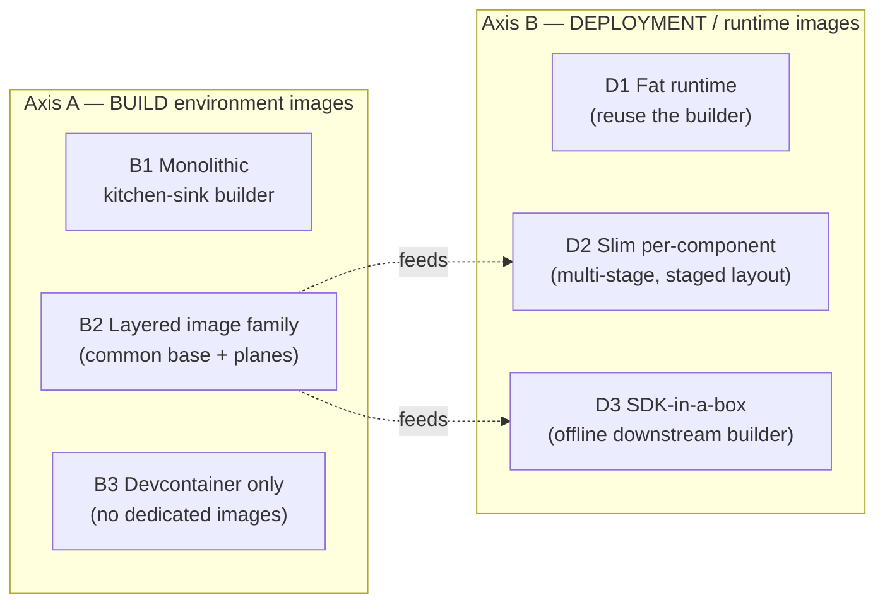
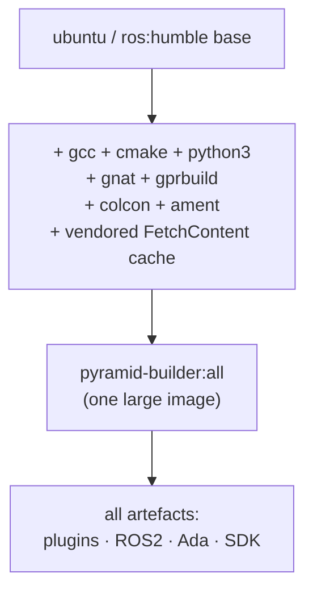
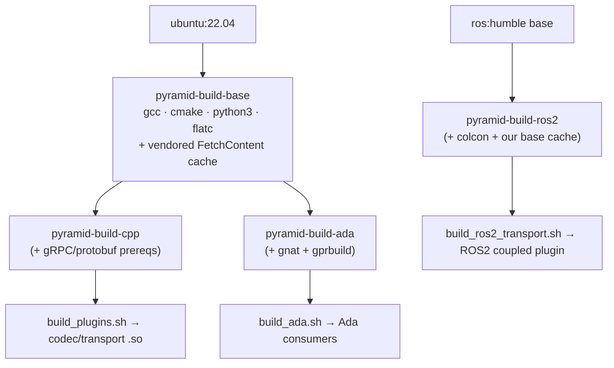
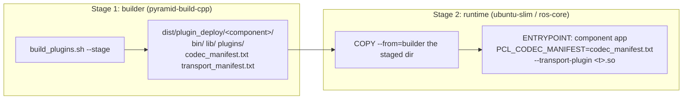
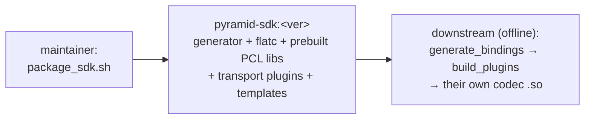
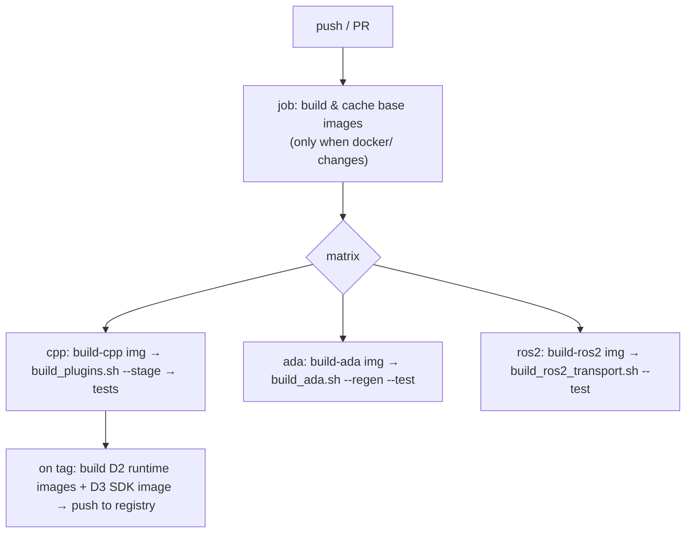
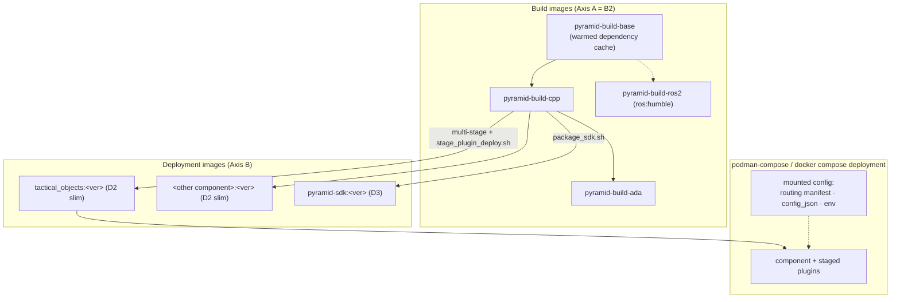

# Docker Build Environment & Deployment Plan for PYRAMID Components

**Status:** proposed (2026-07-19) — not yet scheduled. This document
discusses the design options, recommends one, and lays out a phased path. No
container files have been added to the tree yet; the file layout in
[§9](#9-proposed-repository-layout) is a proposal.

**Scope owner:** PYRAMID build/deploy.

**Related design references:**

- [`build_artefacts.md`](../../../subprojects/PYRAMID/doc/architecture/build_artefacts.md)
  — the map of every build artefact and every deployment configuration file.
- [`transport_codec_plugin_system.md`](../../../subprojects/PYRAMID/doc/architecture/transport_codec_plugin_system.md)
  — plugin ABI, the loader, and per-component deployment staging.
- [`sdk_packaging.md`](../../../subprojects/PYRAMID/doc/architecture/sdk_packaging.md)
  — the existing offline SDK path for firewalled downstream projects.
- [`ams_gra_starter_kit_bringup.md`](../../../subprojects/PYRAMID/doc/guides/ams_gra_starter_kit_bringup.md)
  — the podman/podman-compose world PYRAMID components are expected to join.

---

## 1. Purpose

We want a **reproducible, container-based build environment** and a
**consistent way to package PYRAMID components as deployable images**. Today a
new engineer or a CI runner has to install a multi-language toolchain by hand,
and there is no agreed way to ship a running component. This plan proposes how
Docker (and OCI containers generally) should cover both halves of that gap.

Two separate problems are in scope, and this plan treats them separately
because they have different constraints:

1. **Build environment.** A container image that carries the whole toolchain
   so that "check out the repo, run one command, get the artefacts" works the
   same on a laptop, a CI runner, and an air-gapped build host.
2. **Deployment.** Container images that carry a *built* PYRAMID component plus
   the plugins and configuration it needs to run, ready to drop into a
   `compose` (or podman-compose) deployment alongside the other services.

### What "PYRAMID components" means here

From [`build_artefacts.md`](../../../subprojects/PYRAMID/doc/architecture/build_artefacts.md),
the things we might containerize are:

| Artefact class | Examples | Container relevance |
|----------------|----------|---------------------|
| Component apps | `tactical_objects_app` | The main **deployment** target — a long-running process. |
| Bridge/demo executables | `standalone_bridge`, `pyramid_bridge_evidence_client` | Deployable, usually paired with a component. |
| Codec plugins (`.so`) | `pyramid_codec_json_<component>` | Not standalone; **staged into** a component image's `plugins/`. |
| Transport plugins (`.so`) | `pcl_transport_socket_plugin`, `pyramid_ros2_coupled_plugin` | Same — staged, config-selected, loaded at run time. |
| Offline SDK | `dist/pcl_pyramid_sdk` | A candidate for its own **builder** image so firewalled downstreams build their own plugins. |

The load-bearing fact from the architecture docs is that **a component links
only the framework and its generated contract; codecs and transports arrive as
loaded `.so` plugins selected by configuration**. A deployment image therefore
is not "one binary" — it is a binary plus a staged plugin set plus manifests.
The existing `scripts/stage_plugin_deploy.sh` already produces exactly this
layout, and the runtime image should mirror it rather than invent a new one.

---

## 2. Current state and constraints

**What exists today**

- The primary supported toolchain is **Windows / MSVC / Visual Studio 2022**
  (see the root `CLAUDE.md` and `CMakePresets.json`). Docker on Linux cannot
  reproduce that toolchain, so containers cover the **Linux** build paths, not
  the Windows one.
- A complete set of Linux build scripts already exists and is written to be
  CI-usable — each has a "CI example" line in its header:
  - `scripts/build_plugins.sh` — `.proto` → core + codec/transport plugins.
  - `scripts/build_ros2_transport.sh` — the colcon/ament ROS2 plane.
  - `scripts/build_ada.sh` — the GNAT/gprbuild Ada consumers.
  - `scripts/stage_plugin_deploy.sh` — per-component deployment staging.
  - `scripts/package_sdk.sh` — the offline SDK.
- **No `Dockerfile`, no `docker-compose`, and no CI workflow exist yet**
  (`.github/workflows/` is absent).

**Constraints that shape every option below**

1. **Three distinct toolchain planes.** They do not share a base cleanly:
   - *Plain-CMake C++ plane:* a C/C++ compiler, CMake, Python 3 (standard
     library only, for the binding generator), FlatBuffers. Optional gRPC and
     Protobuf are **fetched from source on first configure** and are the
     slowest, most network-heavy part of a build.
   - *ROS2 plane:* needs a sourced ROS2 (the scripts default to
     `/opt/ros/humble`), `colcon`, and `ament`. This effectively forces a
     ROS2 base image.
   - *Ada plane:* needs `gnat` and `gprbuild` on `PATH`.
2. **Air-gap is a first-class requirement.** Real deployment targets are
   firewalled. `FetchContent` pulling LAPKT, BT.CPP, googletest, FlatBuffers,
   gRPC, and Protobuf from git during configure is exactly what the offline
   SDK exists to avoid. Any build image must be able to build **without**
   network access after it is first assembled.
3. **The target ecosystem uses OCI + podman.** The AMS-GRA starter kit is
   pulled and run with **podman / podman-compose** from a GitLab registry, and
   every component publishes a `:latest` tag. Our images must be OCI images
   that run under both `docker` and `podman`, and should be publishable to a
   registry the same way.
4. **Fail-closed runtime.** With no codec plugin for a content type or no
   transport for a route, the loader fails with a diagnostic — it never falls
   back silently. A deployment image that is missing a plugin must fail loudly
   at start, which is the behaviour we want and should test for.

---

## 3. The two axes, and how the options map onto them



The two axes are chosen independently. The recommendation is **B2 + D2**, with
**D3** added as a complementary deliverable for firewalled downstream
consumers. The sections below discuss each option before the recommendation.

---

## 4. Axis A — build environment images

### Option B1 — Monolithic "kitchen-sink" builder

One image with every toolchain installed: C/C++, CMake, Python, FlatBuffers,
gRPC/Protobuf prerequisites, a full ROS2 install, and GNAT/gprbuild.



| Pros | Cons |
|------|------|
| One image to learn, pull, and cache. | Large (ROS2 + GNAT + gRPC toolchain in one layer set — several GB). |
| Any build path works without picking an image. | A change to one plane rebuilds/re-pulls the whole image. |
| Simplest CI matrix (one container). | Couples unrelated toolchains; the C++-only path drags in ROS2 it does not need. |

### Option B2 — Layered image family (recommended)

A small **common base** (OS + C/C++ + CMake + Python + the vendored dependency
cache) plus thin **plane images** that add only what their plane needs. The
ROS2 plane starts from the official `ros:humble` base rather than adding ROS2
to ours.



| Pros | Cons |
|------|------|
| Each plane image is small and rebuilds independently. | More images to define and tag (a small `docker/` matrix). |
| The common base's vendored dependency cache is shared by every plane. | Slightly more CI wiring (choose the image per job). |
| ROS2 plane reuses the official, maintained `ros:humble` base. | Two base lineages (ours + `ros:humble`) to keep in step. |
| Matches how the `.sh` scripts already split the work. | |

This mirrors the existing script split one-for-one, which is why it is the
recommendation: `build_plugins.sh` → `build-cpp`, `build_ada.sh` →
`build-ada`, `build_ros2_transport.sh` → `build-ros2`.

### Option B3 — Devcontainer only (no dedicated build images)

Ship a `.devcontainer/devcontainer.json` and a documented `apt install` list;
do not publish builder images. Engineers get a reproducible local environment,
but CI and air-gapped hosts still install the toolchain from scratch every
time.

| Pros | Cons |
|------|------|
| Least to build and maintain. | No air-gap story — still pulls the toolchain from the network. |
| Good IDE/local-dev ergonomics. | CI re-installs the toolchain on every run (slow, flaky). |
| | Does not by itself produce deployment images. |

**Recommendation for Axis A: B2.** It matches the existing script boundaries,
keeps images small, gives each plane an independent rebuild cadence, and the
common base is where we solve the air-gap problem once (see [§6](#6-air-gap--offline-strategy)).
A devcontainer (the useful half of B3) can be added on top of B2 later for
local-dev ergonomics — the two are not exclusive.

---

## 5. Axis B — deployment / runtime images

### Option D1 — Fat runtime (reuse the builder image)

Run the component out of the builder image itself.

| Pros | Cons |
|------|------|
| Zero extra Dockerfile work. | Ships compilers, headers, and the whole toolchain into production — large attack surface and image size. |
| | The ROS2/GNAT toolchain has no business in a runtime image. |

Acceptable only as a throwaway smoke-test convenience, not for deployment.

### Option D2 — Slim per-component runtime, multi-stage (recommended)

A multi-stage build: the **builder stage** (a B2 image) compiles and runs
`stage_plugin_deploy.sh`; the **runtime stage** starts from a slim base
(`ubuntu:22.04-slim`, or `ros:humble-ros-core` for a ROS2 component) and copies
in **only** the staged deployment directory. The result is the
`stage_plugin_deploy` layout, unchanged, inside a minimal image.



Runtime configuration is injected, never baked, so one image serves every
deployment (this is the "the component binary is identical in every
deployment" rule from `build_artefacts.md`):

| Config | How it enters the container |
|--------|-----------------------------|
| Per-plugin `config_json`, routing manifest | Bind-mount / compose `volumes:` or a config `configMap`-style mount. |
| `PCL_CODEC_MANIFEST`, `PCL_TRANSPORT_PLUGIN`, `PYRAMID_CODEC_PLUGINS` | compose `environment:`. |
| ROS2 env (`AMENT_PREFIX_PATH`, `RMW_IMPLEMENTATION`) | Set in the `ros-core` runtime layer + compose. |

| Pros | Cons |
|------|------|
| Small, minimal runtime surface. | One Dockerfile pattern per component (mitigated by a shared template + build arg for the component name). |
| Reuses `stage_plugin_deploy.sh` verbatim — no new layout. | Two-stage build takes longer than D1 (cache mitigates). |
| Fail-closed loading is preserved and testable at container start. | ROS2 components need the `ros-core` base, so there are two runtime bases. |

### Option D3 — SDK-in-a-box image (complementary, for firewalled downstreams)

Package the output of `package_sdk.sh` into an image so a downstream, firewalled
project builds **its own** codec plugins from **its own** `.proto` tree, with no
access to this monorepo and no network. This is the container form of the
existing offline SDK story.



This is not a substitute for D2 — it serves a different audience (external
component authors) — but it is cheap to add once the SDK build runs in a
container, and it directly serves the firewalled-target constraint.

**Recommendation for Axis B: D2 as the standard deployment image, plus D3 as a
published SDK image.** D1 is allowed only for local smoke tests.

---

## 6. Air-gap / offline strategy

This is the highest-risk part of the plan and deserves an explicit decision.
The problem: a normal CMake configure fetches LAPKT, BT.CPP, googletest,
FlatBuffers, and (optionally) gRPC/Protobuf from git, and gRPC-from-source is
slow. Air-gapped build hosts cannot do this.

Three complementary mechanisms, in preference order:

1. **Warm the dependency cache into the common base image (B2).** During the
   base image build (which *does* have network), run one throwaway configure so
   `FetchContent` populates a cache directory, then keep that directory in the
   image and point later builds at it (`FETCHCONTENT_BASE_DIR` /
   `FETCHCONTENT_FULLY_DISCONNECTED=ON`). After that, builds inside the image
   need no network. This is the primary mechanism and lives entirely in the
   base image.
2. **Ship images as tarballs** (`docker save` / `podman save`) for hosts with
   no registry access, mirroring how the starter kit distributes images.
3. **Use the SDK image (D3)** for the downstream case where even our source
   tree is not present — the SDK already vendors everything the plugin build
   needs.

Open question to settle in Phase 2: whether to pre-warm gRPC/Protobuf into the
base (large) or keep the base gRPC-free and only warm it in `pyramid-build-cpp`
when `--grpc` builds are needed. Recommendation: keep gRPC out of the common
base, warm it in the `-cpp` image only, since the JSON/FlatBuffers path is the
common case and gRPC roughly doubles base size.

---

## 7. CI integration

The `.sh` scripts are already CI-shaped, so CI is mostly "run the script in the
right image". A GitHub Actions matrix (or GitLab CI, to match the AMS-GRA
registry world) would look like:



Key points:

- Base/plane images rebuild **only** when `docker/` or dependency pins change,
  and are pulled from the registry otherwise — this is where the layered B2
  approach pays off.
- Runtime (D2) and SDK (D3) images are built and pushed **on tag/release**,
  publishing a `:latest` and a version tag per component, matching the
  starter-kit registry convention.
- Both `docker` and `podman` should be exercised at least in a smoke job, since
  the deployment world is podman.

---

## 8. Recommended architecture (synthesis)



The through-line: **B2 builds feed D2/D3 images; a component image is the
`stage_plugin_deploy` layout on a slim base; configuration is mounted at deploy
time, never baked.**

---

## 9. Proposed repository layout

New files this plan would add (none exist yet):

```
docker/
  base.Dockerfile            # pyramid-build-base (+ warmed FetchContent cache)
  cpp.Dockerfile             # pyramid-build-cpp   (FROM base; optional gRPC)
  ada.Dockerfile             # pyramid-build-ada   (FROM base; + gnat/gprbuild)
  ros2.Dockerfile            # pyramid-build-ros2  (FROM ros:humble)
  component.Dockerfile       # D2 multi-stage; ARG COMPONENT=<name>
  sdk.Dockerfile             # D3 SDK-in-a-box
  compose/
    tactical_objects.yml     # reference podman-compose / docker compose
    config/                  # sample routing manifest + config_json mounts
  README.md                  # how to build/run each image; podman notes
.dockerignore
.github/workflows/
  containers.yml             # base/plane matrix + release publish
```

`.dockerignore` matters: the repo's `build*/` and `dist/` directories are large
and must be excluded from the build context.

---

## 10. Phased implementation

| Phase | Deliverable | Exit criterion |
|-------|-------------|----------------|
| 0 | Scope + decisions: confirm B2+D2+D3, Ubuntu 22.04 / ROS2 Humble, target arch(s), registry choice. | This document reviewed and the open questions in §11 answered. |
| 1 | `pyramid-build-base` + `pyramid-build-cpp`; run `build_plugins.sh --stage` in-container; first D2 image for `tactical_objects_app`. | `docker run` (and `podman run`) starts the component; a missing plugin fails closed as expected. |
| 2 | Air-gap: warm the FetchContent cache into the base; prove a `FETCHCONTENT_FULLY_DISCONNECTED` build with the network disabled. | A build succeeds with `--network none`. |
| 3 | `pyramid-build-ros2` (colcon/ament) and `pyramid-build-ada` (gnat/gprbuild); their `--test` scripts pass in-container. | ROS2 and Ada CTest labels pass inside their images. |
| 4 | CI workflow: plane matrix, image caching, release publish of D2 images with `:latest` + version tags. | Green CI on PR; a tag publishes images to the registry. |
| 5 | `docker/compose/` reference deployment + config mounts; `sdk.Dockerfile` (D3); `docker/README.md`. | `compose up` brings up a component reachable over its configured transport; the SDK image builds a downstream plugin offline. |

---

## 11. Risks and open questions

- **Windows/MSVC is out of scope for containers.** Docker on Linux does not
  reproduce the primary MSVC toolchain. Containers cover the Linux build paths
  only; MSVC parity stays on native Windows CI (a separate effort). This must
  be stated up front so nobody expects the container build to be the Windows
  build.
- **Target architecture(s).** x86-64 is assumed. If any deployment target is
  arm64, the base and plane images need multi-arch (`buildx`) builds — decide
  in Phase 0.
- **Registry.** The AMS-GRA world uses a GitLab container registry; GitHub
  Container Registry (GHCR) is the natural default for this repo. Pick one in
  Phase 0 so tags and CI target it.
- **ROS2 image size and base lineage.** The ROS2 plane rides `ros:humble`, a
  second base lineage to keep patched alongside ours.
- **gRPC-from-source build time** dominates a cold `--grpc` build; the §6
  decision (warm gRPC only in `-cpp`) keeps it out of the common path.
- **Rootless podman gotchas.** UID mapping and volume permissions differ from
  Docker; the compose reference and CI smoke should exercise podman explicitly,
  and images should run as a non-root user.
- **Config authorship.** Per `build_artefacts.md`, production plugin
  `config_json` and routing manifests are authored by the deployer. The
  container plan provides the mount points and env wiring; it does not
  auto-generate production routing.

---

## 12. Summary

Adopt a **layered builder image family (B2)** whose common base solves the
air-gap problem once by warming the CMake dependency cache; produce
**slim, multi-stage per-component runtime images (D2)** that are just the
existing `stage_plugin_deploy` layout on a minimal base with configuration
mounted at deploy time; and publish an **SDK-in-a-box image (D3)** for
firewalled downstream component authors. Keep everything OCI-correct so it runs
under both `docker` and `podman`, matching the ecosystem the components deploy
into. The existing Linux `.sh` scripts are the build steps — the containers
just give them a reproducible home.
