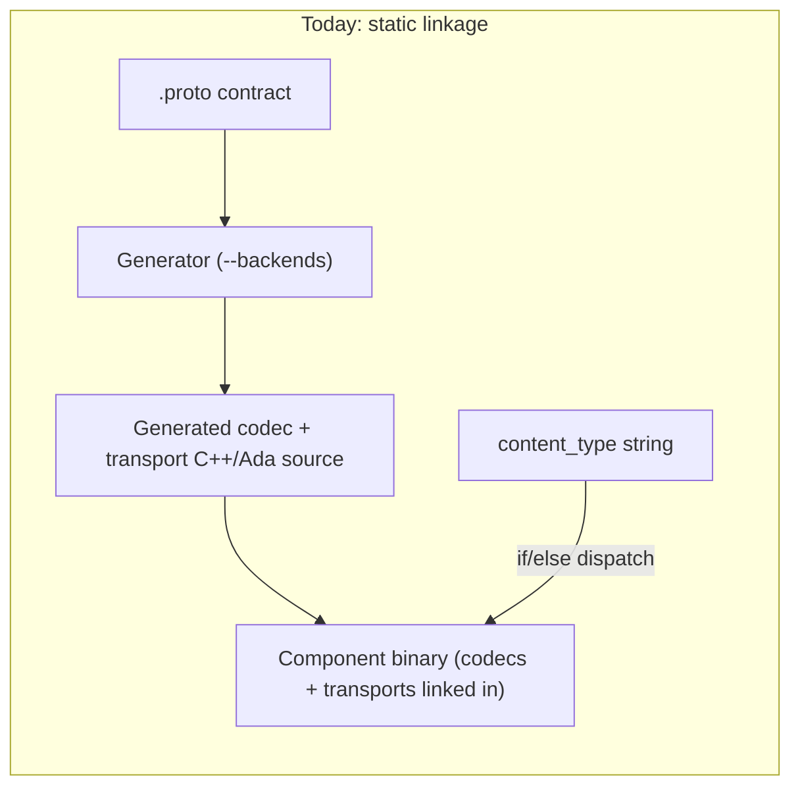
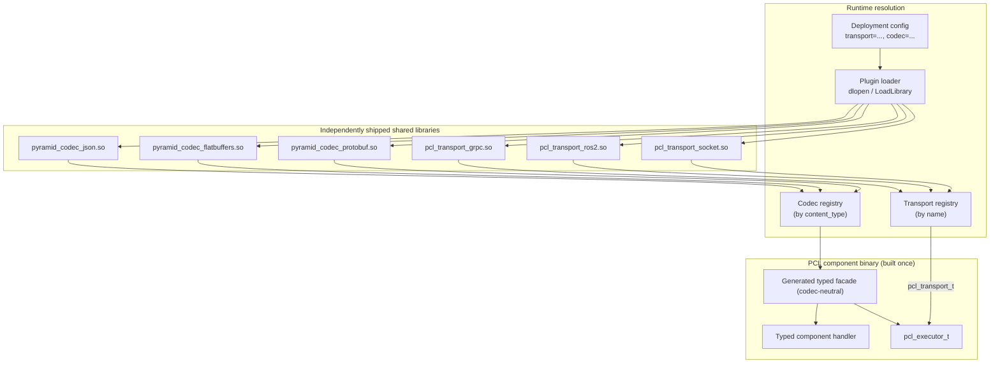

# Transport / Codec Plugin (DLL) Transition

## Purpose

This report describes how PYRAMID/PCL could transition from the current
**build-time, statically linked** transport and codec model to a **runtime
plugin / shared-library (DLL/.so)** model, so that the transport and the codec
used by a deployed component can be swapped **without rebuilding the PCL
component**.

It is a design exploration and migration proposal, not a committed backlog. It
builds on the current binding-generation architecture documented in
[`subprojects/PYRAMID/doc/architecture/pcl_pyramid_binding_generation_overview.md`](../../../subprojects/PYRAMID/doc/architecture/pcl_pyramid_binding_generation_overview.md)
and the PCL transport interface in
[`subprojects/PCL/include/pcl/pcl_transport.h`](../../../subprojects/PCL/include/pcl/pcl_transport.h).

## Motivation

Today, choosing a codec (JSON, FlatBuffers, Protobuf) or a transport projection
(gRPC, ROS2) means selecting generator backends, then **compiling and linking
the generated sources into the component**. Changing the wire format or the
middleware for a fielded component requires a recompile and redeploy of that
component.

The goal is a model where:

- A PCL component binary is built **once** against stable interfaces.
- Transport and codec implementations ship as **separate, independently
  versioned shared libraries**.
- An operator or integrator selects transport + codec **by configuration** at
  deployment time, and the runtime loads the matching plugin(s).
- Adding a new transport or codec does **not** force a rebuild of existing
  components.

This matters most for: late-binding to a customer's middleware, swapping wire
formats for bandwidth/latency tuning, A/B testing transports, and shipping a
component to a repository that integrates the contract separately.

## Current State (2026-06-22)

### What is already abstracted

The transport layer is in good shape for plugins because the seam already
exists. `pcl_transport_t` is a **C ABI vtable** of function pointers
(`publish`, `serve`, `subscribe`, `invoke_async`, `respond`, `invoke_stream`,
`stream_send`, `stream_end`, `stream_cancel`, `shutdown`) plus an opaque
`adapter_ctx`. It is installed at runtime via:

- `pcl_executor_set_transport(e, transport)` — default adapter
- `pcl_executor_register_transport(e, peer_id, transport)` — named peers

PCL deliberately moves opaque `pcl_msg_t` buffers and knows nothing about
PYRAMID schemas. This is exactly the boundary a plugin needs: **the executor
already accepts a transport implementation as data, not as a compile-time
dependency.** What is missing is a stable way to *load* that vtable from a
shared library and *configure* it by name.

The generator side is also well-factored: `codec_backends.py` defines an
abstract `CodecBackend` with a name + `content_type` and a registry
(`register` / `get` / `all_backends`). But this registry is a **build-time**
construct in the Python generator. It decides what source to emit; it is not
present at C++ runtime.

### What is static today

- **Codecs are compiled in.** Generated codecs
  (`pyramid_data_model_*_codec.*`, `flatbuffers/`, `protobuf/`) are emitted as
  C++/Ada source and linked into the component. Runtime codec selection is a
  hardcoded `content_type` string `if/else` over those statically linked
  symbols (see `tests/test_codec_dispatch_e2e.cpp`,
  `serializeEvidence` / `deserializeEvidence`). There is **no runtime codec
  registry** — no `register_codec` / `dlopen` / `LoadLibrary` anywhere in the
  C++ tree.
- **Transport projections are compiled in.** gRPC and ROS2 are generated
  transport projections compiled into the build. Although `pcl_transport_t`
  itself is runtime-installable, the concrete adapters and their generated glue
  are statically linked.
- **Backend selection is a build input.** `generate_bindings.py --backends ...`
  decides what gets generated and therefore what the CMake glob compiles.



The net effect: **the set of codecs and transports a component can use is
frozen at link time.**

## Target Architecture

Introduce two stable runtime extension points behind C ABIs, each backed by a
loadable shared library, plus a small runtime registry and a config-driven
loader.



### 1. Codec plugin ABI

The codec is the larger gap, because no runtime codec interface exists yet.
Define a C ABI codec vtable analogous to `pcl_transport_t`, keyed by
`content_type`:

```c
/* pcl_codec.h (proposed) */
typedef struct {
  uint32_t    abi_version;     /* PCL_CODEC_ABI_VERSION at build time */
  const char* content_type;    /* "application/json", etc. */

  /* Encode a typed value (identified by schema_id) into msg->payload. */
  pcl_status_t (*encode)(void* codec_ctx, const char* schema_id,
                         const void* value, pcl_msg_t* out_msg);

  /* Decode msg->payload (schema_id) into a caller-allocated typed value. */
  pcl_status_t (*decode)(void* codec_ctx, const char* schema_id,
                         const pcl_msg_t* msg, void* out_value);

  void* codec_ctx;
} pcl_codec_t;

/* Single exported entry point each codec DLL provides. */
const pcl_codec_t* pcl_codec_plugin_entry(void);
```

The hard problem the codec ABI must solve is the **typed value boundary**.
Generated facades today hand the codec a concrete C++/Ada type. Crossing a DLL
boundary by `void*` + `schema_id` requires a schema-stable, language-neutral
in-memory representation. Three candidate strategies, in increasing decoupling:

| Strategy | How values cross the ABI | Trade-off |
|----------|--------------------------|-----------|
| **A. Per-type codec exports** | Generator emits one DLL per (contract, codec) exposing typed `encode_<Type>` symbols resolved by name | Simplest, preserves typing; DLL is still contract-specific, but codec swap no longer needs the *component* rebuilt |
| **B. Reflective POD layout** | Generator emits a stable C-struct layout + a field descriptor table; codec walks the table | One codec DLL handles all contracts; needs a frozen layout/descriptor format |
| **C. Canonical intermediate** | Facade lowers typed value to a canonical tree (e.g. a tagged-union document); codec serializes the tree | Maximum decoupling; adds a lowering pass and a copy per call |

**Recommendation: start with Strategy A.** It delivers the headline goal
(swap codec/transport without rebuilding the *component*) with the least ABI
risk, keeps full typing, and reuses the existing generated codec bodies almost
verbatim — they just move from "linked into the component" to "exported from a
codec DLL." Strategy B/C can follow if a single contract-agnostic codec binary
becomes a requirement.

### 2. Transport plugin ABI

Transport needs far less work: `pcl_transport_t` **is already the ABI.** Add
only:

- A versioned exported entry point per transport DLL:
  ```c
  uint32_t           pcl_transport_abi_version(void);
  const pcl_transport_t* pcl_transport_plugin_entry(const char* config_json);
  ```
- A name → DLL mapping so config can say `transport = "grpc"`.

The existing generated gRPC/ROS2 adapters move behind this entry point and ship
as `pcl_transport_grpc.so` / `pcl_transport_ros2.so`. PCL's intra-process
default stays statically linked as the fallback when no plugin is configured.

### 3. Runtime registry + loader

A thin loader (in `pcl_core`, no PYRAMID knowledge) reads deployment config,
resolves plugin filenames, `dlopen`/`LoadLibrary`s them, checks `abi_version`,
calls the entry point, and registers the returned vtable:

- Codecs register by `content_type` into a codec registry the facade consults
  instead of its current `if/else`.
- Transports register by name and are installed via the existing
  `pcl_executor_set_transport` / `register_transport`.

Prior art exists in-tree: `gnatcoll-plugins` (used by the vendored GNATcoll)
already wraps `dlopen`/`LoadLibrary` for the Ada side, which the Ada bindings
can reuse rather than inventing a loader.

## Build System Changes

- Add `pcl_codec.h` / `pcl_transport` plugin headers to the stable public API
  surface; freeze and version them.
- Emit each codec/transport as an `add_library(... MODULE)` (or `SHARED`)
  target instead of folding generated sources into the component library.
- Default presets keep building the in-process transport and (at least) the
  JSON codec statically so a component still runs with **zero plugins present**.
- `PYRAMID_GENERATE_CPP_BINDINGS` / `PYRAMID_CPP_BINDINGS_DIR` semantics extend
  to optionally produce **plugin** outputs vs. linked-in outputs, selected by a
  new option (e.g. `PYRAMID_CODEC_PLUGINS=ON`).
- Install rules place plugins in a discoverable directory
  (`<prefix>/lib/pcl/plugins/`) with a manifest the loader reads.

## Generator Changes

The generator already separates backends cleanly (`codec_backends.py`), so the
change is mostly in *emission target*, not in logic:

- Each backend additionally emits a plugin wrapper: the `pcl_codec_plugin_entry`
  (Strategy A: typed `encode_<Type>`/`decode_<Type>` exports) and the CMake
  `MODULE` target.
- Transport backends (gRPC, ROS2) emit the `pcl_transport_plugin_entry` wrapper
  around the existing adapter.
- The generated **facade stays codec-neutral** — it already is; it would call
  the codec registry rather than a statically chosen codec. This preserves the
  invariant that component business logic never changes across transport/codec
  choices.

## Migration Phases

1. **Freeze the ABIs.** Land `pcl_codec.h`, version macros, and the transport
   plugin entry points. No behavior change; everything still linked statically.
2. **Runtime codec registry.** Replace the `content_type` `if/else` in the
   facade/dispatch with a registry, still populated by statically linked
   `register` calls. Behavior-preserving; this is the highest-value refactor and
   de-risks the rest.
3. **Transport plugin loading.** Move gRPC/ROS2 adapters behind the plugin entry
   point and load them via config. Transport ABI already exists, so this is
   low-risk and proves the loader end to end.
4. **Codec plugin loading (Strategy A).** Emit per-(contract, codec) codec DLLs;
   load by `content_type`. Component no longer links codec bodies.
5. **(Optional) Contract-agnostic codecs (Strategy B/C).** Only if a single
   codec binary across contracts is required.

Each phase is independently shippable and leaves the system runnable.

## Risks and Trade-offs

- **ABI stability.** A plugin boundary is a long-lived contract. `pcl_msg_t`,
  `pcl_status_t`, and the codec/transport structs must become
  carefully-versioned, C-only, layout-stable types. `abi_version` checks at load
  time are mandatory; mismatches must fail closed.
- **Safety / certification.** This codebase targets MIL-STD / assured-autonomy
  contexts. Dynamic loading complicates supply-chain integrity, reproducible
  builds, and static analysis. Mitigations: signed/manifested plugins, an
  allow-list of plugin paths, and a **fully static build mode retained** for
  certified deployments (plugins become a packaging option, not a mandate).
- **Performance.** Indirect calls and a possible value-lowering copy
  (Strategy B/C) add overhead on the hot serialization path. Strategy A avoids
  the lowering copy. The existing
  `tests/test_binding_performance.cpp` baseline should gate any regression.
- **Typed value boundary.** As above — the central technical challenge for
  codecs. Strategy A sidesteps it; B/C must define and freeze a layout.
- **Versioning matrix.** Component, contract, codec plugin, and transport plugin
  now version independently. A loader-enforced compatibility manifest is needed
  to prevent silent mismatch.
- **Distribution.** More artifacts to build, sign, package, and install; the
  install layout + manifest format becomes part of the product.

## Testing Strategy

- **ABI conformance tests** per plugin: load, version-check, round-trip encode
  /decode and publish/serve through the loaded vtable.
- **Swap tests**: build one component binary, run the existing
  `CodecDispatch` / `Ros2TransportSemantics` / `tobj_*` suites against it with
  **different plugins loaded by config**, asserting identical handler-level
  behavior — the concrete proof of "swap without rebuild."
- **Negative tests**: missing plugin, ABI-version mismatch, unknown
  `content_type`/transport name must fail closed with clear diagnostics.
- **Performance gate**: extend `test_binding_performance.cpp` to compare static
  vs. plugin paths.
- **Fallback test**: component with zero plugins present runs on the static
  in-process transport + JSON codec.

## Recommendation

The transport half is largely a packaging-and-loader exercise because
`pcl_transport_t` is already a runtime-installable C vtable. The codec half is
the real design work, and **Strategy A (per-type codec exports) plus a runtime
codec registry** is the lowest-risk way to reach the goal of swapping
transport/codec without rebuilding PCL components. Sequence the work as Phases
1–4, keep a static build mode for certified/assured deployments, and treat the
plugin headers as a frozen, versioned ABI from day one.

## Key Files

| Area | Files |
|------|-------|
| Transport ABI (existing seam) | `subprojects/PCL/include/pcl/pcl_transport.h` |
| Message/type ABI to freeze | `subprojects/PCL/include/pcl/pcl_types.h` |
| Static codec dispatch (to replace) | `subprojects/PYRAMID/tests/test_codec_dispatch_e2e.cpp` |
| Generator backend registry | `subprojects/PYRAMID/pim/codec_backends.py`, `subprojects/PYRAMID/pim/backends/` |
| Generator entry point | `subprojects/PYRAMID/pim/generate_bindings.py` |
| Binding/transport overview | `subprojects/PYRAMID/doc/architecture/pcl_pyramid_binding_generation_overview.md` |
| Performance baseline | `subprojects/PYRAMID/tests/test_binding_performance.cpp` |
| Ada plugin-loading prior art | `subprojects/PYRAMID/core/external/gnatcoll-core/core/src/gnatcoll-plugins__*.adb` |
</content>
</invoke>
