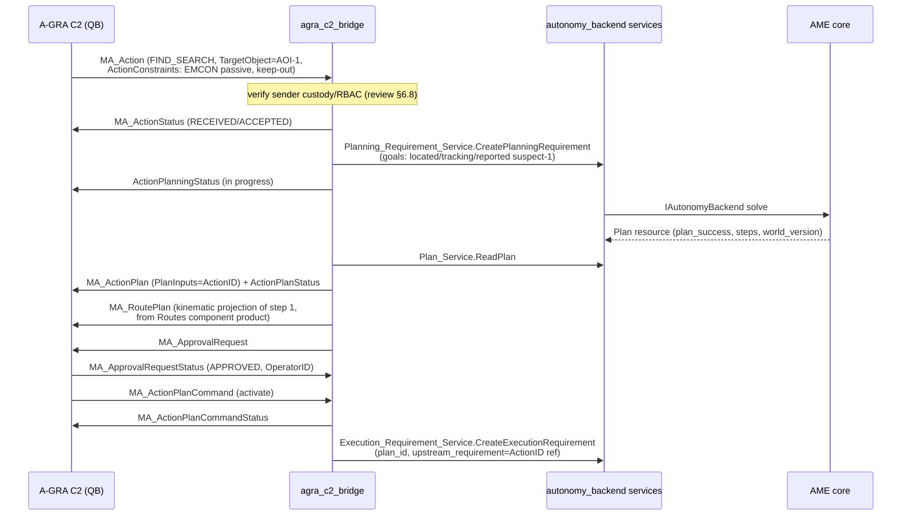
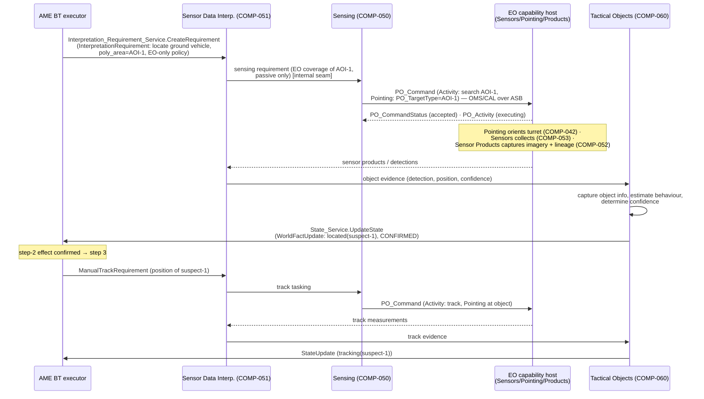
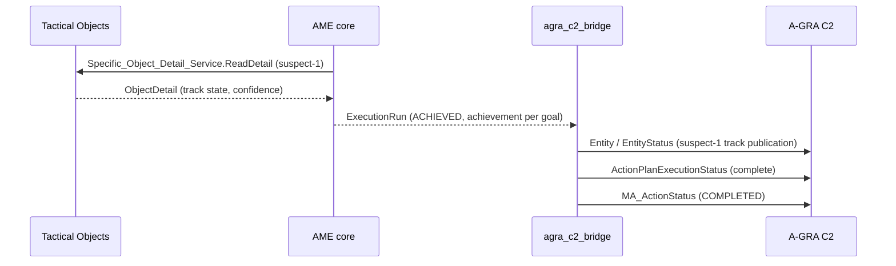
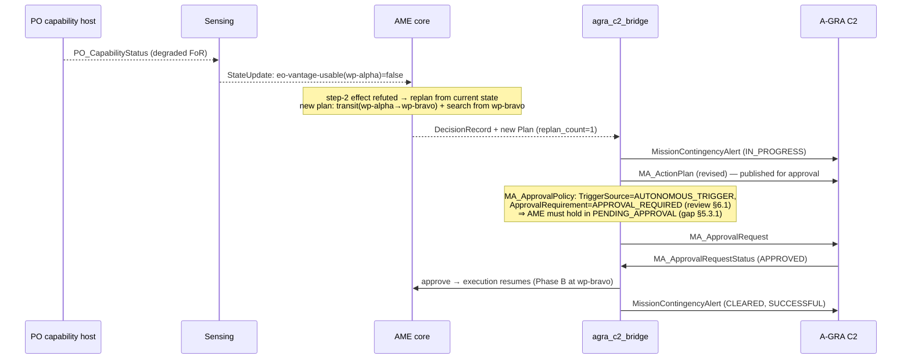

# A-GRA ↔ AME/PYRAMID Worked End-to-End Example: Find & Observe with an EO Camera

**Scope:** A concrete, message-level walkthrough of one mission thread through
the integration shape proposed in
[`a_gra_standard_review.md`](a_gra_standard_review.md) §5.2: an A-GRA C2 node
tasks the platform, AME plans, and the plan executes through PYRAMID
components for **routing** and **EO (passive-optical) sensor control**. Every
exchange is named — A-GRA/UCI messages at the boundary (verified against
`A-GRA_MessageDefinitions_v5_0_a.xsd`), `pyramid.*` proto messages and
services internally — and each step is mapped to the PYRAMID component
responsibilities it discharges
([`PYRAMID_COMPONENT_RESPONSIBILITIES.md`](../../../subprojects/PYRAMID/doc/architecture/PYRAMID_COMPONENT_RESPONSIBILITIES.md)).

**Date:** 2026-07-02
**Status:** Design walkthrough. Messages marked **exists** are in the repo
today; messages marked **NEW** are contract work this example identifies.

A-GRA's **service-over-pub/sub mechanism** and its implications for the
PCL/PYRAMID binding system are treated separately in
[`doc/plans/PYRAMID/pubsub_contract_generation_plan.md`](../../plans/PYRAMID/pubsub_contract_generation_plan.md)
(§8 here is a short pointer).

---

## 1. Scenario

> C2 tasks a single ACP: *"Find the suspected mobile vehicle in area AOI-1
> using EO, then observe it and report the track."*

- A-GRA tasking: one `MA_Action` with `ActionType = FIND_SEARCH` (and a
  follow-on `MONITOR_OBSERVE` goal carried as a second goal of the same
  requirement), `TargetObject` = AOI-1 polygon, constraints (EMCON: passive
  sensing only; keep-out volume west of AOI-1).
- The EO camera is A-GRA's **PO (Passive Optical)** capability family —
  "Passive Optical which includes search and track" per the XSD annotation on
  `PO_Command` — so the sensor-control boundary messages are `PO_*`.
- The route to a usable vantage point is flown via the Vehicle Interface
  route-plan lifecycle (`RoutePlan` upload → validate → activate).

One nominal pass, then a contingency variant (EO capability degrades
mid-search → autonomous replan to a second vantage point, held for approval
per `MA_ApprovalPolicy`).

---

## 2. Cast of components

The A-GRA "MA" is a *composition* of PYRAMID components (review §5.3 item 7 —
A-GRA's unpublished L2 leaves this decomposition free):

| Role in this example | PYRAMID component | Implementation in/around this repo | A-GRA interface it touches |
|---|---|---|---|
| C2 boundary translation, approval hold, RBAC, status fan-out | (bridge — not a PYRAMID component) | `agra_c2_bridge` (planned, review §5.2) | C2, P2P |
| Mission-level planning + execution management | Objectives (COMP-039), Tasks (COMP-062) | AME via `PyramidAutonomyBridge` → `IAutonomyBackend` | — (internal) |
| Approval/consent enactment | Authorisation (COMP-003) | bridge-held approval gate (AME `PENDING_APPROVAL` — gap, review §5.3.1) | C2 (`MA_ApprovalRequest`) |
| Route determination & command | Routes (COMP-048) | **NEW component** (prerequisite, review §5.3.7) | VI (`RoutePlan` lifecycle) |
| Trajectory enactment | Vehicle Guidance (COMP-070) | platform / Flight Autonomy side of the VI airworthiness boundary | VI |
| Sensing coordination (what to sense, when, with what) | Sensing (COMP-050) | inside the sensing chain (may be fused with SDI initially) | MS |
| EO camera resource control | Sensors (COMP-053) | platform EO capability host (or PO egress adapter) | MS (`PO_Command`) |
| Sensor orientation | Pointing (COMP-042) | carried inside `PO_Command.Pointing` at the MS boundary | MS |
| Imagery products | Sensor Products (COMP-052) | platform / capability host | MS |
| Detect/locate objects from sensor data | Sensor Data Interpretation (COMP-051) | `sensor_data_interpretation` component (contract **exists**) | — (internal) |
| Track/object state, evidence → facts | Tactical Objects (COMP-060) | `tactical_objects` component + `StandardBridge` (**exists**) | MS ingress, C2/P2P track egress |

```mermaid
flowchart TB
  C2["A-GRA C2 node<br/>(Quarterback)"]
  subgraph MA["A-GRA 'Mission Autonomy' = PYRAMID composition"]
    BR["agra_c2_bridge<br/>translation + approval hold + RBAC"]
    subgraph AMEBOX["AME (Objectives/Tasks role)"]
      AB["autonomy_backend services<br/>Planning/Plan/Execution/State"]
      AME["WorldModel · Planner (LAPKT) ·<br/>PlanCompiler · BT executor"]
    end
    RT["Routes (COMP-048)<br/>NEW component"]
    SDI["Sensor Data Interpretation<br/>(COMP-051)"]
    SEN["Sensing (COMP-050)"]
    TO["Tactical Objects (COMP-060)"]
  end
  FA["Flight Autonomy / VMS<br/>(Vehicle Guidance COMP-070)<br/>behind airworthiness boundary"]
  EO["EO capability host<br/>(Sensors COMP-053 + Pointing COMP-042<br/>+ Sensor Products COMP-052)"]

  C2 <-->|"MA_Action / MA_ActionPlan /<br/>MA_ApprovalRequest / statuses<br/>(EXI over DMS/DDS)"| BR
  BR <-->|"pyramid.components.autonomy_backend<br/>services"| AB
  AB --- AME
  AME -->|"RequirementPlacement:<br/>PositioningRequirement (NEW)"| RT
  AME -->|"RequirementPlacement:<br/>InterpretationRequirement /<br/>ManualTrackRequirement"| SDI
  SDI --> SEN
  SEN -->|"PO_Command / PO_CommandStatus<br/>(OMS/CAL over ASB)"| EO
  RT -->|"RoutePlan upload/validate/activate<br/>(VI, OMS/CAL over ASB)"| FA
  EO -->|"Sensor_Products / evidence"| SDI
  SDI -->|"object evidence"| TO
  TO -->|"StateUpdate (facts)"| AB
  TO -->|"Track / Entity egress"| BR
```



---

## 3. The planning problem (AME internals)

The bridge's ActionType→goal-fluent table (review §7 Phase 2) turns the
`MA_Action` into a `PlanningRequirement` with two goals. Illustrative PDDL:

```pddl
(define (domain find-observe)
  (:requirements :strips :typing)
  (:types vehicle waypoint area object)
  (:predicates
    (at ?v - vehicle ?w - waypoint)
    (vantage-of ?w - waypoint ?a - area)
    (route-clear ?from ?to - waypoint)
    (eo-operational ?v - vehicle)
    (emcon-passive-ok)
    (located ?o - object)
    (tracking ?o - object)
    (reported ?o - object))

  (:action transit
    :parameters (?v - vehicle ?from ?to - waypoint)
    :precondition (and (at ?v ?from) (route-clear ?from ?to))
    :effect (and (at ?v ?to) (not (at ?v ?from))))

  (:action search-area-eo
    :parameters (?v - vehicle ?w - waypoint ?a - area ?o - object)
    :precondition (and (at ?v ?w) (vantage-of ?w ?a)
                       (eo-operational ?v) (emcon-passive-ok))
    :effect (located ?o))

  (:action track-object-eo
    :parameters (?v - vehicle ?o - object)
    :precondition (and (located ?o) (eo-operational ?v))
    :effect (tracking ?o))

  (:action report-track
    :parameters (?o - object)
    :precondition (tracking ?o)
    :effect (reported ?o)))
```

Problem: `(at acp1 wp-base)`, `(vantage-of wp-alpha aoi-1)`,
`(vantage-of wp-bravo aoi-1)`, `(route-clear wp-base wp-alpha)`, …; goal
`(and (located suspect-1) (tracking suspect-1) (reported suspect-1))`.

LAPKT returns the 4-step plan; the `Plan` resource
(`pyramid.data_model.autonomy.Plan`) carries the steps and each step's
`PlannedComponentInteraction`s, resolved from the `ExecutionBinding` table
(`ame::ExecutionBinding`, `subprojects/AME/include/ame/execution_sink.h`):

| # | `PlanStep.action_name` | Binding target (`target_component` / `target_service` / `target_type`) | Effect confirmation source |
|---|---|---|---|
| 1 | `transit(acp1, wp-base, wp-alpha)` | `routes` / `Positioning_Requirement_Service` / `PositioningRequirement` **(NEW)** | Routes `Achievement` COMPLETED |
| 2 | `search-area-eo(acp1, wp-alpha, aoi-1, suspect-1)` | `sensor_data_interpretation` / `Interpretation_Requirement_Service` / `InterpretationRequirement` **(exists)** | Tactical Objects evidence → `StateUpdate` sets `(located suspect-1)` |
| 3 | `track-object-eo(acp1, suspect-1)` | `sensor_data_interpretation` / `Manual_Track_Requirement_Service` / `ManualTrackRequirement` **(type exists; service NEW)** | track quality above threshold → `(tracking suspect-1)` |
| 4 | `report-track(suspect-1)` | `tactical_objects` / `Specific_Object_Detail_Service` / READ_PRODUCT + bridge egress | bridge publish acknowledged |

Note the AME idiom: STRIPS effects like `(located suspect-1)` are *assumed*
by the planner and *confirmed or refuted* by authoritative `StateUpdate`
ingress (here fed by Tactical Objects); a refuted assumption is what triggers
replanning.

---

## 4. Nominal walkthrough

### Phase A — Tasking, planning, approval (C2 interface)



Messages, phase A:

| Direction | A-GRA boundary (UCI primitive) | Internal PYRAMID message / service | Status |
|---|---|---|---|
| C2 → MA | `MA_Action` (Command-2) | `autonomy.PlanningRequirement` via `Planning_Requirement_Service.CreatePlanningRequirement` | proto **exists** |
| MA → C2 | `MA_ActionStatus`, `ActionPlanningStatus` (Status-1) | derived from create ack + `DecisionRecord` stream | exists |
| MA → C2 | `MA_ActionPlan`, `ActionPlanStatus` (Data-1/Status-1) | `autonomy.Plan` via `Plan_Service.ReadPlan` | exists |
| MA → C2 | `MA_RoutePlan` (Data-1) | Routes component route product | **NEW** (needs Routes component) |
| MA → C2 | `MA_ApprovalRequest` (ActionRequest-2) | bridge-held gate; AME `PENDING_APPROVAL` state | **NEW** (review §5.3.1) |
| C2 → MA | `MA_ApprovalRequestStatus`, `MA_ActionPlanCommand` | `Execution_Requirement_Service.CreateExecutionRequirement(plan_id)` | proto **exists** |

The plan/approve/execute split needs no AME change for the *initial* plan:
`Plan` is already an addressable resource and execution is a separate
requirement referencing `plan_id`. The gap is only inside the replan loop
(Phase D).

### Phase B — Routing (Vehicle Interface)

AME's BT executes step 1: the `ActionCommand` for `transit` matches its
`ExecutionBinding` and surfaces as a typed `RequirementPlacement` on the
Routes component.

```mermaid
sequenceDiagram
    participant AME as AME BT executor
    participant RT as Routes (COMP-048)
    participant FA as Flight Autonomy (VI)

    AME->>RT: Positioning_Requirement_Service.CreateRequirement<br/>(PositioningRequirement: be at wp-alpha, keep-out constraint) [NEW]
    RT->>RT: determine Route within Vehicle_Capability<br/>and Routing_Constraints
    RT->>FA: RoutePlan (upload; checksum-validated)
    FA-->>RT: RoutePlanStatus (READY_FOR_ACTIVATION)
    RT->>FA: MA_MissionPlanActivationCommand (BySubPlan: RoutePlan)
    FA-->>RT: MA_MissionPlanActivationCommandStatus + RoutePlanExecutionStatus
    Note over FA: FA validates/accepts; FA always retains control<br/>(airworthiness boundary, review §6.4)
    FA-->>RT: RoutePlanExecutionStatus (progress) · MA_PositionReport
    RT-->>AME: Achievement (Progress=COMPLETED) on the placement
    Note over AME: fact (at acp1 wp-alpha) confirmed → BT advances
```

Messages, phase B:

| Direction | A-GRA boundary (VI) | Internal PYRAMID message / service | Status |
|---|---|---|---|
| AME → Routes | — | `routing.PositioningRequirement` via `Positioning_Requirement_Service` | **NEW** proto + component |
| Routes → FA | `RoutePlan`, `RoutePlanValidationCommand(Status)` | Routes egress adapter (OMS/CAL over ASB) | **NEW** |
| Routes → FA | `MA_MissionPlanActivationCommand(Status)` | route activation state machine (review §6.4) | **NEW** |
| FA → MA | `RoutePlanExecutionStatus`, `MA_PositionReport` (Status-1) | Routes progress → `Achievement`; position → `StateUpdate` | Achievement/StateUpdate protos **exist** |
| AME product | — | `autonomy.RequirementPlacement` (traceability) via `Requirement_Placement_Service.ReadPlacement` | **exists** |

### Phase C — EO sensor control and interpretation (Mission Systems)

Step 2 (`search-area-eo`) places an `InterpretationRequirement` on Sensor
Data Interpretation. SDI owns the *how* (COMP-051 determines the
Data_Interpretation_Solution and its `Sensor_Data_Provision_Dependency`);
Sensing turns that into EO tasking; the platform's PO capability host is
commanded over the MS interface.



Messages, phase C:

| Direction | A-GRA boundary (MS) | Internal PYRAMID message / service | Status |
|---|---|---|---|
| AME → SDI | — | `sensors.InterpretationRequirement` via `Interpretation_Requirement_Service.CreateRequirement` | **exists** (`InterpretationType` needs an EO/ground value — **NEW enum value**) |
| SDI → Sensing → PO host | `PO_Command` (Command-2; `PO_ActivityCommandType.Pointing`) | Sensing egress adapter | **NEW** adapter |
| PO host → MA | `PO_CommandStatus`, `PO_Activity` (Status-1) | Sensing/Sensors progress feedback | **NEW** adapter |
| PO host → MA | `PO_Capability`, `PO_CapabilityStatus` (Status-1) | capability sweep input (MECL, review §6.6) → `StateUpdate` (`eo-operational`) | StateUpdate **exists** |
| optional | `PO_SettingsCommand(Status)` | sensor mode/settings from Sensing solution | **NEW** adapter |
| AME → SDI | — | `sensors.ManualTrackRequirement` | type **exists**; service **NEW** |
| SDI/TO internal | — | `tactical_objects` evidence flow (`StandardBridge` pattern) | **exists** |
| TO → AME | — | `autonomy.StateUpdate`/`WorldFactUpdate` via `State_Service` | **exists** |

Two deployment options for the `PO_Command` seam, same plan either way:

1. **Internal-only demo:** Sensing commands a simulated EO driver with
   internal protos; no A-GRA MS traffic. Good for the Phase-2 demo target in
   the review's adoption path.
2. **A-GRA-conformant:** the Sensing egress adapter speaks `PO_Command` /
   `PO_CommandStatus` over OMS/CAL/ASB to a platform-hosted capability
   (review §6.3). The `ExecutionBinding`/placement machinery is unchanged;
   only the adapter differs.

### Phase D — Reporting and execution status (C2/P2P)



| Direction | A-GRA boundary | Internal PYRAMID message / service | Status |
|---|---|---|---|
| MA → C2/P2P | `Entity`, `EntityStatus` (or `Track`) (Data-1) | `tactical.ObjectDetail` via `Specific_Object_Detail_Service.ReadDetail` | **exists** |
| MA → C2 | `ActionPlanExecutionStatus`, `MA_ActionStatus`, `MA_TaskStatus` (Status-1) | `autonomy.ExecutionRun` via `Execution_Run_Service.ReadRun` | **exists** |
| wrapper | `MA_TxDataPayloadCommand` / `MA_RxDataPayload` | bridge-local DMS wrapping (review §6.3) | **NEW** (compliance only) |

Throughout, periodic status fan-out (`MA_MissionPlanExecutionStatus` with
`Source=ACTUAL`, heartbeats) is bridge work derived from `ExecutionRun` and
placements — review §6.8.

---

## 5. Contingency variant: EO degradation → autonomous replan with approval

Mid-search, the EO capability degrades (e.g. turret azimuth restriction).



This is exactly the review's §6.1 *Triggered Autonomous Contingency Re-Plan*
sequence. With `AUTO_APPROVE` policy it degenerates to AME's current
immediate BT swap; with `APPROVAL_REQUIRED` it needs the
`require_plan_approval` / `PENDING_APPROVAL` capability (review §5.3 item 1
and adoption-path Phase 3). The registered **failsafe plan** (review §6.4)
must remain valid across the replan — the contingency verifier's safe-state
invariant is the compliance hook.

---

## 6. Identified message summary

**A-GRA boundary set for this one thread** (30 messages — all verified
present as top-level elements in `A-GRA_MessageDefinitions_v5_0_a.xsd`):

- **C2:** `MA_Action`, `MA_ActionStatus`, `ActionPlanningStatus`,
  `MA_ActionPlan`, `ActionPlanStatus`, `MA_ActionPlanCommand`,
  `MA_ActionPlanCommandStatus`, `ActionPlanExecutionStatus`,
  `MA_ApprovalPolicy`, `MA_ApprovalRequest`, `MA_ApprovalRequestStatus`,
  `MA_RoutePlan`, `MissionContingencyAlert`, `MA_TaskStatus`, `Entity`,
  `EntityStatus`
- **VI:** `RoutePlan`, `RoutePlanStatus`, `RoutePlanValidationCommand`,
  `RoutePlanValidationCommandStatus`, `RoutePlanExecutionStatus`,
  `MA_MissionPlanActivationCommand`, `MA_MissionPlanActivationCommandStatus`,
  `MA_PositionReport`
- **MS:** `PO_Command`, `PO_CommandStatus`, `PO_Activity`, `PO_Capability`,
  `PO_CapabilityStatus`, `PO_SettingsCommand` (+ transport wrappers
  `MA_TxDataPayloadCommand`/`MA_RxDataPayload` for offboard legs)

This is a realistic seed for the §6.2-anchored conversion profile: ~30
messages here vs the ~123 `MA_*` + referenced UCI types for the fuller
profile.

**Internal PYRAMID surface:**

| Contract element | Status |
|---|---|
| `pyramid.data_model.autonomy.{PlanningRequirement, PlanningGoal, Plan, PlanStep, PlannedComponentInteraction, ExecutionRequirement, ExecutionRun, RequirementPlacement, StateUpdate, WorldFactUpdate, Capabilities}` | **exists** |
| `pyramid.components.autonomy_backend` services (Planning_Requirement / Plan / Execution_Requirement / Execution_Run / Requirement_Placement / State / Capabilities) | **exists** |
| `pyramid.data_model.sensors.{InterpretationRequirement, ManualTrackRequirement, TrackProvisionRequirement, SensorObject}` | **exists** |
| `pyramid.components.sensor_data_interpretation.Interpretation_Requirement_Service` | **exists** |
| `pyramid.components.tactical_objects.{Object_Of_Interest_Service, Specific_Object_Detail_Service, Matching_Objects_Service}` | **exists** |
| `InterpretationType` value for EO/ground-object location (only `LOCATE_SEA_SURFACE_OBJECTS` today) | **NEW** enum value |
| `Manual_Track_Requirement_Service` on sensor_data_interpretation | **NEW** service |
| `pyramid.data_model.routing.PositioningRequirement` + `routes` component contract (Positioning_Requirement_Service, Route product) | **NEW** component |
| Sensing-chain internal contract (Sensing ↔ Sensors/Pointing) if decomposed beyond SDI | **NEW** (optional initially) |
| A-GRA egress adapters: PO (MS), RoutePlan lifecycle (VI), DMS wrapper | **NEW**, bridge-local |
| AME `require_plan_approval` policy + `PENDING_APPROVAL` state | **NEW** (review §5.3.1) |

---

## 7. Conformance to PYRAMID component responsibilities

Where each step of the thread discharges a responsibility from
`PYRAMID_COMPONENT_RESPONSIBILITIES.md`. (Selected load-bearing
responsibilities; capability-assessment/missing-information duties
(`assess_*`, `identify_missing_information`, `predict_capability_progression`)
apply to every component and are exercised by the MECL/capability sweep.)

### Objectives (COMP-039) & Tasks (COMP-062) — fulfilled by AME + bridge

| Responsibility | Where in this example |
|---|---|
| PYR-RESP-0497 `capture_requirements` (039-R01) | `MA_Action` → `CreatePlanningRequirement` (goals, upstream refs) |
| PYR-RESP-0499 `capture_constraints` (039-R03) | ActionConstraints → EMCON/keep-out facts + `PlanningPolicy` |
| PYR-RESP-0501 `determine_implementation_scheme` (039-R05) | LAPKT solve → `Plan` resource |
| PYR-RESP-0502 `determine_predicted_quality_of_solution` (039-R06) | `Plan.predicted_quality` |
| PYR-RESP-0503/0504 dependencies between Tasks (039-R07/R08) | plan-step ordering; BT sequencing of placements |
| PYR-RESP-0505 `coordinate_objective_enactment` (039-R09) | BT executor drives placements across Routes/SDI/TO |
| PYR-RESP-0506 `identify_progress_of_objective` (039-R10) | `ExecutionRun.achievement` → `ActionPlanExecutionStatus` |
| PYR-RESP-0500 `identify_whether_requirement_remains_achievable` (039-R04) | replan-on-refuted-fact; `plan_success=false` → status |
| PYR-RESP-0763 `determine_implementation_solution` (062-R05) | ordered `PlanStep` sequence (Derived_Needs) |
| PYR-RESP-0764 `satisfy_dependencies_between_derived_needs` (062-R06) | STRIPS precondition ordering |
| PYR-RESP-0765 `coordinate_solution_enactment` (062-R07) | `RequirementPlacement` lifecycle per step |
| PYR-RESP-0766 `identify_progress_of_solution` (062-R08) | placement `Progress` per step |
| PYR-RESP-0769 `capture_contingency_definitions` (062-R11) | contingency domains + §5 trigger config |

### Authorisation (COMP-003) — approval gate

| Responsibility | Where |
|---|---|
| PYR-RESP-0018 `capture_requirements_for_authorisations` (003-R01) | plan requiring approval before activation |
| PYR-RESP-0020 `determine_authorisation_solution` (003-R03) | bridge maps `MA_ApprovalPolicy` → hold/auto-approve path |
| PYR-RESP-0022 `determine_permitted_authorisers` (003-R05) | RBAC/QB role check on `MA_ApprovalRequestStatus.OperatorID` |
| PYR-RESP-0026 `identify_progress_of_authorisation` (003-R09) | re-publish plan until approved (review §6.1) |

### Routes (COMP-048) — phase B

| Responsibility | Where |
|---|---|
| PYR-RESP-0595 `capture_positioning_requirements` (048-R01) | `PositioningRequirement` placement (wp-alpha) |
| PYR-RESP-0597 `capture_routing_constraints` (048-R03) | keep-out volume from ActionConstraints |
| PYR-RESP-0599 `determine_route` (048-R05) | route to vantage within Vehicle_Capability |
| PYR-RESP-0601 `command_route` (048-R07) | `RoutePlan` upload + activation toward FA |
| PYR-RESP-0602 `determine_route_progress` (048-R08) | `RoutePlanExecutionStatus`/`MA_PositionReport` → `Achievement` |
| PYR-RESP-0603 `determine_routing_continuity` (048-R09) | continuity check when replan swaps wp-alpha → wp-bravo |
| PYR-RESP-0604 `collate_route_cost` (048-R10) | route cost into plan-quality metrics |
| PYR-RESP-0598 `identify_whether_requirement_remains_achievable` (048-R04) | feasibility feedback if vantage unreachable |

### Vehicle Guidance (COMP-070) — FA side of the VI

| Responsibility | Where |
|---|---|
| PYR-RESP-0845 `ensure_solution_validity` (070-R04) | FA accept/reject of uploaded `RoutePlan` (airworthiness boundary) |
| PYR-RESP-0848 `determine_planned_vehicle_trajectory` (070-R07) | trajectory from activated route |
| PYR-RESP-0849 `issue_vehicle_control_commands` (070-R08) | motion commands (below MA scope) |
| PYR-RESP-0851 `determine_trajectory_requirement_progress` (070-R10) | execution status back over VI |

### Sensing (COMP-050), Sensors (COMP-053), Pointing (COMP-042) — phase C

| Responsibility | Where |
|---|---|
| PYR-RESP-0616/0618 capture sensing requirements/constraints (050-R01/R03) | EO coverage of AOI-1, passive-only |
| PYR-RESP-0620 `determine_sensing_solution` (050-R05) | search pattern / activity selection behind `PO_Command` |
| PYR-RESP-0623 `coordinate_sensing_solution` (050-R08) | issuing `PO_Command`, sequencing search→track |
| PYR-RESP-0624 `identify_progress_of_sensing_solution` (050-R09) | `PO_Activity`/`PO_CommandStatus` consumption |
| PYR-RESP-0662 `control_use_of_sensor` (053-R05) | PO capability host executes activity |
| PYR-RESP-0663 `capture_sensor_data` (053-R06) | EO measurements |
| PYR-RESP-0665 `provide_sensor_data_feedback` (053-R08) | products/detections to SDI |
| PYR-RESP-0529 `capture_orientation_requirements` (042-R01) | `PO_Command.Pointing` (PO_TargetType) |
| PYR-RESP-0532/0535 determine/coordinate orientation solution (042-R04/R07) | turret slew to AOI / object |
| PYR-RESP-0536 `identify_progress_of_orientation_solution` (042-R08) | pointing state in activity status |

### Sensor Products (COMP-052) & Sensor Data Interpretation (COMP-051)

| Responsibility | Where |
|---|---|
| PYR-RESP-0654 `capture_sensor_products` (052-R14) | imagery frames captured |
| PYR-RESP-0646 `capture_acquisition_characteristics` (052-R06) | time/region/spectrum metadata |
| PYR-RESP-0648 `maintain_traceability` (052-R08) | product lineage → debrief (MD volume) |
| PYR-RESP-0651 `characterise_sensor_products` (052-R11) | detection candidates with confidence |
| PYR-RESP-0629 `capture_requirements` (051-R01) | `InterpretationRequirement` (locate vehicle in AOI-1) |
| PYR-RESP-0632 `determine_solution` (051-R04) | interpretation pipeline selection |
| PYR-RESP-0634 `determine_solution_dependencies` (051-R06) | `Sensor_Data_Provision_Dependency` → Sensing tasking |
| PYR-RESP-0635 `coordinate_solution` (051-R07) | drive collect→detect→locate |
| PYR-RESP-0636 `identify_progress_of_solution` (051-R08) | requirement `Achievement` back to AME |
| PYR-RESP-0637 `determine_quality_of_deliverables` (051-R09) | detection confidence vs criteria |

### Tactical Objects (COMP-060)

| Responsibility | Where |
|---|---|
| PYR-RESP-0741 `capture_object_information` (060-R13) | suspect-1 position/class/kinematics from evidence |
| PYR-RESP-0735 `determine_object_information_confidence` (060-R07) | confidence gating before `CONFIRMED` fact authority |
| PYR-RESP-0738 `estimate_object_behaviour` (060-R10) | loiter/move estimation on the track |
| PYR-RESP-0739 `identify_progress` (060-R11) | `Object_Of_Interest_Service` requirement progress |
| PYR-RESP-0736 `determine_additional_information` (060-R08) | drives track-quality goal for step 3 |

Cross-checks: the example leaves **Trajectory Prediction (COMP-065)** and
**Observability (COMP-040)** unexercised; both become relevant when vantage
selection is computed (line-of-sight to AOI-1, PYR-RESP-0517
`determine_line_of_sight`) rather than pre-declared as `vantage-of` facts —
a natural follow-on refinement.

---

## 8. A-GRA's service-over-pub/sub mechanism — see the bindings plan

A-GRA has **no RPC anywhere**: its entire service surface is correlated
object pairs over DDS topics (command + `*Status` correlated by ID, topic
name == message name, one generic payload wrapper, `ObjectState` for CRUD,
instance disambiguation by header IDs rather than per-instance topics).
That pattern, its fit with the new port-shaped proto contract set
(`pim/test/`), and a concrete phased plan for generating pub/sub bindings
from those contracts — including the option of skewing toward pub/sub at
the MBSE layer — are covered in
[`doc/plans/PYRAMID/pubsub_contract_generation_plan.md`](../../plans/PYRAMID/pubsub_contract_generation_plan.md).

The consequence for this example: once EntityActions services have a native
correlated-topic projection, the `agra_c2_bridge` is mostly *renaming*
(`PlanningRequirement` → `MA_Action` vocabulary) rather than *re-plumbing*
(RPC ↔ pub/sub adaptation).

---

## 9. References

- [`a_gra_standard_review.md`](a_gra_standard_review.md) — §2.3 interaction
  primitives, §5.2 integration shape, §5.3 gaps, §6 volume findings, §7
  adoption path
- A-GRA schema (local): `a-gra-main/Schema/A-GRA_MessageDefinitions_v5_0_a.xsd`
  (message names in §4/§6 verified against top-level element declarations;
  `PO_Command` annotation confirms PO = passive optical incl. search & track)
- `subprojects/PYRAMID/proto/pyramid/data_model/pyramid.data_model.autonomy.proto`,
  `.sensors.proto`; `pyramid.components.autonomy_backend.services.provided.proto`,
  `pyramid.components.sensor_data_interpretation.services.provided.proto`,
  `pyramid.components.tactical_objects.services.provided.proto`
- `subprojects/AME/include/ame/execution_sink.h` (`ExecutionBinding`,
  `RequirementBindingExecutionSink`), `pyramid_autonomy_bridge.h`
- `subprojects/PYRAMID/doc/architecture/PYRAMID_COMPONENT_RESPONSIBILITIES.md`
  (PYR-RESP IDs cited in §7)
- `doc/plans/PYRAMID/pubsub_contract_generation_plan.md` (service-over-pub/sub
  analysis and bindings plan, split out from §8)
