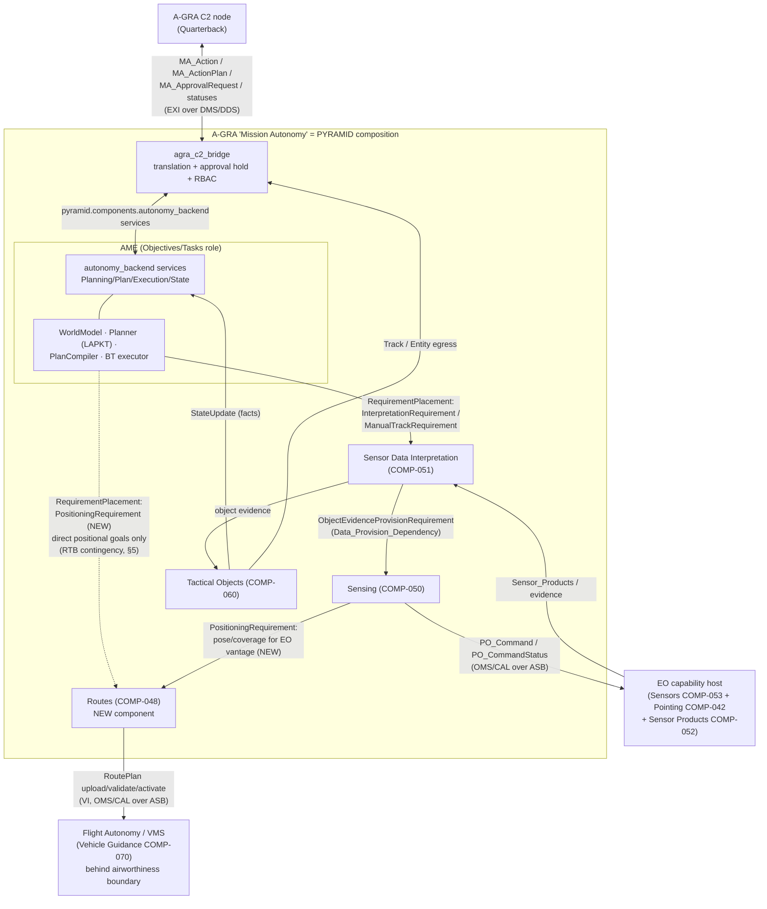
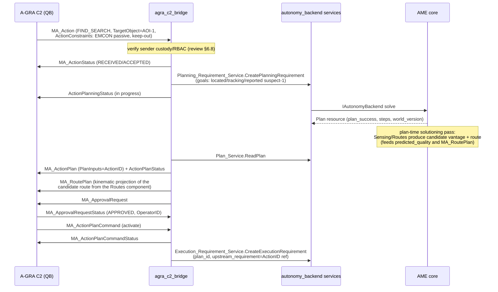
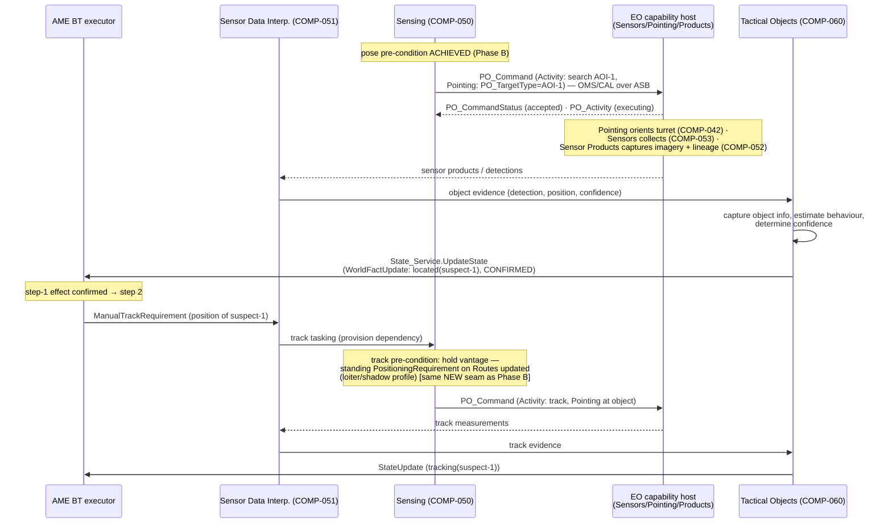
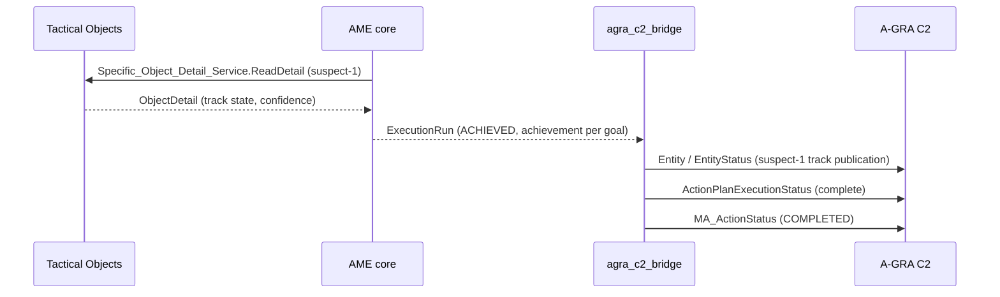

# A-GRA ↔ AME/PYRAMID Worked End-to-End Example: Find & Observe with an EO Camera

**Scope:** A concrete, message-level walkthrough of one mission thread through
the integration shape proposed in
[`a_gra_standard_review.md`](a_gra_standard_review.md) §5.2: an A-GRA C2 node
tasks the platform, AME plans, and the plan executes through PYRAMID
components for **EO (passive-optical) sensor control** with **route control
delegated down the sensing chain** (Sensing → Routes → Vehicle Interface).
Every exchange is named — A-GRA/UCI messages at the boundary (verified against
`A-GRA_MessageDefinitions_v5_0_a.xsd`), `pyramid.*` proto messages and
services internally — and each step is mapped to the PYRAMID component
responsibilities it discharges
([`PYRAMID_COMPONENT_RESPONSIBILITIES.md`](../../../subprojects/PYRAMID/proofs/doc/architecture/PYRAMID_COMPONENT_RESPONSIBILITIES.md)).

**Date:** 2026-07-08
**Status:** Design walkthrough, revision 2. Messages marked **exists** are in
the repo today; messages marked **NEW** are contract work this example
identifies.

**Revision 2 (2026-07-08):** route control is now *delegated*, per the
PYRAMID layering intent: Tasks asks the sensing chain to achieve the sensing
outcome, and **Sensing asks Routes to achieve the pose/coverage** its solution
needs — the mission planner no longer plans or commands transits itself.
Revision 1 had AME placing a `PositioningRequirement` directly on Routes as
plan step 1; that pattern is retained only for goals that are *intrinsically*
positional (see §2.1 and the RTB contingency in §5).

A-GRA's **service-over-pub/sub mechanism** and its implications for the
PCL/PYRAMID binding system are treated separately in
[`doc/plans/PYRAMID/pubsub_contract_generation_plan.md`](../../plans/PYRAMID/README.md)
(§8 here is a short pointer).

---

## 1. Scenario

> C2 tasks a single ACP: *"Find the suspected mobile vehicle in area AOI-1
> using EO, then observe it and report the track."*

- A-GRA tasking: one `MA_Action` with `ActionType = FIND_SEARCH` (and a
  follow-on `MONITOR_OBSERVE` goal carried as a second goal of the same
  requirement), `TargetObject` = AOI-1 polygon, constraints (EMCON: passive
  sensing only; keep-out volume west of AOI-1).
- The EO camera is A-GRA's **PO (Passive Optical)** capability family —
  "Passive Optical which includes search and track" per the XSD annotation on
  `PO_Command` — so the sensor-control boundary messages are `PO_*`.
- Getting the platform to a usable vantage is a **derived need of the sensing
  solution**, not a plan step: Sensing identifies the pose/coverage its EO
  activity requires and places it on Routes, which flies it via the Vehicle
  Interface route-plan lifecycle (`RoutePlan` upload → validate → activate).

One nominal pass, then three mid-execution variants: (a) EO field-of-regard
degrades mid-search → **Sensing-local** re-position via Routes, invisible to
the mission planner; (b) EO fails outright → escalation up the requirement
chain → AME contingency replan (return to rally point), held for approval per
`MA_ApprovalPolicy`; (c) **pop-up classification tasking** — candidate
detections spawn new sensing actions whose route requirements were not known
at plan time, absorbed by Sensing/Routes arbitration without a mission
replan (§5c).

---

## 2. Cast of components

The A-GRA "MA" is a *composition* of PYRAMID components (review §5.3 item 7 —
A-GRA's unpublished L2 leaves this decomposition free):

| Role in this example | PYRAMID component | Implementation in/around this repo | A-GRA interface it touches |
|---|---|---|---|
| C2 boundary translation, approval hold, RBAC, status fan-out | (bridge — not a PYRAMID component) | `agra_c2_bridge` (planned, review §5.2) | C2, P2P |
| Mission-level planning + execution management | Objectives (COMP-039), Tasks (COMP-062) | AME via `PyramidAutonomyBridge` → `IAutonomyBackend` | — (internal) |
| Approval/consent enactment | Authorisation (COMP-003) | bridge-held approval gate (AME `PENDING_APPROVAL` — gap, review §5.3.1) | C2 (`MA_ApprovalRequest`) |
| Detect/locate objects from sensor data (owns the interpretation *how*) | Sensor Data Interpretation (COMP-051) | `sensor_data_interpretation` component (contract **exists**) | — (internal) |
| Sensing coordination (what to sense, when, with what, **from where**) | Sensing (COMP-050) | sensing-chain component (may be fused with SDI initially) | MS |
| Route determination & command — **subordinate to Sensing here** | Routes (COMP-048) | **NEW component** (prerequisite, review §5.3.7) | VI (`RoutePlan` lifecycle) |
| Trajectory enactment | Vehicle Guidance (COMP-070) | platform / Flight Autonomy side of the VI airworthiness boundary | VI |
| EO camera resource control | Sensors (COMP-053) | platform EO capability host (or PO egress adapter) | MS (`PO_Command`) |
| Sensor orientation | Pointing (COMP-042) | carried inside `PO_Command.Pointing` at the MS boundary | MS |
| Imagery products | Sensor Products (COMP-052) | platform / capability host | MS |
| Track/object state, evidence → facts | Tactical Objects (COMP-060) | `tactical_objects` component + `StandardBridge` (**exists**) | MS ingress, C2/P2P track egress |

### 2.1 The requirement-delegation principle

PYRAMID's component responsibilities repeat one pattern at every level:
*capture requirements → determine a solution → identify the solution's
pre-conditions/dependencies → place those as derived requirements on
subordinate components → roll progress back up*. Route control follows that
pattern rather than being coordinated from the top:

- **Tasks** (AME) places an *outcome* requirement — "locate a ground vehicle
  in AOI-1, passive only" — on SDI. It does not decide where the platform
  should be (PYR-RESP-0765 `coordinate_solution_enactment` coordinates
  *placements*, not routes).
- **SDI** determines the Data_Interpretation_Solution and its
  `Sensor_Data_Provision_Dependency` (PYR-RESP-0634
  `determine_solution_dependencies`) → a sensing requirement on Sensing.
- **Sensing** determines the Sensing_Solution (PYR-RESP-0620) and identifies
  its **pre-conditions** (PYR-RESP-0622
  `identify_sensing_solution_pre-conditions`) — chief among them a platform
  pose/coverage geometry from which the EO activity can see AOI-1 within the
  keep-out and EMCON constraints — and places that as a
  `PositioningRequirement` on **Routes**.
- **Routes** determines and commands the route within Vehicle_Capability and
  Routing_Constraints (PYR-RESP-0599/0601), toward Flight Autonomy over the
  VI. Its own pre-condition machinery (PYR-RESP-0600 `identify_pre-conditions`)
  covers route-level needs (e.g. climb before the transit leg).

Two placement patterns for the same `PositioningRequirement` contract follow:

| Pattern | When | Placer |
|---|---|---|
| **Derived positioning** (this example's nominal path) | positioning is a pre-condition of another capability's solution (sensing vantage, comms geometry, weapon release basket) | that capability's component (here: Sensing) |
| **Direct positioning** | the task *is* positional (transit to station, RTB, loiter at rally point) | Tasks (AME), via an `ExecutionBinding` for the movement action |

The nominal mission uses only the first; the §5 RTB contingency exercises the
second.



---

## 3. The planning problem (AME internals)

The bridge's ActionType→goal-fluent table (review §7 Phase 2) turns the
`MA_Action` into a `PlanningRequirement` with two goals. Because positioning
is delegated, the mission domain contains **no movement actions and no
waypoint graph** — reachability of a usable vantage is abstracted into a
single capability-fed fact. Illustrative PDDL:

```pddl
(define (domain find-observe)
  (:requirements :strips :typing)
  (:types vehicle area object)
  (:predicates
    (eo-operational ?v - vehicle)
    (emcon-passive-ok)
    (eo-coverage-feasible ?v - vehicle ?a - area)  ; fed by Sensing capability
    (located ?o - object)
    (tracking ?o - object)
    (reported ?o - object))

  (:action search-area-eo
    :parameters (?v - vehicle ?a - area ?o - object)
    :precondition (and (eo-operational ?v) (emcon-passive-ok)
                       (eo-coverage-feasible ?v ?a))
    :effect (located ?o))

  (:action track-object-eo
    :parameters (?v - vehicle ?o - object)
    :precondition (and (located ?o) (eo-operational ?v))
    :effect (tracking ?o))

  (:action report-track
    :parameters (?o - object)
    :precondition (tracking ?o)
    :effect (reported ?o)))
```

Problem: `(eo-operational acp1)`, `(emcon-passive-ok)`,
`(eo-coverage-feasible acp1 aoi-1)`; goal
`(and (located suspect-1) (tracking suspect-1) (reported suspect-1))`.

`(eo-coverage-feasible acp1 aoi-1)` is the delegation seam in fact form: it
asserts "the sensing chain can achieve EO coverage of AOI-1 from *some*
reachable pose within constraints". It is fed by Sensing's capability
assessment (PYR-RESP-0626, which in turn consults Routes feasibility,
PYR-RESP-0598) via `StateUpdate`, exactly like `eo-operational` from the
capability sweep. Where the revision-1 domain planned `transit` over a
`vantage-of`/`route-clear` waypoint graph, that graph now lives inside
Sensing/Routes solutioning, where it belongs — the mission planner reasons
about *whether* coverage is achievable, not *from where*.

LAPKT returns the 3-step plan; the `Plan` resource
(`pyramid.data_model.autonomy.Plan`) carries the steps and each step's
`PlannedComponentInteraction`s, resolved from the `ExecutionBinding` table
(`ame::ExecutionBinding`, `subprojects/AME/include/ame/execution_sink.h`):

| # | `PlanStep.action_name` | Binding target (`target_component` / `target_service` / `target_type`) | Effect confirmation source |
|---|---|---|---|
| 1 | `search-area-eo(acp1, aoi-1, suspect-1)` | `sensor_data_interpretation` / `Interpretation_Requirement_Service` / `InterpretationRequirement` **(exists)** | Tactical Objects evidence → `StateUpdate` sets `(located suspect-1)` |
| 2 | `track-object-eo(acp1, suspect-1)` | `sensor_data_interpretation` / `Manual_Track_Requirement_Service` / `ManualTrackRequirement` **(type exists; service NEW)** | track quality above threshold → `(tracking suspect-1)` |
| 3 | `report-track(suspect-1)` | `tactical_objects` / `Specific_Object_Detail_Service` / READ_PRODUCT + bridge egress | bridge publish acknowledged |

There is deliberately **no plan step bound to Routes**: step 1's placement
fans out *inside* the component chain (SDI → Sensing → Routes → FA), and its
`Achievement` aggregates the whole chain including the transit to vantage.
The contingency domain (§5) is where a Routes binding still appears, for the
direct-positioning pattern.

Note the AME idiom: STRIPS effects like `(located suspect-1)` are *assumed*
by the planner and *confirmed or refuted* by authoritative `StateUpdate`
ingress (here fed by Tactical Objects); a refuted assumption is what triggers
replanning.

---

## 4. Nominal walkthrough

### Phase A — Tasking, planning, approval (C2 interface)



**Plan-time kinematics.** A-GRA C2 expects `MA_RoutePlan` alongside the
`MA_ActionPlan` it is asked to approve, but under delegation the route is
determined inside the sensing chain, at execution time. The reconciliation is
the predicted-quality chain that PYRAMID already requires: to report
`Plan.predicted_quality`, AME's solve consults SDI/Sensing predicted quality
(PYR-RESP-0633/0621), and Sensing cannot predict quality without a candidate
vantage and route cost from Routes (PYR-RESP-0599 `determine_route`,
PYR-RESP-0604 `collate_route_cost`). That plan-time solutioning pass produces
a **candidate route product** as a side effect; the bridge projects it to
`MA_RoutePlan` for approval. The executed route may deviate within the
approved action's constraint envelope (§5 discusses when a deviation
re-enters approval).

Messages, phase A:

| Direction | A-GRA boundary (UCI primitive) | Internal PYRAMID message / service | Status |
|---|---|---|---|
| C2 → MA | `MA_Action` (Command-2) | `autonomy.PlanningRequirement` via `Planning_Requirement_Service.CreatePlanningRequirement` | proto **exists** |
| MA → C2 | `MA_ActionStatus`, `ActionPlanningStatus` (Status-1) | derived from create ack + `DecisionRecord` stream | exists |
| MA → C2 | `MA_ActionPlan`, `ActionPlanStatus` (Data-1/Status-1) | `autonomy.Plan` via `Plan_Service.ReadPlan` | exists |
| MA → C2 | `MA_RoutePlan` (Data-1) | Routes candidate-route product from the plan-time solutioning pass | **NEW** (needs Routes component) |
| MA → C2 | `MA_ApprovalRequest` (ActionRequest-2) | bridge-held gate; AME `PENDING_APPROVAL` state | **NEW** (review §5.3.1) |
| C2 → MA | `MA_ApprovalRequestStatus`, `MA_ActionPlanCommand` | `Execution_Requirement_Service.CreateExecutionRequirement(plan_id)` | proto **exists** |

The plan/approve/execute split needs no AME change for the *initial* plan:
`Plan` is already an addressable resource and execution is a separate
requirement referencing `plan_id`. The gap is only inside the replan loop
(Phase D / §5).

### Phase B — Requirement cascade and positioning (delegated route control)

AME's BT executes step 1: the `ActionCommand` for `search-area-eo` matches
its `ExecutionBinding` and surfaces as a typed `RequirementPlacement` on SDI.
Everything below that placement — including getting the platform to a
vantage — is derived inside the component chain.

```mermaid
sequenceDiagram
    participant AME as AME BT executor
    participant SDI as Sensor Data Interp. (COMP-051)
    participant SEN as Sensing (COMP-050)
    participant RT as Routes (COMP-048)
    participant FA as Flight Autonomy (VI)

    AME->>SDI: Interpretation_Requirement_Service.CreateRequirement<br/>(InterpretationRequirement: locate ground vehicle,<br/>poly_area=AOI-1, EO-only policy)
    SDI->>SEN: Data_Provision_Dependency_Service.CreateRequirement<br/>(ObjectEvidenceProvisionRequirement: EO evidence<br/>of AOI-1, passive only)
    Note over SEN: determine Sensing_Solution (activity plan)<br/>identify pre-condition: pose/coverage —<br/>vantage with LOS to AOI-1, outside keep-out
    SEN->>RT: Positioning_Requirement_Service.CreateRequirement<br/>(PositioningRequirement: achieve pose/coverage<br/>for EO vantage of AOI-1) [NEW]
    RT->>RT: determine Route within Vehicle_Capability<br/>and Routing_Constraints (keep-out)
    RT->>FA: RoutePlan (upload; checksum-validated)
    FA-->>RT: RoutePlanStatus (READY_FOR_ACTIVATION)
    RT->>FA: MA_MissionPlanActivationCommand (BySubPlan: RoutePlan)
    FA-->>RT: MA_MissionPlanActivationCommandStatus + RoutePlanExecutionStatus
    Note over FA: FA validates/accepts; FA always retains control<br/>(airworthiness boundary, review §6.4)
    FA-->>RT: RoutePlanExecutionStatus (progress) · MA_PositionReport
    RT-->>SEN: Achievement (pose/coverage ACHIEVED)
    Note over SEN: pre-condition met → begin EO activity (Phase C)
    SEN-->>SDI: provision requirement progress
    SDI-->>AME: Achievement (Progress=IN_PROGRESS)<br/>on the interpretation placement
```

The `Achievement` AME sees on its single placement aggregates the whole
subordinate chain; AME never observes the `RoutePlan` lifecycle. Position
reports still reach the WorldModel as facts (`MA_PositionReport` →
`StateUpdate`) for situational awareness and contingency triggers, but no
plan step is conditioned on a waypoint.

Messages, phase B:

| Direction | A-GRA boundary (VI) | Internal PYRAMID message / service | Status |
|---|---|---|---|
| AME → SDI | — | `sensors.InterpretationRequirement` via `Interpretation_Requirement_Service.CreateRequirement` | **exists** (`InterpretationType` needs an EO/ground value — **NEW enum value**) |
| SDI → Sensing | — | `sensors.ObjectEvidenceProvisionRequirement` via `Data_Provision_Dependency_Service` | proto + consumed-service contract **exist**; Sensing-side implementation **NEW** |
| Sensing → Routes | — | `routing.PositioningRequirement` (pose *or* coverage geometry + constraints) via `Positioning_Requirement_Service` | **NEW** proto + component |
| Routes → FA | `RoutePlan`, `RoutePlanValidationCommand(Status)` | Routes egress adapter (OMS/CAL over ASB) | **NEW** |
| Routes → FA | `MA_MissionPlanActivationCommand(Status)` | route activation state machine (review §6.4) | **NEW** |
| FA → MA | `RoutePlanExecutionStatus`, `MA_PositionReport` (Status-1) | Routes progress → `Achievement` toward Sensing; position → `StateUpdate` | Achievement/StateUpdate protos **exist** |
| AME product | — | `autonomy.RequirementPlacement` (traceability) via `Requirement_Placement_Service.ReadPlacement` | **exists** |

**Shape of the `PositioningRequirement`.** Because the placer is Sensing, the
requirement should admit both a concrete pose ("be at this point/orbit,
heading H") and a *coverage* form ("achieve any pose from which sensor
footprint F covers AOI-1, subject to constraints"), letting Routes trade
vantage selection against route cost (with Observability COMP-040 as the
LOS service — see §7 cross-checks). Revision 1's "be at wp-alpha" is the
degenerate pose-only case.

### Phase C — EO sensor control and interpretation (Mission Systems)

With the pose pre-condition achieved, Sensing executes the EO activity. SDI
owns the *how* (COMP-051 determines the Data_Interpretation_Solution);
Sensing turns the provision dependency into EO tasking; the platform's PO
capability host is commanded over the MS interface.



Note the track step: keeping the mover in view is *also* a positioning
pre-condition (a hold/shadow profile rather than a point), which Sensing
maintains by updating its standing requirement on Routes — again without the
mission planner's involvement.

Messages, phase C:

| Direction | A-GRA boundary (MS) | Internal PYRAMID message / service | Status |
|---|---|---|---|
| SDI → Sensing → PO host | `PO_Command` (Command-2; `PO_ActivityCommandType.Pointing`) | Sensing egress adapter | **NEW** adapter |
| PO host → MA | `PO_CommandStatus`, `PO_Activity` (Status-1) | Sensing/Sensors progress feedback | **NEW** adapter |
| PO host → MA | `PO_Capability`, `PO_CapabilityStatus` (Status-1) | capability sweep input (MECL, review §6.6) → Sensing assessment → `StateUpdate` (`eo-operational`, `eo-coverage-feasible`) | StateUpdate **exists** |
| optional | `PO_SettingsCommand(Status)` | sensor mode/settings from Sensing solution | **NEW** adapter |
| AME → SDI | — | `sensors.ManualTrackRequirement` | type **exists**; service **NEW** |
| SDI/TO internal | — | `tactical_objects` evidence flow (`StandardBridge` pattern) | **exists** |
| TO → AME | — | `autonomy.StateUpdate`/`WorldFactUpdate` via `State_Service` | **exists** |

Two deployment options for the `PO_Command` seam, same plan either way:

1. **Internal-only demo:** Sensing commands a simulated EO driver with
   internal protos; no A-GRA MS traffic. Good for the Phase-2 demo target in
   the review's adoption path.
2. **A-GRA-conformant:** the Sensing egress adapter speaks `PO_Command` /
   `PO_CommandStatus` over OMS/CAL/ASB to a platform-hosted capability
   (review §6.3). The `ExecutionBinding`/placement machinery is unchanged;
   only the adapter differs.

### Phase D — Reporting and execution status (C2/P2P)



| Direction | A-GRA boundary | Internal PYRAMID message / service | Status |
|---|---|---|---|
| MA → C2/P2P | `Entity`, `EntityStatus` (or `Track`) (Data-1) | `tactical.ObjectDetail` via `Specific_Object_Detail_Service.ReadDetail` | **exists** |
| MA → C2 | `ActionPlanExecutionStatus`, `MA_ActionStatus`, `MA_TaskStatus` (Status-1) | `autonomy.ExecutionRun` via `Execution_Run_Service.ReadRun` | **exists** |
| wrapper | `MA_TxDataPayloadCommand` / `MA_RxDataPayload` | bridge-local DMS wrapping (review §6.3) | **NEW** (compliance only) |

Throughout, periodic status fan-out (`MA_MissionPlanExecutionStatus` with
`Source=ACTUAL`, heartbeats) is bridge work derived from `ExecutionRun` and
placements — review §6.8.

---

## 5. Mid-execution dynamics: tiered recovery and pop-up tasking

Delegation restructures mid-execution change handling into **tiers**: each
component first absorbs change within its own solution envelope, and
escalates up the requirement chain only when its envelope is exhausted. The
ladder for this thread:

| Tier | Component | Recovery within envelope | Escalates when |
|---|---|---|---|
| 0 | Routes | re-route around pop-up constraint, same pose/coverage requirement (PYR-RESP-0603 continuity) | no route achieves the requirement (PYR-RESP-0598) |
| 1 | Sensing | re-derive vantage / activity sequence, new `PositioningRequirement` (PYR-RESP-0619/0620/0622) | no Sensing_Solution within constraints |
| 2 | SDI | swap interpretation solution / provision dependency (PYR-RESP-0631/0632) | no solution for the requirement |
| 3 | Tasks (AME) | replan against updated facts; contingency goals | `plan_success=false` → C2 (new tasking) |

The same ladder governs *opportunity* handling, not just failure: pop-up
tasking (§5c) enters at tiers 1–2 as solution elaboration and rises to
tier 3 only when the goal structure changes.

Revision 1's single contingency (EO turret restriction → AME replans transit
to a second waypoint) was a **tier-3 handling of a tier-1 problem**; it now
lands at tier 1. Three variants below: one that stays at tier 1, one that
escalates to tier 3, and one nominal-dynamics case (pop-up classification)
that never leaves the chain.

### 5a. EO field-of-regard degrades → Sensing-local re-position (tier 1)

Mid-search, the EO turret develops an azimuth restriction: the current
vantage no longer covers AOI-1, but coverage is achievable from a
north-eastern vantage.

```mermaid
sequenceDiagram
    participant EO as PO capability host
    participant SEN as Sensing
    participant RT as Routes
    participant AME as AME core
    participant BR as agra_c2_bridge
    participant C2 as A-GRA C2

    EO-->>SEN: PO_CapabilityStatus (degraded FoR)
    Note over SEN: Sensing_Solution in progress no longer achievable<br/>from current pose (PYR-RESP-0619); re-derive:<br/>new vantage NE of AOI-1 satisfies pre-condition
    SEN->>RT: Update PositioningRequirement (new pose/coverage)
    RT->>RT: determine new Route; continuity check (0603)
    Note over RT: new RoutePlan uploaded to FA;<br/>held at READY_FOR_ACTIVATION pending policy check
    RT-->>BR: route product changed
    BR->>C2: MA_RoutePlan (revised) · MA_MissionPlanExecutionStatus
    Note over BR: MA_ApprovalPolicy scope check:<br/>deviation within approved ActionPlan constraint envelope<br/>(keep-out respected, same action) ⇒ pre-approved<br/>⇒ bridge releases activation
    RT-->>SEN: Achievement (new pose ACHIEVED)
    SEN-->>AME: (nothing — placement still IN_PROGRESS)
    Note over AME: no refuted fact, no replan;<br/>search resumes from new vantage
```

The mission planner is **not involved**: no fact it planned on is refuted
(`eo-coverage-feasible` still holds), so its placement simply stays
in progress. Two governance consequences of pushing the recovery down:

- **The approval hold-point moves down too.** A-GRA's `MA_ApprovalPolicy`
  (TriggerSource `AUTONOMOUS_TRIGGER`) can require operator approval for
  autonomously triggered *kinematic* changes, not just replans. Under
  delegation the natural enforcement point is the **route activation gate**
  the VI lifecycle already provides: Routes uploads the new `RoutePlan`, FA
  parks it at `READY_FOR_ACTIVATION`, and the bridge releases (or holds)
  activation per policy. With `APPROVAL_REQUIRED` in force, the bridge
  publishes `MA_ApprovalRequest` for the revised `MA_RoutePlan` and Routes
  activates only on approval — the same pattern as AME's `PENDING_APPROVAL`
  gap, one level down. **NEW:** the Routes component contract needs a
  `hold_activation` policy knob mirroring AME's `require_plan_approval`.
- **C2 visibility is preserved by products, not by control.** C2 still sees
  the revised `MA_RoutePlan` and execution status; what changed is that the
  revision originates from Sensing/Routes rather than from a mission replan,
  so there is no new `MA_ActionPlan` and no `MissionContingencyAlert` —
  the action never stopped being on track.

### 5b. EO fails outright → escalation to an approval-gated AME replan (tier 3)

Later, the EO capability fails completely (`PO_CapabilityStatus`:
INOPERATIVE). No vantage helps; EO is the only passive sensor and EMCON
forbids active alternatives, so tiers 1–2 are exhausted.

```mermaid
sequenceDiagram
    participant EO as PO capability host
    participant SEN as Sensing
    participant SDI as Sensor Data Interp.
    participant AME as AME core
    participant RT as Routes
    participant BR as agra_c2_bridge
    participant C2 as A-GRA C2

    EO-->>SEN: PO_CapabilityStatus (INOPERATIVE)
    Note over SEN: no Sensing_Solution within constraints (0619)
    SEN-->>SDI: provision requirement NOT achievable
    Note over SDI: no alternative Data_Interpretation_Solution (0631)
    SDI-->>AME: Achievement (NOT_ACHIEVABLE) on placement
    SEN-->>AME: StateUpdate: eo-operational=false,<br/>eo-coverage-feasible(acp1, aoi-1)=false
    Note over AME: step-1 assumption refuted; replan:<br/>mission goals unachievable → contingency goal<br/>(hold at rally point RP-1, await tasking)
    AME-->>BR: DecisionRecord + contingency Plan (replan_count=1)
    BR->>C2: MissionContingencyAlert (IN_PROGRESS,<br/>Mission Capability Fault: PO)
    BR->>C2: MA_ActionPlan (revised) + MA_RoutePlan (to RP-1)
    Note over BR: MA_ApprovalPolicy: TriggerSource=AUTONOMOUS_TRIGGER,<br/>ApprovalRequirement=APPROVAL_REQUIRED (review §6.1)<br/>⇒ AME holds in PENDING_APPROVAL (gap §5.3.1)
    BR->>C2: MA_ApprovalRequest
    C2->>BR: MA_ApprovalRequestStatus (APPROVED)
    BR->>AME: approve → execution resumes
    AME->>RT: Positioning_Requirement_Service.CreateRequirement<br/>(PositioningRequirement: hold at RP-1) [direct pattern, §2.1]
    RT->>C2: (via FA/VI) RoutePlan lifecycle to RP-1
    BR->>C2: MissionContingencyAlert (CLEARED) · MA_ActionStatus (CANNOT_COMPLY on FIND_SEARCH)
```

This is the review's §6.1 *Triggered Autonomous Contingency Re-Plan* sequence
(and the §6.6 MECL/Mission-Capability-Fault path feeding it). Points to note:

- The contingency plan's `hold-at-rally-point` step is **intrinsically
  positional**, so its `ExecutionBinding` targets Routes directly — the
  *direct positioning* pattern of §2.1. The `PositioningRequirement` contract
  is the same one Sensing uses; only the placer differs. The nominal
  find-observe domain needs no Routes binding, but the **contingency domain**
  (062-R11 `capture_contingency_definitions`) retains one.
- With `AUTO_APPROVE` policy the sequence degenerates to AME's current
  immediate BT swap; with `APPROVAL_REQUIRED` it needs the
  `require_plan_approval` / `PENDING_APPROVAL` capability (review §5.3 item 1
  and adoption-path Phase 3).
- The registered **failsafe plan** (review §6.4) must remain valid across
  both the tier-1 re-position and the tier-3 replan — the contingency
  verifier's safe-state invariant is the compliance hook, and under
  delegation it must now be checked against routes originated by *two*
  placers (Sensing and Tasks).

### 5c. Pop-up classification: non-a-priori route requirements, no mission replan

Routes' workload is not fixed at plan time. Mid-search, SDI reports two
candidate detections (obj-A, obj-B) in AOI-1; neither can be confirmed or
dismissed as suspect-1 without a classification pass, and each pass needs
its own vantage geometry — none of which existed when the plan (or the
Phase-A candidate route) was produced.

The load-bearing question is **whose plan changes**. Under delegation the
answer is Sensing's, not AME's: classifying what the search turns up is
*elaboration of the same interpretation solution* — "locate the suspect
vehicle in AOI-1" cannot be discharged without classifying candidates — so
the new activities and their positioning needs arise, and are arbitrated,
entirely inside the chain:

```mermaid
sequenceDiagram
    participant AME as AME core
    participant SDI as Sensor Data Interp.
    participant SEN as Sensing
    participant RT as Routes
    participant FA as Flight Autonomy (VI)
    participant BR as agra_c2_bridge

    SDI->>SDI: candidate detections obj-A, obj-B →<br/>elaborate solution: classification passes (0632/0635)
    SDI->>SEN: update ObjectEvidenceProvisionRequirement<br/>(+ classification evidence of obj-A, obj-B)
    Note over SEN: re-sequence activities (0620):<br/>coverage legs + classify passes;<br/>pre-conditions → vantage per pass (0622)
    SEN->>RT: revise standing PositioningRequirement set:<br/>R1 maintain coverage AOI-1 (priority: normal)<br/>R2 classify vantage obj-A (priority: high, quality criteria)<br/>R3 classify vantage obj-B (priority: high)
    RT->>RT: multi-requirement route solve (0599, plural);<br/>cost collation (0604); per-requirement feasibility (0598)
    RT->>FA: revised RoutePlan vN+1 (upload → validate →<br/>activation swap) — or waypoint control mode<br/>within approved corridor
    RT-->>BR: route product changed
    BR->>BR: policy check: within approved ActionPlan envelope<br/>⇒ pre-approved (§5a gate)
    BR-->>AME: (nothing — placement still IN_PROGRESS,<br/>no fact refuted, no replan)
```

**Where prioritisation lives.** Routes *solves* the multi-requirement
routing problem but does not *rank tasks*: priority and quality criteria
arrive attached to each `PositioningRequirement` (Measurement_Criterion,
PYR-RESP-0596), set by Sensing from its activity sequencing — which is in
turn conditioned by A-GRA's operator-adjustable **Execution Priority List /
Constraint Priority List** machinery (review §5.3 item 8), mapped down by
the bridge as policy. When the standing set is jointly infeasible (both
classification passes cannot be flown before coverage goes stale), Routes
reports per-requirement feasibility (PYR-RESP-0598) and **Sensing** makes
the trade (sequence obj-A first, defer a coverage leg) — escalating up the
§5 ladder only if it cannot.

**Does the A-GRA routing surface handle non-a-priori routes?** The VI
surface is plan-artifact-only: there is no "insert detour" or "add
requirement" message. A route changes by uploading a **revised RoutePlan
version**, re-validating, and swapping activation
(`MA_MissionPlanActivationCommand` BySubPlan) — the same mechanics as §5a —
with the registered failsafe plan's version maintained in step (review
§6.4). For high-tempo terminal positioning (final classify approach
geometry), Routes may instead drop to the VI **control modes**
(waypoint-following / HSA / curve-following under Control Mode
Authorization; review §5.3 item 6, §6.4) inside an approved manoeuvre
corridor, rather than re-issuing full plan artifacts per adjustment. Both
are Routes-internal choices; A-GRA sees versioned kinematic products either
way (`MA_RoutePlan` revisions to C2 for visibility). Practical discipline:
Routes should **batch revisions with hysteresis** — one revised RoutePlan
absorbing several requirement updates — since every artifact cycle costs
validation latency and, outside the pre-approved envelope, an operator
round-trip.

**When a mission replan *is* the right cycle.** Escalate to AME when the
*goal structure* changes, not merely the solution:

1. **Classification resolves the goal** — obj-A confirmed as suspect-1
   simply sets `(located suspect-1)` CONFIRMED via Tactical Objects and the
   existing plan advances; all candidates dismissed eventually refutes the
   search assumption and triggers the normal replan-on-refuted-fact path.
2. **C2 policy demands per-entity tasks** — if each new contact must become
   a reportable task of its own (per-entity `MA_TaskStatus`, or a follow-on
   `MA_Action` per contact), the bridge raises goals and AME replans so the
   work is planned, approved, and reported at mission level rather than
   buried inside a sensing solution.
3. **Cross-action conflicts** — a classification vantage that competes with
   a time-critical goal elsewhere in the *same plan* is Tasks' arbitration
   (PYR-RESP-0764 `satisfy_dependencies_between_derived_needs`), invisible
   to Sensing, which only sees its own requirement.

The replan cycle is the **escalation path, not the default** — the
delegation dividend is precisely that the mission planner is not re-entered
for every pop-up contact.

---

## 6. Identified message summary

**A-GRA boundary set for this one thread** (30 messages — all verified
present as top-level elements in `A-GRA_MessageDefinitions_v5_0_a.xsd`):

- **C2:** `MA_Action`, `MA_ActionStatus`, `ActionPlanningStatus`,
  `MA_ActionPlan`, `ActionPlanStatus`, `MA_ActionPlanCommand`,
  `MA_ActionPlanCommandStatus`, `ActionPlanExecutionStatus`,
  `MA_ApprovalPolicy`, `MA_ApprovalRequest`, `MA_ApprovalRequestStatus`,
  `MA_RoutePlan`, `MissionContingencyAlert`, `MA_TaskStatus`, `Entity`,
  `EntityStatus`
- **VI:** `RoutePlan`, `RoutePlanStatus`, `RoutePlanValidationCommand`,
  `RoutePlanValidationCommandStatus`, `RoutePlanExecutionStatus`,
  `MA_MissionPlanActivationCommand`, `MA_MissionPlanActivationCommandStatus`,
  `MA_PositionReport`
- **MS:** `PO_Command`, `PO_CommandStatus`, `PO_Activity`, `PO_Capability`,
  `PO_CapabilityStatus`, `PO_SettingsCommand` (+ transport wrappers
  `MA_TxDataPayloadCommand`/`MA_RxDataPayload` for offboard legs)

The boundary set is **unchanged by the delegation revision** — A-GRA sees the
same messages; what moved is which internal component originates the VI
traffic and the route products behind `MA_RoutePlan`.

This is a realistic seed for the §6.2-anchored conversion profile: ~30
messages here vs the ~123 `MA_*` + referenced UCI types for the fuller
profile.

**Internal PYRAMID surface:**

| Contract element | Status |
|---|---|
| `pyramid.data_model.autonomy.{PlanningRequirement, PlanningGoal, Plan, PlanStep, PlannedComponentInteraction, ExecutionRequirement, ExecutionRun, RequirementPlacement, StateUpdate, WorldFactUpdate, Capabilities}` | **exists** |
| `pyramid.components.autonomy_backend` services (Planning_Requirement / Plan / Execution_Requirement / Execution_Run / Requirement_Placement / State / Capabilities) | **exists** |
| `pyramid.data_model.sensors.{InterpretationRequirement, ManualTrackRequirement, TrackProvisionRequirement, ObjectEvidenceProvisionRequirement, SensorObject}` | **exists** |
| `pyramid.components.sensor_data_interpretation.Interpretation_Requirement_Service` | **exists** |
| `pyramid.components.sensor_data_interpretation` consumed `Data_Provision_Dependency_Service` (the SDI→Sensing seam) | contract **exists**; Sensing-side provider **NEW** |
| `pyramid.components.tactical_objects.{Object_Of_Interest_Service, Specific_Object_Detail_Service, Matching_Objects_Service}` | **exists** |
| `InterpretationType` value for EO/ground-object location (only `LOCATE_SEA_SURFACE_OBJECTS` today) | **NEW** enum value |
| `Manual_Track_Requirement_Service` on sensor_data_interpretation | **NEW** service |
| `pyramid.data_model.routing.PositioningRequirement` (pose **and coverage** forms) + `routes` component contract (Positioning_Requirement_Service, Route product) — placed by **Sensing** (derived) or **Tasks** (direct positional goals); a revisable *standing set* of concurrent requirements, each carrying priority/measurement criteria, with per-requirement feasibility feedback (§5c) | **NEW** component |
| Routes `hold_activation` policy knob (approval gate at route activation, §5a) | **NEW** |
| Sensing component (provision-dependency provider, solution pre-conditions → PositioningRequirement, PO egress) | **NEW** (may be fused with SDI initially) |
| A-GRA egress adapters: PO (MS), RoutePlan lifecycle (VI), DMS wrapper | **NEW**, bridge-local |
| AME `require_plan_approval` policy + `PENDING_APPROVAL` state | **NEW** (review §5.3.1) |

Delta from revision 1: `PositioningRequirement` gains a coverage form and a
second (primary) placer; the Sensing↔Routes seam and the Routes activation
hold are new items; the AME→Routes `ExecutionBinding` moves from the nominal
domain to the contingency domain.

---

## 7. Conformance to PYRAMID component responsibilities

Where each step of the thread discharges a responsibility from
`PYRAMID_COMPONENT_RESPONSIBILITIES.md`. (Selected load-bearing
responsibilities; capability-assessment/missing-information duties
(`assess_*`, `identify_missing_information`, `predict_capability_progression`)
apply to every component and are exercised by the MECL/capability sweep.)

### Objectives (COMP-039) & Tasks (COMP-062) — fulfilled by AME + bridge

| Responsibility | Where in this example |
|---|---|
| PYR-RESP-0497 `capture_requirements` (039-R01) | `MA_Action` → `CreatePlanningRequirement` (goals, upstream refs) |
| PYR-RESP-0499 `capture_constraints` (039-R03) | ActionConstraints → EMCON/keep-out facts + `PlanningPolicy` |
| PYR-RESP-0501 `determine_implementation_scheme` (039-R05) | LAPKT solve → `Plan` resource |
| PYR-RESP-0502 `determine_predicted_quality_of_solution` (039-R06) | `Plan.predicted_quality` (aggregating SDI/Sensing/Routes predicted quality — §4 Phase A) |
| PYR-RESP-0503/0504 dependencies between Tasks (039-R07/R08) | plan-step ordering; BT sequencing of placements |
| PYR-RESP-0505 `coordinate_objective_enactment` (039-R09) | BT executor drives placements on SDI/TO (Routes only for direct positional goals, §5b) |
| PYR-RESP-0506 `identify_progress_of_objective` (039-R10) | `ExecutionRun.achievement` → `ActionPlanExecutionStatus` |
| PYR-RESP-0500 `identify_whether_requirement_remains_achievable` (039-R04) | replan-on-refuted-fact; `plan_success=false` → status |
| PYR-RESP-0763 `determine_implementation_solution` (062-R05) | ordered `PlanStep` sequence (Derived_Needs) |
| PYR-RESP-0764 `satisfy_dependencies_between_derived_needs` (062-R06) | STRIPS precondition ordering |
| PYR-RESP-0765 `coordinate_solution_enactment` (062-R07) | `RequirementPlacement` lifecycle per step — *outcome* placements only; subordinate coordination is delegated (§2.1) |
| PYR-RESP-0766 `identify_progress_of_solution` (062-R08) | placement `Progress` per step (aggregated across the subordinate chain) |
| PYR-RESP-0769 `capture_contingency_definitions` (062-R11) | contingency domain (RTB/rally-point, §5b) + trigger config |

### Authorisation (COMP-003) — approval gates (both levels)

| Responsibility | Where |
|---|---|
| PYR-RESP-0018 `capture_requirements_for_authorisations` (003-R01) | plan approval before activation; route-activation approval under `AUTONOMOUS_TRIGGER` policy (§5a) |
| PYR-RESP-0020 `determine_authorisation_solution` (003-R03) | bridge maps `MA_ApprovalPolicy` → hold/auto-approve path — at the AME plan gate *and* the Routes activation gate |
| PYR-RESP-0022 `determine_permitted_authorisers` (003-R05) | RBAC/QB role check on `MA_ApprovalRequestStatus.OperatorID` |
| PYR-RESP-0026 `identify_progress_of_authorisation` (003-R09) | re-publish plan until approved (review §6.1) |

### Sensor Data Interpretation (COMP-051) — top of the delegated chain

| Responsibility | Where |
|---|---|
| PYR-RESP-0629 `capture_requirements` (051-R01) | `InterpretationRequirement` (locate vehicle in AOI-1) |
| PYR-RESP-0632 `determine_solution` (051-R04) | interpretation pipeline selection; solution elaboration for pop-up candidates (§5c) |
| PYR-RESP-0634 `determine_solution_dependencies` (051-R06) | `Sensor_Data_Provision_Dependency` → `ObjectEvidenceProvisionRequirement` on Sensing (**the first delegation hop**) |
| PYR-RESP-0635 `coordinate_solution` (051-R07) | drive collect→detect→locate |
| PYR-RESP-0636 `identify_progress_of_solution` (051-R08) | requirement `Achievement` back to AME (aggregated) |
| PYR-RESP-0637 `determine_quality_of_deliverables` (051-R09) | detection confidence vs criteria |
| PYR-RESP-0631 `identify_if_requirement_remains_achievable` (051-R03) | tier-2 escalation decision (§5b) |

### Sensing (COMP-050) — owner of the positioning derivation

| Responsibility | Where |
|---|---|
| PYR-RESP-0616/0618 capture sensing requirements/constraints (050-R01/R03) | EO coverage of AOI-1, passive-only, keep-out |
| PYR-RESP-0620 `determine_sensing_solution` (050-R05) | search pattern / activity selection behind `PO_Command`; re-sequencing to interleave pop-up classification passes (§5c) |
| PYR-RESP-0622 `identify_sensing_solution_pre-conditions` (050-R07) | **pose/coverage pre-condition → `PositioningRequirement` on Routes (the second delegation hop, §2.1)** |
| PYR-RESP-0623 `coordinate_sensing_solution` (050-R08) | sequencing position→search→track; issuing `PO_Command` |
| PYR-RESP-0624 `identify_progress_of_sensing_solution` (050-R09) | `PO_Activity`/`PO_CommandStatus` + Routes `Achievement` consumption |
| PYR-RESP-0619 `identify_whether_requirement_remains_achievable` (050-R04) | tier-1 re-solution vs escalation decision (§5a/§5b) |
| PYR-RESP-0621 `determine_predicted_quality_of_sensing_solution` (050-R06) | plan-time solutioning pass feeding `predicted_quality` and `MA_RoutePlan` (§4 Phase A) |
| PYR-RESP-0626 `assess_sensing_action_capability` (050-R11) | `PO_Capability(Status)` → `eo-operational`, `eo-coverage-feasible` facts |

### Routes (COMP-048) — subordinate to Sensing (nominal) / Tasks (contingency)

| Responsibility | Where |
|---|---|
| PYR-RESP-0595 `capture_positioning_requirements` (048-R01) | `PositioningRequirement` from **Sensing** (vantage/coverage, §4B; hold profile, §4C; classification vantages, §5c) or **Tasks** (rally point, §5b) |
| PYR-RESP-0596 `capture_measurement_criteria` (048-R02) | per-requirement priority/quality criteria from the placer (§5c arbitration input) |
| PYR-RESP-0597 `capture_routing_constraints` (048-R03) | keep-out volume from ActionConstraints |
| PYR-RESP-0599 `determine_route` (048-R05) | route within Vehicle_Capability; candidate route at plan time; multi-requirement solve across the standing set (coverage + classification vantages, §5c) |
| PYR-RESP-0600 `identify_pre-conditions` (048-R06) | route-level pre-conditions (e.g. climb profile before transit leg) |
| PYR-RESP-0601 `command_route` (048-R07) | `RoutePlan` upload + activation toward FA (activation gate, §5a) |
| PYR-RESP-0602 `determine_route_progress` (048-R08) | `RoutePlanExecutionStatus`/`MA_PositionReport` → `Achievement` to the placer |
| PYR-RESP-0603 `determine_routing_continuity` (048-R09) | continuity check across the tier-1 vantage change (§5a) |
| PYR-RESP-0604 `collate_route_cost` (048-R10) | route cost into Sensing solution quality → plan quality |
| PYR-RESP-0598 `identify_whether_requirement_remains_achievable` (048-R04) | per-requirement feasibility feedback to Sensing (tier-0 escalation; §5c infeasible-set trade) |

### Vehicle Guidance (COMP-070) — FA side of the VI

| Responsibility | Where |
|---|---|
| PYR-RESP-0845 `ensure_solution_validity` (070-R04) | FA accept/reject of uploaded `RoutePlan` (airworthiness boundary) |
| PYR-RESP-0848 `determine_planned_vehicle_trajectory` (070-R07) | trajectory from activated route |
| PYR-RESP-0849 `issue_vehicle_control_commands` (070-R08) | motion commands (below MA scope) |
| PYR-RESP-0851 `determine_trajectory_requirement_progress` (070-R10) | execution status back over VI |

### Sensors (COMP-053), Pointing (COMP-042) — phase C

| Responsibility | Where |
|---|---|
| PYR-RESP-0662 `control_use_of_sensor` (053-R05) | PO capability host executes activity |
| PYR-RESP-0663 `capture_sensor_data` (053-R06) | EO measurements |
| PYR-RESP-0665 `provide_sensor_data_feedback` (053-R08) | products/detections to SDI |
| PYR-RESP-0529 `capture_orientation_requirements` (042-R01) | `PO_Command.Pointing` (PO_TargetType) |
| PYR-RESP-0532/0535 determine/coordinate orientation solution (042-R04/R07) | turret slew to AOI / object |
| PYR-RESP-0536 `identify_progress_of_orientation_solution` (042-R08) | pointing state in activity status |

### Sensor Products (COMP-052)

| Responsibility | Where |
|---|---|
| PYR-RESP-0654 `capture_sensor_products` (052-R14) | imagery frames captured |
| PYR-RESP-0646 `capture_acquisition_characteristics` (052-R06) | time/region/spectrum metadata |
| PYR-RESP-0648 `maintain_traceability` (052-R08) | product lineage → debrief (MD volume) |
| PYR-RESP-0651 `characterise_sensor_products` (052-R11) | detection candidates with confidence |

### Tactical Objects (COMP-060)

| Responsibility | Where |
|---|---|
| PYR-RESP-0741 `capture_object_information` (060-R13) | suspect-1 position/class/kinematics from evidence |
| PYR-RESP-0735 `determine_object_information_confidence` (060-R07) | confidence gating before `CONFIRMED` fact authority |
| PYR-RESP-0738 `estimate_object_behaviour` (060-R10) | loiter/move estimation on the track |
| PYR-RESP-0739 `identify_progress` (060-R11) | `Object_Of_Interest_Service` requirement progress |
| PYR-RESP-0736 `determine_additional_information` (060-R08) | drives track-quality goal for step 2 |

Cross-checks: **Observability (COMP-040)** is now a natural *service to
Sensing/Routes* — vantage selection under the coverage form of
`PositioningRequirement` needs line-of-sight computation (PYR-RESP-0517
`determine_line_of_sight`) to trade vantage candidates against route cost.
In revision 1 this was deferred because vantages were pre-declared
`vantage-of` facts at the planning level; delegation places the need where
the computation belongs. **Trajectory Prediction (COMP-065)** remains
unexercised until the track step predicts mover motion for the shadow
profile — a natural follow-on refinement.

---

## 8. A-GRA's service-over-pub/sub mechanism — see the bindings plan

A-GRA has **no RPC anywhere**: its entire service surface is correlated
object pairs over DDS topics (command + `*Status` correlated by ID, topic
name == message name, one generic payload wrapper, `ObjectState` for CRUD,
instance disambiguation by header IDs rather than per-instance topics).
That pattern, its fit with the new port-shaped proto contract set
(`pim/test/`), and a concrete phased plan for generating pub/sub bindings
from those contracts — including the option of skewing toward pub/sub at
the MBSE layer — are covered in
[`doc/plans/PYRAMID/pubsub_contract_generation_plan.md`](../../plans/PYRAMID/README.md).

The consequence for this example: once EntityActions services have a native
correlated-topic projection, the `agra_c2_bridge` is mostly *renaming*
(`PlanningRequirement` → `MA_Action` vocabulary) rather than *re-plumbing*
(RPC ↔ pub/sub adaptation). The same applies one level down: the
Sensing→Routes `PositioningRequirement` seam is an ordinary
requirement/achievement service pair and inherits whatever projection the
contract set adopts.

---

## 9. References

- [`a_gra_standard_review.md`](a_gra_standard_review.md) — §2.3 interaction
  primitives, §5.2 integration shape, §5.3 gaps, §6 volume findings, §7
  adoption path
- A-GRA schema (local): `a-gra-main/Schema/A-GRA_MessageDefinitions_v5_0_a.xsd`
  (message names in §4/§6 verified against top-level element declarations;
  `PO_Command` annotation confirms PO = passive optical incl. search & track)
- `subprojects/PYRAMID/proofs/contracts/proto/pyramid/data_model/pyramid.data_model.autonomy.proto`,
  `.sensors.proto`; `pyramid.components.autonomy_backend.services.provided.proto`,
  `pyramid.components.sensor_data_interpretation.services.provided.proto`,
  `pyramid.components.sensor_data_interpretation.services.consumed.proto`
  (the `Data_Provision_Dependency_Service` SDI→Sensing seam),
  `pyramid.components.tactical_objects.services.provided.proto`
- `subprojects/AME/include/ame/execution_sink.h` (`ExecutionBinding`,
  `RequirementBindingExecutionSink`), `pyramid_autonomy_bridge.h`
- `subprojects/PYRAMID/proofs/doc/architecture/PYRAMID_COMPONENT_RESPONSIBILITIES.md`
  (PYR-RESP IDs cited in §2.1/§7; PYR-RESP-0622 and PYR-RESP-0634 are the
  delegation hooks)
- `doc/plans/PYRAMID/pubsub_contract_generation_plan.md` (service-over-pub/sub
  analysis and bindings plan, split out from §8; executed and retired —
  design intent in `doc/plans/PYRAMID/README.md`, full text in git history)
