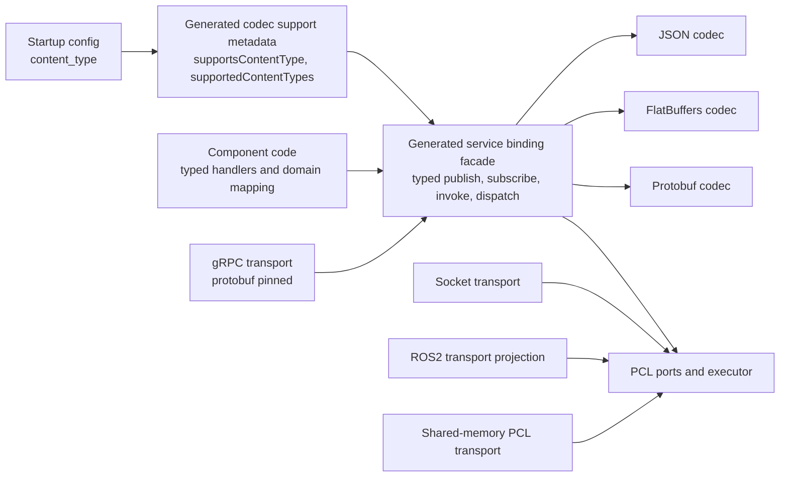
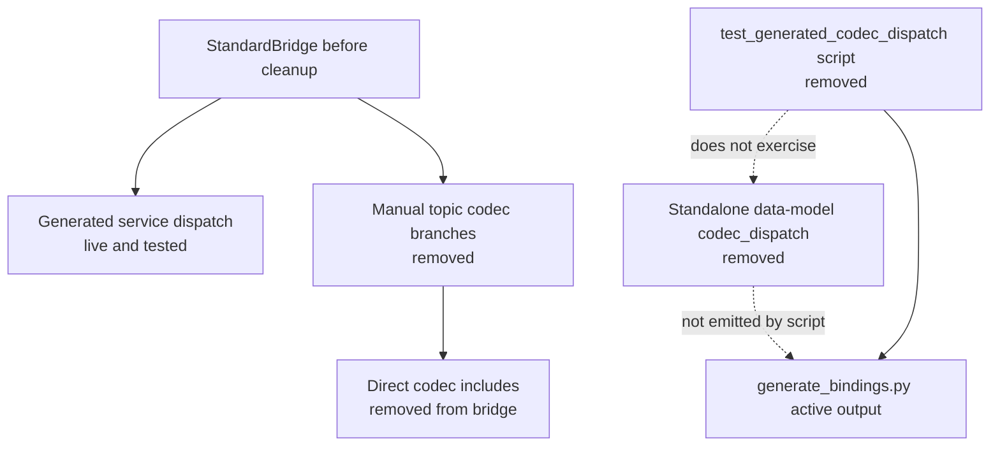
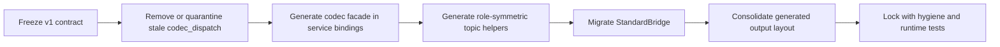
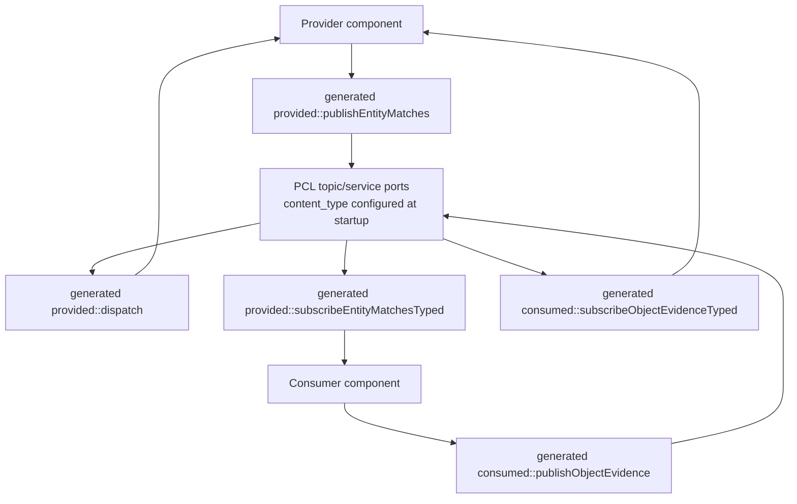

# PYRAMID Generated Bindings — Pluggability & Consistency Review

## Current Doc Status

This is a historical review and implementation-plan record from the binding
pluggability cleanup.

For current usage and v1 architecture, use:

- [generated_bindings.md](../../../subprojects/PYRAMID/doc/architecture/generated_bindings.md)

For current Tactical Objects proof status and test coverage, use:

- [generated_bindings_status.md](../../reports/PYRAMID/generated_bindings_status.md)

Some findings below were intentionally fixed after this review, including the
`StandardBridge` topic encode/decode duplication and removal of the stale
standalone `examples/dispatch` artefacts. Keep this document as audit context
rather than as the primary user guide.

---

Reviewer scope: how PYRAMID-generated bindings let a consuming component
swap codecs and transports with **only configuration / startup wiring**, no
bespoke per-codec or per-transport branching in business logic.

Branch: `claude/review-pyramid-bindings-1hYVp`
Date: 2026-04-19

---

## 1. Summary verdict

The pluggability **architecture** in PYRAMID is sound:

- A registry-based code generator with a clean `CodecBackend` ABC.
- A transport-agnostic `ServiceHandler` interface generated from `.proto`.
- A generated service-binding `dispatch(...)` path that selects codec by
  `content_type` for request/response services.
- A consistent PCL-executor handoff rule ("transport threads do wire work
  only; business logic runs on the executor").

The **realisation** is partial: the design intent is "components use the
generated bindings + a content-type config; transport selection is just
startup wiring", but in practice the live Tactical Objects app only does
that cleanly for service ingress. `StandardBridge` uses the generated
service `dispatch(...)` path for provided services, but still hand-rolls
topic payload encode/decode, content-type predicates, and per-codec includes.
The transports also have three different activation shapes, and several
generated-output asymmetries make truly drop-in codec swap incomplete.

Additional review conclusion: for v1, treat the generated service binding
as the stable surface and make it complete. Do **not** build v1 around the
separate `examples/dispatch/*_codec_dispatch.*` artefacts unless the team
commits to adopting them fully; today they are stale, asymmetric, and not
the path the app or generator scripts actually exercise.

---

## 2. What "generated bindings" actually means here

Driven from `.proto` by `pim/generate_bindings.py` via a registry
(`pim/codec_backends.py`), PYRAMID emits, per language:

| Layer | C++ output | Ada output |
|-------|------------|------------|
| Types | `bindings/cpp/generated/pyramid_data_model_*_types.hpp` | `bindings/ada/generated/pyramid-data_model-*-types.ads` |
| JSON codec | `bindings/cpp/generated/pyramid_data_model_*_codec.hpp` | `bindings/ada/generated/pyramid-data_model-*-types_codec.ads` |
| FlatBuffers codec | `bindings/cpp/generated/flatbuffers/cpp/pyramid_data_model_*_flatbuffers_codec.hpp` | `bindings/ada/generated/flatbuffers/ada/*_flatbuffers_codec.ads` |
| Protobuf codec | `bindings/cpp/generated/protobuf/cpp/pyramid_data_model_*_protobuf_codec.hpp`; tactical service shim remains under `bindings/protobuf/cpp/` | `bindings/ada/generated/protobuf/ada/*_protobuf_codec.ads` |
| Service binding | `bindings/cpp/generated/pyramid_services_tactical_objects_provided.hpp` (typed `ServiceHandler`, `dispatch(...)`, wire-name constants) | `bindings/ada/generated/pyramid-services-tactical_objects-provided.ads` |
| gRPC transport | `bindings/cpp/generated/grpc/cpp/pyramid_components_*_grpc_transport.{hpp,cpp}` (`ServerHost::start(address)`) | `bindings/ada/generated/grpc/ada/*_grpc_transport.ads` |
| ROS2 transport | `bindings/cpp/generated/ros2/cpp/pyramid_components_*_ros2_transport.{hpp,cpp}` (`ServiceBinder::bind()`) | endpoint-constant specs |
| Standalone data-model codec dispatch | removed v1 cleanup candidate; historical path was `examples/dispatch/cpp/*_codec_dispatch.*` | removed v1 cleanup candidate |

The current contract is captured in
[generated_bindings.md](../../../subprojects/PYRAMID/doc/architecture/generated_bindings.md):

> Codec selection: by `content_type`; the generated dispatch layer decodes
> bytes to proto-native types; handlers operate only on typed values.
> Transport selection: by generated transport binding; handlers must not
> branch on transport choice.

---

## 3. Pluggability mechanics, in order of strength

### 3.1 Service handler abstraction — STRONG

`pyramid_services_tactical_objects_provided.hpp:78-102` defines a single
typed `ServiceHandler` ABC (`handleCreateRequirement`, `handleReadMatch`,
…). All three transports re-use it:

- PCL: `dispatch(handler, channel, …, content_type, …)` at line 193-199.
- gRPC: `MatchingObjectsServiceImpl` etc. (`pyramid_components_tactical_objects_services_provided_grpc_transport.cpp:92-239`)
  forward to the same handler via the executor.
- ROS2: `ServiceBinder::bind()` (`…_ros2_transport.cpp:23-30`) wires
  ingress to `pcl_executor_post_service_request`, which lands on the same
  handler.

Net: a component that implements `ServiceHandler` is genuinely reusable
across transports. This is the cleanest part of the design.

### 3.2 Backend registry — STRONG (generator-side)

`pim/codec_backends.py` exposes an `ABC` + `register()` pattern; each
backend module under `pim/backends/` self-registers. Adding a new codec
is "subclass + register"; the orchestrator does not need to be edited.

Caveat: this is generator-time pluggability only. Runtime cannot acquire
new codecs; they must be regenerated and recompiled.

### 3.3 Standalone data-model codec dispatch — STALE, NOT V1 AS-IS

There are currently two concepts named "dispatch":

1. **Service binding dispatch**: `provided::dispatch(...)` /
   `consumed::dispatch(...)` in `bindings/cpp/generated/*_provided.cpp`
   and `*_consumed.cpp`. This is live, built by `generate_bindings.py`,
   and exercised by `test_codec_dispatch_e2e`.
2. **Standalone data-model codec dispatch**:
   `examples/dispatch/cpp/pyramid_data_model_*_codec_dispatch.hpp` and
   the Ada equivalents. These files are not registered in
   `pim/backends/__init__.py`, are not emitted by
   `scripts/generate_bindings.bat`, and are not what the current CMake
   `test_codec_dispatch_e2e` target includes.

The standalone layer emits a clean-looking per-package dispatcher. For each
typed message it produces:

```cpp
inline std::string serialize(const …::GeodeticPosition& msg,
                             const char* content_type);
```

…that does the routing. The intent is reasonable, but this artefact is not
currently a workable v1 seam. Two important properties of the current
emission:

- Codecs are gated by `#if defined(CODEC_FLATBUFFERS)` /
  `#if defined(CODEC_PROTOBUF)` (lines 21-27, 52-59, …) — runtime
  selection by `content_type` is real, but the available set is fixed at
  build time.
- `deserializeXxx(...)` only implements JSON; non-JSON paths
  unconditionally throw with the comment "FlatBuffers and Protobuf
  deserialize to their own types; conversion to the common type requires
  a mapping layer" (lines 70-74, 99-103, …).

So the standalone dispatch is **symmetric for serialise, asymmetric for
deserialise**. It also does not cover the service-level payload shapes that
matter in Tactical Objects, such as `std::vector<ObjectMatch>` topic
payloads. A consumer that "just changes `content_type`" gets full encode
for simple messages but partial decode and no complete topic/service
surface.

V1 direction: either delete/quarantine this standalone dispatch concept, or
fold it into the generated service binding layer and make the service
binding call it internally. Keeping both concepts active invites drift.
Given current usage, removal/quarantine is the lower-risk v1 path.

### 3.4 PCL port-level codec selection — STRONG (when used)

A port is created with a `content_type`; PCL routes the message and the
generated `dispatch(handler, channel, …, content_type, …)` picks the
codec. Threaded all the way through `StandardBridge::on_configure`
(`StandardBridge.cpp:376-413`) the codec is set once via a constructor
parameter and propagated to every `addService` / `addPublisher` /
`addSubscriber` call. CLI flag `--content-type` in
`tactical_objects_main.cpp:139-143` flows that down.

This is the closest the codebase gets to "no bespoke code, just
configuration". Switching the live tactical-objects app between JSON,
FlatBuffers, and Protobuf is genuinely a CLI argument.

### 3.5 Transport selection — MIXED

Transports are **not interchangeable at the call site**. Each presents a
different activation API:

| Transport | Startup call (provider) |
|-----------|--------------------------|
| PCL socket | `pcl_socket_transport_create_server(port, exec)` then `pcl_executor_set_transport(...)` (`tactical_objects_main.cpp:186-195`) |
| gRPC | `provided::grpc_transport::buildServer(address, exec)` returning a `ServerHost` (`…_grpc_transport.hpp:29-30`) |
| ROS2 | construct a `pyramid::transport::ros2::Adapter` (e.g. `RclcppRuntimeAdapter(node)`), then `ServiceBinder(adapter, exec).bind()` (`…_ros2_transport.hpp:11-20`) |
| PCL shared-memory | central named-bus (foundation only at PCL layer; Tactical Objects projection status is tracked in [generated_bindings_status.md](../../reports/PYRAMID/generated_bindings_status.md)) |

These shapes are not unifiable today: ServerHost vs adapter+binder vs
socket factory. So transport swap is "additional setup" (per the user's
intent), but each transport is its own bespoke setup snippet rather than
a single pluggable factory. There is no `Transport` trait / abstract
factory shared across them.

---

## 4. Inconsistencies and gaps

### 4.1 The proving-ground component only partly uses generated bindings

`StandardBridge.cpp` is the live tactical-objects consumer of the
generated bindings. The service path is healthier than the first-pass
review implied: `StandardBridge::dispatchProvidedService(...)` calls
`prov::dispatch(handler, ..., frontend_content_type_.c_str(), ...)`, so
provided service requests do flow through generated service dispatch.

The remaining problem is the topic and consumed-interface edge. The bridge:

1. Includes the generated `*_provided.hpp`, `*_consumed.hpp`, and the
   per-codec headers directly (`StandardBridge.cpp:3-7`).
2. Re-defines `kJsonContentType` / `kFlatBuffersContentType` /
   `kProtobufContentType` and helper predicates `is_json_content_type`
   etc. (lines 36-50).
3. Hand-rolls per-codec branches in `encode_match_array` (lines 289-306),
   `encode_evidence_requirement` (lines 308-317), `decode_object_evidence`
   (lines 319-337).

Effect: service ingress is close to the desired model, but topic
publication/subscription is not. Any new codec still requires editing
`StandardBridge` because the generated provided binding exposes subscribe
helpers for provided topics, but not provider-side typed publish helpers
for those same topics. The consumed binding has typed `publishObjectEvidence`,
but the role-symmetric helper set is incomplete.

A second symptom: JSON's "encode a vector of `ObjectMatch`" path
(line 297-305) builds the JSON array inline (`"[" + toJson(match) + …
"]"`) because the JSON codec exposes per-message `toJson`, while
FlatBuffers/Protobuf expose `toBinary(vector<…>)` directly. The
collection-encoding surface is **asymmetric across codecs**, which is
why generated topic helpers need to own service/topic payload encoding for
arrays as well as scalar messages.

### 4.2 Two parallel JSON output locations

- Active: `bindings/cpp/generated/pyramid_data_model_common_codec.hpp`
  (no `_json_` suffix). Used by the live generated service bindings and
  by `StandardBridge.cpp` via `tactical_codec::toJson`.
- Removed stale path: `examples/json/cpp/pyramid_data_model_common_json_codec.hpp`
  and the matching Ada JSON mirror. These were not used by the active service
  binding path.

The standalone dispatch layer therefore points at a different JSON layout
than the active app consumes. The v1 cleanup should choose one canonical
layout and remove or quarantine the other. The `near-term standardisation`
cleanup guidance in [generated_bindings.md](../../../subprojects/PYRAMID/doc/architecture/generated_bindings.md) now points
at this class of filename/package compatibility debt.

### 4.3 FlatBuffers / Protobuf output layouts also differ

- FlatBuffers C++: `bindings/cpp/generated/flatbuffers/cpp/`.
- Protobuf C++:    `bindings/cpp/generated/protobuf/cpp/` for generated
  data-model stubs; `bindings/protobuf/cpp/` is retained only for the tactical
  service protobuf shim still linked by `pyramid_protobuf_support`.
- gRPC C++:        `bindings/cpp/generated/grpc/cpp/`.
- ROS2 C++:        `bindings/cpp/generated/ros2/cpp/`.

There is no single rule like "every backend lives at
`examples/<backend>/<lang>/`". Build glue and `#include` hygiene are
backend-specific. This is purely a layout issue, but it is a real
friction point when a new backend needs to be added.

### 4.4 Compile-time availability vs runtime content-type

The standalone `pyramid_data_model_common_codec_dispatch.hpp` brackets
non-JSON codecs in `#if defined(CODEC_FLATBUFFERS)` /
`#if defined(CODEC_PROTOBUF)`. The active generated service bindings use
`__has_include(...)` to decide whether FlatBuffers/Protobuf service codecs
are available. Both approaches leave the same v1 gap: runtime configuration
can request a content type without a generated public way to ask "does this
binary support it?"

Consequences:

- A component can be configured with `application/flatbuffers` or
  `application/protobuf` and only discover missing codec support when a
  message is encoded/decoded.
- There is no generated introspection table, no startup validation helper,
  and no consistent error model across service dispatch, publish helpers,
  and application code.

### 4.5 Asymmetric serialise / deserialise in standalone dispatch

For every type the generator emits:

```cpp
std::string serialize(...);                       // routes JSON/FB/Protobuf
T deserializeXxx(const void*, size_t,             // JSON only; throws otherwise
                 const char* content_type);
```

(see `pyramid_data_model_common_codec_dispatch.hpp:65-74, 94-103, …`).
A bidirectional consumer therefore can't be built on top of the
standalone dispatch layer alone. This is a decisive reason not to adopt
that artefact directly as the v1 surface.

### 4.6 gRPC transport hard-binds protobuf

`pyramid_services_tactical_objects_grpc_dispatch.hpp:14` declares
`kProtobufContentType` as the only request type, and the gRPC server
shim at `…_grpc_transport.cpp:70` sets `request.type_name =
grpc_detail::kProtobufContentType` unconditionally. This is
semantically reasonable (gRPC is protobuf-native) but it means
"transport" and "codec" are not orthogonal axes — gRPC pins the codec.
Worth documenting explicitly so consumers don't expect
`grpc + flatbuffers`.

### 4.7 Ada story has a stated short-cut

[generated_bindings.md](../../../subprojects/PYRAMID/doc/architecture/generated_bindings.md) is candid about the Ada policy:

> JSON is expected to remain native at the Ada layer. FlatBuffers and
> Protobuf may use generated C/C++ shims internally. … This is a
> short-term implementation choice, not a change to the public contract.

So Ada *callers* see a typed surface, but Ada is not really pluggable at
the codec implementation level today. This is openly tracked, not a
hidden defect.

### 4.8 Application-level transport selection is bespoke

`tactical_objects_main.cpp:186-200` hard-codes the socket transport.
There is no factory like:

```cpp
auto transport = pyramid::transport::create("grpc:127.0.0.1:50111", exec);
transport->bind(server_handler);
```

Switching the app from socket to gRPC or ROS2 today requires editing
`main.cpp` to call a different builder (`buildServer` vs
`pcl_socket_transport_create_server` vs `Adapter` + `ServiceBinder`).
Each transport has its own lifetime object (`ServerHost`,
`pcl_socket_transport_t*`, `Adapter` + `ServiceBinder`), with no common
RAII type.

---

## 5. Cross-language conformance signal

[generated_bindings_status.md](../../reports/PYRAMID/generated_bindings_status.md) tracks the
current cross-language and transport conformance matrix, including:

- socket + JSON
- socket + FlatBuffers
- gRPC + Protobuf

…with `socket + Protobuf`, shared-memory tactical projection, and
ROS2/Ada combinations not yet in the master matrix. The matrix shape
matches the issues above: gRPC is only proven in its native pairing
(protobuf), and codec orthogonality is exercised under the socket
transport, not across transports.

---

## 6. V1 direction and concrete action plan

Recommended v1 decision: **adopt the generated service bindings as the only
component-facing binding surface**. They already expose the stable
`ServiceHandler` interface, typed invoke/publish/subscribe entry points, and
service-level `dispatch(...)`. Codec choice should be **statically configured
at component startup** by `content_type` and validated once against the codecs
compiled into that binary. Runtime per-port selection can continue where PCL
already supports it, but v1 should not require dynamic plugin loading or
business-logic branches on codec.

The separate data-model `examples/dispatch/*_codec_dispatch.*` concept should
not be part of v1 unless it is deliberately folded into the service generator.
The lower-risk v1 path is to remove or quarantine it.

### 6.0 V1 shape at a glance

Target component-facing shape:



The intended component boundary is therefore simple: component code sees the
generated binding facade and proto-native generated types. Codec-specific
headers, content-type branching, and wire payload parsing stay inside generated
binding/codec code.

Historical ambiguity removed during v1 cleanup:



V1 cleanup sequence:



Provider/consumer topic shape after helper generation:



### 6.1 Freeze the v1 contract

Define the v1 rule in [generated_bindings.md](../../../subprojects/PYRAMID/doc/architecture/generated_bindings.md):

- Component code may include generated service binding headers and generated
  domain type headers.
- Component code must not include codec-specific headers such as
  `*_flatbuffers_codec.hpp` / `*_protobuf_codec.hpp` directly.
- Component code must not do `strcmp(content_type, ...)` or codec-specific
  `toJson` / `toBinary` / `fromBinary` branching.
- Generated binding code owns all codec selection, encode/decode, and
  unsupported-codec reporting.
- Transport startup may be transport-specific for v1, but transport choice
  must not change handler signatures or component business logic.

Acceptance check: `StandardBridge.cpp` should compile without direct
FlatBuffers/Protobuf includes and without local content-type predicates.

### 6.2 Remove or quarantine stale dispatch artefacts

Cleanup status: completed. The standalone `examples/dispatch` files,
`pim/backends/codec_dispatch_generator.py`, `test_generated_codec_dispatch.*`
scripts, and `generated_bindings_flatbuffers_dispatch` CTest wrapper have been
removed. Active codec dispatch now means generated service-binding dispatch.

Completed cleanup pass:

- Deleted `examples/dispatch/cpp/*_codec_dispatch.*` and
  `examples/dispatch/ada/*-codec_dispatch.*`.
- Deleted `pim/backends/codec_dispatch_generator.py`.
- Deleted `scripts/test_generated_codec_dispatch.*` and the
  `generated_bindings_flatbuffers_dispatch` CTest entry.
- Updated current docs so "dispatch" means service binding dispatch unless a
  section explicitly says "standalone data-model codec dispatch".

This prevents future work from trying to migrate components onto an artefact
that is currently stale, not generator-registered, and not bidirectional.

### 6.3 Make service bindings own the codec facade

Move the missing abstractions into `pim/cpp_codegen.py` /
`pim/ada_codegen.py`, where the live service dispatch already exists:

- Generate shared content-type constants and `supportsContentType(...)`.
- Generate `supportedContentTypes()` or equivalent static metadata so startup
  can fail early when config asks for a codec not compiled into the binary.
- Generate internal encode/decode helpers for every request, response, and
  topic payload shape, including arrays such as `std::vector<ObjectMatch>`.
- Keep `__has_include` / compile-time gating inside generated binding code,
  but make unsupported codec behavior explicit and testable.
- Keep JSON, FlatBuffers, and Protobuf conversion to the same proto-native
  C++/Ada public types. Codec-native types must not escape into component
  code.

This gives a single place to add the next codec backend: the backend exposes
`toBinary` / `fromBinary` for the generated proto-native type surface, and
the service binding generator wires it into the facade.

### 6.4 Generate role-symmetric topic helpers

Close the current `StandardBridge` gap by generating endpoint-role helpers
for both sides of every topic:

- For a provider-side topic, generate provider publish helpers as well as
  consumer subscribe helpers.
- For a consumed-side topic, generate consumer publish helpers and provider
  subscribe/decode helpers.
- Provide typed callback wrappers where practical, so component code can
  receive `ObjectDetail` or `ObjectEvidenceRequirement` directly rather than
  raw `pcl_msg_t` plus local decode logic.
- Keep raw `std::string` publish overloads only as an escape hatch; mark the
  typed overload as the normal v1 API.

After this, `StandardBridge::publishEntityMatches`,
`publishEvidenceRequirement`, and `onStandardObjectEvidence` should be thin
calls into generated helpers plus internal model mapping.

### 6.5 Migrate the Tactical Objects app

Use `StandardBridge` as the v1 proving-ground:

1. Replace local content-type constants/predicates with generated metadata.
2. Replace `encode_match_array`, `encode_evidence_requirement`, and
   `decode_object_evidence` with generated typed helpers.
3. Remove direct includes of FlatBuffers/Protobuf service codec headers from
   `StandardBridge.cpp`.
4. Validate `frontend_content_type_` in `on_configure()` and fail before
   opening ports if unsupported.
5. Keep `--content-type` / `--frontend-content-type` as the static app-level
   configuration knob for socket/PCL v1.

The bridge should still own Tactical Objects domain mapping. It should not own
wire-format selection.

### 6.6 Consolidate generated output layout

Pick one canonical generated-output layout before adding more backends. For
v1, the least disruptive choice is:

- Keep active C++ service/data-model bindings under `bindings/cpp/generated/`.
- Keep active Ada service/data-model bindings under `bindings/ada/generated/`.
- Put backend-specific generated support under subdirectories of those roots,
  for example `bindings/cpp/generated/flatbuffers/cpp/` and
  `bindings/cpp/generated/protobuf/cpp/`.
- Stale parallel roots such as `examples/json/`, `examples/flatbuffers/`, and
  root-level data-model protobuf codec mirrors have been removed; do not
  reintroduce them unless they are emitted by `scripts/generate_bindings.bat`
  as part of the active generated root.

The rule is less important than enforcing one rule. The previous mix of
`bindings/cpp/generated`, `examples/json/cpp`, root-level data-model protobuf
mirrors, and `examples/dispatch/cpp` let stale artefacts look authoritative.

### 6.7 Keep transport v1 static, document codec coupling

Transport does not need to be fully runtime-selectable for binding v1. A clean
v1 can be statically wired as long as each component sees the same generated
handler and typed topic/service APIs.

Concrete v1 transport rules:

- Socket/PCL remains the production proving path for `json`, `flatbuffers`,
  and `protobuf`.
- gRPC is documented as protobuf-pinned, not codec-orthogonal.
- ROS2 is documented as a transport projection over the generated typed
  surface and ROS2 envelope mapping, not as a separate payload model.
- Shared memory remains a PCL transport foundation until the Tactical
  Objects-specific projection is generated.

Only after the binding surface is clean should a common `ProvidedHost` /
`ConsumedHost` factory be introduced. That factory is useful, but not a v1
blocker if startup wiring remains explicit and stable.

### 6.8 V1 acceptance tests

Add or tighten tests around the cleanup:

- Generator test: running full C++/Ada generation for
  `json,flatbuffers,protobuf,grpc,ros2` produces no stale dispatch files
  and no undocumented parallel JSON/protobuf roots.
- Static hygiene test: `StandardBridge.cpp` has no direct
  FlatBuffers/Protobuf codec includes and no local content-type branch table.
- Runtime tests: real app passes JSON, FlatBuffers, and Protobuf C++ client
  tests through the generated helpers.
- Negative config test: unsupported `--content-type` fails during configure,
  not on first message.
- Conformance test: keep `socket + JSON`, `socket + FlatBuffers`, and
  `gRPC + Protobuf`; add `socket + Protobuf` when the standalone Tactical
  Objects socket/protobuf path is promoted into the master matrix.
- Documentation test/review checklist: no page describes
  `examples/dispatch/*_codec_dispatch.*` as active v1 API.

---

## 7. Bottom line

The clean v1 is not "make every dispatch artefact real". It is:

- one generated service binding surface;
- one static `content_type` configuration point per component/port;
- generated bindings own all codec encode/decode and support checks;
- components implement typed handlers and perform domain mapping only;
- stale generated artefacts are removed or clearly quarantined.

That path preserves the good architecture already present in
`ServiceHandler` and service `dispatch(...)`, while removing the ambiguity
created by the unused standalone `codec_dispatch` files. Once that is stable,
transport factories and broader runtime selection can be added without
dragging codec-specific branches back into component code.
