# Tactical Objects Architecture

This document describes the internal architecture of the `tactical_objects` component with visual diagrams and end-to-end worked examples.

For high-level requirements see `REQUIREMENTS.md`. For the concrete class design see `DESIGN.md`. For low-level requirements and traceability see `LLR.md`. For the TDD implementation plan see `TDD_PLAN.md`.

---

## 1. System Context

The `tactical_objects` component sits inside a PYRAMID container managed by PCL. External systems push data in through PCL transport adapters and pull state through PCL services.

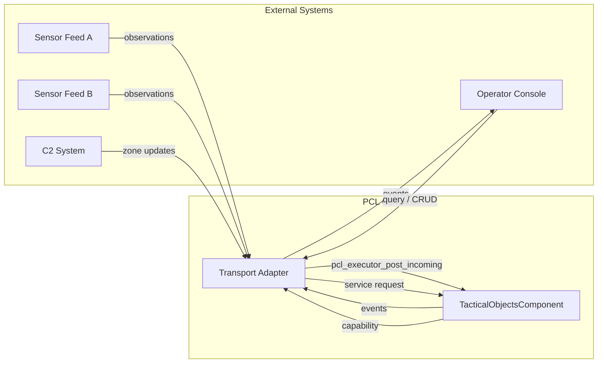

---

## 2. Component Layers

The component is split into a thin PCL wrapper and a pure domain runtime that can be tested in isolation.

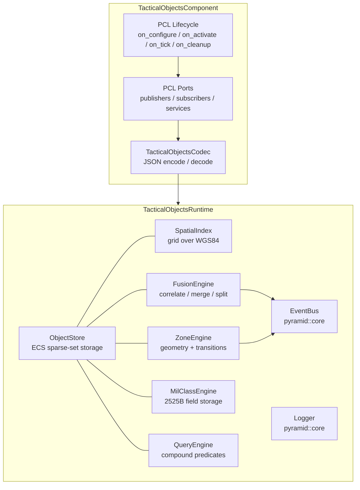

---

## 3. Object Store (ECS Layout)

The `ObjectStore` uses a sparse-set pattern. Each entity has a UUID. Optional component tables hold facets. Not every entity populates every table.

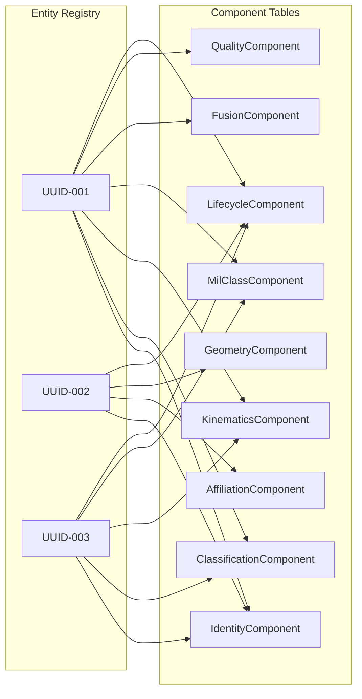

UUID-001 is a fully-tracked fused entity. UUID-002 is a geographic zone (no kinematics or fusion). UUID-003 is a sparse entity with only identity, classification, kinematics, military classification, and lifecycle.

---

## 4. Two Entity Creation Paths

Entities enter the store through two distinct paths.

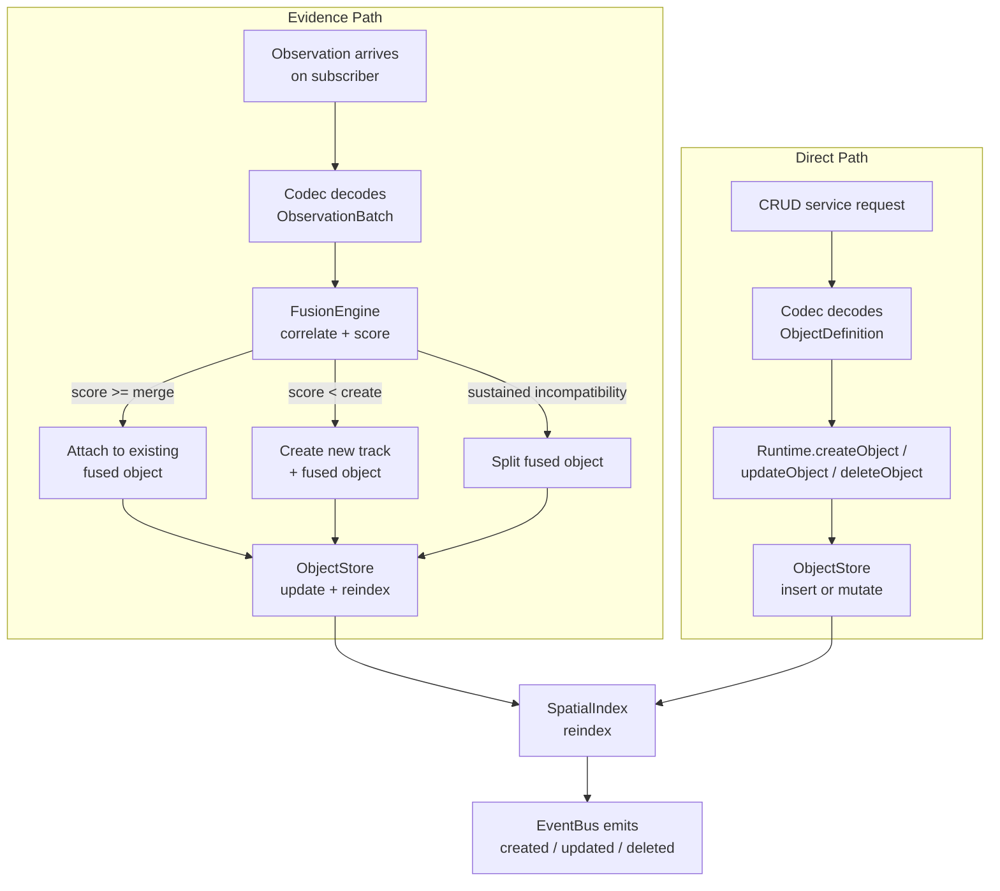

Evidence-path objects carry `fused` provenance and retain lineage to contributing observations and tracks. Direct-path objects carry `direct` provenance and bypass correlation.

Both paths feed the same `ObjectStore` and are queryable through the same `QueryEngine`.

---

## 5. Fusion Pipeline Detail

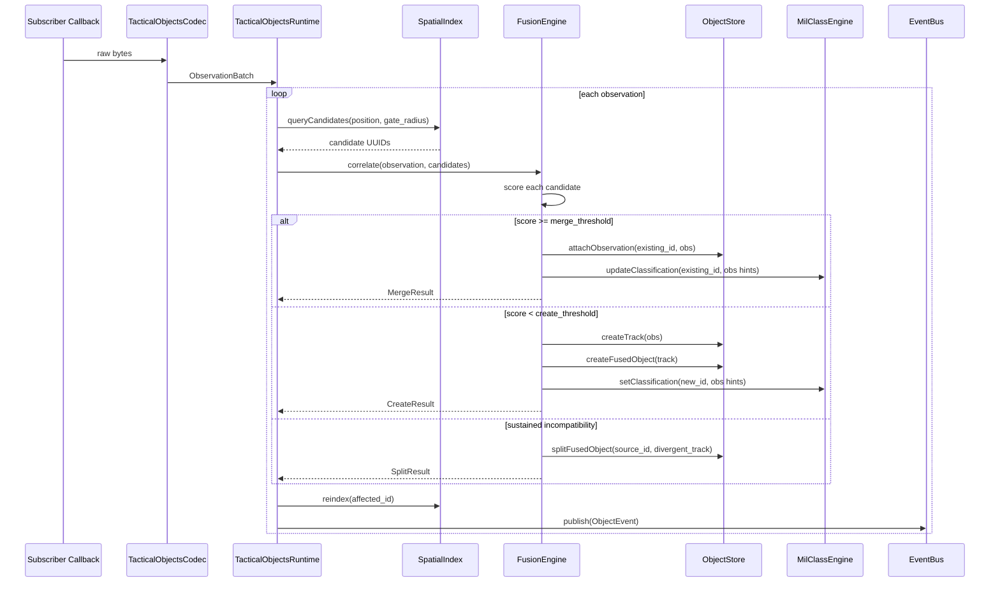

---

## 6. Zone Relationship Evaluation

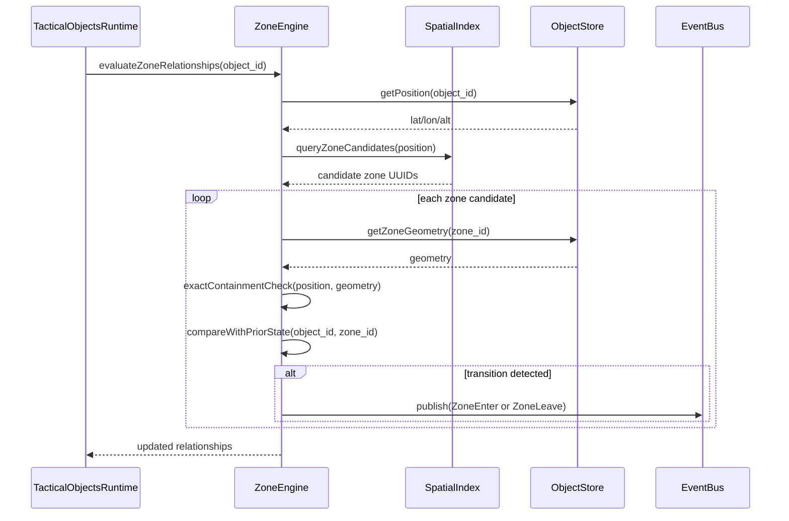

---

## 7. Query Flow

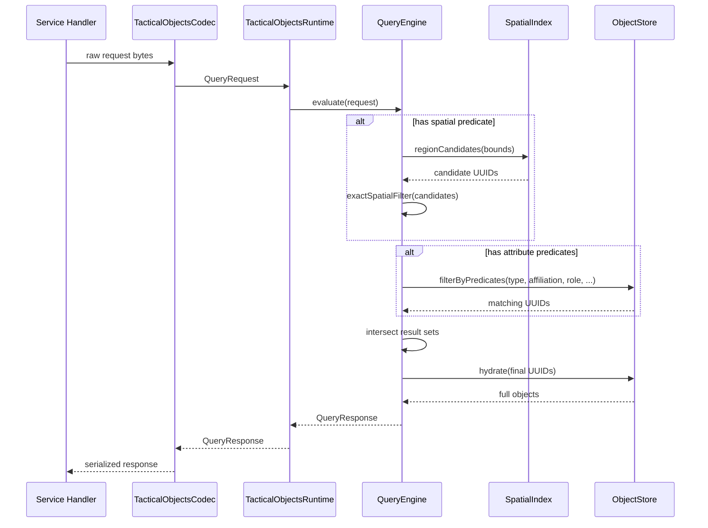

---

## 8. PCL Lifecycle

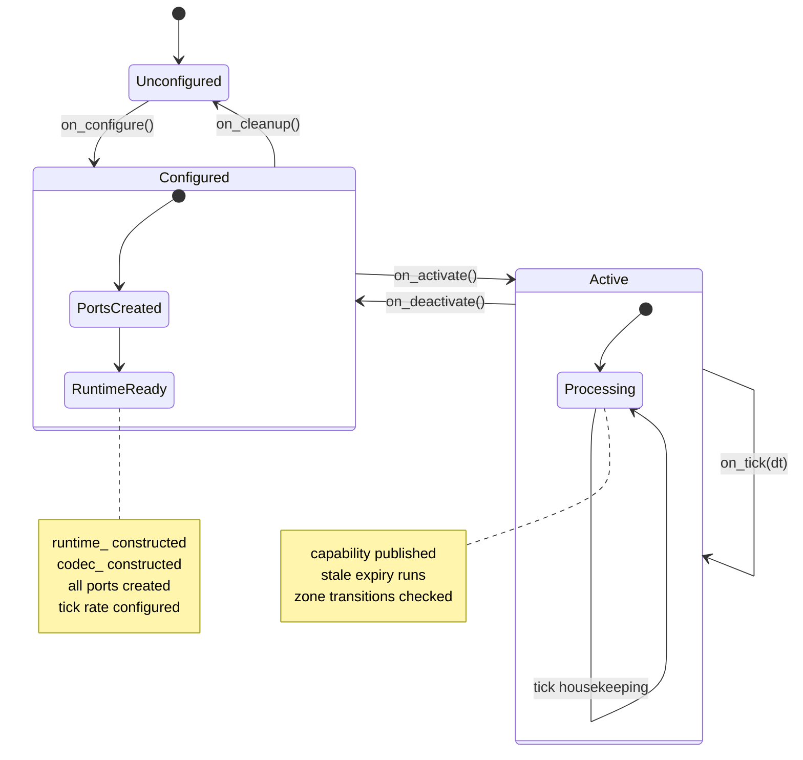

---

## 9. Military Classification Data Flow

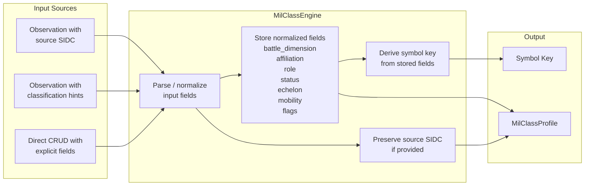

The MilClassEngine stores normalized semantic fields. Source SIDCs are preserved but never used as the authoritative representation. Symbol keys can be regenerated after any field change.

---

## 10. End-to-End Examples

### 10.1 Radar Detection Creates a New Entity (Evidence Path)

**Scenario**: A radar feed submits an observation of an unknown aircraft. No existing entity matches.

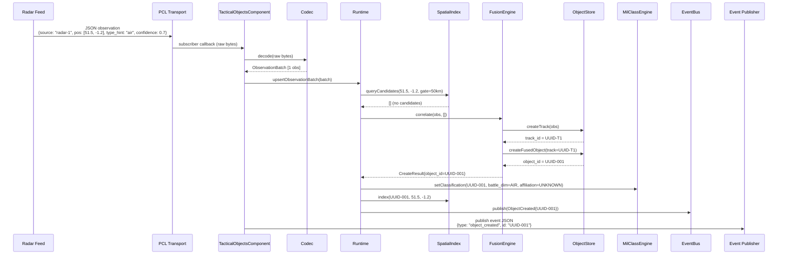

**Result**: A new fused object UUID-001 exists in the store with battle dimension AIR, affiliation UNKNOWN, confidence 0.7, and a single track UUID-T1 backed by one observation.

---

### 10.2 Second Sensor Confirms the Same Entity (Evidence Path - Merge)

**Scenario**: An ADS-B feed reports the same aircraft. The observation is close enough to merge.

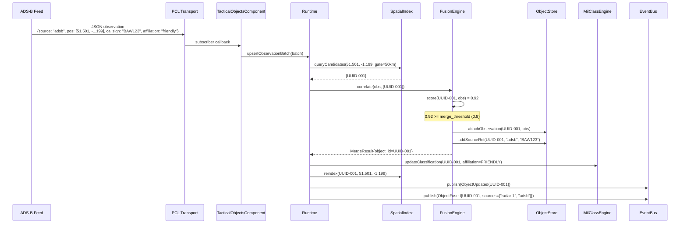

**Result**: UUID-001 now has two source references (radar-1 and adsb), affiliation upgraded to FRIENDLY, higher confidence from dual-source corroboration, and lineage tracing back to both observations.

---

### 10.3 Operator Creates an Entity Directly (Direct Path)

**Scenario**: An operator manually plots a known hostile ground unit at a specific location.

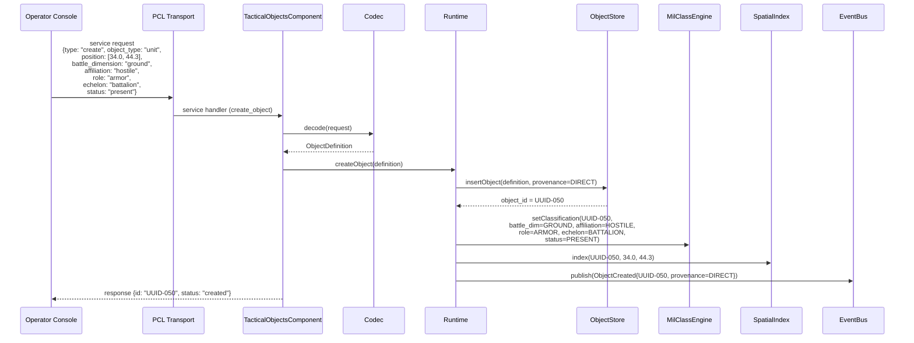

**Result**: UUID-050 exists in the store with `direct` provenance, full military classification, and is queryable alongside evidence-based entities.

---

### 10.4 Zone Creation and Boundary Alert

**Scenario**: A no-go zone is created. An existing entity is evaluated and found inside.

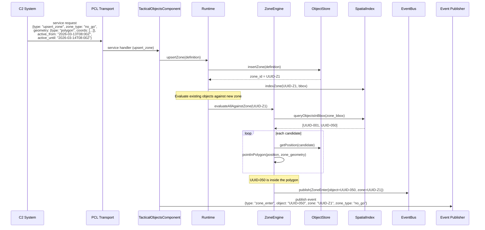

**Result**: Zone UUID-Z1 is stored with temporal validity. UUID-050 triggered a `zone_enter` event because it falls inside the polygon. Downstream consumers can alert on hostile units inside no-go zones.

---

### 10.5 Query for All Hostile Ground Units Near a Zone

**Scenario**: An operator queries for all hostile ground units within 10 km of the no-go zone.

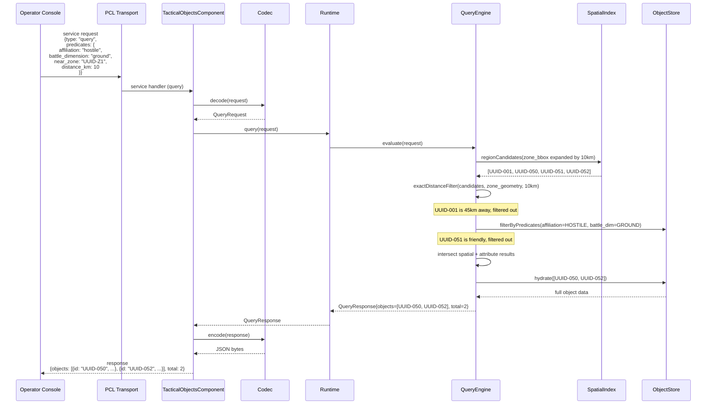

**Result**: The query returns exactly the two hostile ground entities within 10 km of the no-go zone. Spatial index pruned the candidate set before attribute filtering.

---

### 10.6 Tick-Based Stale Object Expiry

**Scenario**: No updates arrive for a tracked entity for longer than the configured timeout.

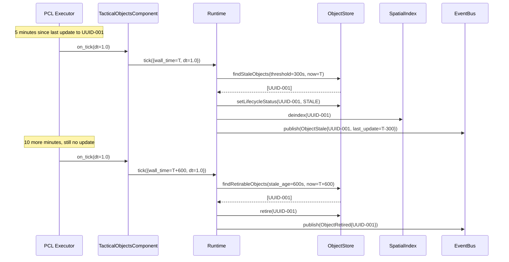

**Result**: UUID-001 transitions from active to stale after 5 minutes without updates, then is retired after 10 more minutes. Its spatial index entry is removed when it becomes stale to avoid false query results.

---

## 11. Module Dependency Graph

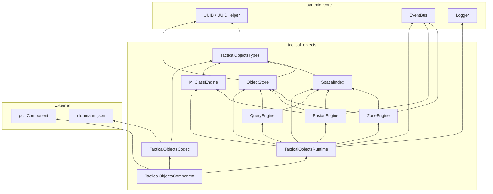

---

## 12. Source File Map

| Module | Header | Source | Test |
|--------|--------|--------|------|
| Types | `include/TacticalObjectsTypes.h` | (header-only) | (covered by other tests) |
| ObjectStore | `include/store/ObjectStore.h` | `src/store/ObjectStore.cpp` | `Test_ObjectStore.cpp` |
| ObjectComponents | `include/store/ObjectComponents.h` | (header-only) | (covered by ObjectStore tests) |
| SpatialIndex | `include/spatial/SpatialIndex.h` | `src/spatial/SpatialIndex.cpp` | `Test_SpatialIndex.cpp` |
| FusionEngine | `include/fusion/FusionEngine.h` | `src/fusion/FusionEngine.cpp` | `Test_FusionEngine.cpp` |
| MilClassEngine | `include/milclass/MilClassEngine.h` | `src/milclass/MilClassEngine.cpp` | `Test_MilClassEngine.cpp` |
| ZoneEngine | `include/zone/ZoneEngine.h` | `src/zone/ZoneEngine.cpp` | `Test_ZoneEngine.cpp` |
| QueryEngine | `include/query/QueryEngine.h` | `src/query/QueryEngine.cpp` | `Test_QueryEngine.cpp` |
| Runtime | `include/TacticalObjectsRuntime.h` | `src/TacticalObjectsRuntime.cpp` | `Test_TacticalObjectsRuntime.cpp` |
| Codec | `include/TacticalObjectsCodec.h` | `src/TacticalObjectsCodec.cpp` | `Test_TacticalObjectsComponent.cpp` |
| Component | `include/TacticalObjectsComponent.h` | `src/TacticalObjectsComponent.cpp` | `Test_TacticalObjectsComponent.cpp` |

All paths are relative to `pyramid/tactical_objects/`. Tests are under `tests/tactical_objects/`.
