# AME Authoring Tool User Guide

The AME authoring tool is a local graphical workbench for describing what a
mission is allowed to do, checking that the description makes sense, and
watching a mission play out against it before any of it reaches a vehicle.

**You do not need to know PDDL to read this guide.** PDDL is the file format
AME uses to record a mission model, and the tool reads and writes it for you.
[Part 1](#part-1--the-ideas) explains every idea the tool uses in plain words,
[Part 2](#part-2--build-and-launch) builds and starts the tool, and
[Part 3](#part-3--a-worked-example-first-survey) walks through building a
complete small mission from an empty project, planning it, running it,
breaking it on purpose, and exporting it for review. Everything after that is
reference material you can come back to.

Every screenshot in this guide is the real interface, taken from the finished
example project by the script described in
[Regenerating the screenshots](#regenerating-the-screenshots).

| Part | What it covers |
|------|----------------|
| [Part 1](#part-1--the-ideas) | The ideas: facts, things, actions, missions, planning, behaviour trees |
| [Part 2](#part-2--build-and-launch) | Building the tool and starting it, on Windows and on Linux |
| [Part 3](#part-3--a-worked-example-first-survey) | The tutorial: build, check, plan, run, break and export a small mission |
| [Part 4](#part-4--reference) | Reference for every screen, menu, file format and command |
| [Part 5](#part-5--troubleshooting) | What to do when something does not work |

---

# Part 1 — The ideas

Skip this part if you already write PDDL. If you do not, read it once: the
rest of the guide assumes these six ideas and nothing else.

## 1.1 A mission model is a description, not a program

You are not writing the steps a vehicle should take. You are writing down what
the vehicle **can** do, what has to be true before it can do each thing, and
what changes as a result. Given that description and a goal, the software works
out the steps by itself, and works them out again if something goes wrong
during the mission.

This is worth stating plainly because it changes how you think about the work.
There is no "then" in a mission model. There is no ordering, no loop and no
branch. You describe five actions and the software finds the order.

## 1.2 Facts

A **fact** is something that is either true or false right now. `the uav is at
base` is a fact. `the uav is airborne` is a fact. `sector A has been searched`
is a fact.

Facts come in families. Rather than writing a separate fact for every sector,
you write one fact **shape** with blanks in it:

> `searched(____)` — where the blank is a sector

The tool calls the shape a fact and shows it as `searched(sector)`. Fill the
blank with a real sector and you get a fact that is true or false: `(searched
sector_a)`. A fact with no blanks at all is fine too, and is how you say
something about the world as a whole: `comms-available()` is either true or it
is not.

Everything the software knows about the world at any moment is just a list of
these facts and whether each one is true. There is nothing else. If your
mission depends on something, that something has to be a fact, or the planner
cannot see it.

## 1.3 Things, and kinds of thing

The blanks in a fact have to be filled with something, and not just anything
will do: `searched(base)` is nonsense if `base` is an airfield rather than a
sector.

So the tool asks you for two lists.

**Kinds of thing** — the tool's `Types` list. A kind of thing can be a special
case of another: a *sector* is a kind of *location*, so anything that accepts a
location also accepts a sector. Every kind of thing is ultimately a special case
of `object`, which is the root that always exists.

**Things** — the tool's `Things in scenarios` list, which PDDL calls objects.
These are the actual named items your mission involves: one vehicle called
`uav1`, an airfield called `base`, two sectors called `sector_a` and `sector_b`.
Each one has a kind.

The tool uses the kinds to stop you writing nonsense. When you fill in a blank,
things of the wrong kind still appear in the list, greyed out, with a short
reason such as `applies to a sector`. You can see why the choice is not offered
without being allowed to make it.

## 1.4 Actions

An **action** is something the mission can do. Each one is written in three
parts, and the tool words them as three headings on the screen:

| Heading on screen | What it means |
|-------------------|---------------|
| `It involves` | The blanks in this action: which vehicle, which sector, which two locations |
| `Before it can happen` | The facts that must already be true for the action to be possible |
| `Afterwards` | The facts that become true, and the facts that become false |

Take off, for instance:

- It involves a robot (call it `?r`) and a location (call it `?l`).
- Before it can happen: `?r` is at `?l`, and `?r` is on the ground.
- Afterwards: `?r` is airborne becomes true, and `?r` is on the ground becomes
  false.

The names beginning with a question mark — `?r`, `?l`, `?from`, `?to` — are the
blanks. They are not vehicles; they are the places a vehicle's name goes. The
same action description therefore covers every vehicle and every location you
will ever add.

**Making facts false matters as much as making them true.** An action that only
ever adds facts usually means something has been half described. A vehicle that
takes off must stop being on the ground, or the model will happily believe it is
both airborne and on the ground at once, and the plans that come out will be
wrong in ways that are hard to see.

## 1.5 A mission: where it starts and what counts as done

An action description says what is possible in general. A **scenario** is one
particular mission, and it says two things:

- **Initial state** — which facts are true when the mission begins. Anything not
  listed is taken to be false.
- **Goals** — which facts have to be true for the mission to count as finished.

That is the whole of it. You do not say how to get from one to the other.

## 1.6 What the planner does

Given the actions, the starting facts and the goals, the **planner** searches
for a sequence of actions that gets from one to the other. AME uses LAPKT, a
classical search library, for this. It either finds a plan, or it tells you that
no sequence of your actions can reach your goals from that start — which is
itself useful information, and the tool explains why rather than just saying no.

## 1.7 What the behaviour tree does

A plan is a list of steps. To *run* those steps against real software, AME
compiles the plan into a **behaviour tree**: a structure that is ticked many
times a second, where each tick asks the currently running step whether it has
finished, failed, or is still going. Behaviour trees are how the plan reaches
the actual mobility, sensor and communications software on a vehicle.

The important consequence for you as an author: when a step **fails**, AME does
not simply give up. It looks at the facts as they now stand, plans again from
there, and continues with the new plan. That is called **replanning**, and it
is the reason the model is worth writing carefully. The richer and more honest
your description of what each action needs and changes, the better the recovery.

## 1.8 The words PDDL uses

The tool speaks plain English on screen and writes PDDL to disk. When you look
at the generated file, or read the rest of AME's documentation, this table
translates.

| Plain words (the tool) | PDDL word | Example in the generated file |
|------------------------|-----------|-------------------------------|
| Fact | predicate | `(searched ?s - sector)` |
| Kind of thing | type | `sector - location` |
| Thing | object | `sector_a - sector` |
| Action | action | `(:action survey ...)` |
| It involves | `:parameters` | `:parameters (?r - robot ?s - sector)` |
| Before it can happen | `:precondition` | `:precondition (and (at ?r ?s) ...)` |
| Becomes true | add effect | `(searched ?s)` |
| Becomes false | delete effect | `(not (on-ground ?r))` |
| Where the mission starts | `:init` | `(at uav1 base)` |
| What counts as done | `:goal` | `(:goal (and (reported sector_a)))` |
| Scenario | problem file | `problem_survey-sector-a.pddl` |
| Domain | domain file | `domain.pddl` |

The repository's [`doc/GLOSSARY.md`](../../../../doc/GLOSSARY.md) defines the
terms that recur across AME as a whole.

---

# Part 2 — Build and launch

The tool is gated behind `AME_BUILD_AUTHORING=ON`, and the `authoring` preset
turns that on for you. The preset configures into its own `build-authoring/`
directory and has matching build and test presets, `authoring-release` and
`authoring-debug`.

From the repository root on Windows:

```bat
cmake --preset authoring
cmake --build --preset authoring-release --target ame_authoring_tool ame_mission_cli --parallel %NUMBER_OF_PROCESSORS%
build-authoring\subprojects\AME\src\Release\ame_authoring_tool.exe
```

From the repository root on Linux, using GCC or Clang:

```bash
cmake --preset authoring -DCMAKE_BUILD_TYPE=Release
cmake --build --preset authoring-release --target ame_authoring_tool ame_mission_cli --parallel $(nproc)
build-authoring/subprojects/AME/src/ame_authoring_tool
```

Run the tool's own test suites with the matching test preset:

```bash
ctest --preset authoring-release
```

The same `authoring` preset serves both platforms. Two details differ on Linux.
The build type has to be given explicitly, because the generators normally used
there choose one configuration at configure time rather than at build time. The
executable also lands directly in `build-authoring/subprojects/AME/src/` rather
than in a `Release` subdirectory, for the same reason.

### Building AME on its own

You do not need the whole workspace. `subprojects/AME` is a complete CMake
project with its own presets, and it needs neither PCL nor PYRAMID on disk. Open
that folder in VS Code, or configure it from the command line:

```bash
cd subprojects/AME
cmake --preset default
cmake --build --preset release --parallel
build/src/ame_authoring_tool
```

Every third-party dependency is checked in under `subprojects/AME/external`, so
this works with no network access. The `default` preset sets
`AME_REQUIRE_VENDORED_DEPENDENCIES=ON`, which means a dependency missing from
that directory is an error naming what is absent, rather than a silent attempt
to download it.

If you would rather configure by hand than use the preset, note that **two**
options are needed, not one:

```bash
cmake -S . -B build-authoring -DUNMANNED_BUILD_AME=ON -DAME_BUILD_AUTHORING=ON
```

`AME_BUILD_AUTHORING` is declared inside the AME subproject, and
`UNMANNED_BUILD_AME` defaults to off. Setting only `AME_BUILD_AUTHORING` means
the AME subdirectory is never processed, so the option is never declared and
CMake discards the setting with nothing more than a "Manually-specified
variables were not used by the project" warning. The configure then succeeds and
produces no authoring tool at all.

The tool is supported equally on both platforms and contains no
platform-specific code. SDL2, Dear ImGui, and imgui-node-editor are
cross-platform, and the Linux build compiles SDL2 from source with X11 and
OpenGL support. Building on Linux therefore needs the OpenGL and X11 development
headers present (on Debian and Ubuntu these come from `libgl1-mesa-dev` and
`xorg-dev`); everything else is fetched by CMake.

### Headless self-test

The executable includes a self-test mode for automated smoke testing and
screenshot capture:

```bat
build\subprojects\AME\src\Release\ame_authoring_tool.exe --self-test ame_authoring_self_test.png
```

The command creates a hidden window, drives the real application shell, writes a
PNG screenshot, and prints a JSON result to stdout. A successful run exits with
code `0`.

On a Linux machine without a display server, use SDL's offscreen backend:

```bash
SDL_VIDEODRIVER=offscreen build/subprojects/AME/src/ame_authoring_tool --self-test ame_authoring_self_test.png
```

---

# Part 3 — A worked example: `first-survey`

This part builds one small mission from nothing. It takes about half an hour,
and at the end you will have planned it, run it, made it fail, made it recover,
and exported it for someone else to review.

## 3.1 The mission

A single uncrewed air vehicle sits on the ground at a base. Two sectors need
looking at. To survey a sector the vehicle has to be over it and airborne; to
send a report back it has to have surveyed the sector and have a working
communications link. When the work is done the vehicle comes home and lands.

That paragraph contains everything the model needs. Written out as the three
lists from Part 1:

**Kinds of thing:** location, sector (a kind of location), robot.

**Things:** `uav1` (a robot), `base` (a location), `sector_a` and `sector_b`
(sectors).

**Facts:**

| Fact | Meaning |
|------|---------|
| `at(robot, location)` | that vehicle is at that place |
| `on-ground(robot)` | that vehicle is on the ground |
| `airborne(robot)` | that vehicle is flying |
| `searched(sector)` | that sector has been surveyed |
| `reported(sector)` | the survey of that sector has been sent back |
| `comms-available()` | the communications link is working |

**Actions:** take-off, fly, survey, report, land.

### The finished project

The finished project ships with the repository, so you can look at the
destination before setting off, or open it if you get stuck:

```text
subprojects/AME/domains/first_survey/first-survey.ameproj.json
```

Beside it are the PDDL files the tool exports from it — `domain.pddl` and one
`problem_*.pddl` per scenario. Those are generated files: the project is the
source, and a test checks that the two have not drifted apart.

Use `File > Open...` to look at it now, or carry on and build your own.

## 3.2 Start a project

Start the tool and choose `File > New`. Then `File > Save As...` and save it as
`first-survey.ameproj.json` somewhere of your own. The name you save under
becomes the project name, and the project name becomes the domain name in the
generated PDDL, so it is worth setting early.

The status bar along the bottom always shows three things: the project name,
whether it currently validates, and what the last operation was.

## 3.3 Add the kinds of thing

Everything in this section happens in the left sidebar of the `Domain` tab.

Expand `Types`. `object` is already there and is the root. Add three more, each
by typing a name, typing its parent, and pressing `Add Type`:

| Name | Parent |
|------|--------|
| `location` | `object` |
| `sector` | `location` |
| `robot` | `object` |

Making `sector` a kind of `location` is what later lets the vehicle fly to a
sector using the same action it uses to fly anywhere else.

A type cannot be deleted while child types or things still use it. Renaming one
with the `rename` button beside it reaches everything that names it — the things
of that kind, the action blanks that ask for it, the types below it — in a
single step, so one press of undo puts the old name back everywhere.

## 3.4 Add the things

Expand `Things in scenarios` and add four, each by name and kind:

| Name | Kind |
|------|------|
| `uav1` | `robot` |
| `base` | `location` |
| `sector_a` | `sector` |
| `sector_b` | `sector` |

## 3.5 Add the facts

Use `Quick Add` at the top of the palette, or press `A`, or right-click the
canvas and choose `Add Predicate`. Add six facts, then select each one and give
it its blanks in the properties area below:

| Fact | Blanks |
|------|--------|
| `at` | `?r` of kind `robot`, `?l` of kind `location` |
| `on-ground` | `?r` of kind `robot` |
| `airborne` | `?r` of kind `robot` |
| `searched` | `?s` of kind `sector` |
| `reported` | `?s` of kind `sector` |
| `comms-available` | none |

Blank names conventionally start with `?`. The tool adds the `?` for you if you
forget.

At this point the palette on the left lists your six facts, and the canvas on
the right shows one green box each.

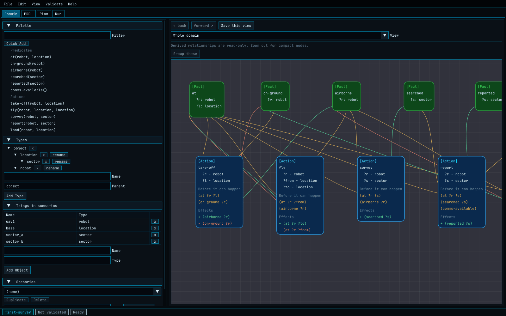

*The `Domain` tab once the model is complete. Green boxes are facts, blue boxes
are actions, and the lines between them are worked out from the actions rather
than drawn by hand. Amber means the action needs the fact to be true, green
means the action makes it true, and red-orange means it makes it false.*

## 3.6 Add the actions

Add an action the same way you added a fact: `Quick Add`, the `A` key, or
right-click and `Add Action`. Select it, and fill in the three sentence groups.

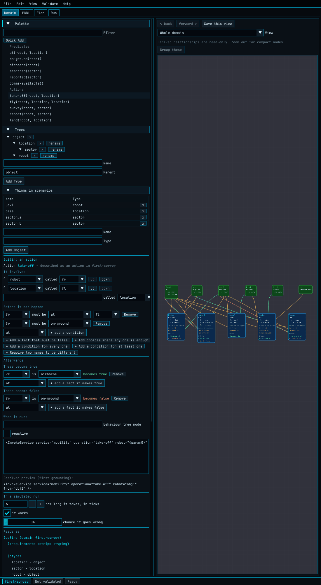

*Editing `take-off`. `It involves` names the blanks, `Before it can happen`
lists what must already be true, and `Afterwards` has separate lists for facts
that become true and facts that become false. Below them, `When it runs` is the
behaviour-tree binding, `In a simulated run` is how the action behaves in the
tool's own run screen, and `Reads as` is the PDDL all of it generates.*

Add all five. Each row is a dropdown: pick the fact, press the button, then say
which of the action's own blanks each slot refers to.

### take-off

| Group | Contents |
|-------|----------|
| It involves | `?r` — robot; `?l` — location |
| Before it can happen | `at ?r ?l`; `on-ground ?r` |
| These become true | `airborne ?r` |
| These become false | `on-ground ?r` |

### fly

| Group | Contents |
|-------|----------|
| It involves | `?r` — robot; `?from` — location; `?to` — location |
| Before it can happen | `at ?r ?from`; `airborne ?r` |
| These become true | `at ?r ?to` |
| These become false | `at ?r ?from` |

Two blanks of the same kind is normal and is how movement is described: the
vehicle stops being where it was and starts being where it went.

### survey

| Group | Contents |
|-------|----------|
| It involves | `?r` — robot; `?s` — sector |
| Before it can happen | `at ?r ?s`; `airborne ?r` |
| These become true | `searched ?s` |
| These become false | *(nothing)* |

Note that `?s` is a sector rather than a location. That single choice is what
stops the planner trying to survey the airfield.

### report

| Group | Contents |
|-------|----------|
| It involves | `?r` — robot; `?s` — sector |
| Before it can happen | `at ?r ?s`; `searched ?s`; `comms-available` |
| These become true | `reported ?s` |
| These become false | *(nothing)* |

### land

| Group | Contents |
|-------|----------|
| It involves | `?r` — robot; `?l` — location |
| Before it can happen | `at ?r ?l`; `airborne ?r` |
| These become true | `on-ground ?r` |
| These become false | `airborne ?r` |

`Before it can happen` can express more than a list of facts that must be true.
The other buttons cover a fact that **must be false**, alternatives where **any
one is enough**, a condition that must hold **for every** thing of some kind or
**for at least one**, and a requirement that two blanks be **the same as** or
**different from** each other. This example needs none of them, and
[Part 4](#43-conditions-beyond-a-list-of-facts) describes them when you do.

## 3.7 Say that being on the ground and being airborne are alternatives

You know that `on-ground` and `airborne` are two states of the same thing and
cannot both be true. Nothing you have written says so.

Open the `Lifecycles` view from the `View` dropdown on the right of the `Domain`
tab, and add one grouping:

| Field | Value |
|-------|-------|
| Grouping name | `flight state` |
| Object type | `robot` |
| Alternative fact names | `on-ground airborne` |

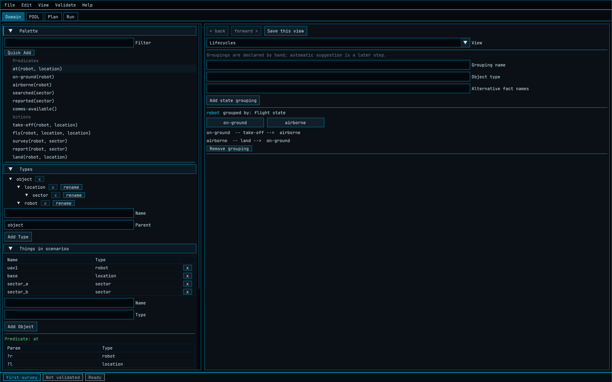

*The grouping, and the transitions the tool worked out from your actions:
`on-ground -- take-off --> airborne` and `airborne -- land --> on-ground`.*

The transitions are not something you draw. The tool finds them by looking for
an action that makes one member of the group false and another true. If a
grouping shows no transitions, that is real information about the model rather
than a drawing that failed: it means nothing you have written moves the thing
between those states.

Groupings do not change the generated PDDL. They earn their place in two ways:
they make a missing transition obvious, and they keep the run screen honest when
you inject a fault, by making the other alternatives false when you force one
of them true.

## 3.8 Add the first scenario

Expand `Scenarios` in the sidebar, type `survey-sector-a` and press
`Add Scenario`.

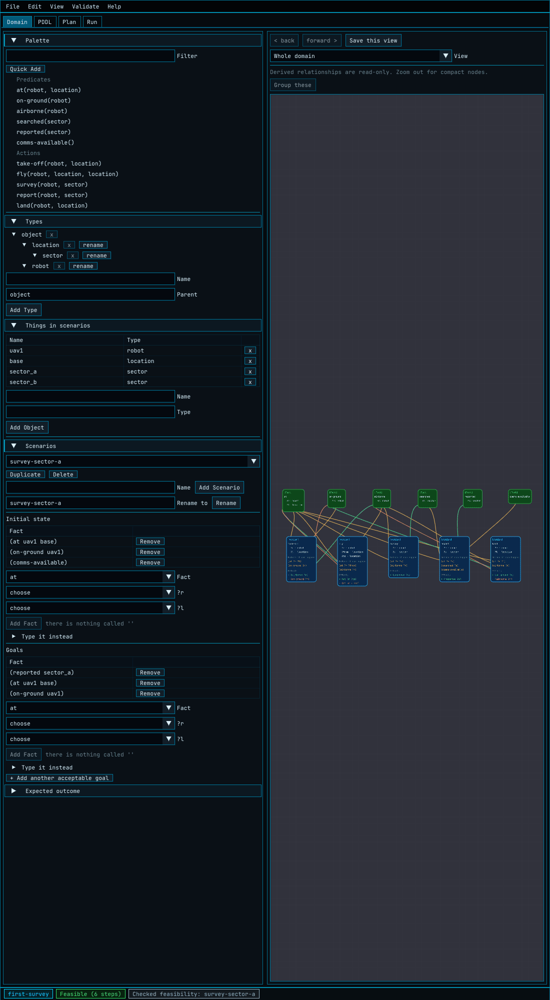

*The scenario editor: initial state at the top, goals below it, and the expected
outcome behind its own heading.*

Under `Initial state` add three facts. Choose the fact from the dropdown, then
choose what goes in each blank from the lists — which contain only things of the
right kind, with the wrong ones greyed out and a reason on hover.

| Initial fact | In plain words |
|--------------|----------------|
| `(at uav1 base)` | the vehicle starts at the airfield |
| `(on-ground uav1)` | it starts on the ground |
| `(comms-available)` | the link is working |

Anything you do not list is false. The vehicle is not airborne, no sector has
been searched, and nothing has been reported, because you did not say they had.

Under `Goals` add three more:

| Goal | In plain words |
|------|----------------|
| `(reported sector_a)` | sector A has been surveyed and the report sent |
| `(at uav1 base)` | the vehicle is back at the airfield |
| `(on-ground uav1)` | and on the ground |

If you would rather type than click, open `Type it instead`. `(at uav1 base)`,
`at uav1 base` and `at(uav1, base)` are all accepted and all checked against the
same rules.

Save the project.

## 3.9 Check that the model makes sense

Choose `Validate > Validate Now`, or press `F6`. The tool runs its structural
checks, generates PDDL from your project, parses that PDDL with AME's own
parser, and grounds it — that is, works out every combination of your actions
and your things.

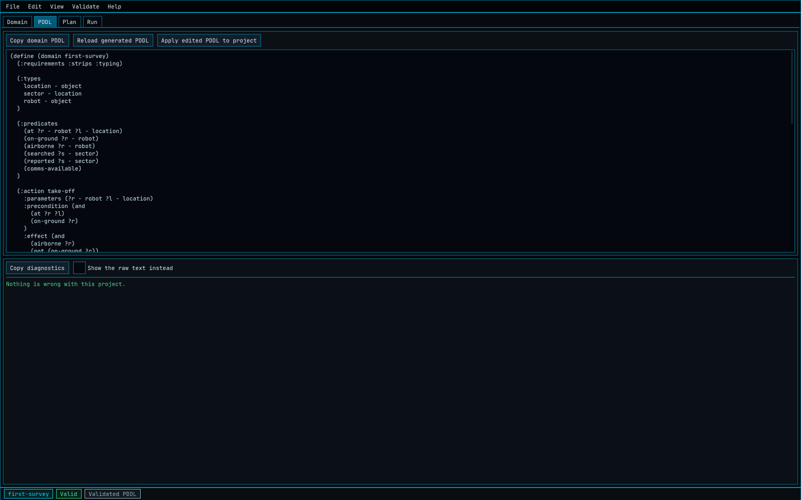

*The `PDDL` tab. The top half is the generated domain, which you can edit and
apply back to the project. The bottom half lists everything the checkers found,
worst first, one sentence each. Clicking a row selects the fact or action it
names and opens it on the `Domain` tab.*

If something is wrong, the bottom half says what, in a sentence, and takes you
to it. When a problem comes from the PDDL reader rather than from the project's
structure, the row says which element could not be read and keeps the reader's
own words behind `What the reader said`.

The status bar should now read `Valid`. The tool also reports what the grounding
produced: for this model, 10 facts about actual things and 19 possible actions.
Those numbers matter more than they look. A fact or action with **no** ground
instances is warned about, and almost always means a thing is missing or a blank
has the wrong kind.

Here is the domain the tool generated. You never have to write this, but it is
worth reading once against the tables above:

```pddl
(define (domain first-survey)
  (:requirements :strips :typing)

  (:types
    location - object
    sector - location
    robot - object
  )

  (:predicates
    (at ?r - robot ?l - location)
    (on-ground ?r - robot)
    (airborne ?r - robot)
    (searched ?s - sector)
    (reported ?s - sector)
    (comms-available)
  )

  (:action take-off
    :parameters (?r - robot ?l - location)
    :precondition (and
      (at ?r ?l)
      (on-ground ?r)
    )
    :effect (and
      (airborne ?r)
      (not (on-ground ?r))
    )
  )

  (:action fly
    :parameters (?r - robot ?from - location ?to - location)
    :precondition (and
      (at ?r ?from)
      (airborne ?r)
    )
    :effect (and
      (at ?r ?to)
      (not (at ?r ?from))
    )
  )

  (:action survey
    :parameters (?r - robot ?s - sector)
    :precondition (and
      (at ?r ?s)
      (airborne ?r)
    )
    :effect (searched ?s)
  )

  (:action report
    :parameters (?r - robot ?s - sector)
    :precondition (and
      (at ?r ?s)
      (searched ?s)
      (comms-available)
    )
    :effect (reported ?s)
  )

  (:action land
    :parameters (?r - robot ?l - location)
    :precondition (and
      (at ?r ?l)
      (airborne ?r)
    )
    :effect (and
      (on-ground ?r)
      (not (airborne ?r))
    )
  )
)
```

And the scenario, which PDDL calls a problem:

```pddl
(define (problem first-survey-1)
  (:domain first-survey)

  (:objects
    uav1 - robot
    base - location
    sector_a - sector
    sector_b - sector
  )

  (:init
    (at uav1 base)
    (on-ground uav1)
    (comms-available)
  )

  (:goal (and
    (reported sector_a)
    (at uav1 base)
    (on-ground uav1)
  ))
)
```

## 3.10 Find a plan

Choose `Validate > Check Feasibility`. The tool validates, then calls the
planner for the selected scenario.

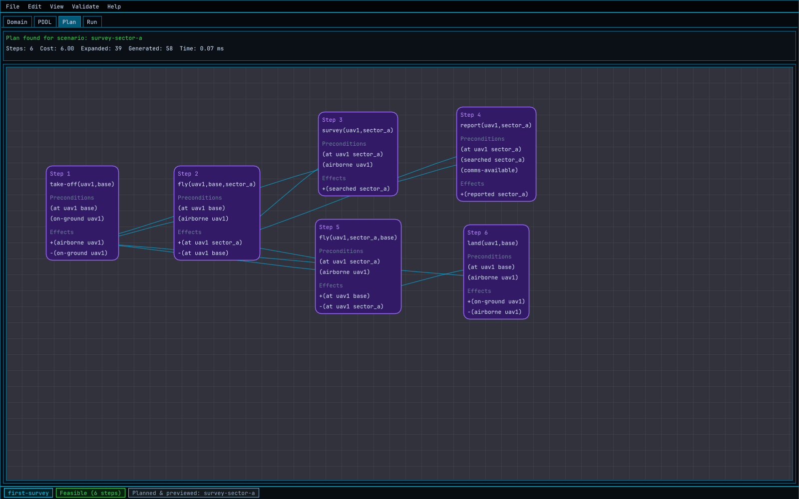

*Six steps: take off, fly out, survey, report, fly home, land. Each box shows
the facts that step needed and the facts it changed, so the chain from the
starting facts to the goals can be read straight off the screen. The header
gives the step count, the cost, how much of the search space was explored, and
how long it took.*

Nobody wrote that order. It follows from the five action descriptions and the
three goals. Change the model and the order changes with it: delete the
`airborne ?r` requirement from `survey` and the plan stops bothering to take
off.

If the planner finds nothing, the same tab explains why instead — see
[3.14](#314-a-scenario-that-should-fail).

## 3.11 Compile it into a behaviour tree

Choose `Validate > Plan & Preview`, or press `F5`. This validates, plans and
compiles in one step, and fills in both the `Plan` tab and the `Run` tab. The
`Run` tab now holds the behaviour tree that the plan compiled into, waiting to
be run.

## 3.12 Run it

Open the `Run` tab and press `Run`.

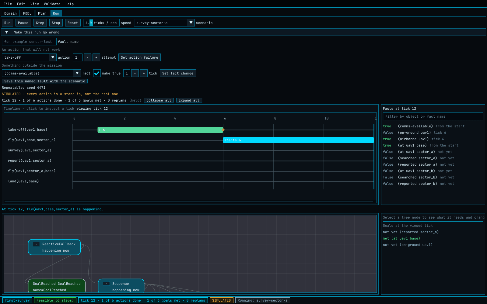

*Part way through. The timeline has one row per action and a tick axis, so you
can see what started when and what overlapped. The facts panel on the right
lists every fact about actual things, whether each is true at the tick you are
looking at, and when it last changed. Below, the behaviour tree colours each
node by what it is doing, with a bright border on the node being ticked.*

Press `Run` again and let it finish.

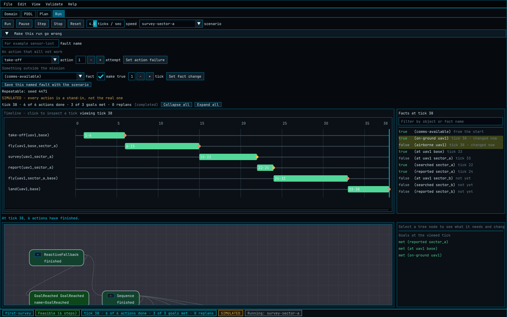

*The complete mission: six actions, finishing at tick 38, with all three goals
met. `(searched sector_a)` became true at tick 22 and `(reported sector_a)` at
tick 24, which the facts panel records beside each row.*

Some things worth knowing about this screen:

- **It is a simulation, and the tool never lets you forget it.** Every action is
  replaced by a stand-in that waits a number of ticks and then succeeds or fails
  as the project says. The word `SIMULATED` sits on the screen and in the status
  bar the whole time. A run is evidence about your mission model. It is never
  evidence about how the system will behave in the field.
- **Nothing has to be set up first.** An action nobody has configured takes four
  ticks, which is one second at the default speed, and works.
- **Durations are per action**, set under `In a simulated run` on the `Domain`
  tab. In this example `fly` takes 10 ticks, `survey` 8, `take-off` and `land`
  6, and `report` 3, which is why the bars have the lengths they do.
- **Clicking the timeline inspects a moment** without pausing or rewinding the
  run. The playhead, the facts, the tree colours and the sentence describing
  what is happening all move to the tick you picked. `Run` or `Step` returns you
  to the live tick.

## 3.13 Make it go wrong

A mission model earns its keep when something fails. Open
`Make this run go wrong` at the top of the `Run` tab. It offers exactly two
levers:

- **An action that will not work.** Choose an action and an attempt number. That
  attempt fails; later attempts behave normally.
- **Something outside the mission.** Choose a fact, a value and a tick. The
  world model applies that change as an observed event that the mission did not
  cause.

Before the first tick, the panel describes what the fault is expected to do: the
action that should be under way, the requirement that can be lost, and the
actions in your domain that could respond.

Try the first lever with `survey`, attempt 1. Press `Reset`, then `Run`. The
survey step fails; the engine replans from the facts as they now stand; the new
plan surveys again; the mission still finishes. The `Run` tab states why the
replan happened and shows the abandoned plan beside the one that replaced it,
and the run counts its replans.

This is exactly the behaviour the deployed system has, which is why it is worth
rehearsing here.

Second scenario for the project: add one called `survey-both-sectors` with the
same three starting facts and four goals — `(reported sector_a)`,
`(reported sector_b)`, `(at uav1 base)` and `(on-ground uav1)`. Set the same
fault, and use `Save this named fault with the scenario` so that the scenario
carries it. Runs with a random element repeat exactly, because every draw comes
from the seed saved in the project.

## 3.14 A scenario that should fail

Add a third scenario, `comms-lost-before-take-off`. Give it the same goals as
the first, but leave `(comms-available)` out of the initial state.

Choose `Validate > Check Feasibility`.

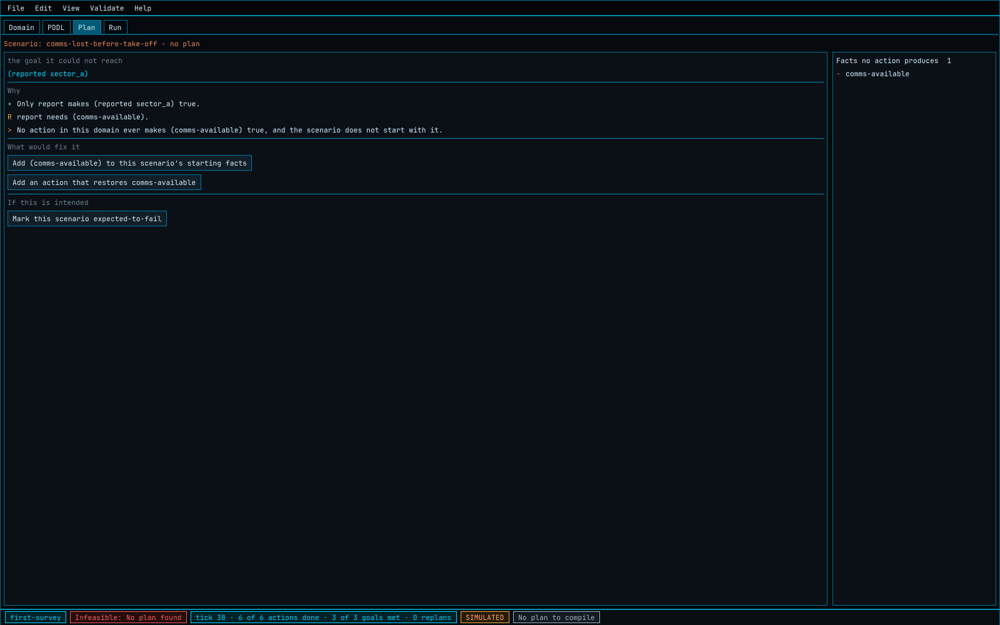

*There is no plan, and the tool says why: the goal it could not reach, the only
action that could have reached it, the requirement that action has, and the fact
that nothing in the domain ever makes that requirement true. The panel then
offers the three things you might actually want to do about it.*

Read the `Why` section as a chain, because that is how it is built. It walks
backwards from the failed goal until it reaches the first fact that no action
can bring about. On the right, `Facts no action produces` lists every such fact
in the whole model — a list worth glancing at even when everything works,
because a fact nothing produces is either a genuine assumption about the world
or an action you forgot to write.

Here, infeasibility is the correct answer: a vehicle with no communications
link genuinely cannot report. Press `Mark this scenario expected-to-fail` so
that the tool knows.

## 3.15 Say what each scenario should do, and check them all at once

Open `Expected outcome` on each scenario. It records what the project expects,
and turns a scenario into a regression test:

| Field | Meaning |
|-------|---------|
| `Should succeed` | Whether the planner is expected to find a plan |
| `Min plan steps` / `Max plan steps` | Bounds on the plan length, or `0` for no bound |
| `Expected actions` | Action names that must appear in the plan |
| `Forbidden actions` | Action names that must not appear |

There are matching expectations for the simulated run: whether it should reach
the goal, how many actions it should take, which must and must not appear, and
how many replans are acceptable.

For this example: the first scenario should succeed in 5 to 8 steps and must use
`survey`, `report` and `land`, with no replans. The second should succeed and
reach its goal, with at least one replan because of its saved fault. The third
should not succeed at all.

Now choose `Validate > Run All Scenarios`. Every scenario is planned and
simulated, and each result is compared with its expectation.

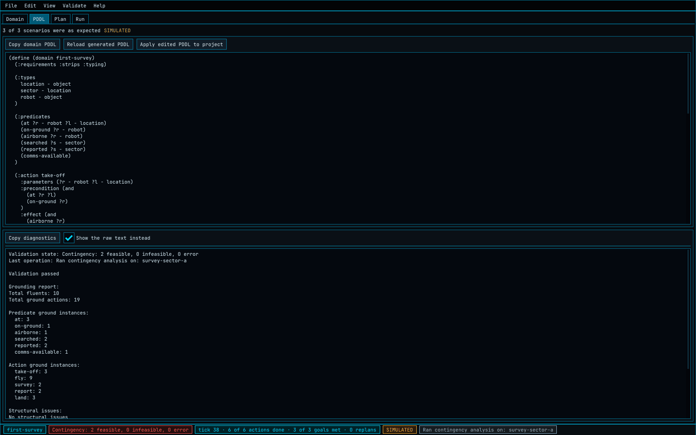

*Three of three as expected. The banner along the top gives the verdict; the
`Stop batch` button leaves the remaining scenarios waiting if you need it.*

Use `File > Export Regression Report...` to write the batch result as JSON.

## 3.16 Ask what survives a contingency

`Validate > Run Contingency Analysis` asks a different question from planning:
not "can this mission be done", but "for every combination of the things that
can go wrong, is the vehicle still able to reach a safe state".

Left alone, the tool works out for itself which facts count as context — those
that actions require but no action changes — and treats the scenario's goal as
the safe state. It is better to say what you mean. On the first scenario, set:

| Field | Value | Why |
|-------|-------|-----|
| Contingency facts | `comms-available` | the thing that can be lost |
| Safe state | `(at uav1 base)`, `(on-ground uav1)` | home and on the ground, whatever else happened |

The result for this model is that both combinations — link working, link lost —
still reach the safe state. That is the useful finding: losing communications
costs the mission its report but never its recovery. Declaring the contingency
also narrows what has to be varied, which is what makes the analysis tractable
on a large domain.

The report says how much of the space it covered: how many combinations were
planned for, how many followed from those without planning, and whether anything
could be carried between them at all.

## 3.17 Say how each action reaches real software

Everything so far is about deciding *what* to do. `When it runs`, in the action
editor, is where you say *how* each action reaches the software that does it.
There are three ways:

- **BT node type** — emit a simple behaviour-tree node of the type you name.
- **Subtree XML** — use a template of your own.
- **Reactive** — compile through reactive behaviour, so that the requirements
  are rechecked while the action is running rather than only before it starts.

A template can use placeholders, which are resolved by position from the
action's blanks:

```xml
<InvokeService service="sensor" operation="survey" robot="{param0}" sector="{param1}" />
```

When the planner produces `survey(uav1, sector_a)`, `{param0}` becomes `uav1`
and `{param1}` becomes `sector_a`. The editor shows the resolved result under
`Resolved preview` as you type.

In the shipped example every action carries a template, and `report` is also
marked **reactive** — the link can drop while a report is being sent, and a
reactive node notices, whereas a plain one would not find out until it finished.

An action with no binding still previews using the compiler defaults, but a
model heading for a real vehicle should bind everything that will execute.

## 3.18 Save it, and hand it over

| What you want | How |
|---------------|-----|
| The project itself | `File > Save` — the `*.ameproj.json` is the source of everything else |
| The PDDL | `File > Export Domain PDDL...` and `File > Export every scenario's problem file...` |
| A regression report | `File > Export Regression Report...` |
| The fact-by-action table | `Matrix` view, then `Export CSV` or `Export Markdown` |
| Evidence a reviewer can read without the tool | `File > Export Assurance Evidence...` |
| All of it, in one dated folder | `File > Export Review Pack...` |

The review pack is the one to reach for when handing work on. It contains the
generated domain, one problem file per scenario, the fact-by-action matrix in
two formats, a table of all scenario results, a replayable recorded run, a
domain summary, and an `00-index.md` explaining each item.

The assurance evidence report deserves a note of its own: it always ends with
what it does **not** cover — that its runs are simulations rather than evidence
about the field, how many scenarios declare no contingency, and how many actions
have nothing bound to them.

## 3.19 Do the same thing without the window

Everything in [3.15](#315-say-what-each-scenario-should-do-and-check-them-all-at-once)
also runs from a command line, which is how a mission model goes into a test
suite or continuous integration. It lives in its own program,
`ame_mission_cli`, which links no display libraries:

```bash
ame_mission_cli run    first-survey.ameproj.json --scenario survey-sector-a --json run.json
ame_mission_cli record first-survey.ameproj.json --scenario survey-sector-a --out runs/nominal
ame_mission_cli batch  first-survey.ameproj.json --json regression.json
```

Running the batch on the finished example prints:

```text
survey-sector-a: as expected, goal=reached, actions=6, replans=0, seed=4471
survey-both-sectors: as expected, goal=reached, actions=10, replans=1, seed=4471
comms-lost-before-take-off: as expected, goal=not reached, actions=0, replans=0, seed=4471
3 as expected, 0 not as expected, 0 could not be run
```

The exit code is `0` when the mission behaved as the project expects and `1`
when it did not, so this is a build step as it stands.

## 3.20 What you have built

A description of what a vehicle may do, checked four ways — structurally, by the
PDDL reader, by grounding, and by planning — and exercised three ways: a nominal
run, a run that fails and recovers, and a case that correctly cannot be done at
all. It is under a hundred lines of generated PDDL and it already has a
regression suite.

Read the rest of this guide when you need it. The parts most people want next
are [the domain views](#42-the-five-domain-views) for making sense of a model
that has outgrown one screen, and
[importing existing PDDL](#48-import-and-export-pddl) if you have files already.

---

# Part 4 — Reference

## 4.1 The four tabs

| Tab | Purpose |
|-----|---------|
| `Domain` | Main authoring surface for palette, types, objects, scenarios, properties, and the node graph |
| `PDDL` | Editable domain PDDL, the list of problems, grounding report, regression results, and contingency results |
| `Plan` | Read-only plan graph after a successful feasibility check |
| `Run` | The compiled behaviour tree, and the controls that run a scenario against it |

The status bar shows the current project name, validation state, and last
operation. The layout is saved to `ame_authoring_tool.ini` during normal
interactive use.

The PDDL tab starts from the generated domain text. Edit it directly and select
`Apply edited PDDL to project` to round-trip it through the same importer used
for PDDL files. Objects, scenarios, and lifecycle groupings are retained when
the edited domain is applied. Select `Reload generated PDDL` to discard
un-applied text edits.

## 4.2 The five domain views

The right side of the `Domain` tab has five views over the same project model.

| View | Purpose |
|------|---------|
| `Neighbourhood` | Shows the selected fact or action and only its nearby relationships |
| `Relations` | Lists everything that needs, makes true, or makes false the selection |
| `Matrix` | Shows all facts against all actions as `R`, `+`, and `-` marks |
| `Lifecycles` | Shows transitions within user-declared state groups for each object type |
| `Whole domain` | Retains the complete canvas for small domains and presentation use, and is where named groups are drawn |

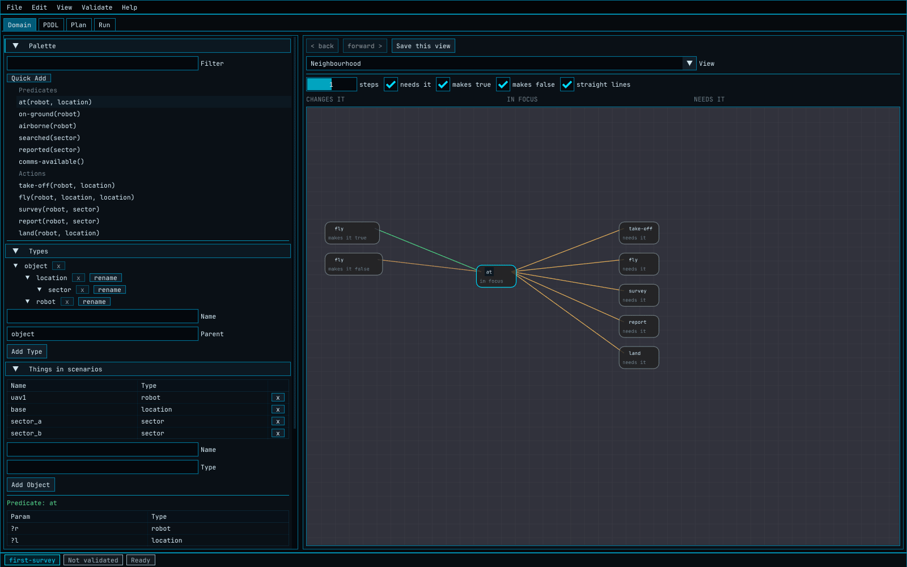

*The neighbourhood of `at`: what changes it on the left, what needs it on the
right. This is the view to use when the whole-domain canvas has become a
thicket.*

Use the back and forward buttons to retrace selections made in the palette,
relation lists, or graph. The neighbourhood view has one-step and two-step depth
settings and filters for the three relationship kinds. It shows at most twenty
neighbours; select the `+ n more` node to open the complete list.

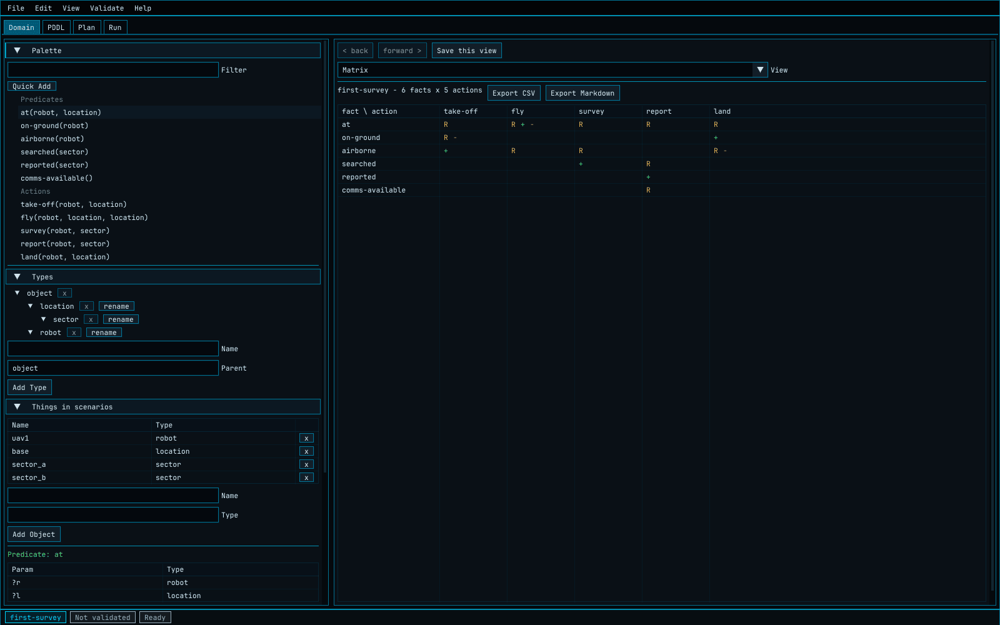

*The matrix. `R` means the action requires the fact, `+` means it makes it true,
`-` means it makes it false, `F` means it requires the fact to be false, and `A`
marks one fact in a set of alternatives. A cell can hold more than one mark:
`fly` both needs `at` and changes it, in both directions.*

Open the `Matrix` view and use `Export CSV` or `Export Markdown`. Both formats
include the complete table and preserve cells with more than one mark. Use these
exports as review or assurance evidence alongside the generated PDDL.

### Colours and words, everywhere

Amber means an action needs a fact to be true, green means an action makes a
fact true, and red-orange means either that an action needs a fact to be false
or makes it false. The label beside the line distinguishes the two. The same
colours and words are used in the relations panel, both graph views, the matrix,
and the failure report.

The tool also derives that action A may enable action B when A makes a fact true
that B needs and their blanks can describe at least one common thing. These
relationships are read-only, because the action definitions are authoritative.

### Named groups on the whole-domain canvas

A large domain drawn all at once is hard to talk about in a meeting. A group is
a named set of facts and actions that the canvas draws as one labelled box, and
which you can close so that the box stands in for everything inside it.

To make one, open the `Whole domain` view, select the facts and actions you want
on the canvas, and choose `Group these`. The button is unavailable until the
selection can be grouped, and hovering over it says why: nothing is selected, or
something in the selection is already in another group. Anything can be in at
most one group, because two boxes each claiming to stand for the same fact would
make closing them ambiguous.

The `Groups` list beside the button opens, closes, renames and removes each
group. Closing a group replaces its contents with a single box carrying the
group's name and what it holds, such as `3 facts and 2 actions`. Lines that
reached one of its members now reach the box instead; lines that would then be
drawn twice on top of each other are drawn once; and a line with both ends
inside the closed group is not drawn at all, because it would start and finish
on the same box. Selecting the closed box and choosing `Open` puts the contents
back. Every one of these is a single step on the undo stack.

You never place or size a group's box. It is drawn around wherever its contents
are, and a group closed for the first time appears in the middle of what it
held.

Two things to know. Groups change only how the domain is drawn: nothing about
them reaches the generated PDDL, and adding, closing or removing one cannot
change what the planner does. And membership is stored by name, so deleting a
fact or an action takes it out of any group it was in, and a group left holding
nothing is removed with it — undoing the deletion brings both back.

### Saved views

`Save this view` on the `Domain` tab stores what is in focus, how far out the
view reaches, which relationships are shown and which view is open, under a
name. Saved views live in the project file, so they survive reopening and travel
with the project. Pick one from `Saved views` to put the picture back.

## 4.3 Conditions beyond a list of facts

`Before it can happen` supports more than a list of facts that must be true. The
buttons and dropdowns use these phrases:

| Screen wording | Meaning |
|----------------|---------|
| `must be false` | The selected fact must not hold |
| `Any one of these is enough` | At least one fact or nested group must hold |
| `For every` | The inner condition must hold for every thing of the selected type |
| `For at least one` | The inner condition must hold for one or more things of the selected type |
| `must be the same as` / `must be different from` | Restrict the two selected names to equal or unequal values |

Completed groups are summarised in one plain sentence. Select a group or fact to
change it; the dropdowns include only names and types that are legal in that
position. Actions imported from PDDL using these forms open in the same editor
rather than falling back to raw text.

## 4.4 Project files

The native project format is JSON with the extension:

```text
*.ameproj.json
```

Use `File > New` to start a clean model, `File > Open...` to load one,
`File > Recent projects` to reopen one of the last eight without typing a path
(a project that has since been deleted is not offered), and `File > Save` or
`File > Save As...` to write the current model.

The project stores the type hierarchy, predicates, action schemas,
user-declared lifecycle state groups, objects, scenarios, scenario expected
outcomes, per-action behaviour-tree bindings, per-action simulation settings,
named groups, saved views, the simulation seed, and the graph node positions
used by the whole-domain view.

Action-to-action relationships are derived from action outcomes and
requirements. They are not stored or drawn by hand. Older version-1 files that
contain `causalLinks` still load, but that legacy field is ignored and is not
written when the project is saved again.

Closing the tool with unsaved changes asks whether to save first. While there
are unsaved changes the tool also writes a recovery copy beside the project,
named `<project>.recovery`, and removes it once the project is saved. If the
tool stops unexpectedly, open that file to get the work back.

Typing is undoable: a run of keystrokes in one field is a single step, so undo
puts back what the field held before you started rather than removing one
letter. The `Edit` menu names what would be undone.

PDDL remains an import and export format. The structured project is the better
format for ongoing graphical editing.

## 4.5 The Validate menu

### Validate Now

Runs structural checks, generates PDDL, parses it through AME's `PddlParser`,
and grounds it through the AME world-model path. Results appear in the `PDDL`
tab: parser errors, structural errors and warnings, grounding statistics, and
warnings for predicates or action schemas with no ground instances.

The lower half lists every problem the checkers found, worst first, one sentence
each. Click a row to select the fact or action it names and open it on the
`Domain` tab. Tick `Show the raw text instead` for the whole diagnostic block,
which is also where scenario batch results and contingency results are written
out in full.

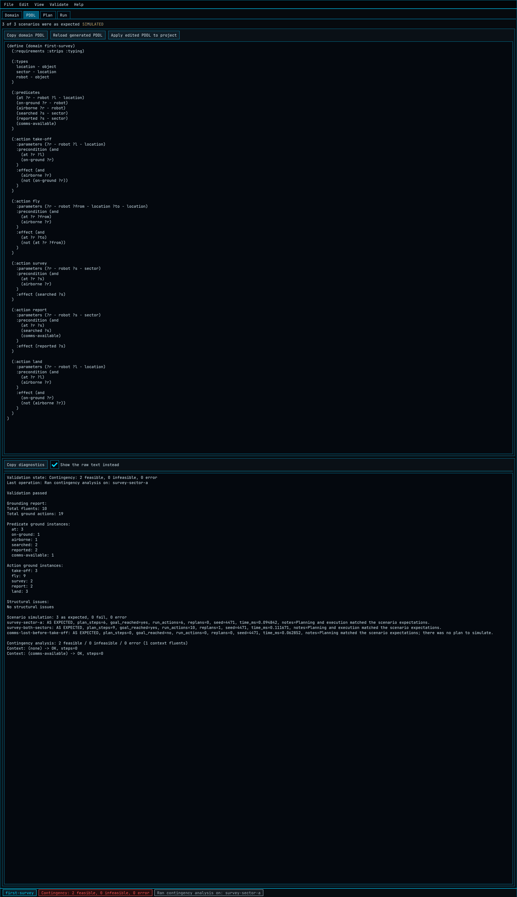

*`Show the raw text instead`, on a project where everything has been run:
grounding counts for every fact and action, then one line per scenario, then the
contingency findings.*

### Check Feasibility

Runs validation and then calls the AME planner for the selected scenario. On
success the `Plan` tab shows plan status, step count, cost, expanded and
generated search counts, solve time, and the read-only plan graph.

When no plan exists, the `Plan` tab names a failed goal and walks backwards
through the domain until it reaches the first fact that no action can make true.
The report offers direct actions: add the missing fact to the scenario's
starting facts, add an action that restores it, jump to the relevant action, or
mark the scenario as expected to fail. The right side lists every fact that no
action produces.

### Plan & Preview

Runs validation, planning and behaviour-tree compilation in one workflow, and
populates both the `Plan` and `Run` tabs. Selecting a plan step highlights the
corresponding action schema in the domain graph.

### Run All Scenarios

Plans and simulates every scenario, then compares both results with its expected
outcome. The `PDDL` tab reports which scenario is running and how many have
finished. Use `Stop batch` to leave the remaining scenarios waiting. Each result
states why the observed planning and execution did or did not match the
expectation. `File > Export Regression Report...` writes the latest batch report
as JSON.

### Run Contingency Analysis

Runs an in-process contingency reachability analysis: the tool identifies
context predicates, enumerates context combinations, and checks whether the
selected scenario remains solvable in each.

By default it works out for itself which facts are context — those that appear
in action preconditions and are changed by no action effect — and treats the
scenario's goal as the safe state. A scenario can instead name the facts that
represent a contingency worth checking and the facts that count as having
recovered. Declaring the contingency narrows what is varied, which is what makes
a large domain checkable.

The result says how much of the space was covered: how many combinations were
planned for, how many followed from those without planning, and whether anything
could be carried between them at all. In a domain with conditions about facts
being false, nothing can, and every combination is planned for.

Results appear in the `PDDL` tab as feasible, infeasible or error rows. Context
predicate nodes are highlighted in the domain graph after a report is generated.

The same search is available as a standalone command; see
[`contingency_verifier.md`](contingency_verifier.md).

## 4.6 The Run tab in detail

The run uses the project's generated PDDL, the same world model, the same
planner and the same plan compiler that the runtime uses. The only substitution
is the action nodes: every action is built as a stand-in that waits for the
number of ticks the project gives it, then succeeds or fails as the project
says, and records the action's declared effects. **A run is evidence about the
mission model. It is never evidence about how the system will behave in the
field**, which is why the screen and the status bar both say `SIMULATED` while a
run is loaded.

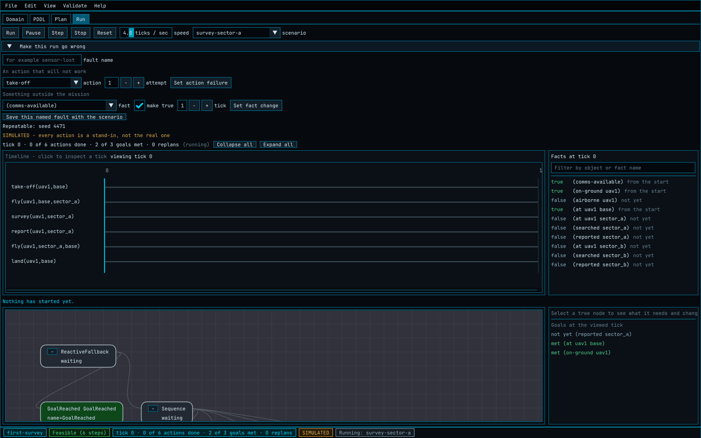

*A mission loaded and waiting. The controls sit in one row and never move.*

| Control | What it does |
|---------|--------------|
| `Run` | Starts the selected scenario, or resumes a paused one |
| `Pause` | Stops the run advancing without ending it |
| `Step` | Advances exactly one tick, pausing the run first |
| `Stop` | Ends the run where it stands, leaving what it did on screen |
| `Reset` | Plans, compiles and loads the same scenario from the beginning |
| `speed` | How many ticks a second a running scenario advances |
| `scenario` | Which scenario to run |

### Per-action run settings

Select an action on the `Domain` tab. Under `In a simulated run`:

- `how long it takes, in ticks`: how many ticks the stand-in waits before
  finishing.
- `it works`: clear this to make the action fail every time it is reached.
- `chance it goes wrong`: the probability that an otherwise working action
  fails.

Random draws use the project's saved seed, so a run with a random element
repeats exactly until somebody changes the seed. Settings are stored in the
project file beside the action's behaviour-tree binding, and a project saved
before runs existed takes the defaults.

The default duration is four ticks, which is one second at the default speed.
It is not one tick on purpose: a behaviour tree walks a sequence of actions that
each finish immediately within a single tick, so one-tick actions would make a
whole mission start and end on tick one, with nothing to watch and no order
visible.

### Making a run go wrong

`Make this run go wrong` contains exactly two fault controls: an action and an
attempt number that fails once, and a grounded fact, a value and a tick that the
world model applies as an observed event outside the mission's control.

These settings belong to the loaded run, not to the PDDL domain, and `Reset`
keeps them. When a fact is made true and belongs to a declared lifecycle group,
the other alternative facts for the same things are made false, which prevents
an injected event from leaving two alternative states true together.

When a tree step fails, the engine replans from the world model as it stands and
continues with the replacement tree. The `Run` tab states why the replan happened
and shows the plan that was abandoned beside the plan that replaced it. The
timeline retains actions from both plans and the run counts its replans. If no
replacement plan exists, the same panel uses the failure explanation from the
`Plan` tab to name a fact that the domain could not bring about.

Use `Save this named fault with the scenario` when the scenario batch should
repeat these run settings and check its execution expectations.

### Save, replay and compare runs

Use `File > Save Current Run...` after starting a simulation, and choose a new or
empty folder. It will contain:

```text
ame_bt_events.jsonl
ame_wm_audit.jsonl
ame_plan_audit.jsonl
run.json
```

The first three files use the runtime observability schemas. `run.json` names the
project, scenario, random seed and injected faults, and says that the run was
simulated. It also records `timeBasis` as `simulated_tick_time` and gives
`tickPeriodSeconds`, the reciprocal of the engine's ticks per second. Event
timestamps therefore describe how long the mission appeared to take on the `Run`
tab, not how quickly the processor computed the simulation.

Use `File > Open Recorded Run...` to replay any folder with the three JSONL
files. The project that produced them does not have to be open. A recording from
a deployed system normally has no authoring `run.json`; the tool treats it as a
real-system run and states `REAL SYSTEM` above the replay and in the status bar.

To open an authoring-tool recording in DevEnv without conversion:

1. Start DevEnv offline from the repository root:

   ```bash
   python -m subprojects.AME.tools.devenv --backend none
   ```

2. Open `Observability` and select the `JSONL Replay` tab.
3. Select `Load Directory...`.
4. Choose the folder containing the three JSONL files.
5. Use the `Time Scrubber` to move through the recorded events.

DevEnv ignores the authoring manifest and the optional simulation tick fields,
and reads the same core fields it reads from a runtime recording. Its time
scrubber uses the simulated `ts_us` timeline, so each mission tick remains a
visible step. Recordings made by a real system keep their measured timestamps
unchanged.

`File > Compare Current Run with Recorded Run...` compares the run in memory with
an earlier saved folder, without saving the current one first — the shortest path
for checking a run before and after a domain change, or a nominal run against a
faulted one. `File > Compare Two Recorded Runs...` compares two saved folders. The
comparison appears on the `Run` tab, and its first line states where the trees
first differ, so a reviewer can take the answer without reading the detail.

## 4.7 The command-line tool

| Command | What it does |
|---------|--------------|
| `run` | Simulates one named scenario and reports what happened |
| `record` | Simulates one named scenario and writes a folder of replay files |
| `batch` | Simulates every scenario and checks each against the planning and execution expectations the project records for it |
| `evidence` | Writes the assurance evidence report |

| Option | Meaning |
|--------|---------|
| `--scenario <name>` | Which scenario to run. Required by `run` and `record` |
| `--json <file>` | Where to write the machine-readable report. Without it, no report is written |
| `--out <folder>` | Where `record` writes the run. Required by `record` |
| `-h`, `--help` | Show the usage summary |

The exit code is `0` when the mission behaved as the project expects, and `1`
when it did not or the command could not be carried out. Standard output carries
the summary a person reads, which is why the report goes to the file named by
`--json`: the planner writes progress lines of its own to standard output, so it
is no place for a document another program has to parse.

`record` requires `--scenario` because one folder holds one run. The scenario's
saved fault settings and the project's random seed are applied, so the recorded
run is the one the project describes and repeats exactly.

**One convention across the tools.** The file being examined is a positional
argument, `--json` names the machine-readable report, `--help` explains itself,
and the exit code is the verdict. The three questions worth asking about a
mission model — whether it can be planned, whether it runs, and whether it stays
safe under every contingency — are therefore three commands that look alike:

```bash
ame_mission_cli      batch  my-mission.ameproj.json --json runs.json
contingency_verifier domain.pddl problem.pddl       --json contingency.json
```

The graphical tool takes no command-line options other than `--self-test` and
`--capture`, both of which need a window and so belong to it.

## 4.8 Import and export PDDL

### Import an existing domain

The importer covers the same finite PDDL subset as `ame_core`: typed STRIPS,
negative facts in action conditions, nested `and` and `or` groups, finite
`forall` and `exists` groups, equality and inequality filters, `(either ...)`
action-input types, domain constants, confirmed facts, and top-level goal
alternatives. An invalid condition message names the action that contains it.
Conditional effects, numeric expressions and temporal actions remain unsupported
by both the tool and the runtime.

Importing into a project that already has facts or actions shows what the import
would do before it does any of it: what would be added, what would be
overwritten, and what is already the same, with the cost of each replacement
named. Anything new is always added. Tick the kinds of thing you are willing to
have overwritten — types, facts, actions, objects — and the rest of your work is
left alone. Replacing an action keeps its behaviour-tree binding, its run
settings and its place on the canvas, because the imported PDDL says nothing
about any of those.

```text
File > Import PDDL Domain...
```

This imports types, domain constants, facts, actions, their full condition trees,
and an initial graph layout from a domain `.pddl` file. Domain import replaces
the current project model and clears undo history.

### Import an existing problem

```text
File > Import PDDL Problem...
```

This imports objects, initial-state facts and goals as a scenario on the current
project. If the goal offers alternatives, the scenario shows them under `any one
of these is enough`. Each choice remains editable with the ordinary fact chooser,
and `Add another acceptable goal` creates another route to mission success.

Import the matching domain first, then import one or more problem files.

### Export

```text
File > Export Domain PDDL...
File > Export every scenario's problem file...
File > Export Problem PDDL...
```

Export refuses to write if structural errors are present. `Export every
scenario's problem file...` asks where to put them and writes one file per
scenario, named after the project and the scenario.

### Export assurance evidence

`File > Export Assurance Evidence...` writes a Markdown report a reviewer can
read without the tool: what the model contains, the facts nothing in the mission
brings about, what each action is bound to, the facts that must be observed
before an action will act on them, how every scenario behaved, and what stayed
reachable under each declared contingency. The report always ends with what it
does **not** cover. The same report goes into the review pack as
`07-assurance-evidence.md`, and `ame_mission_cli evidence <project> --json
report.md` writes it from a script.

### Export a review pack

`File > Export Review Pack...` creates a dated folder whose files can be
identified from their names, with `00-index.md` explaining each item:

- the generated domain PDDL;
- one generated problem PDDL file for every scenario;
- the fact-by-action matrix as CSV and Markdown;
- a Markdown table of all scenario results;
- one replayable recorded-run folder;
- a domain summary listing types, objects, facts, actions and facts that no
  action produces.

If a run is currently loaded, the pack includes it without asking you to save it
first. Otherwise it runs the first scenario for the recorded-run part of the
pack.

## 4.9 Keyboard shortcuts

| Shortcut | Action |
|----------|--------|
| `Ctrl+Z` | Undo |
| `Ctrl+Y` | Redo |
| `Delete` | Delete selected graph nodes or links |
| `Ctrl+C` | Copy the selected fact or action |
| `Ctrl+V` | Paste it, under a name nothing else uses |
| `Ctrl+D` | Duplicate selection |
| `F` | Fit the canvas to everything on it |
| `A` | Quick-add a fact or an action |
| `Ctrl+Tab` | Cycle workflow tabs |
| `F5` | Plan & Preview |
| `F6` | Validate Now |
| `Esc` | Exit application |

## 4.10 Where this tool stops

- Conditional effects, numeric fluents, temporal PDDL and durative actions are
  out of scope for the whole of AME, not just for this tool: `PddlParser`
  rejects them too.
- The plan view is a read-only preview, and the tree on the `Run` tab cannot be
  edited.
- Named groups are drawn on the whole-domain canvas only; the neighbourhood view
  always shows individual facts and actions.
- The tool performs design-time validation only. Live ROS2 execution monitoring
  remains in DevEnv and Foxglove. The two read the same three recorded-run files,
  so a run recorded here opens there without conversion.
- A simulated run is never evidence about field behaviour. It is evidence about
  the mission model.

## Regenerating the screenshots

The pictures in this guide are the interface itself, so they have to be retaken
when the interface changes. The tool has a capture mode that opens a project,
walks the workflow and writes one PNG per step:

```bash
python subprojects/AME/scripts/capture_guide_screenshots.py \
    --tool subprojects/AME/build/src/ame_authoring_tool
```

The script runs `ame_authoring_tool --capture` three times, once per group of
screens, because each group wants a different window size, and writes the
results into `doc/guides/images/authoring/` along with a manifest naming each
picture. On Linux it uses SDL's offscreen video driver, so no display is needed.
Run `pngquant` over the directory afterwards to keep the files small.

---

# Part 5 — Troubleshooting

| Symptom | Likely cause | Fix |
|---------|--------------|-----|
| `ame_authoring_tool` target is missing | Configure was run without authoring enabled | Run `cmake --preset authoring`. If configuring by hand, pass both `-DUNMANNED_BUILD_AME=ON` and `-DAME_BUILD_AUTHORING=ON` — see [Part 2](#part-2--build-and-launch) |
| Configure reports "Manually-specified variables were not used by the project: AME_BUILD_AUTHORING" | `UNMANNED_BUILD_AME` was off, so the option was never declared and the setting was discarded | Add `-DUNMANNED_BUILD_AME=ON`, or use the `authoring` preset, which sets both |
| Configure reports that a dependency is not checked in | Something was deleted from `subprojects/AME/external`, or a dependency was added to the build without being vendored | Restore the directory from version control, or run `subprojects/AME/scripts/vendor_dependencies.py --fetch` on a machine with network access and commit the result |
| Configure tries to download something | The build is not requiring the checked-in copies | Configure with `-DAME_REQUIRE_VENDORED_DEPENDENCIES=ON`, which AME's own presets already set, so that a missing copy fails immediately instead |
| Window opens but the font differs | `JetBrainsMono-Regular.ttf` was not copied next to the executable | Rebuild the `ame_authoring_tool` target |
| Export is refused | Structural validation has errors | Open the `PDDL` tab, fix the error rows, then export again |
| Planner returns no plan | The goal is unreachable from the initial state, or an action's requirements or effects are incomplete | Read the explanation on the `Plan` tab: it names the first fact nothing can bring about |
| Grounding report shows zero ground actions | No things exist for some blank, or a blank has the wrong kind | Add things for each kind an action asks for, and revalidate |
| An action never appears in any plan | Something it needs is never made true, or a blank has a kind nothing matches | Select it and open the `Relations` view, which lists what it needs and what makes those facts true |
| A fact stays true when it should not | Some action makes it true and nothing makes it false | Open `Lifecycles`, or look for a row in the `Matrix` view with a `+` and no `-` |
| Imported problem fails | The problem does not match the imported domain | Import the matching domain first and check predicate and object names |
| A run finishes on tick one with nothing to see | Every action still has the default duration | Give the actions that matter their own duration under `In a simulated run` |
