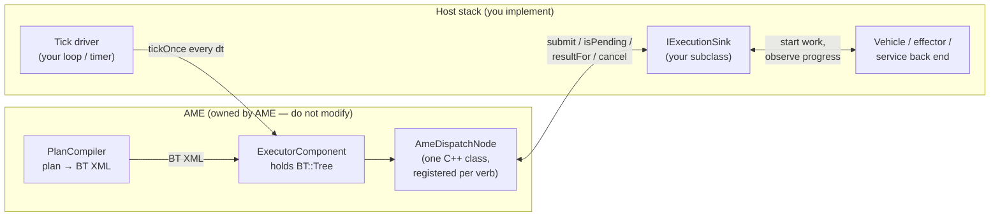
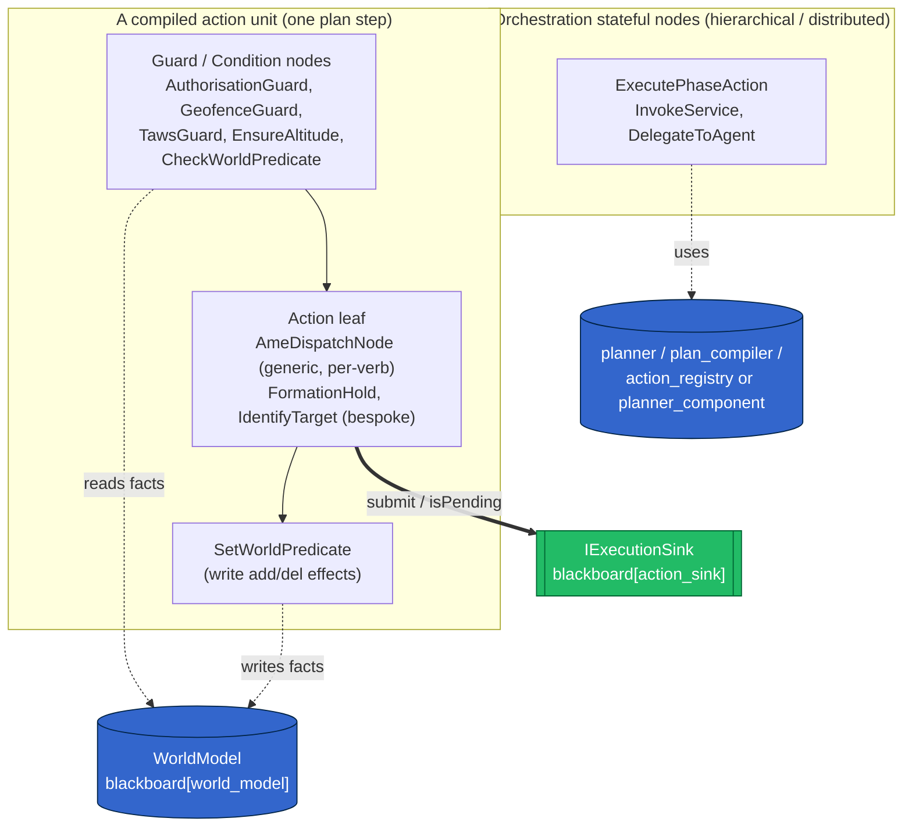
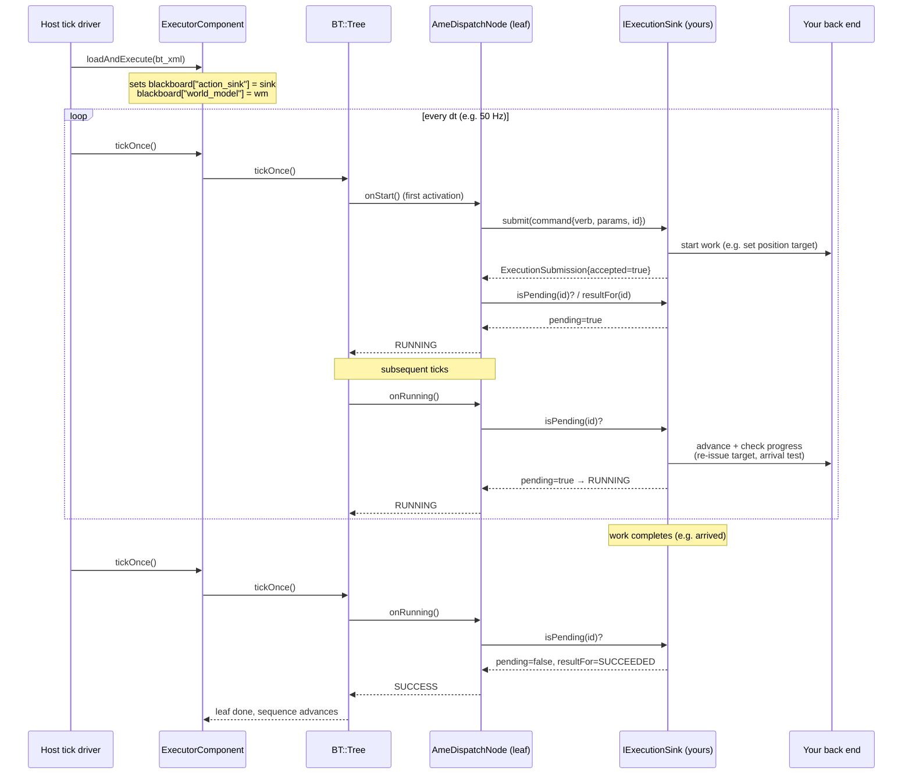
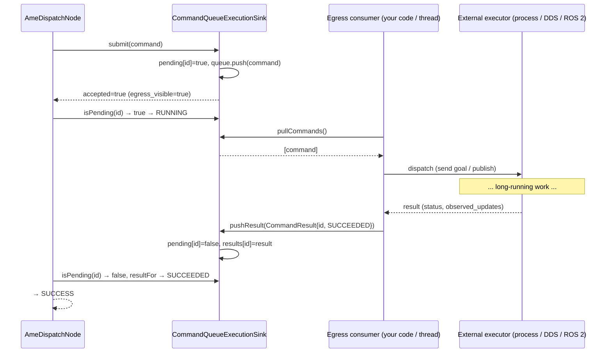
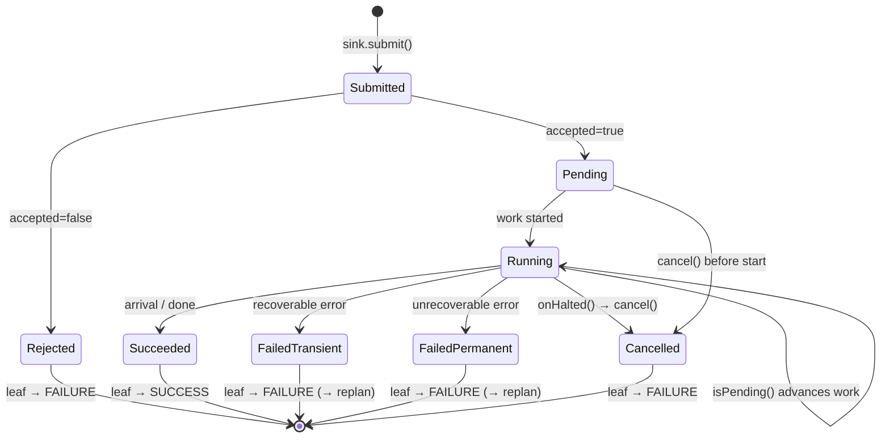
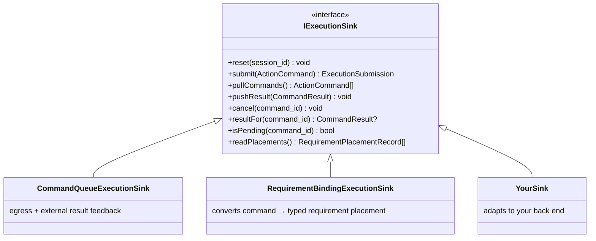
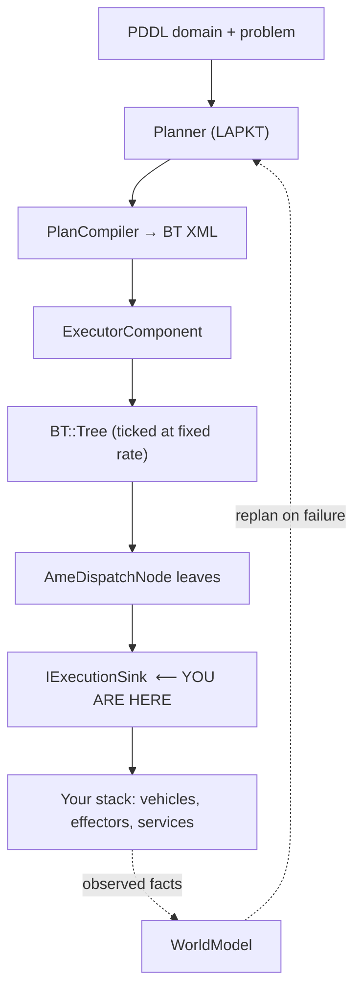

# Integrating AME Long-Running Action Execution Into Another Stack

This guide explains the **exact runtime mechanics** by which AME's BehaviorTree.CPP
(BT.CPP) execution layer drives long-running actions (movement, search, track, …)
through the `IExecutionSink` boundary, and how to wire that boundary into a host
stack that is **not** AutoMTK.

It is aimed at an integrator who wants to reuse AME's PDDL-plan → BT compilation →
ticked execution pipeline while supplying their own vehicle / effector / service
back end. You only need to implement **one interface** (`IExecutionSink`) and run
**one tick loop**; everything else is owned by AME.

> Scope: this is the *execution egress* contract. Planning, plan→BT compilation,
> the WorldModel and replanning are covered in `04-execution.md`,
> `03-planning.md`, and `02-world-model.md`. The whole-system swap surface
> (`IAutonomyBackend`) is covered in `autonomy_backend_shell.md`.

---

## 1. The two things you must provide



To integrate, you provide exactly two things:

1. **An `IExecutionSink` implementation** — the adapter that turns an abstract AME
   `ActionCommand` into real work in your stack, and reports progress/terminal
   status back.
2. **A tick driver** — a loop or timer that calls `tickOnce()` on the executor at a
   fixed rate. AME does not own a thread; the host drives time.

Everything between the compiled BT XML and the sink is AME's `AmeDispatchNode`,
which is **generic and verb-agnostic** — you never subclass or register BT nodes
for your own verbs.

---

## 2. How one planned action becomes one BT leaf

`PlanCompiler` emits **one leaf per grounded PDDL action**, tagged with the action
*verb* and carrying its parameters as positional ports `param0..param7`:

```xml
<Sequence name="navigate-to-waypoint(uav1,wp_alpha)">
    <CheckWorldPredicate predicate="at uav1 base" expected="true"/>
    <navigate-to-waypoint param0="uav1" param1="wp_alpha"/>
    <SetWorldPredicate predicate="at uav1 wp_alpha" value="true"/>
</Sequence>
```

`ExecutorComponent::on_configure()` registers the **single** `AmeDispatchNode`
class against *every* known verb string:

```cpp
for (const char* verb : {"navigate-to-waypoint", "search-area", "track-target",
                         "classify-target", "orbit", "hover", "takeoff", "land",
                         "KeepAltitude", /* … */}) {
    factory_.registerNodeType<AmeDispatchNode>(verb);
}
```

So the `<navigate-to-waypoint .../>` leaf instantiates an `AmeDispatchNode` whose
`registrationName()` is `"navigate-to-waypoint"`. The verb is the only thing that
distinguishes one leaf from another at the C++ level — **the meaning of the verb
lives entirely in your sink.**

> Integration note: AME registers a fixed verb list. To add verbs for a new
> domain, extend that registration list (in `ExecutorComponent::on_configure`) or
> register `AmeDispatchNode` against your verbs on the factory before
> `loadAndExecute`. The dispatch node never needs subclassing — only the verb
> string set needs to cover your domain's actions.

---

## 3. `AmeDispatchNode` is a `StatefulActionNode` — the long-running contract

Long-running behaviour in BT.CPP is expressed through
`BT::StatefulActionNode`, which has three callbacks:

| Callback      | When BT.CPP calls it                                 | `AmeDispatchNode` behaviour |
|---------------|------------------------------------------------------|-----------------------------|
| `onStart()`   | first tick after the node becomes active             | build `ActionCommand`, `sink->submit(...)`, then immediately evaluate `onRunning()` |
| `onRunning()` | every subsequent tick while the node returns RUNNING | poll `sink->isPending()` / `sink->resultFor()` and map to a `NodeStatus` |
| `onHalted()`  | when a parent aborts the node (reactive control, replan, shutdown) | `sink->cancel(command_id)` |

The crucial design point:

> **The BT leaf holds no work and no timers of its own.** It only *submits* a
> command and *polls* the sink. All per-tick progress — re-issuing a position
> target, checking arrival, advancing a search pattern, integrating sensor
> coverage — is expected to happen **inside your sink**, driven by the repeated
> `isPending()` calls. (See the comment block in `ame_dispatch_node.h`.)

### 3.1 `onStart()` — build and submit

```cpp
BT::NodeStatus AmeDispatchNode::onStart() {
    sink_ = config().blackboard->get<IExecutionSink*>("action_sink");   // injected by executor
    if (!sink_) return BT::NodeStatus::FAILURE;

    const std::string verb = registrationName();
    ActionCommand command;
    command.action_name = command.service_name = command.operation = verb;
    // param0..param7 → command.request_fields["paramN"]; also build signature string
    command.command_id = verb + "#" + std::to_string(g_command_counter.fetch_add(1));

    ExecutionSubmission submission = sink_->submit(command);
    if (!submission.accepted) return BT::NodeStatus::FAILURE;   // fail-closed
    command_id_ = command.command_id;

    return onRunning();   // commands that complete synchronously resolve this tick
}
```

Key facts an integrator must respect:

- `command_id` is **unique per leaf activation** (`verb#<monotonic counter>`). The
  same logical action re-entered after a replan gets a **new** id. Your sink must
  key all state by `command_id`, never by verb.
- `action_name == service_name == operation == verb`. (The richer
  service/operation split exists for requirement-binding sinks; the dispatch node
  itself fills all three with the verb.)
- Parameters are positional strings in `request_fields["param0".."param7"]`,
  matching `ActionRegistry::resolve` output. Empty params are dropped.
- `submit()` returning `accepted == false` is a **hard FAILURE** of the leaf. Use
  this to fail closed when the command cannot be honoured (unknown target, gate
  not authorised, unresolvable symbol). Do **not** invent a success.

### 3.2 `onRunning()` — the poll → status mapping

```cpp
BT::NodeStatus AmeDispatchNode::onRunning() {
    if (sink_->isPending(command_id_)) return BT::NodeStatus::RUNNING;

    auto result = sink_->resultFor(command_id_);
    if (!result.has_value()) return BT::NodeStatus::SUCCESS;   // not pending, no terminal record → done

    switch (result->status) {
        case CommandStatus::SUCCEEDED:           return BT::NodeStatus::SUCCESS;
        case CommandStatus::PENDING:
        case CommandStatus::RUNNING:             return BT::NodeStatus::RUNNING;
        default: /* FAILED_*/CANCELLED */        return BT::NodeStatus::FAILURE;
    }
}
```

This is the entire long-running protocol. Read it as a contract on **your sink**:

| `isPending(id)` | `resultFor(id)`                | Leaf result | Meaning your sink must honour |
|-----------------|--------------------------------|-------------|-------------------------------|
| `true`          | (ignored)                      | `RUNNING`   | work still in progress; keep advancing it each `isPending` call |
| `false`         | `nullopt`                      | `SUCCESS`   | finished, no explicit terminal record |
| `false`         | `SUCCEEDED`                    | `SUCCESS`   | finished OK |
| `false`         | `RUNNING`/`PENDING`            | `RUNNING`   | (transitional — treated as still running) |
| `false`         | `FAILED_TRANSIENT/PERMANENT`   | `FAILURE`   | failed → bubbles up; triggers replan path |
| `false`         | `CANCELLED`                    | `FAILURE`   | cancelled out from under us |

`resultFor()` **only returns terminal results** (the reference sinks return
`nullopt` while status is non-terminal). `isPending()` is the authoritative
"still working" signal.

### 3.3 `onHalted()` — cancellation

```cpp
void AmeDispatchNode::onHalted() {
    if (sink_ && !command_id_.empty()) sink_->cancel(command_id_);
    command_id_.clear();
    sink_ = nullptr;
}
```

A leaf is halted when a reactive parent, a replan, or `haltTree()` aborts it
mid-flight. Your sink's `cancel()` must stop the underlying work (cancel the goal,
release the vehicle slot) and record a `CANCELLED` terminal so any late
`resultFor()` is coherent.

### 3.4 Where the other BT node types fit (and which ones touch your sink)

A compiled AME tree contains more than dispatch leaves. `ExecutorComponent::on_configure()`
registers four *families* of node. **Only one family reaches your sink** — the rest
read/write the WorldModel or run nested planning, using other blackboard handles.
You must understand the split so you provide the right handles and don't expect a
guard or a `SetWorldPredicate` to show up as a command.



| Family | Nodes | Base class | Talks to | What the integrator must supply |
|--------|-------|------------|----------|---------------------------------|
| **Sink-routed action leaves** | `AmeDispatchNode` (every verb), plus the bespoke `FormationHold` (`formation-follow`) and `IdentifyTarget` (`classify-target`) | `StatefulActionNode` | **your `IExecutionSink`** | implement the sink; handle these verbs |
| **Symbolic effect glue** | `SetWorldPredicate` | `SyncActionNode` | `WorldModel` | nothing — internal plan bookkeeping (writes add/del effects) |
| **Guard / precondition** | `CheckWorldPredicate`, `AuthorisationGuard`, `GeofenceGuard`, `TawsGuard`, `EnsureAltitude` | `ConditionNode` | `WorldModel` | keep the gating facts current in the WorldModel |
| **Orchestration** | `ExecutePhaseAction`, `InvokeService`, `DelegateToAgent` | `StatefulActionNode` | planner/compiler handles (or a PYRAMID service) | only if you use hierarchical/distributed plans |

Three things to internalise:

1. **`FormationHold` and `IdentifyTarget` are *also* sink-routed.** They are not a
   different mechanism — they are hand-written variants of the dispatch leaf that
   pull `IExecutionSink*` from the same `action_sink` blackboard key and emit a
   fixed verb (`formation-follow` / `classify-target`) via the shared
   `action_command_builder`. At your sink they look exactly like any other
   command, just with a constant verb. The only reason they exist as separate
   classes is bespoke per-tick re-submit logic; you handle them identically.

2. **Guards and predicate nodes never reach your sink.** `AuthorisationGuard`,
   `GeofenceGuard`, `TawsGuard` and `EnsureAltitude` are all `ConditionNode`s that
   evaluate a single boolean fact in the WorldModel (`evaluateTrueWorldFact`). They
   sit *in front of* the action leaf inside the action-unit `Sequence`, so a gate
   that is not satisfied makes the **guard** return FAILURE and the action leaf is
   **never reached** — `submit()` is never called. This is the fail-closed boundary:
   permission/geofence/terrain safety is enforced before any command leaves AME.
   Your job is to keep those facts truthful in the WorldModel (e.g. set
   `(authorised strike-gate)` only when the operator has authorised it); you do
   **not** re-implement gating in the sink.

3. **Orchestration nodes need planning handles, not a sink.**
   `ExecutePhaseAction` runs a whole nested *plan → compile → execute* cycle for a
   sub-goal set; it reads `planner` / `plan_compiler` / `action_registry` (direct
   path) or `planner_component` (distributed ROS 2 path) from the blackboard, and
   it ticks a child subtree whose own leaves end up back at your sink.
   `InvokeService` / `DelegateToAgent` are similar hierarchical/service nodes. If
   your integration only uses flat compiled plans you will not see these nodes at
   all; if you use hierarchical decomposition, supply the planning handles via the
   executor's `BlackboardInitializer` (`setBlackboardInitializer`).

So the integrator's surface stays exactly as stated in §1: **implement the sink,
keep WorldModel gating facts current, and (only for hierarchical plans) provide
planning handles on the blackboard.** Every node family resolves to one of those
three responsibilities.

---

## 4. The full per-tick sequence (in-process, synchronous-poll sink)

This is the simplest and most common topology: the sink runs in the **same thread**
as the tick loop, `submit()` starts the work immediately, and `isPending()` both
advances and reports the work. AutoMTK's `SimActionSink` uses this shape.



In this topology, **`isPending()` is your per-tick work function.** Treat it as
"advance the action by one tick and tell me whether it is still going." The
reference Python `SimActionSink` does exactly this: it stores a `PendingCommand`
on `submit`, and on each `isPending(id)` call it invokes `pending.poll(context)`,
which re-issues the controller command and runs the arrival/coverage test.

---

## 5. The decoupled topology (egress queue / async back end)

If your back end is **another process, a DDS/ROS 2 action server, or a network
service**, you cannot do the work synchronously inside `isPending()`. Use the
**egress + result-feedback** shape that `CommandQueueExecutionSink` (the default
C++ sink) and AutoMTK's `Ros2ActionSink` implement:

- `submit()` marks the command **pending** and enqueues / fires it asynchronously,
  then returns `accepted=true` immediately.
- A separate consumer drains work via `pullCommands()` (queue style) or the sink
  fires an async goal directly (ROS 2 style).
- When the external executor reports back, **someone calls `pushResult(result)`**
  on the sink. That flips `isPending` to false and stores the terminal result.
- `isPending()` is then a cheap state read (no work done inside it).



Hard rules for the decoupled path, enforced by the reference sink:

- `pushResult()` for an **unknown `command_id` throws** (`CommandQueueExecutionSink`
  raises `std::invalid_argument`). This is deliberate fail-closed behaviour — do
  not silently accept results for commands you never submitted.
- Only **terminal** statuses (`SUCCEEDED`, `FAILED_TRANSIENT`, `FAILED_PERMANENT`,
  `CANCELLED`) clear pending. Pushing a `RUNNING`/`PENDING` result is allowed for
  progress bookkeeping but keeps the command pending.
- `observed_updates` on `CommandResult` is a list of `FactUpdate`s the external
  executor saw. In a full backend deployment these are fed back into the WorldModel
  so replanning sees ground truth; in a bare sink they are simply recorded.

---

## 6. Command and status state model



`CommandStatus` (from `autonomy_backend.h`) is the contract enum your sink reports.
`PENDING` and `RUNNING` are non-terminal; the other four are terminal. AME's
replan-on-failure logic keys off the leaf returning `FAILURE`, so map your back
end's recoverable vs. unrecoverable errors onto `FAILED_TRANSIENT` /
`FAILED_PERMANENT` to inform downstream policy (max-replans, etc.).

---

## 7. The `IExecutionSink` interface you implement



| Method | Called by | You must… |
|--------|-----------|-----------|
| `reset(session_id)`     | host, on new session            | clear all per-session state |
| `submit(command)`       | `onStart()`                     | start/queue work; return `accepted` + (optional) placement; key state by `command_id` |
| `isPending(command_id)` | `onRunning()` every tick        | return true while in progress; (in-process sinks: advance the work here) |
| `resultFor(command_id)` | `onRunning()`                   | return the **terminal** result, else `nullopt` |
| `cancel(command_id)`    | `onHalted()`                    | stop the work; record `CANCELLED` |
| `pushResult(result)`    | your egress consumer (async)    | record terminal/progress result; throw/ignore unknown ids per policy |
| `pullCommands()`        | your egress consumer (async)    | hand out queued commands for external dispatch (return `[]` for in-process sinks) |
| `readPlacements()`      | observability / PYRAMID wrapper | return requirement placements (return `[]` if not using typed placement) |

You implement `IExecutionSink` in C++ (subclass) or in Python via the pybind11
trampoline (`_ame_py.IExecutionSink`). The reference Python integration shows the
trampoline pattern, including the metaclass caveat when mixing with a Python ABC:

```python
import _ame_py

class MySink(_ame_py.IExecutionSink):
    def __init__(self, backend):
        super().__init__()
        self._backend = backend
        self._pending: dict[str, PendingWork] = {}
        self._results: dict[str, _ame_py.CommandResult] = {}

    def submit(self, command):
        work = self._backend.start(command.action_name, dict(command.request_fields))
        self._pending[command.command_id] = work
        sub = _ame_py.ExecutionSubmission()
        sub.accepted = True
        return sub

    def isPending(self, command_id):
        work = self._pending.get(command_id)
        if work is None:
            return False
        if work.poll():                      # advance + test completion
            res = _ame_py.CommandResult()
            res.command_id = command_id
            res.status = _ame_py.CommandStatus.SUCCEEDED
            self._results[command_id] = res
            del self._pending[command_id]
            return False
        return True

    def resultFor(self, command_id):
        return self._results.get(command_id)

    def cancel(self, command_id):
        w = self._pending.pop(command_id, None)
        if w: w.abort()
    # reset / pushResult / pullCommands / readPlacements as needed
```

---

## 8. Wiring it up: executor + sink + tick loop

```python
import _ame_py

# 1. Build the executor (a PCL component) and bring it to ACTIVE.
executor = _ame_py.ExecutorComponent()
executor.configure()
executor.activate()

# 2. Inject your sink BEFORE loading a tree. set_action_sink uses keep_alive,
#    but you should still hold a Python reference so it is not GC'd while the
#    C++ executor holds a raw pointer to it.
sink = MySink(backend)
executor.set_action_sink(sink)

# (optional) observe BT events for logging / Foxglove
executor.set_event_sink(lambda line: log.write(line))

# 3. Load the compiled plan and start ticking.
executor.load_and_execute(bt_xml)     # bt_xml from PlanCompiler.compile(...)

# 4. Drive time. AME owns no thread — your loop is the clock.
while executor.is_executing():
    executor.tick_once()              # or tick_once(dt) on the C++ on_tick path
    status = executor.last_status()   # IDLE / RUNNING / SUCCESS / FAILURE
    time.sleep(dt)
```

What `loadAndExecute` does for you (`executor_component.cpp`):

- `factory_.createTreeFromText(bt_xml)` builds the `BT::Tree`.
- Publishes `world_model` and `action_sink` onto the **root blackboard** — this is
  how `AmeDispatchNode::onStart()` finds your sink (`blackboard->get<IExecutionSink*>("action_sink")`).
- Attaches `AmeBTLogger` for the 6-layer observability stack.

`on_tick(dt)` (when you run the component via PCL at `tick_rate_hz`, default 50 Hz)
calls `tickOnce()`, and on a terminal `SUCCESS`/`FAILURE` it halts the tree and
publishes status — it deliberately **preserves `last_status_`** so the host can
observe the outcome (it does *not* reset to IDLE).

---

## 9. Integration checklist & pitfalls

**Do**

- Key *all* sink state by `command_id`. A replan re-enters the same verb with a
  **new** id; stale state keyed by verb/target will corrupt execution.
- Fail closed: return `accepted=false` from `submit()` (→ leaf FAILURE) when a
  command cannot be honoured. Never fabricate a `SUCCEEDED`.
- Put long-running progress where the topology dictates: inside `isPending()`
  (in-process) **or** behind `pushResult()` (decoupled). Don't mix — pick one per
  command class.
- Map back-end errors onto `FAILED_TRANSIENT` vs `FAILED_PERMANENT` so the replan
  policy behaves sensibly.
- Hold a live reference to your sink for the executor's lifetime (raw pointer on
  the C++ side; `keep_alive` helps but a dangling Python sink still crashes).
- Cover your whole verb set in the factory registration before `load_and_execute`,
  or unknown leaves fail to construct the tree.

**Watch out for**

- **Continuous "monitor" actions that never complete.** A verb like `KeepAltitude`
  is dispatched through the sink and stays `RUNNING` forever by design (it
  re-asserts a setpoint each tick). If you hoist such a node into a `Parallel`
  alongside a mission `Sequence`, make sure your back end can service **concurrent
  command_ids** — if the back end has a single command slot per platform, the
  never-ending monitor will starve the mission dispatch and movement silently
  stops. Either give the monitor its own actuation channel or don't run it in
  parallel with movement on a single-slot back end. (This exact failure mode was
  hit in AutoMTK Phase 6.)
- **`pushResult` for unknown ids throws** in the reference sink — guard your async
  feedback path so cancelled/expired commands don't crash the consumer.
- **`onRunning()` is called from inside `onStart()`** the first tick, so a
  command that completes synchronously resolves in a single tick. Your `submit()`
  must therefore leave the sink in a coherent pollable state *before* it returns.
- The dispatch node only reads ports `param0..param7`. If a domain action needs
  more than 8 parameters, widen `kMaxParams` in `ame_dispatch_node.{h,cpp}` and
  the `providedPorts()` loop together.

---

## 10. Where this sits in the bigger picture



- For **just execution egress**, implement `IExecutionSink` (this guide).
- To also feed observed state back for replanning, push `observed_updates` from
  `CommandResult` into the `WorldModel` (or wrap the lot in `IAutonomyBackend` —
  see `autonomy_backend_shell.md`).
- Guard nodes (`AuthorisationGuard`, `GeofenceGuard`, `TawsGuard`,
  `EnsureAltitude`, `CheckWorldPredicate`) are already compiled into the tree
  around your action leaves — permission/geofence/TAWS gating happens **before**
  `submit()` is ever called, so a gated action never reaches your back end (see
  §3.4 for the full node taxonomy). Surface gate state by reading the compiled
  tree's guard nodes, not by re-implementing gates in the sink.

### Reference source

| Concern | File |
|---------|------|
| Sink interface + reference sinks | `subprojects/AME/include/ame/execution_sink.h`, `src/lib/execution_sink.cpp` |
| The dispatch leaf | `subprojects/AME/include/ame/bt_nodes/ame_dispatch_node.h`, `src/nodes/ame_dispatch_node.cpp` |
| Executor / tick loop / blackboard injection | `subprojects/AME/include/ame/executor_component.h`, `src/lib/executor_component.cpp` |
| Command / status / result structs | `subprojects/AME/include/ame/autonomy_backend.h` |
| Python bindings | `subprojects/AME/src/bindings/ame_py.cpp` |
| Whole-system swap surface | `subprojects/AME/doc/guides/autonomy_backend_shell.md` |
