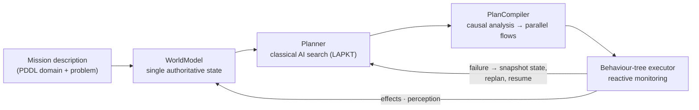
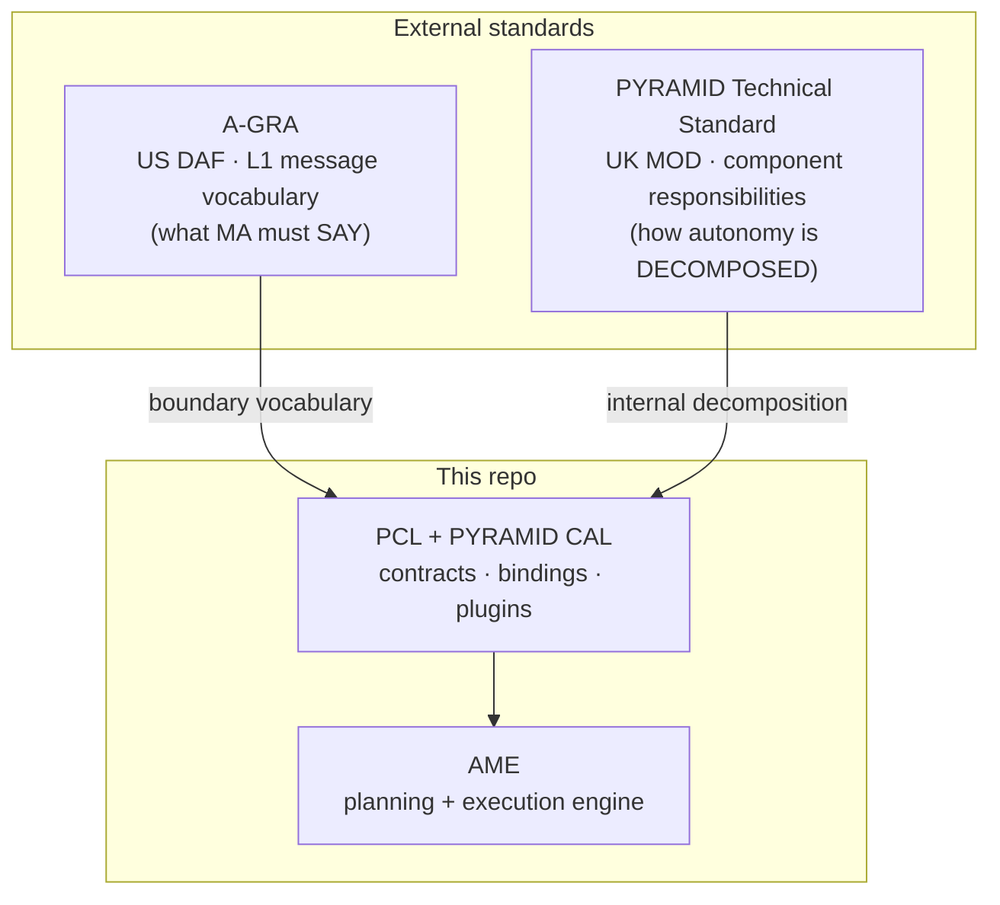
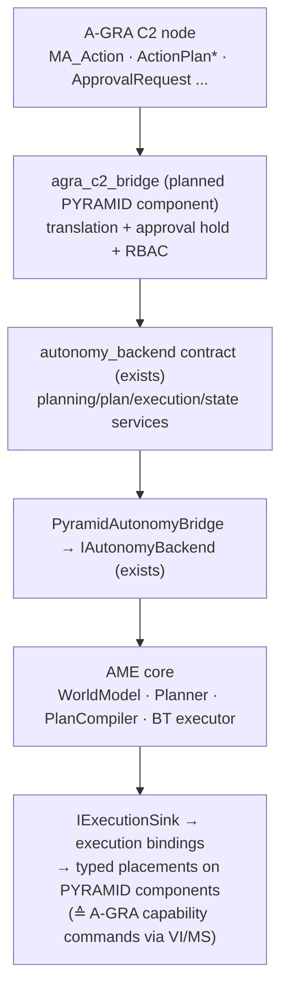

<!--
Slide deck for peer engineers. Render with Marp (VS Code Marp extension or
`marp --pdf`) or read as plain Markdown — GitHub renders the mermaid diagrams
inline. High-level positioning only; the underlying analysis lives in
doc/research/AME/a_gra_standard_review.md and a_gra_e2e_worked_example.md.
-->

# AME and A-GRA

## Where the Autonomous Mission Engine sits against the
## Autonomy Government Reference Architecture

The one-line answer: **A-GRA's "Mission Autonomy" is the role AME plays** —
A-GRA gives AME an externally recognised vocabulary at the boundary, and
the PCL/PYRAMID stack provides the machinery to speak it.

---

## AME in one slide

The **Autonomous Mission Engine**: formal planning + supervised execution
for autonomous platforms.

- Goals in, plans out, execution supervised — **no hand-written mission scripts**.
- Replans automatically on failure; every decision and state change audited
  (multi-layer JSONL audit stack, live Foxglove monitoring).
- Core is framework-agnostic C++; PCL/PYRAMID and ROS2 are integration layers.

---

## A-GRA in one slide

**Autonomy Government Reference Architecture** — the US Air Force's
government-owned interface standard for **Mission Autonomy (MA)** on
Autonomous Collaborative Platforms (CCA programme).

- Built on **UCI** (Universal C2 Interface) messages **plus ~123 `MA_*`
  planning extensions**, published as XSD.
- Six Level-1 interfaces: **C2**, Vehicle Interface (**VI**), Mission
  Systems (**MS**), Mission Planning (**MP**), Mission Debrief (**MD**),
  Peer-to-Peer (**P2P**).
- Decomposition: Effect → Action → Task → capability command, with an
  explicit **plan / approve / execute** lifecycle and status feedback on
  every command.
- Wire: OMS/CAL onboard; EXI over DDS/DMS offboard. Internal (L2)
  structure deliberately unpublished.

Related but distinct: **AMS-GRA** is the open-source reference stack
("Kitty Hawk" demo, UCI 2.5) — the practice environment, not the standard.

---

## The headline: same seam, same shape

**A-GRA's MA and AME solve the same problem at the same architectural
seam** — mission-level planning, prioritisation, execution management, and
replanning, between C2 above and vehicle/mission systems below.

| A-GRA concept | AME concept | Fit |
|---|---|---|
| `MA_Action` / Effect (+ constraints, target) | PlanningRequirement + goals | good |
| `ActionPlan` (addressable, with provenance) | Plan resource (world version, steps, compiled BT) | very good |
| Plan approval / activation commands | plan → execution-requirement split | structural fit |
| `ActionPlanExecutionStatus` / `ActionStatus` | ExecutionRun state + achievement | direct |
| Capability commands + status | execution bindings → typed placements on components | direct |
| Explicit cancel (race-aware, history kept) | stop/drain semantics, runs retained | good |
| Mission Data Package | PDDL domain/problem + action registry + contingency domains | conceptual match |
| Mission Debrief volume | the audit/observability stack | strong — exceeds sequence-level needs |

A-GRA independently **validates AME's design decisions**: planning/approval
separation, explicit cancellation, status on everything, full audit.

---

## Positioning: A-GRA vs PYRAMID vs AME

**Complementary, not competing.** A-GRA's L2 is unpublished, so adopting
A-GRA at the boundary does not conflict with PYRAMID internally: PYRAMID
gives the component decomposition and binding/transport machinery; A-GRA
gives the externally recognised L1 vocabulary for what an MA must say to
C2, the vehicle, and its peers.

---

## The integration shape: two bridges, AME core unchanged

The proven two-bridge pattern (as `StandardBridge` fronts Tactical
Objects): **translation lives in the bridge, AME's internal surfaces need
little or no change.** A full message-identified walkthrough exists
(FIND_SEARCH tasking → EO sensor control → track report, with contingency
variants).

---

## An A-GRA "MA" is bigger than AME — by design

A-GRA expects MA to also **produce kinematic plans** (typed route plans,
task plans, mission-plan hierarchies). AME produces symbolic action plans.

That is not a mismatch: A-GRA's unpublished L2 leaves the internal
decomposition free, so an A-GRA MA maps to a **composition of PYRAMID
components**:

- **AME** ≈ Objectives + Tasks (mission-level planning & execution management)
- **Routes / Vehicle Guidance** components — kinematic planning & enactment
  (a route-planning component is a prerequisite; not an AME change)
- **Sensing / Sensor Data Interpretation / Tactical Objects** — the sensing
  chain and track state (Tactical Objects exists today)
- **agra_c2_bridge** — boundary translation, approval, security markings

---

## Genuine gaps (capability, not translation)

| Gap | Size / where it lands |
|-----|----------------------|
| **Approval gate inside the replan loop** — A-GRA can require operator approval of *autonomous contingency replans*; AME swaps BTs immediately today | Small AME change: an approval-pending state + policy knob; RBAC stays in the bridge |
| **Temporal semantics** — plan windows, sequences in time | Existing AME temporal/STN research track; A-GRA strengthens the case |
| **Plan hierarchy** — mission ⊃ sub-plans ⊃ action plans | Bridge synthesises one level initially; real hierarchy = future work |
| **Kinematic plan production** | New route-planning component, not AME |
| **Team/P2P behaviours** — leader election, COP | Peer-coordination component; AME consumes the results |
| **Security markings end-to-end** | Bridge/contract layer |
| **Constraint priorities / MECL sweeps** | Mostly bridge-side monitors; risk-conditioned planning joins the planner-capability track |

**No static-plan blocker**: A-GRA *expects* replanning — the constraint is
approval, not stasis.

---

## Compliance scale — eyes open

- Formal MA L1 compliance is a **Core Minimum Message Set of ~327 unique
  messages** (~261 on C2 alone), with no partial-compliance tiers.
- The `MA_*` extension set (~123 messages) is where the planning substance
  lives — the right anchor for a conversion profile.
- The repo's XSD→proto converter has **proven the A-GRA 5.0a schema
  converts cleanly** (1,163 messages); the generated tree is deliberately
  held offline pending profile pruning.
- Meanwhile the stack is a **live OMS/CAL peer of the AMS-GRA (UCI 2.5)
  reference environment today** — real command round-trips and live
  sensor-sim telemetry — so the wire path is de-risked ahead of any
  compliance commitment.

**Strategy: profile-first adoption** for demos and internal use; full L1
compliance is a separately costed commitment.

---

## Current state at a glance

| Piece | Status |
|-------|--------|
| AME core (plan → BT → replan → audit) | working, tested |
| `autonomy_backend` contract + AME↔PYRAMID bridge | exists (stub-proven over shared memory) |
| A-GRA-vocabulary example contract (`MA_Action` pair, facade-driven) | exists, proven over SHM/UDP |
| Live AMS-GRA (UCI 2.5) interop via OMS/CAL | **live-proven** (command seam + 4 information topics) |
| A-GRA 5.0a schema conversion | proven offline; tree not checked in (profile pruning pending) |
| `agra_c2_bridge`, approval state machine, route component | planned — the identified adoption path |
| Formal A-GRA compliance | not attempted; no tasking exists |

---

## Where to read more

| Topic | Document |
|-------|----------|
| Full A-GRA standard review (positioning, gaps, adoption path) | `doc/research/AME/a_gra_standard_review.md` |
| Message-level worked example (FIND_SEARCH → EO → track) | `doc/research/AME/a_gra_e2e_worked_example.md` |
| OMS / AMS-GRA / A-GRA compatibility status | `subprojects/PYRAMID/doc/architecture/oms_agra_compatibility.md` |
| A-GRA example contract + facade proofs | `subprojects/PYRAMID/proofs/contracts/agra_example/README.md` |
| AME architecture | `subprojects/AME/doc/architecture/` |
| Temporal extension research (A-GRA-relevant) | `doc/research/AME/temporal_extension_research.md` |
| PCL/PYRAMID + CAL overview deck (companion) | `subprojects/PYRAMID/doc/slides/pcl_pyramid_cal_overview.md` |
