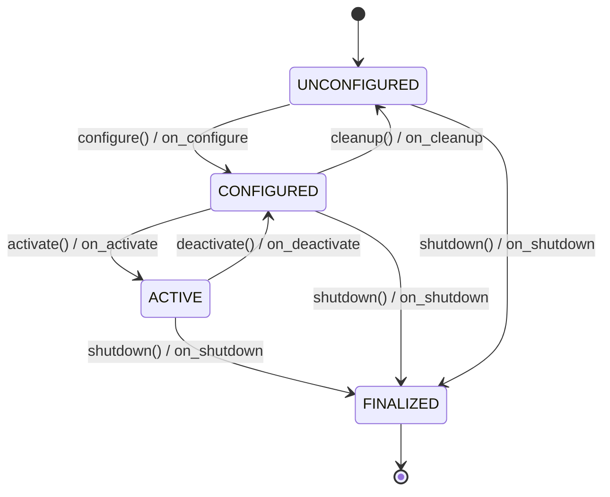

# PCL Component Container -- Developer Guide

## 1. Overview

The PYRAMID Composition Library (PCL) provides a standard component container for autonomous mission systems. It encapsulates business logic behind a consistent lifecycle while entirely decoupling it from external middleware.

PCL uses a **hybrid architecture**: a pure-C ABI core for maximum portability (Ada, C, C++, Rust), with an optional header-only C++ wrapper for ergonomic authoring. Transport adapters (ROS2, DDS, sockets, shared memory) are pluggable -- your component code never depends on middleware.

The API listings in this document are abridged to show the design shape. The
headers under `subprojects/PCL/include/pcl/` are the authoritative API
reference; day-to-day usage is covered in
[`../guides/pcl_user_guide.md`](../guides/pcl_user_guide.md).

---

## 2. Design Principles

| # | Principle | Rationale |
|---|-----------|-----------|
| P1 | **Logic owns the thread** | Business logic runs on exactly one thread (the executor). No internal mutexes needed. |
| P2 | **I/O is injected** | Transport adapters (ROS2, DDS, sockets, shared-mem) are set via function pointers / vtable, not compiled in. |
| P3 | **C-ABI at the boundary** | All public symbols are `extern "C"` with opaque handles. C++ internals are hidden behind the ABI wall. |
| P4 | **Lifecycle is explicit** | Components follow a state machine: `UNCONFIGURED -> CONFIGURED -> ACTIVE -> FINALIZED`. Compatible with ROS2 lifecycle but no rclcpp dependency. |
| P5 | **Zero-copy where possible** | Intra-process communication between containers in the same executor uses pointer handoff, not serialization. |

---

## 3. Architecture

```
+---------------------------------------------------------+
|                    Executor (single thread)              |
|                                                         |
|  +--------------+  +--------------+  +--------------+  |
|  |  Container A  |  |  Container B  |  |  Container C  |  |
|  | +----------+ |  | +----------+ |  | +----------+ |  |
|  | |  Logic   | |  | |  Logic   | |  | |  Logic   | |  |
|  | | (user)   | |  | | (user)   | |  | | (user)   | |  |
|  | +----+-----+ |  | +----+-----+ |  | +----+-----+ |  |
|  |      |       |  |      |       |  |      |       |  |
|  | +----v-----+ |  | +----v-----+ |  | +----v-----+ |  |
|  | | Port I/O | |  | | Port I/O | |  | | Port I/O | |  |
|  | +----------+ |  | +----------+ |  | +----------+ |  |
|  +--------------+  +--------------+  +--------------+  |
|                                                         |
|  +-------------------------------------------------+    |
|  |         Transport Adapter (pluggable)            |    |
|  |   ROS2 / DDS / SharedMem / Socket / gRPC        |    |
|  +-------------------------------------------------+    |
+---------------------------------------------------------+
```

The library itself (`pcl_core`) is pure C17 with zero dependencies. A header-only C++ wrapper (`pcl/component.hpp`) provides RAII, virtual method overrides, and modern C++ ergonomics without compromising the ABI. Ada and C consumers use the raw C API directly.

---

## 4. Core C API

### 4.1 Opaque Handles

```c
/* pcl_container.h */
#include <stdint.h>
#include <stdbool.h>

#ifdef __cplusplus
extern "C" {
#endif

/* Opaque handles */
typedef struct pcl_executor_t       pcl_executor_t;
typedef struct pcl_container_t      pcl_container_t;
typedef struct pcl_port_t           pcl_port_t;
typedef struct pcl_svc_context_t    pcl_svc_context_t;    /* deferred responses */
typedef struct pcl_stream_context_t pcl_stream_context_t; /* streaming services */

/* Return codes */
typedef enum {
    PCL_OK              =  0,
    PCL_PENDING         =  1,   /* operation deferred (service responds later) */
    PCL_STREAMING       =  2,   /* stream opened, more data coming */
    PCL_ERR_INVALID     = -1,
    PCL_ERR_STATE       = -2,   /* wrong lifecycle state for this operation */
    PCL_ERR_TIMEOUT     = -3,
    PCL_ERR_CALLBACK    = -4,   /* user callback returned error */
    PCL_ERR_NOMEM       = -5,
    PCL_ERR_NOT_FOUND   = -6,   /* parameter key / port name not found */
    PCL_ERR_PORT_CLOSED = -7,   /* port not available (container inactive) */
    PCL_ERR_CANCELLED   = -8,   /* stream cancelled by peer */
} pcl_status_t;

/* Lifecycle states */
typedef enum {
    PCL_STATE_UNCONFIGURED = 0,
    PCL_STATE_CONFIGURED   = 1,
    PCL_STATE_ACTIVE       = 2,
    PCL_STATE_FINALIZED    = 3,
} pcl_state_t;
```

### 4.2 Lifecycle Callbacks (User Implements)

```c
/* User-provided callbacks -- all called on the executor thread */
typedef struct {
    pcl_status_t (*on_configure)(pcl_container_t* self, void* user_data);
    pcl_status_t (*on_activate)(pcl_container_t* self, void* user_data);
    pcl_status_t (*on_deactivate)(pcl_container_t* self, void* user_data);
    pcl_status_t (*on_cleanup)(pcl_container_t* self, void* user_data);
    pcl_status_t (*on_shutdown)(pcl_container_t* self, void* user_data);

    /* Periodic tick -- called at configured rate while ACTIVE */
    pcl_status_t (*on_tick)(pcl_container_t* self, double dt_seconds,
                            void* user_data);
} pcl_callbacks_t;
```

### 4.3 Container Lifecycle

```c
/* Create / destroy */
pcl_container_t* pcl_container_create(const char* name,
                                       const pcl_callbacks_t* callbacks,
                                       void* user_data);
void pcl_container_destroy(pcl_container_t* c);

/* Lifecycle transitions */
pcl_status_t pcl_container_configure(pcl_container_t* c);
pcl_status_t pcl_container_activate(pcl_container_t* c);
pcl_status_t pcl_container_deactivate(pcl_container_t* c);
pcl_status_t pcl_container_cleanup(pcl_container_t* c);
pcl_status_t pcl_container_shutdown(pcl_container_t* c);

pcl_state_t  pcl_container_state(const pcl_container_t* c);
const char*  pcl_container_name(const pcl_container_t* c);

/* Parameters (key-value config) */
pcl_status_t pcl_container_set_param_str(pcl_container_t* c,
                                          const char* key, const char* value);
pcl_status_t pcl_container_set_param_f64(pcl_container_t* c,
                                          const char* key, double value);
pcl_status_t pcl_container_set_param_i64(pcl_container_t* c,
                                          const char* key, int64_t value);
pcl_status_t pcl_container_set_param_bool(pcl_container_t* c,
                                           const char* key, bool value);

const char*  pcl_container_get_param_str(const pcl_container_t* c,
                                          const char* key,
                                          const char* default_val);
double       pcl_container_get_param_f64(const pcl_container_t* c,
                                          const char* key, double default_val);
```

### 4.4 Port I/O (Service & Pub/Sub)

```c
/* Port types */
typedef enum {
    PCL_PORT_PUBLISHER      = 0,
    PCL_PORT_SUBSCRIBER     = 1,
    PCL_PORT_SERVICE        = 2,   /* request-reply server */
    PCL_PORT_CLIENT         = 3,   /* request-reply client */
    PCL_PORT_STREAM_SERVICE = 4,   /* streaming server */
} pcl_port_type_t;

/* Message buffer -- user owns the data, container borrows it */
typedef struct {
    const void*  data;
    uint32_t     size;
    const char*  type_name;      /* e.g. "SensorReading", "application/json" */
} pcl_msg_t;

/* Subscriber callback -- called on executor thread */
typedef void (*pcl_sub_callback_t)(pcl_container_t* c,
                                    const pcl_msg_t* msg,
                                    void* user_data);

/* Service handler -- called on executor thread.  Either fill the response
 * and return PCL_OK (immediate), or save ctx and return PCL_PENDING, then
 * complete later with pcl_service_respond(ctx, &response). */
typedef pcl_status_t (*pcl_service_handler_t)(pcl_container_t*   c,
                                               const pcl_msg_t*   request,
                                               pcl_msg_t*         response,
                                               pcl_svc_context_t* ctx,
                                               void*              user_data);

/* Streaming service handler -- save stream_ctx, return PCL_STREAMING, then
 * emit frames with pcl_stream_send() and finish with pcl_stream_end(). */
typedef pcl_status_t (*pcl_stream_handler_t)(pcl_container_t*      c,
                                              const pcl_msg_t*      request,
                                              pcl_stream_context_t* stream_ctx,
                                              void*                 user_data);

/* Create ports (must be called during on_configure) */
pcl_port_t* pcl_container_add_publisher(pcl_container_t* c,
                                         const char* topic,
                                         const char* type_name);
pcl_port_t* pcl_container_add_subscriber(pcl_container_t* c,
                                          const char* topic,
                                          const char* type_name,
                                          pcl_sub_callback_t cb,
                                          void* user_data);
pcl_port_t* pcl_container_add_service(pcl_container_t* c,
                                       const char* service_name,
                                       const char* type_name,
                                       pcl_service_handler_t handler,
                                       void* user_data);
pcl_port_t* pcl_container_add_stream_service(pcl_container_t* c,
                                              const char* service_name,
                                              const char* type_name,
                                              pcl_stream_handler_t handler,
                                              void* user_data);

/* Local/remote routing policy for a concrete port (see the peer/transport
 * configuration guide) */
pcl_status_t pcl_port_set_route(pcl_port_t* port, uint32_t route_mode,
                                const char* const* peer_ids,
                                uint32_t peer_count);

/* Publish (from on_tick or service handler) */
pcl_status_t pcl_port_publish(pcl_port_t* port, const pcl_msg_t* msg);

/* Async client-side service invocation (routes through the executor's
 * transport, or intra-process dispatch when none is set) */
pcl_status_t pcl_container_invoke_async(pcl_container_t* c,
                                        const char*      service_name,
                                        const pcl_msg_t* request,
                                        pcl_resp_cb_fn_t callback,
                                        void*            user_data);
```

### 4.5 Executor

```c
/* Executor -- runs one or more containers on a single thread */
pcl_executor_t* pcl_executor_create(void);
void            pcl_executor_destroy(pcl_executor_t* e);

pcl_status_t pcl_executor_add(pcl_executor_t* e, pcl_container_t* c);

/* Spin -- blocks, runs all containers' ticks and I/O callbacks in round-robin */
pcl_status_t pcl_executor_spin(pcl_executor_t* e);

/* Spin once -- process pending work, return immediately */
pcl_status_t pcl_executor_spin_once(pcl_executor_t* e, uint32_t timeout_ms);

/* Thread-safe ingress from external I/O threads (deep-copies payload) */
pcl_status_t pcl_executor_post_incoming(pcl_executor_t* e,
                                        const char* topic,
                                        const pcl_msg_t* msg);

/* Request shutdown (thread-safe, can be called from signal handler) */
void pcl_executor_request_shutdown(pcl_executor_t* e);

/* Logging -- routed through a process-wide pluggable handler (pcl_log.h),
 * so a deployment can forward to e.g. ROS2 RCLCPP_INFO */
void pcl_log(const pcl_container_t* c, pcl_log_level_t level,
             const char* fmt, ...);

#ifdef __cplusplus
}
#endif
```

The executor additionally provides `pcl_executor_remove`, graceful shutdown
with timeout (`pcl_executor_shutdown_graceful`), thread-safe service-request
and response posting, direct service invocation helpers, and streaming
invocation (`pcl_executor_invoke_stream`) -- see `pcl_executor.h` and
`pcl_transport.h`.

---

## 5. C++ Wrapper

The header-only C++ wrapper (`pcl/component.hpp`) provides ergonomic authoring on top of the C ABI. The wrapper uses static trampoline functions to bridge virtual method calls to the C callback interface.

```cpp
// pcl/component.hpp -- header-only C++ convenience wrapper
namespace pcl {

class Component {
public:
    Component(std::string_view name) {
        pcl_callbacks_t cbs = {};
        cbs.on_configure = [](pcl_container_t* c, void* ud) -> pcl_status_t {
            return static_cast<Component*>(ud)->on_configure();
        };
        cbs.on_activate = [](pcl_container_t* c, void* ud) -> pcl_status_t {
            return static_cast<Component*>(ud)->on_activate();
        };
        cbs.on_tick = [](pcl_container_t* c, double dt, void* ud) -> pcl_status_t {
            return static_cast<Component*>(ud)->on_tick(dt);
        };
        // ... other callbacks
        handle_ = pcl_container_create(name.data(), &cbs, this);
    }

    virtual ~Component() { pcl_container_destroy(handle_); }

    // Override these in your component
    virtual pcl_status_t on_configure() { return PCL_OK; }
    virtual pcl_status_t on_activate()  { return PCL_OK; }
    virtual pcl_status_t on_deactivate(){ return PCL_OK; }
    virtual pcl_status_t on_tick(double dt) { return PCL_OK; }
    // ...

    // Convenience helpers
    pcl_port_t* addPublisher(const char* topic, const char* type) {
        return pcl_container_add_publisher(handle_, topic, type);
    }
    double paramF64(const char* key, double def) {
        return pcl_container_get_param_f64(handle_, key, def);
    }
    void logInfo(const char* fmt, ...) { /* delegates to pcl_log */ }

    pcl_container_t* handle() { return handle_; }

private:
    pcl_container_t* handle_;
};

} // namespace pcl
```

---

## 6. Transport Adapter Layer

The container's ports produce/consume `pcl_msg_t` (opaque byte buffers + type name). A **transport adapter** connects these to the real middleware:

```
Container Port --pcl_msg_t--> Transport Adapter --> Wire
                                   |
                          +--------+--------+
                          v        v        v
                        ROS2    SharedMem  Socket
```

### 6.1 Adapter Interface

A transport adapter is a vtable of function pointers (`pcl_transport_t` in
`pcl_transport.h`). Only the operations the transport supports need to be
implemented; unsupported slots stay NULL and the framework fails closed. The
full contract covers:

| Slot | Direction | Purpose |
|------|-----------|---------|
| `publish` | egress | Send a published message to the wire |
| `subscribe` | setup | Begin listening on a topic; deliver via `pcl_executor_post_incoming` (I/O thread) or `pcl_executor_dispatch_incoming` (executor thread) |
| `serve` | ingress | Dispatch a wire service request to the container's handler |
| `invoke_async` | egress | Client-side unary service call; response callback fires on the executor thread |
| `respond` | egress | Send a deferred (`PCL_PENDING`) service response |
| `invoke_stream` / `stream_send` / `stream_end` / `stream_cancel` | both | Client- and server-side streaming service support |
| `shutdown` | teardown | Release adapter resources |

```c
pcl_status_t pcl_executor_set_transport(pcl_executor_t* e,
                                         const pcl_transport_t* transport);
```

Multiple named peer transports can also be registered on one executor
(`pcl_executor_register_transport`), each with declared interaction
capabilities and offered QoS that are validated against endpoint routes at
compose time (`pcl_executor_validate_endpoint_route`, fail closed). See
`pcl_transport.h`, `pcl_capabilities.h`, and the
[peer/transport configuration guide](../guides/peer_transport_configuration.md).

Transports can also be built as runtime-loaded plugins (`pcl_plugin.h`,
`pcl_plugin_loader.h`); the socket, UDP, and shared-memory transports ship
both as static libraries and as loadable plugins.

### 6.2 ROS2 Adapter Example

```cpp
// ros2_adapter.cpp -- wraps PCL containers as rclcpp_lifecycle::LifecycleNode
class Ros2Adapter {
public:
    Ros2Adapter(rclcpp::executors::SingleThreadedExecutor& ros_exec,
                pcl_executor_t* pcl_exec);

    // Wraps each pcl_container_t as a LifecycleNode with matching services/pubs
    void bridge(pcl_container_t* container);

    // Pumps pcl_executor_spin_once from a ROS2 timer callback
    void spin_integrated();
};
```

---

## 7. Lifecycle State Machine

PCL enforces a strict lifecycle compatible with ROS 2 managed nodes but with no rclcpp dependency:



**Key rules:**
- **Ports must be created during `on_configure`.** Dynamic port creation after configure is not supported.
- **`on_tick()` is only called while `ACTIVE`.** Each container has its own tick rate (set via parameter).
- **Shutdown is graceful** with a configurable timeout: `ACTIVE -> on_deactivate -> on_shutdown -> FINALIZED`.

**Executor tick loop** (while `ACTIVE`):

```
while (!shutdown_requested) {
    t_now = clock();
    dt = t_now - t_prev;

    for each container in executor:
        if container.state == ACTIVE:
            drain_ingress_queue(container)          // posted by I/O threads
            process_incoming_messages(container)   // dispatch subscriber callbacks
            process_service_requests(container)     // dispatch service handlers
            container.callbacks.on_tick(container, dt, user_data)

    sleep_until(next_tick)
}
```

All callbacks execute on the **single executor thread** -- no mutexes needed in user code. External transport threads never call user callbacks directly; they only enqueue messages via `pcl_executor_post_incoming()`.

---

## 8. Serialization

Ports exchange `pcl_msg_t` -- a pointer, size, and type name string. PCL is **format-agnostic**: the `data` field is an opaque byte buffer, and `type_name` conventionally carries a content type such as `application/json`, `application/flatbuffers`, or `application/protobuf`. Each transport adapter knows how to route bytes on the wire; it never interprets the payload.

For **intra-process** communication (no transport adapter set), messages are passed by pointer with zero-copy semantics.

For **cross-process** or **cross-network** communication, payload encode/decode belongs to a codec layer above PCL. Two mechanisms exist:

- **Generated bindings** (PYRAMID): typed facades generated from `.proto` contracts own encode/decode and hand PCL opaque buffers. See `subprojects/PYRAMID/doc/architecture/generated_bindings.md`.
- **Runtime codec plugins**: codecs can be registered per content type in the PCL codec registry (`pcl_codec.h`, `pcl_codec_registry.h`) and loaded as shared-library plugins (`pcl_plugin_loader.h`), so a client binary links no wire-format code. With no codec registered for a content type, encode/decode fails closed.

This keeps the core minimal while supporting zero-copy intra-process messaging and pluggable serialization everywhere else.

---

## 9. Writing a Component (C++)

Here is a complete example of a PCL component using the C++ wrapper:

```cpp
#include "pcl/component.hpp"
#include "pcl/executor.hpp"

class TemperatureSensor : public pcl::Component {
public:
    TemperatureSensor() : Component("temp_sensor") {}

protected:
    pcl_status_t on_configure() override {
        threshold_ = paramF64("alert_threshold", 50.0);
        pub_alert_ = addPublisher("alerts", "AlertMsg");
        addSubscriber("config_updates", "ConfigMsg",
            [this](const pcl_msg_t* msg) { /* handle config update */ });
        return PCL_OK;
    }

    pcl_status_t on_activate() override {
        setTickRateHz(10.0);
        return PCL_OK;
    }

    pcl_status_t on_tick(double dt) override {
        logInfo("Sensor ticking... dt=%f", dt);
        // Read sensor, check threshold, publish alert if needed
        return PCL_OK;
    }

private:
    double threshold_ = 0.0;
    pcl_port_t* pub_alert_ = nullptr;
};

int main() {
    TemperatureSensor sensor;
    pcl::Executor exec;

    sensor.configure();
    sensor.activate();

    exec.add(sensor);
    exec.spin();  // Blocks and runs the tick loop

    return 0;
}
```

---

## 10. Writing a Component (C)

The same component in pure C, suitable for Ada interop or embedded targets:

```c
#include "pcl/pcl_container.h"
#include "pcl/pcl_executor.h"

typedef struct {
    pcl_port_t* pub_alert;
    double threshold;
} SensorData;

pcl_status_t sensor_on_configure(pcl_container_t* c, void* ud) {
    SensorData* d = (SensorData*)ud;
    d->threshold = pcl_container_get_param_f64(c, "alert_threshold", 50.0);
    d->pub_alert = pcl_container_add_publisher(c, "alerts", "AlertMsg");
    return PCL_OK;
}

pcl_status_t sensor_on_tick(pcl_container_t* c, double dt, void* ud) {
    SensorData* d = (SensorData*)ud;
    /* Read sensor, check threshold, publish alert if needed */
    return PCL_OK;
}

int main(void) {
    SensorData data = {0};
    pcl_callbacks_t cbs = {
        .on_configure = sensor_on_configure,
        .on_tick      = sensor_on_tick,
    };

    pcl_container_t* c = pcl_container_create("temp_sensor", &cbs, &data);
    pcl_executor_t* e = pcl_executor_create();

    pcl_container_configure(c);
    pcl_container_activate(c);
    pcl_executor_add(e, c);
    pcl_executor_spin(e);

    pcl_executor_destroy(e);
    pcl_container_destroy(c);
    return 0;
}
```

---

## 11. Writing a Component (Ada)

The pure-C ABI enables direct Ada bindings with no C++ dependency. The
canonical Ada binding lives in `subprojects/PCL/bindings/ada/`:

- `Pcl_Bindings` -- thin import layer over the public C ABI
- `Pcl_Component` -- tagged OO wrapper for components, executors, ports, and routing
- `Pcl_Transports` -- socket, UDP, and shared-memory transport helpers
- `Pcl_Content_Types` / `Pcl_Typed_Ports` -- content-type constants and typed-port generics

See the [PCL user guide](../guides/pcl_user_guide.md) section 5 for a worked
Ada component example, and `subprojects/PYRAMID/examples/ada/pcl_sensor_demo.adb`
for a runnable demo.

---

## 12. External I/O Integration

PCL draws a hard line between business logic and transport I/O. External threads (gRPC, sockets, device drivers) must never call component callbacks directly. Instead, they post messages into the executor's ingress queue:

```
external I/O thread
  -> receive / deserialize / classify
  -> pcl_executor_post_incoming(executor, topic, msg)
  -> return to middleware immediately

executor thread
  -> drain ingress queue
  -> dispatch subscriber callback / service handler
  -> run on_tick()
```

For long-latency outbound calls (e.g., gRPC clients), the recommended pattern is the inverse: the executor creates the request, an adapter-owned I/O thread waits for network completion, and the completion is posted back into the executor as a new ingress event.

See `subprojects/PCL/examples/external_io_bridge_example.c` for a concrete producer-thread to executor-queue to subscriber flow.

