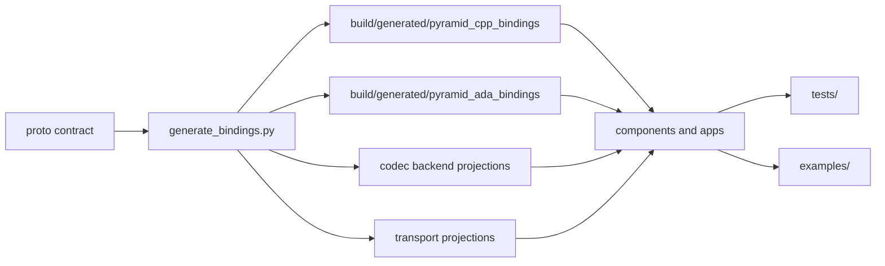

# PYRAMID Bindings

This directory is the legacy home for generated binding artifacts. Active
monorepo builds generate C++ and Ada bindings into the build tree instead of
committing generated implementations.

The monorepo CMake build creates build-local artifacts under
`${binaryDir}/generated/pyramid_cpp_bindings` and
`${binaryDir}/generated/pyramid_ada_bindings`. Those files are produced from
`subprojects/PYRAMID/proto/` when `PYRAMID_GENERATE_*_BINDINGS=ON`, then
refreshed by the corresponding codegen targets during builds.

## Directory Map

| Directory | Role |
|-----------|------|
| `cpp/generated/` | Ignored legacy C++ generated output location |
| `ada/generated/` | Ignored legacy Ada generated output location |
| `protobuf/cpp/` | Ignored legacy protobuf support output location |
| `../src/protobuf_support/` | Checked-in tactical protobuf codec support used by the active PCL path |

`subprojects/PYRAMID/proto/` is the schema source of truth. Use CMake or
`subprojects/PYRAMID/scripts/generate_bindings.sh` / `.bat` to regenerate into a
build-local output directory after changing proto contracts or generator code.

For a broad architecture view of how these generated artifacts plug into the
PCL runtime, see
[`../doc/architecture/pcl_pyramid_binding_generation_overview.md`](../doc/architecture/pcl_pyramid_binding_generation_overview.md).

## V1 Shape

Component code should use the generated typed service/topic facade and select
a supported content type through the binding API. It should not switch directly
on JSON, FlatBuffers, or Protobuf payloads except inside a generated backend or
a narrowly scoped binding test.

## Examples And Tests

- `examples/` contains hand-written sample applications and reusable example
  support code.
- `tests/` contains test harnesses and conformance checks.
- Generated binding files belong in the build tree, even when they are first
  introduced to support an example.

For usage rules, regeneration commands, and the binding action plan, see
`../doc/architecture/generated_bindings.md`.
