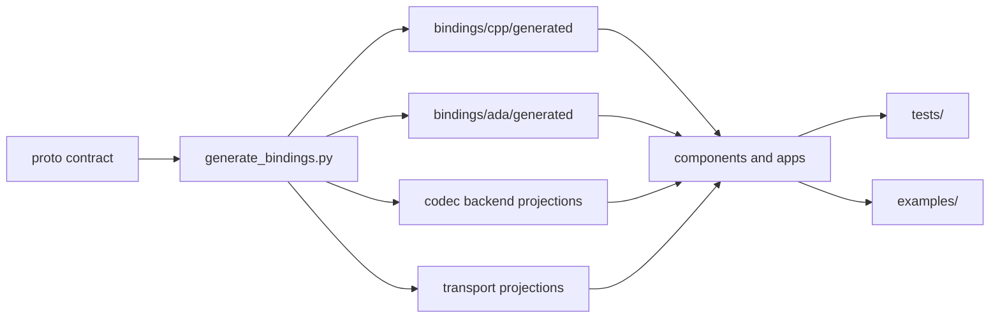

# PYRAMID Bindings

This directory contains the checked-in generated binding artifacts that form
the current v1 component-facing contract snapshot. They are no longer example
files: production code, Tactical Objects, examples, and tests use these
interfaces, and downstream component repositories may receive an equivalent
generated binding tree as a delivered contract artifact.

The monorepo CMake build also creates build-local C++ artifacts under
`${binaryDir}/generated/pyramid_cpp_bindings`. Those files are produced during
configure from `subprojects/PYRAMID/proto/` when
`PYRAMID_GENERATE_CPP_BINDINGS=ON`, then refreshed by the
`pyramid_cpp_bindings_codegen` target during builds. CMake globs the build-local
tree, plus supporting generated trees under `bindings/`, instead of maintaining
handwritten lists of generated filenames.

## Directory Map

| Directory | Role |
|-----------|------|
| `cpp/generated/` | Canonical C++ data-model types, service facades, JSON codecs, and generated FlatBuffers/Protobuf backend stubs |
| `cpp/generated/grpc/cpp/` | Generated C++ gRPC transport projection and C API shim |
| `cpp/generated/ros2/cpp/` | Generated C++ ROS2 transport projection and runtime support |
| `ada/generated/` | Canonical Ada data-model types, service facades, package hierarchy stubs, JSON codecs, and generated backend projections |
| `ada/generated/grpc/ada/` | Generated Ada gRPC transport specs |
| `ada/generated/ros2/ada/` | Generated Ada ROS2 endpoint constants |
| `protobuf/cpp/` | Tactical Objects Protobuf codec and C shim used by the active PCL path |

`subprojects/PYRAMID/proto/` is the schema source of truth. Regenerate this
tree with `subprojects/PYRAMID/scripts/generate_bindings.bat` or `.sh` after
changing proto contracts or generator code.

For a broad architecture view of how these generated artifacts plug into the
PCL runtime, see
[`../doc/architecture/pcl_pyramid_binding_generation_overview.md`](../doc/architecture/pcl_pyramid_binding_generation_overview.md).

## V1 Shape

Component code should use the generated typed service/topic facade and select
a supported content type through the binding API. It should not switch directly
on JSON, FlatBuffers, or Protobuf payloads except inside a generated backend or
a narrowly scoped binding test.

## Examples And Tests

- `examples/` contains hand-written sample applications and reusable example
  support code.
- `tests/` contains test harnesses and conformance checks.
- Generated binding files belong in `bindings/`, even when they are first
  introduced to support an example.

For usage rules, regeneration commands, and the binding action plan, see
`../doc/architecture/generated_bindings.md`.
