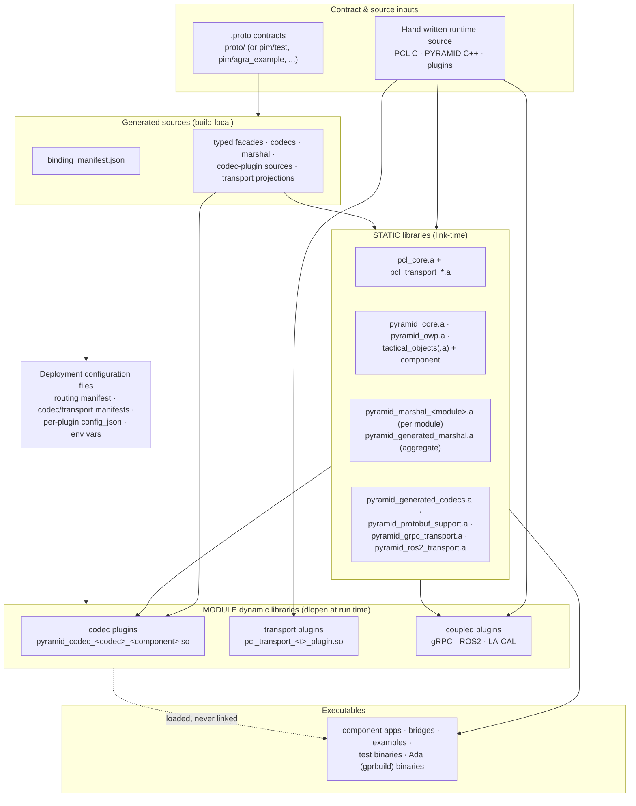
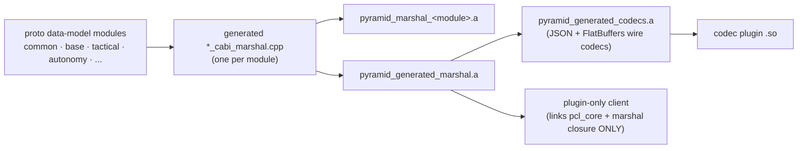
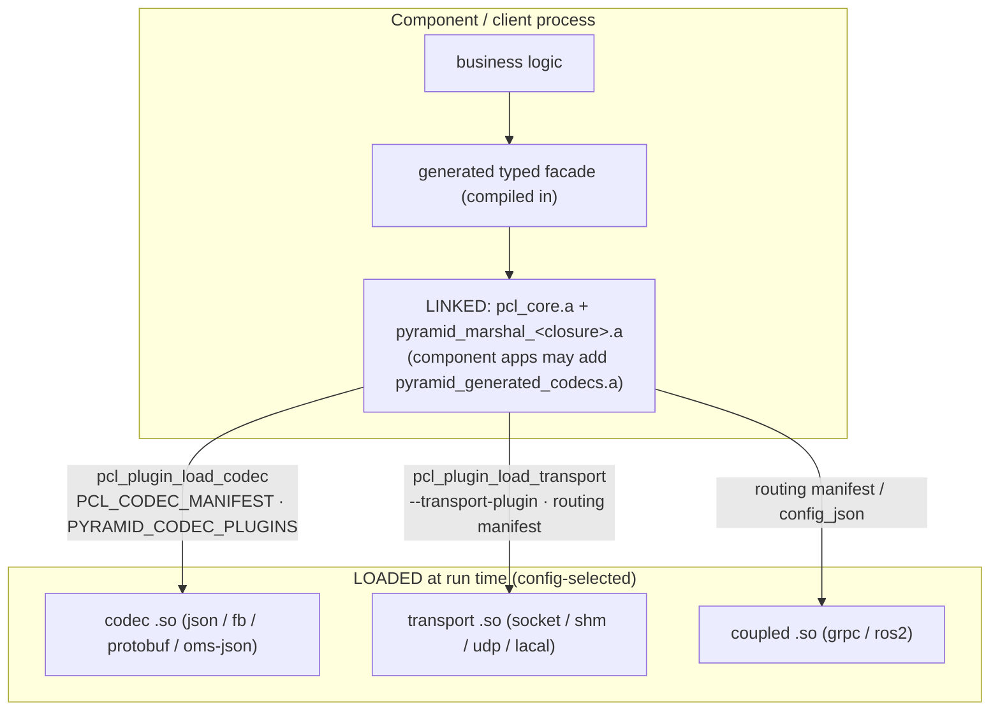
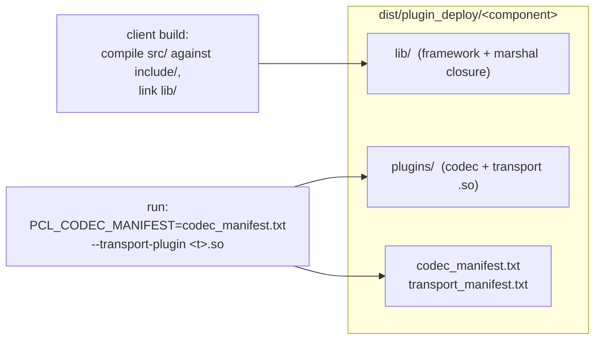

# PCL/PYRAMID Build Artefacts & Deployment Configuration

## Summary

This page is the single high-level map of **everything the PCL/PYRAMID build
produces** — core static libraries, generated marshalling ("marshal")
libraries, runtime plugin dynamic libraries, executables — and **every
configuration file a deployment consumes**. It names artefacts and their
roles, not their internals; follow the cross-references for design detail.

Read this page when you need to answer: *what do I link, what do I load, and
what do I configure?*

- Plugin ABI, capability model, and routing design:
  [`transport_codec_plugin_system.md`](transport_codec_plugin_system.md)
- How the generated sources come to exist:
  [`pcl_pyramid_binding_generation_overview.md`](pcl_pyramid_binding_generation_overview.md)
- Offline SDK packaging of these artefacts:
  [`sdk_packaging.md`](sdk_packaging.md)

## The artefact taxonomy in one picture



The load-bearing distinction is **linked vs loaded**: a component/client
*links* only the framework and its generated contract (facade + marshal
closure); wire codecs and transports arrive as *loaded* `.so`/`.dll` plugins
selected by configuration. That is what lets a wire-format or transport
change ship as a new plugin instead of a client rebuild.

## 1. Core static libraries

### PCL (pure C, zero external dependencies)

| Library | Role |
|---------|------|
| `pcl_core` | The runtime: container lifecycle, single-thread executor, ports/services/streams, codec registry, plugin loader, transport routing, logging, bridge helpers. C11, ABI-stable, position-independent. |
| `pcl_transport_socket` | TCP socket transport implementation (also wrapped by the socket plugin). |
| `pcl_transport_udp` | UDP datagram transport (pub/sub only). |
| `pcl_transport_shared_memory` | Central shared-memory bus transport. |
| `pcl_transport_template` | Engineer-extendable transport scaffold (standard send/recv worker threading; supply blocking I/O hooks). |
| `pcl_transport_apos` + `apos_stub` | APOS Local Virtual Channel transport over the template scaffold, with a stub APOS implementation for development. |

GNAT/Ada consumers use GCC-compatible rebuilds of the same PCL libraries
(`subprojects/PCL/scripts/build_gnat_pcl_static_libs.*`) because MSVC and
GNAT object formats are incompatible on Windows.

### PYRAMID runtime (C++)

| Library | Role |
|---------|------|
| `pyramid_core` | Shared runtime services: logging, UUIDs, event bus, job system. |
| `pyramid_owp` | OMS WebSocket Protocol (LA-CAL) client, PCL-free; linked into the LA-CAL transport plugin. |
| `tactical_objects` | Tactical Objects pure domain runtime + codec (no PCL dependency). |
| `tactical_objects_component` | PCL component wrapper + generated-binding standard adapter (`StandardBridge`). |

## 2. Generated marshal & codec static libraries

These are compiled from **generated** sources
(`${binaryDir}/generated/pyramid_cpp_bindings`, refreshed by the
`pyramid_cpp_bindings_codegen` target whenever proto or generator inputs
change).

| Library | Contents | Who links it |
|---------|----------|--------------|
| `pyramid_marshal_<module>` | Native ↔ frozen `pyramid_<T>_c` C-ABI marshalling for **one** data-model module (`common`, `base`, `tactical`, `autonomy`, `sensors`, `sensorproducts`, `radar`, …). No wire encoding, no transport. | Deployment staging ships only the modules a component actually uses (churn isolation). |
| `pyramid_generated_marshal` | Aggregate of every module's marshal objects + service-level marshal. The name C++ and Ada consumers link by. | Plugin-only clients/components (with `pcl_core`); codec plugins (transitively). |
| `pyramid_generated_codecs` | Wire codecs: JSON data-model + per-component service codecs, plus FlatBuffers service codecs when enabled. Re-exports the marshal aggregate. | Codec plugins; components still using an in-tree codec. |
| `pyramid_protobuf_support` | Protobuf service codecs + `protoc`-generated data-model sources (optional, `PYRAMID_ENABLE_PROTOBUF`). | Protobuf codec plugins; the coupled gRPC plugin. |
| `pyramid_grpc_transport` | Generated gRPC transport projection + proto-driven plugin aggregator (optional, `PYRAMID_ENABLE_GRPC`). | The coupled gRPC plugin; direct gRPC users. |
| `pyramid_ros2_transport` | Generated ROS2 support layer (binding model, envelope helpers, executor handoff; `PYRAMID_ENABLE_ROS2`). | ROS2 transport users; the ament package. |
| `pyramid_flatbuffers_support` | INTERFACE target carrying FlatBuffers generated headers/include paths. | FlatBuffers codec users. |



**Why per-module marshal libraries:** an edit to one data-model module
re-versions only that module's artefact. Deployment staging computes each
component's *module closure* and ships only those `pyramid_marshal_*`
libraries, so unrelated contract changes produce no diff in a component's
deployment directory.

For Ada, the GNAT-compatible equivalent archive is
`libpyramid_generated_cabi_marshal.a`
(`scripts/build_gnat_pyramid_cabi_marshal_libs.*`); Ada links **only** PCL +
this marshal layer, never wire-codec content.

## 3. Runtime plugin dynamic libraries

All plugins are CMake `MODULE` targets (`.so`/`.dll`) loaded with `dlopen`
behind ABI-versioned C entry points; nothing links them. The
`pyramid_plugins` aggregate target builds every runtime plugin the enabled
options allow (used by `scripts/build_plugins.*`).

### Codec plugins (generated, one per component × content type)

| Plugin | Content type | Gate |
|--------|--------------|------|
| `pyramid_codec_json_<component>` | `application/json` | always |
| `pyramid_codec_flatbuffers_<component>` | `application/flatbuffers` | `PYRAMID_ENABLE_FLATBUFFERS` |
| `pyramid_codec_protobuf_<component>` | `application/protobuf` | `PYRAMID_ENABLE_PROTOBUF` |
| `pyramid_codec_oms_json_<module>` | `application/oms-json` | `PYRAMID_ENABLE_OWP`, and the contract tree has a UCI-shaped data model. Generated from the selected contract, one per data-model package with OMS wire roots (`pyramid_codec_oms_json_agra` for the A-GRA 5.0a P2 profile). Carries the contract's schema identity and refuses a loader configuration naming another drop. |
| `pyramid_codec_oms_json_uci_starter` | OMS JSON (UCI wire) | `PYRAMID_ENABLE_OWP` (hand-written 4-root UCI 2.5 subset; a frozen byte-equivalence baseline for the generated UCI codec, not a contract codec — it is not packaged by `--gra`) |

One codec `.so` serves both C++ and Ada: it consumes the frozen
`pyramid_<T>_c` structs, so language never appears in the artefact set.

### Transport plugins (proto-agnostic)

| Plugin | Middleware | Notes |
|--------|-----------|-------|
| `pcl_transport_socket_plugin` | TCP | RPC + pub/sub |
| `pcl_transport_shared_memory_plugin` | SHM bus | RPC + streams + pub/sub |
| `pcl_transport_udp_plugin` | UDP | pub/sub only, BEST_EFFORT |
| `pyramid_lacal_transport_plugin` | OMS/CAL (OWP WebSocket) | pub/sub only; wraps `pyramid_owp` |

These never change when a `.proto` changes, so the SDK ships them prebuilt.
(The `pcl_transport_capture/nocaps/noentry/wrongabi` and
`pcl_codec_stub/badabi` modules are **test fixtures** for the loader's
fail-closed behaviour, not deployment artefacts.)

### Coupled plugins (codec + transport in one `.so`)

| Plugin | Built by | Notes |
|--------|----------|-------|
| `pyramid_grpc_coupled_plugin` | main build, `PYRAMID_ENABLE_GRPC` | Both-ways gRPC: server ingress + `invoke_async`/`invoke_stream`; statically absorbs `pyramid_grpc_transport` + protobuf. |
| `pyramid_ros2_coupled_plugin` | **colcon/ament** (`scripts/build_ros2_transport.sh`), not the plain-CMake tree | Wraps `RclcppRuntimeAdapter`; also produces the shared `pyramid_ros2_transport_lib`, the `pyramid_msgs` typed-interface package, and generated `*_ros2_codec_plugin` registry codecs. Needs the ROS2 runtime environment at load time. |

## 4. Executables

High-level inventory only — each is documented where it lives.

| Group | Executables | Purpose |
|-------|-------------|---------|
| Component apps | `tactical_objects_app`, `tactical_objects_test_client` | Standalone Tactical Objects node + plugin-only remote client. |
| Bridge demos | `standalone_bridge`, `ame_backend_stub`, `pyramid_bridge_evidence_client` | AME ↔ PYRAMID bridge smoke path over SHM. |
| Examples | `tobj_shared_memory_example`, `agra_interaction_facade_example`, `wm_container_example`, `external_io_bridge_example`, `tobj_grpc_server` (gated) | Copied examples for component authors. |
| Test binaries | `test_pcl_*`, `test_tobj_*`, `test_*` (CTest-registered) | The proof suite; not deployment artefacts. |
| Ada binaries | via GNAT `gprbuild` (`pyramid_ada_all` umbrella target; excluded from the default `ALL` build) | Ada client/e2e apps loading the same plugin `.so`s. |
| SDK smoke tests | `sdk_codec_plugin_load_smoke`, `sdk_tactical_objects_fail_closed_smoke` | Built inside the packaged SDK to prove plugin load offline. |

## 5. Who links what, who loads what



Fail-closed rule: with no codec plugin registered for a content type, or no
transport for a route, calls fail with a precise diagnostic — nothing falls
back silently.

## 6. Deployment configuration files

Everything a deployment composes is configuration; the component binary is
identical in every deployment.

### Runtime configuration

| Config artefact | Consumed by | Contents / purpose |
|-----------------|------------|--------------------|
| **Per-plugin `config_json`** (opaque string) | each plugin's entry point at load | Wiring knobs: socket `{"role","host","port","executor"}`; SHM `{"bus_name","participant_id","executor"}`; UDP `{"remote_host","remote_port","local_port","peer_id","executor"}`; gRPC `{"role","address",...}`; ROS2 `{"role","node_name","executor"}`. |
| **Transport routing manifest** (line-based text, conventionally `*.pcl`) | `pcl_transport_routing_load()` | `transport <peer> <plugin.so> [config]`, `route <endpoint> <kind> <peers> [reliability]`, `exclusive <group> <side_a> <side_b>` — loads transports, validates capabilities/QoS/exclusivity fail-closed, installs per-endpoint routes. `pim/test_harness/contract_routing_manifest.py` generates stub-plugin validation manifests; production plugin config is currently authored by the deployer. |
| **`codec_manifest.txt`** (staged per component) | `pcl_codec_registry_load_plugins_from_manifest` via the `PCL_CODEC_MANIFEST` env var or `--codec-manifest` | Codec plugin paths to auto-load. |
| **`transport_manifest.txt`** (staged per component) | operator / launch script | Transport plugin paths to pass via `--transport-plugin` (transports need runtime config, so they are not auto-loaded). |
| **`MANIFEST.txt`** (staged per component) | review/audit | Full listing of every staged plugin path. |
| **Env vars** | plugin loading | `PCL_CODEC_MANIFEST` (manifest file path, C++ apps); `PYRAMID_CODEC_PLUGINS` (path-separated codec plugin list, Ada apps via `load_plugins_from_env`); `PCL_TRANSPORT_PLUGIN` (transport `.so` path, used by the Ada/e2e harnesses). |
| **Endpoint route config** (opaque JSON) | generated facades (`configureTransport`, `configurePubSubTransport`) | `{"transport":"local"}` / `{"transport":"remote"[,"peer":"id"]}` — selects local executor dispatch vs an installed transport per endpoint group. |
| **Interaction binding config** (opaque JSON) | interaction facade (`configureInteractionBinding`) | `{"binding":"rpc"}` / `{"binding":"pubsub"}` or per-leg `{"request_leg":...,"requirement_leg":...}` — selects the RPC vs pub/sub realization of a port leg. |
| **ROS2 runtime environment** | coupled ROS2 plugin | `AMENT_PREFIX_PATH`/`LD_LIBRARY_PATH` (ROS2 + `pyramid_ros2_transport` install), `RMW_IMPLEMENTATION` — see [`ros2_transport_semantics.md`](ros2_transport_semantics.md). |

### Generation/build-time configuration

| Config artefact | Consumed by | Purpose |
|-----------------|------------|---------|
| `binding_manifest.json` (generated per binding tree) | manifest-mode CMake (`PYRAMID_BINDING_SOURCE_MODE=manifest`); `contract_routing_manifest.py` | Generated artefacts by role; topics/QoS; endpoint requirements; interaction legs. |
| CMake options (`PYRAMID_ENABLE_{FLATBUFFERS,PROTOBUF,GRPC,ROS2,OWP}`, `PYRAMID_PROTO_DIR`, `PYRAMID_CPP_BINDINGS_DIR`, `PYRAMID_GENERATE_CPP_BINDINGS`) | configure | Select backends, proto tree, and generated-tree location (or consume delivered bindings). |
| `pim/uci_profiles/*.json`, `pim/schemas/schema_manifest.json`, `wire_names.json` sidecars | `xsd2proto.py` / OMS-JSON codec generation | UCI/A-GRA schema profile selection, schema pinning, XSD wire-name resolution. |
| `pim/topic_metadata/tactical_objects_topics.json` | generator (frozen legacy fallback) | Legacy Tactical Objects standard topics only. |
| GNAT external vars (`PYRAMID_CABI_LIB_DIR`, `PYRAMID_CABI_LIB_NAME`) | every Ada `.gpr` | Point Ada builds at the C-ABI marshal archive. |

### Per-component deployment layout

`scripts/stage_plugin_deploy.*` stages, per component:

```
<out>/<component>/
  plugins/                codec .so(s) + transport .so(s)
  include/  src/          PCL headers + generated facade the client compiles
  lib/                    libpcl_core.a + libpyramid_marshal_<module>.a  (module closure only)
  codec_manifest.txt      → PCL_CODEC_MANIFEST auto-load
  transport_manifest.txt  → pass via --transport-plugin
  MANIFEST.txt  README.md
```



The offline SDK (`scripts/package_sdk.*`) is the superset artefact: it adds
the generator, `flatc`, vendored headers, prebuilt PCL libs for both
toolchains, and standalone CMake/GNAT project templates so a downstream,
firewalled project can produce its **own** codec plugins from its own
`.proto` tree — see [`sdk_packaging.md`](sdk_packaging.md).

## See also

- [`transport_codec_plugin_system.md`](transport_codec_plugin_system.md) — plugin ABI, capability model, routing, staging detail
- [`pcl_pyramid_binding_generation_overview.md`](pcl_pyramid_binding_generation_overview.md) — generation pipeline
- [`generated_bindings.md`](generated_bindings.md) — every generated artifact and how components use it
- [`sdk_packaging.md`](sdk_packaging.md) — offline SDK layout
- [`../guides/pyramid_user_guide.md`](../guides/pyramid_user_guide.md) — the user-guide entry point
