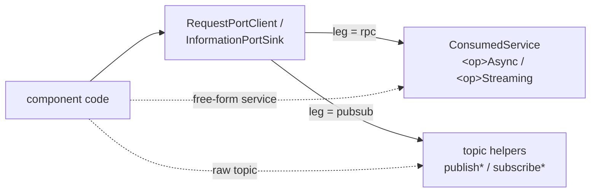

# Authoring C++ Components Against Generated PYRAMID Bindings

This guide is the reference for writing a C++ component on top of the PYRAMID
generated service bindings. It is the companion to
[`generated_bindings.md`](generated_bindings.md) and uses the
**service-binding facade** emitted alongside the low-level binding
(`*_components.hpp`).

If you only need the low-level invoke/dispatch/encode/decode primitives — for
custom transports, codec dispatch tests, or framework code — read the binding
guide instead. This page is for application authors writing components.

## What the generator emits

For each `pyramid.components.<name>.services.{provided,consumed}` proto, the
generator produces two layers under `${binaryDir}/generated/pyramid_cpp_bindings/`:

| Artifact | Surface | Use |
|----------|---------|-----|
| `<prefix>.{hpp,cpp}` | `ServiceHandler`, `invoke*`, `dispatch`, `encode*`, `decode*` | Low-level. Transports, codec round-trip tests. |
| `<prefix>_components.hpp` | `ProvidedHandler`, `ProvidedService`, `ConsumedService`, `Result<T>`, `StreamHandle` | Service bindings you attach to your own `pcl::Component`. |

`ProvidedService` and `ConsumedService` are **bindings**, not components. A
PYRAMID component is a deployable unit that may host several services. You
write a `pcl::Component` subclass and compose one binding per proto as a
member; that lets a single deployable component own (for example) the
provided side of Tactical Objects and the consumed side of Sensor Data
Interpretation in the same class.

## The pieces you write against

### `ProvidedHandler` — typed callbacks

Subclass and override `on<Op>` methods. There is one method per RPC, with
typed request and reply.

- Unary RPC `Op(Req) returns (Reply)` → `Reply onOp(const Req&)`.
- Server-streaming RPC `Op(Req) returns (stream Item)` →
  `void onOp(const Req&, StreamWriter<Item> writer)`.

For streaming RPCs the handler is handed a typed `StreamWriter<Item>` it can
keep and pump frames into over time:

- `writer.send(frame)` — emit one typed frame on the wire.
- `writer.end(status = PCL_OK)` — close (or abort) the stream. Idempotent.
- `writer.cancelled()` — true if the client has asked to cancel; servers
  emitting long streams should poll this and stop.
- Dropping the writer without calling `end()` aborts the stream with
  `PCL_ERR_STATE` (the destructor handles this for you).

The writer is move-only; capture it into a per-stream state if you need to
emit across tick boundaries.

```cpp
class InterestStore final : public svc::ProvidedHandler {
  Identifier onObjectOfInterestCreateRequirement(
      const ObjectInterestRequirement& r) override;

  void onObjectOfInterestReadRequirement(             // streaming RPC
      const Query& q,
      svc::StreamWriter<ObjectInterestRequirement> writer) override {
    for (auto& it : results_for(q)) {
      if (writer.cancelled()) break;
      writer.send(it);
    }
    writer.end();
  }

  Ack onObjectOfInterestDeleteRequirement(const Identifier&) override;
};
```

### `ProvidedService` — attach to your component

`ProvidedService` is a binding object. You declare it as a member of your
own `pcl::Component`, hand it the host component plus the executor plus the
handler at construction, then call `bind()` from `on_configure()` to install
the RPC ports on the host.

```cpp
class TacticalObjectsComponent : public pcl::Component {
public:
  TacticalObjectsComponent(pcl::Executor& exec, std::string content_type)
      : pcl::Component("tactical_objects"),
        tobj_provided_(*this, exec, store_, std::move(content_type)) {}

  pcl_status_t routeProvidedTo(std::string_view peer) {
    return tobj_provided_.routeAllRemote(peer);
  }

protected:
  pcl_status_t on_configure() override { return tobj_provided_.bind(); }

private:
  InterestStore store_;
  svc::ProvidedService tobj_provided_;
};
```

Two constructors are emitted, matching whichever ownership you prefer:

- `(pcl::Component&, pcl::Executor&, ProvidedHandler&, std::string content_type)` —
  caller owns the handler.
- `(pcl::Component&, pcl::Executor&, std::unique_ptr<ProvidedHandler>, std::string content_type)` —
  the binding takes ownership.

`bind()`:

- Validates the content type.
- Installs each RPC port (unary `addService` / streaming `addStreamService`)
  on the host component.
- Stores per-channel response-buffer state so dispatch is reentrant.

`routeAllLocal()` restricts every advertised RPC to callers in the same
executor/process. `routeAllRemote(peer)` restricts every advertised RPC to a
single named peer. `configureTransport(config_json)` accepts the same route
selection as the runtime transport layer:

```cpp
tobj_provided_.configureTransport(R"({"transport":"local"})");
tobj_provided_.configureTransport(R"({"transport":"remote","peer":"hmi"})");
```

`local` is not a plugin. It means "do not use a transport adapter for this
endpoint; let PCL dispatch through the local executor." Remote socket,
shared-memory, UDP, gRPC, and ROS2 transports are still loaded/configured at
startup with their own opaque `config_json`; the facade JSON above only selects
which generated endpoints use local or remote routing.

Stream-end handling is internal — you never call `pcl_stream_end` directly,
just `writer.end()` from your handler.

Composing several `ProvidedService` (or mixing provided and consumed) inside
one component is just adding more members and another `binding.bind()` call
in `on_configure`.

### `ConsumedService` — async-shaped typed client

`ConsumedService` is the client-side binding. Like `ProvidedService` it
attaches to your component and takes the executor; routing happens through
the executor's transport.

```cpp
class HmiClientComponent : public pcl::Component {
public:
  HmiClientComponent(pcl::Executor& exec, std::string content_type)
      : pcl::Component("hmi_client"),
        tobj_consumed_(*this, exec, std::move(content_type)) {}

  std::future<svc::Result<Identifier>>
  createRequirementAsync(const ObjectInterestRequirement& req) {
    return tobj_consumed_.objectOfInterestCreateRequirementAsync(req);
  }

  svc::StreamHandle
  streamReadRequirement(
      const Query& q,
      std::function<void(const ObjectInterestRequirement&)> on_frame,
      std::function<void(pcl_status_t)> on_end = {}) {
    return tobj_consumed_.objectOfInterestReadRequirementStreaming(
        q, std::move(on_frame), std::move(on_end));
  }

  pcl_status_t routeProvidedLocal() {
    return tobj_consumed_.configureTransport(R"({"transport":"local"})");
  }
  pcl_status_t routeProvidedDefault() {
    return tobj_consumed_.routeAllRemote();      // executor's default transport
  }
  pcl_status_t routeProvidedTo(std::string_view peer) {
    return tobj_consumed_.routeAllRemote(peer);  // named peer
  }

private:
  svc::ConsumedService tobj_consumed_;
};
```

The per-RPC API:

- **Unary RPC** → `<op>Async(req)` returns `std::future<Result<T>>`. The
  future resolves on the executor thread once the response trampoline runs;
  callers spin the executor (typically by ticking it from the main loop)
  until the future is ready.
- **Streaming RPC** → `<op>Streaming(req, on_frame, on_end)` returns a
  `StreamHandle`. Both callbacks fire on the executor thread and together
  cover the stream lifetime; there is no future-returning collected variant.
  Call `handle.cancel()` to stop receiving frames — subsequent on_frame
  callbacks are suppressed, the underlying stream context is cancelled, and
  `on_end` fires with `PCL_ERR_CANCELLED`.

`Result<T>` is a generated struct: `.status`, `.value`, `.ok()`. There is no
synchronous `Result<T> create(...)` form — every unary call is async-shaped
to make executor-thread coupling explicit.

### Generated pub/sub on the component facade

The component facade also owns generated topic wiring. For each generated topic
constant, it emits:

- `subscribe<Topic>(typed_callback)` — register a typed subscriber on the host
  component and retain callback state.
- `add<Topic>Publisher()` — create and retain a publisher port during
  `on_configure()`.
- `publish<Topic>(typed_payload)` — encode and publish through the retained
  port.
- `configurePubSubTransport(config_json)` — route created topic ports using the
  same local/remote JSON shape as services.

Example:

```cpp
pcl_status_t on_configure() override {
  if (auto rc = binding_.addObjectEvidencePublisher(); rc != PCL_OK) return rc;
  return binding_.configurePubSubTransport(R"({"transport":"local"})");
}

pcl_status_t publishEvidence(const ObjectDetail& detail) {
  return binding_.publishObjectEvidence(detail);
}
```

For local component-to-component pub/sub, put the publisher and subscriber
components on the same `pcl::Executor`, call
`configurePubSubTransport(R"({"transport":"local"})")` after the ports exist,
and do not set a transport adapter for that route. If the executor also has a
remote/default transport for other endpoints, the explicit local route prevents
generated topic publishes from taking the remote default.

### The interaction facade — realization-independent ports

For grammar-conforming ports (the 4-rpc Request shape and the 1-rpc
Information shape), the components header also emits a **transaction-shaped
facade** layered on the primitives above. It is emitted *alongside*
`ProvidedService`/`ConsumedService` and the topic helpers — those remain
generated, supported, and are what the facade composes internally; the
facade adds realization independence on top:



| Class | Role | API |
|-------|------|-----|
| `<Service>RequestPortClient` | consumer | `submit(command)` → `std::future<SubmitResult>`, `transitions(query, on_frame, on_end)` → `SubscriptionHandle` |
| `<Service>RequestPortHandler` / `<Service>RequestPortProvider` | provider | `on<Command>()` callbacks (no `onRead` — stream fan-out is facade-internal), `transitionWriter().send(t)` |
| `<Service>InformationPortSource` / `<Service>InformationPortSink` | provider / consumer | `publish(msg)` / `subscribe(on_msg)` |

Each is a binding you compose into your `pcl::Component` and `bind()` from
`on_configure()`, exactly like `ProvidedService`/`ConsumedService`. The
point of the facade is that **whether the interaction runs as RPC or as
pub/sub is per-port deployment configuration, not component code**. Generated
facades expose `deploymentDescriptor()`, which gives the deployment layer the
RPC and topic alternatives without making the application repeat endpoint
names or directions:

```text
port action_command_request rpc    mission_autonomy plugin.so {plugin config}
port action_information     pubsub mission_autonomy plugin.so {plugin config}
```

Under RPC the facade composes the `<op>Async`/`<op>Streaming`/dispatch
primitives; under pub/sub it composes the generated topic
publish/subscribe with client-side correlation filtering. The same
compiled component runs unmodified under either realization, and the
deployment layer installs mutually exclusive validated endpoint routes before
`bind()`. `configureInteractionBinding()` remains an override for an in-process
test that does not load endpoint routes.

This is the recommended surface for new components speaking a Request or
Information port. The full developer story — semantics (ack honesty, late
join, `one_shot`), deployment manifests, projectability, worked examples —
is in the
[pub/sub & interaction facade guide](../guides/pubsub_interaction_guide.md);
the design intent of the retired `rpc_pubsub_interchangeability_plan.md` is
summarised in
[`doc/plans/PYRAMID/README.md`](../../../../doc/plans/PYRAMID/README.md).
Free-form (non-grammar) services get no facade — use
`ProvidedService`/`ConsumedService` directly.

## Component transport configuration

Transport setup has two layers:

1. **Adapter setup** creates remote connectivity. Plugin transports take opaque
   `config_json` at load time, for example socket
   `{"role":"client","host":"127.0.0.1","port":19123,"executor":...}` or shared
   memory `{"bus_name":"mission","participant_id":"hmi","executor":...}`.
   The resulting transport vtable is installed with `executor.setTransport(...)`
   or `executor.registerTransport(peer, ...)`.
2. **Endpoint route setup** selects which generated endpoints use local or
   remote dispatch. Generated facades accept a small opaque JSON route config:

   | Config | Meaning |
   |--------|---------|
   | `{"transport":"local"}` | Same executor/process, no transport adapter. |
   | `{"transport":"remote"}` | Use the executor's default remote transport. |
   | `{"transport":"remote","peer":"hmi"}` | Use a named peer registered on the executor. |

Use local routes when the peer component is hosted in the same process. Use
remote routes only after the matching transport plugin/runtime has been loaded
and registered. Handler signatures and typed payload APIs are identical in both
cases.

## Single-threaded executor model

The recommended driving model is single-threaded: the main thread owns the
executor and drives it with `executor.spinOnce(timeout_ms)` in the
application's loop. All `pcl::Component` callbacks (lifecycle, subscribers,
service handlers) and all binding callbacks (unary trampolines, streaming
`on_frame` / `on_end`) run on that thread. Component-local state therefore
does not need atomics or other synchronization.

`pcl::SpinThread` exists for cases where you want a background drive thread
instead, and `pcl::await` / `pcl::awaitValue` block a non-executor thread on
a future; both belong to the multi-threaded pattern and are not needed for
the single-threaded showcase.

## PCL helpers used to wire it all together

```cpp
#include <pcl/shared_memory_participant.hpp>   // bus, executor, gateway
#include <pcl/spin_thread.hpp>                 // (optional) background spin
#include <pcl/await.hpp>                       // (optional) future + spin
```

| Helper | Replaces |
|--------|----------|
| `pcl::SharedMemoryParticipant{bus, id, with_gateway}` | `pcl_shared_memory_transport_create` + `executor.setTransport` + gateway configure/activate/add boilerplate |
| `pcl::SpinThread{executor}` | `std::thread` + atomic stop-flag + `spinOnce(10) + yield` loop |
| `pcl::await(executor, future, timeout)` / `pcl::awaitValue(...)` | Hand-rolled spin-and-wait on `std::atomic<bool>` |

## Full showcase

The canonical showcase is in `subprojects/PYRAMID/examples/cpp/`:

- `tobj_interest_store.{hpp,cpp}` — typed business logic
  (`ProvidedHandler` subclass).
- `tactical_objects_component.hpp` — hand-written `pcl::Component` that
  composes one `ProvidedService` binding plus the store.
- `hmi_client_component.hpp` — hand-written `pcl::Component` that composes
  one `ConsumedService` binding and exposes typed async accessors.
- `tobj_shared_memory_example.cpp` — bus bring-up, component wiring,
  single-threaded `spinOnce` loop, demonstration sequence.

The showcase exercises Create / Read (streaming, server-ended) / Read
(streaming, client-cancelled) / Delete with no `pcl_msg_t`, no codec
branching, no manual stream plumbing, no background thread, and no
`pcl::await`.

## Interaction facade showcase (`submit()`/`transitions()`)

For a grammar-conforming Request-shape contract, prefer the **interaction
facade** (`RequestPortClient`/`RequestPortProvider`) over the raw
`ProvidedService`/`ConsumedService` bindings above — it makes the RPC-vs-
pub/sub realization a deploy-time manifest choice instead of an
application-level one. See
[`examples/cpp/agra_interaction_facade_example.cpp`](../../examples/cpp/agra_interaction_facade_example.cpp):
one provider (`MaactionRequestPortProvider`) and one client
(`MaactionRequestPortClient`) built entirely from generated facade types
against the `pim/agra_example/` contract. This local-only example uses the
explicit binding override because it has no deployment file. The cross-process
P3 example under `examples/agra/p3_three_process` demonstrates per-port plugin,
plugin configuration, peer, and mode records. No RPC or pub/sub primitive is
named directly in component code. See the
[pub/sub & interaction facade guide](../guides/pubsub_interaction_guide.md)
for the full facade API (`submit()`, `transitions()`, `TransitionWriter`,
`InformationPort*`).

## When to drop down to the low-level surface

The component facade calls into the low-level `invoke*` / `dispatch` /
`encode*` / `decode*` helpers in `<prefix>.hpp`. Use those directly when:

- You need full control of `pcl_endpoint_route_t` per call.
- You're writing a transport adapter or codec round-trip test.
- You need to plug the binding into a custom executor lifecycle (e.g. another
  framework's event loop).

For everything else, prefer the binding facade — it owns the boilerplate.

## See also

- [pub/sub & interaction facade guide](../guides/pubsub_interaction_guide.md) — contract-driven pub/sub, the interaction facade, and realization selection at deploy time.
- [`generated_bindings.md`](generated_bindings.md) — binding architecture overview.
- [`pcl_pyramid_binding_generation_overview.md`](pcl_pyramid_binding_generation_overview.md) — short engineer-facing description of the binding layer.
- [`PYRAMID_COMPONENT_RESPONSIBILITIES.md`](PYRAMID_COMPONENT_RESPONSIBILITIES.md) — canonical component responsibilities from the technical standard.
