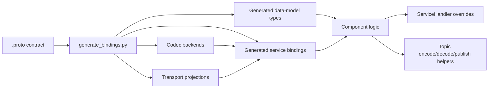
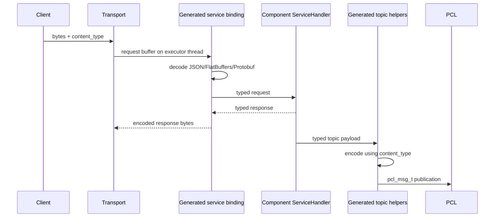

# PYRAMID Generated Bindings

## Purpose

This is the canonical v1 guide for PYRAMID proto schemas, generated bindings,
codec backends, and transport projections.

For a shorter engineer-facing overview of how the generated binding layer plugs
into PCL containers, executors, ports, and transport adapters, start with
[pcl_pyramid_binding_generation_overview.md](pcl_pyramid_binding_generation_overview.md).

For writing C++ components (`ProvidedHandler`, `ProvidedComponent`,
`ConsumedComponent`, `pcl::SharedMemoryParticipant`, async-shaped client API),
see [cpp_component_authoring.md](cpp_component_authoring.md).

Use this page when you need to:

- understand the binding architecture
- generate or regenerate bindings
- write a component against generated services/topics
- select JSON, FlatBuffers, or Protobuf at startup

For current Tactical Objects proof status and test coverage, use
[generated_bindings_status.md](../../../../doc/reports/PYRAMID/generated_bindings_status.md).

## V1 Decision

V1 uses the generated service binding as the stable component-facing facade.

Component code should use:

- generated data-model types from `.proto`
- generated service handler interfaces
- generated service `dispatch(...)` / `invoke*` helpers
- generated topic `encode*`, `decode*`, and `publish*` helpers
- generated `supportsContentType(...)` / `supportedContentTypes()`

Component code should not branch directly on JSON, FlatBuffers, or Protobuf
unless it is inside a generated binding/backend implementation or a narrowly
scoped compatibility harness.

Codec dispatch belongs inside the generated service binding layer. Do not add
standalone component-facing codec dispatch artifacts outside it.

## Quick Map

| Need | Use |
|------|-----|
| Contract source | `subprojects/PYRAMID/proto/**/*.proto` |
| Generator entry point | `subprojects/PYRAMID/pim/generate_bindings.py` |
| Build-local C++ artifact home | `${binaryDir}/generated/pyramid_cpp_bindings` |
| Build-local Ada artifact home | `${binaryDir}/generated/pyramid_ada_bindings` |
| C++ service facade | `${PYRAMID_CPP_BINDINGS_DIR}/pyramid_services_*_{provided,consumed}.{hpp,cpp}` |
| C++ data-model types | `${PYRAMID_CPP_BINDINGS_DIR}/pyramid_data_model_*_types.hpp` |
| C++ JSON codecs | `${PYRAMID_CPP_BINDINGS_DIR}/pyramid_data_model_*_codec.{hpp,cpp}` |
| C++ FlatBuffers codecs | `${PYRAMID_CPP_BINDINGS_DIR}/flatbuffers/cpp/*_flatbuffers_codec.*` |
| C++ Protobuf codecs | data-model stubs in `${PYRAMID_CPP_BINDINGS_DIR}/protobuf/cpp/*_protobuf_codec.*`; per-service codecs in `${PYRAMID_CPP_BINDINGS_DIR}/protobuf/cpp/pyramid_services_*_protobuf_codec.*` |
| C++ gRPC transport | `${PYRAMID_CPP_BINDINGS_DIR}/grpc/cpp/*_grpc_*` |
| C++ ROS2 transport | `${PYRAMID_CPP_BINDINGS_DIR}/ros2/cpp/*_ros2_*` |
| Ada service facade | `${PYRAMID_ADA_BINDINGS_DIR}/pyramid-services-*.ads/.adb` |
| Ada backend projections | `${PYRAMID_ADA_BINDINGS_DIR}/{flatbuffers,protobuf}/ada/*.ads` |
| ROS2 mapping rules | [ros2_transport_semantics.md](ros2_transport_semantics.md) |
| Interaction pattern conventions (pub/sub/RPC/action in `.proto`) | [pyramid_interaction_semantics.md](pyramid_interaction_semantics.md) |
| Tactical Objects status | [generated_bindings_status.md](../../../../doc/reports/PYRAMID/generated_bindings_status.md) |

## Target Shape



The `.proto` contract owns payload meaning. Codec and transport backends project
that contract; they do not redefine it.

## Runtime Flow



Component code lives at the `Handler` and typed-payload side of the diagram.
Generated bindings own the codec boundary.

## Source Of Truth

The downstream contract stack is:

1. MBSE / SysML model
2. generated `.proto`
3. generated language bindings, codecs, and transport projections

For all tooling below MBSE extraction, `.proto` is the canonical contract
artifact. No component should introduce a lower-level schema that competes with
the proto-derived types.

## Build-Local CMake Artifacts

The CMake build produces a build-local C++ binding tree so generated file names
do not have to be hardcoded in `CMakeLists.txt`.

By default, when `subprojects/PYRAMID/proto/` exists,
`PYRAMID_GENERATE_CPP_BINDINGS=ON`. Configure runs:

```bat
python subprojects\PYRAMID\pim\generate_bindings.py ^
  subprojects\PYRAMID\proto ^
  build\generated\pyramid_cpp_bindings ^
  --languages cpp ^
  --backends <enabled-backends>
```

The exact output directory is `PYRAMID_CPP_BINDINGS_DIR`, which defaults to
`${CMAKE_BINARY_DIR}/generated/pyramid_cpp_bindings`. Each preset therefore has
its own generated tree:

| Preset | Build-local binding directory |
|--------|-------------------------------|
| `default` | `build/generated/pyramid_cpp_bindings` |
| `all-on` | `build-all-enabled/generated/pyramid_cpp_bindings` |
| `all-off` | `build-all-off/generated/pyramid_cpp_bindings` |

After configure has seeded the directory, CMake uses glob patterns to discover
build-local generated files:

- generated service facade sources and headers
- data-model codec sources
- FlatBuffers schemas and codec sources
- generated gRPC transport sources

CMake also derives Protobuf/gRPC compiler outputs from globbed proto files.
The local-struct <-> protobuf service codecs are generated per service package
into `${PYRAMID_CPP_BINDINGS_DIR}/protobuf/cpp/pyramid_services_*_protobuf_codec.*`
(selected via the `protobuf_service_codecs` manifest role); ROS2 support is
likewise generated into the build-local binding tree.

The build graph then refreshes the local tree through the
`pyramid_cpp_bindings_codegen` stamp target whenever proto files or generator
Python files change. If a generator change adds or removes generated filenames,
rerun CMake configure so the globbed source lists are refreshed.

For a future component repository where the contract is delivered separately,
turn off local generation and point CMake at the delivered tree:

```bat
cmake -S . -B build ^
  -DPYRAMID_GENERATE_CPP_BINDINGS=OFF ^
  -DPYRAMID_CPP_BINDINGS_DIR=C:\path\to\delivered\pyramid_cpp_bindings
```

In that mode, CMake does not run `generate_bindings.py`; it globs the supplied
binding directory and fails early if required generated sources are missing.

## Regenerating Bindings

From the repository root:

```bat
python subprojects\PYRAMID\pim\generate_bindings.py ^
  subprojects\PYRAMID\proto ^
  build\generated\pyramid_cpp_bindings ^
  --languages cpp ^
  --backends json,flatbuffers
```

The generator can also emit Ada and other backend projections:

```bat
python subprojects\PYRAMID\pim\generate_bindings.py ^
  subprojects\PYRAMID\proto ^
  build\generated\pyramid_ada_bindings ^
  --languages ada ^
  --backends json,flatbuffers,protobuf
```

The backend registry is in:

- `pim/codec_backends.py`
- `pim/backends/`

Generated files are build artifacts materialized into build-local directories by
CMake. When changing a generator, reconfigure/rebuild so the build-local
artifacts are refreshed, then run the binding tests listed below.

## Content-Type Contract

The generated C++ service binding exposes public content-type metadata:

```cpp
constexpr const char* kJsonContentType = "application/json";
constexpr const char* kFlatBuffersContentType = "application/flatbuffers";
constexpr const char* kProtobufContentType = "application/protobuf";

bool supportsContentType(const char* content_type);
std::vector<const char*> supportedContentTypes();
```

Rules:

- `nullptr` means the JSON default.
- Content type is selected at startup or port creation.
- Service handlers and business logic receive typed values, not codec-specific
  payloads.
- A component may validate its configured `content_type` during `on_configure`.

## C++ Service Usage

Implement the generated handler interface. The generated method names are
proto-derived and include the service/entity name, so Tactical Objects
`object_of_interest.create_requirement` maps to
`handleObjectOfInterestCreateRequirement(...)`:

```cpp
namespace prov = pyramid::components::tactical_objects::services::provided;
namespace model = pyramid::domain_model;

class Handler : public prov::ServiceHandler {
public:
  model::Identifier handleObjectOfInterestCreateRequirement(
      const model::ObjectInterestRequirement& request) override {
    return request.base.id;
  }
};
```

Dispatch raw service ingress through the generated binding:

```cpp
void* response_buf = nullptr;
size_t response_size = 0;

prov::dispatch(handler,
               prov::ServiceChannel::ObjectOfInterestCreateRequirement,
               request->data,
               request->size,
               configured_content_type,
               &response_buf,
               &response_size);
```

Invoke provided services with typed requests:

```cpp
prov::invokeObjectOfInterestCreateRequirement(exec,
                                              request,
                                              response_callback,
                                              user_data,
                                              nullptr,
                                              configured_content_type);
```

The generated binding owns encode/decode. The application owns runtime state
and handler behavior.

### Worked C++ Component Example

The compiled showcase under `subprojects/PYRAMID/examples/cpp/` is the current
reference for a user-provided C++ service implementation. It uses the
higher-level **service-binding facade** (`ProvidedHandler`, `ProvidedService`,
`ConsumedService`) generated alongside the low-level surface, which owns the
`pcl_msg_t` callback boilerplate. See
[cpp_component_authoring.md](cpp_component_authoring.md) for the full
authoring guide.

The showcase pieces are:

- `tobj_interest_store.{hpp,cpp}` — typed business logic
  (`ProvidedHandler` subclass)
- `tactical_objects_component.hpp` — hand-written `pcl::Component` composing
  one `ProvidedService` binding plus the store
- `hmi_client_component.hpp` — hand-written `pcl::Component` composing one
  `ConsumedService` binding with typed async accessors
- `tobj_shared_memory_example.cpp` — shared-memory bus bring-up, component
  wiring, single-threaded `spinOnce` loop, demonstration sequence (including
  the shared-memory gateway container on the service-provider side)

Build and run it through the FlatBuffers-only preset:

```bat
cmake --preset flatbuffers-only
cmake --build --preset flatbuffers-only-release --target tobj_shared_memory_example
ctest --test-dir build-flatbuffers-only -R tobj_shared_memory_example --output-on-failure
```

When dropping below the facade (custom transports, framework code), the
low-level pattern is: dispatch raw ingress through generated `dispatch(...)`
and invoke with typed `invoke*` helpers, as shown earlier in this section.

## C++ Topic Usage

The generated service binding exposes typed topic helpers for every topic
visible to that service package. For MBSE-generated contracts these topics come
from `pyramid.options.pyramid_op` method options stamped by the MBSE proto
generator, with the port-grammar classifier retained as the fallback for older
or hand-written contracts. Generated manifests also record the corresponding
endpoint requirements (`endpoint_name`, endpoint kind, capability, QoS floor) so
transport routing can be validated from the contract.

For grammar-conforming Request/Information ports, prefer the **interaction
facade** over raw topic helpers: it presents one transaction-shaped API
(`submit()`/`transitions()`/`publish()`/`subscribe()`) whose RPC or pub/sub
realization is selected per leg at compose time — see the
[pub/sub & interaction facade guide](../guides/pubsub_interaction_guide.md).
The raw helpers below remain the primitives the facade composes, and the
direct surface for free-form contracts.

For Tactical Objects provided bindings:

```cpp
std::vector<model::ObjectMatch> matches = ...;
prov::publishEntityMatches(pub_port, matches, configured_content_type);
```

For cases where message storage must outlive the helper call, encode into
caller-owned storage and use the raw publish overload:

```cpp
std::string payload;
if (prov::encodeEntityMatches(matches, configured_content_type, &payload)) {
  prov::publishEntityMatches(pub_port, payload, configured_content_type);
}
```

Decode inbound topic messages through the generated binding:

```cpp
model::ObjectDetail detail;
if (cons::decodeObjectEvidence(msg, &detail)) {
  process(detail);
}
```

Important: PCL transports may forward `pcl_msg_t` data beyond the immediate
call stack. If a caller is publishing through a path that needs stable storage,
use the explicit `encode*` helper and keep the `std::string` alive in the
owning component.

## Standard Tactical Topics (legacy compatibility set)

| Topic | Direction in provided package | Payload |
|-------|-------------------------------|---------|
| `standard.entity_matches` | publish/subscribe helpers generated | `std::vector<ObjectMatch>` |
| `standard.evidence_requirements` | publish/subscribe helpers generated | `ObjectEvidenceRequirement` |
| `standard.object_evidence` | generated in consumed package | `ObjectDetail` |

The generated helpers live in both provided and consumed namespaces where the
topic is relevant, so components can use one facade consistently.

This topic set comes from a JSON side-table
(`pim/topic_metadata/tactical_objects_topics.json` via
`pim/standard_topics.py`) and is **frozen legacy compatibility**: do not add
new topics to it and do not use it for new contract trees. The generators
consult it only for the legacy
`pyramid.components.<component>.services.<provided|consumed>` compatibility
layout; MBSE/new-tree bindings use contract-derived topics (see
[pyramid_interaction_semantics.md](pyramid_interaction_semantics.md)).

## Codec Backends

Codec backends serialize typed generated values into the payload carried by
PCL or by a generated transport envelope. They do not choose the endpoint or
threading model.

| Backend | Content type | V1 status |
|---------|--------------|-----------|
| JSON | `application/json` | baseline active path |
| FlatBuffers | `application/flatbuffers` | active path |
| Protobuf | `application/protobuf` | active PCL path |
| ROS2 typed | `application/ros2` | active on the ROS2 path; generated `*_ros2_codec_plugin.cpp` registry codecs backed by `pyramid_ros2_codec.hpp`, built inside the ament package only (rclcpp/`pyramid_msgs` resolve there) |

Adding a codec means:

1. add or update a backend in `pim/backends/`
2. register it through the backend registry
3. make service bindings expose it through `supportsContentType`
4. add dispatch and topic encode/decode tests
5. regenerate and rebuild

## Transport Backends

Transport choice must not change handler signatures.

There are two transport categories:

- PCL runtime transports carry `pcl_msg_t` buffers whose payload codec is chosen
  by `content_type`.
- Generated transport bundles project the same proto service contract onto a
  middleware surface, such as gRPC or ROS2, while still handing business logic
  back through the generated facade and PCL executor.

| Transport option | Codec relationship | Current state |
|------------------|--------------------|---------------|
| PCL in-process | Uses generated JSON, FlatBuffers, or Protobuf payload helpers | Baseline active path |
| PCL socket | Uses generated JSON, FlatBuffers, or Protobuf payload helpers | Available PCL transport path |
| PCL UDP | Uses generated payload helpers for pub/sub traffic | Available pub/sub-oriented path |
| PCL shared memory | Uses generated payload helpers over shared-memory transport | Foundation present |
| gRPC bundle | Generated gRPC/protobuf service framing; selected with `--backends grpc`, not by runtime `content_type` alone | Generated C++ transport support and smoke/interop coverage |
| ROS2 bundle | Typed `pyramid_msgs` topic wire by default (`application/ros2` typed codec); envelope wire (opaque `content_type` + payload bytes) selectable as fallback and still used for array topics and unary/stream service framing | Generated Tactical Objects projection, C++ facade hooks, shared support layer, fake-adapter and `rclcpp` proofs incl. plain-rclcpp interop |

Transport code owns endpoint binding, routing, framing, and I/O thread handoff.
It must not own payload semantics or codec-specific handler interfaces.

ROS2 current-state summary:

- Implemented: generated Tactical Objects ROS2 transport projection, generated
  `bindRos2(...)` C++ hooks, generated Ada endpoint constants/specs, typed
  `pyramid_msgs` topic wire (the default, with plain-rclcpp interop proof),
  generic envelope support (selectable fallback; still carries array topics
  and service framing), direct `rclcpp` runtime adapter, pub/sub, unary
  service, streaming service, outbound publish, and executor-thread handoff
  tests.
- Not yet implemented: typed array-topic `.msg` wrappers, typed service
  framing (unary/stream services use the envelope-based
  `PclService`/`PclOpenStream`), ROS2 action mapping, Ada ROS2 runtime beyond
  generated constants/specs, and top-level plain-CMake integration for the
  ament package build.

For the canonical ROS2 naming, envelope, streaming, and threading rules, use
[ros2_transport_semantics.md](ros2_transport_semantics.md).

## Ada Policy

Ada public APIs remain typed and proto-native. Ada consumers link only PCL
and the generated C-ABI marshal layer (`to_c`/`from_c`/`_c_free` over the
frozen `pyramid_<T>_c` structs) — never wire-format code. All encoding is
done by the same cross-language codec plugin `.so`s C++ loads, selected by
`Content_Type` through the codec registry; gRPC and ROS2 are likewise loaded
transport plugins, not Ada-specific paths. See
[transport_codec_plugin_system.md](transport_codec_plugin_system.md) and
[sdk_packaging.md](sdk_packaging.md).

The Ada interaction facade (`<Service>_Submit_*`, `<Service>_Transitions`,
`<Service>_Configure_Interaction_Binding`) is declared but spec-only — bodies
raise `Program_Error` pending runtime dispatch; Ada components use the typed
`Invoke_*` / `Subscribe_*` / `Publish_*` primitives directly (see the
[pub/sub & interaction facade guide](../guides/pubsub_interaction_guide.md) §8).

## Compatibility-only shim surfaces

Every component-facing call goes through the single typed service facade. A
few lower-level shim symbols remain public for ABI/compatibility reasons;
they are **compatibility-only generated implementation details** and must not
be called from component business logic:

| Shim surface | Where it lives | Compatibility-only status |
|--------------|----------------|---------------------------|
| Ada `_Json` C-ABI export shim (`*_to_json` / `*_from_json` C exports used by the gRPC/binary transports) | generated gRPC/transport code | Kept as a generated ABI shim; the public Ada surface stays typed (`Invoke_*` with `Content_Type`). |
| `grpc_*` transport symbols — C++ `grpc_detail::*`, Ada `grpc_provided_*`, `Configure_Grpc`, `Grpc_Content_Type` | generated `*_grpc_transport.{hpp,cpp,ads}` | Owned entirely by the generated gRPC transport; selected via `Content_Type`, never invoked directly. |

**The typed facade is the copied example everywhere.** Component code calls the
generated top-level service procedure — C++ `provided::invoke*` / Ada
`Pyramid.Services.<...>.Provided.Invoke_*` — with `Content_Type` selecting the
codec/transport. gRPC is just a `Content_Type` value, not a separate API.

Enforcement (so the leaks cannot widen): `tests/test_binding_generation_dependencies.py`
(`check_facade_tests`) asserts the gRPC interop facade test is **absent** of
`_Json`, `grpc_provided_`, `Configure_Grpc`, and `Grpc_Content_Type`, and
present of the typed `Invoke_*` + `Content_Type` call shape;
`tests/test_codegen_export_surface.py` pins the externally consumed generator
surface. Any new component example must copy the typed facade, not these shims.

## StandardBridge Usage Pattern

`tactical_objects_app` uses `StandardBridge` as the live production proof for
the Tactical Objects standard interface.

The bridge should:

- validate the configured `content_type` with generated metadata
- register all services/topics with the same configured content type
- dispatch service ingress through generated `dispatch(...)`
- use generated `encode*`, `decode*`, and `publish*` helpers for topics
- keep caller-owned payload storage alive where PCL publication requires it

The bridge should not include codec headers directly or implement per-codec
JSON/FlatBuffers/Protobuf branches.

## Tests

Build the active app/client path:

```bat
cmake --build build --config Release --target tactical_objects_app -j8
cmake --build build --config Release --target tactical_objects_test_client -j8
cmake --build build --config Release --target test_pcl_proto_bindings -j8
```

Run focused generated-binding coverage:

```bat
ctest --test-dir build -C Release -R "ProtoBindings" --output-on-failure
```

Run the broader binding/codec/Tactical Objects E2E set:

```bat
ctest --test-dir build -C Release -R "(ProtoBindings|CodecDispatch|TacticalObjectsE2E|tobj_cpp_bridge|tobj_cpp_app)" --output-on-failure
```
