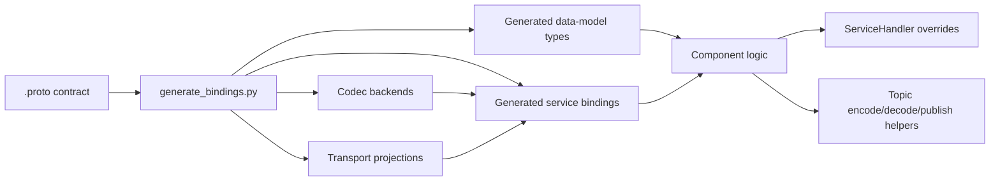
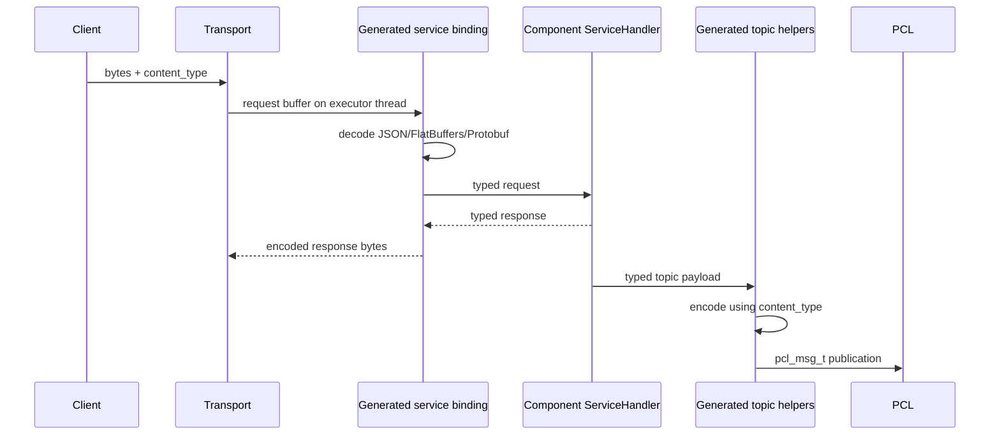

# PYRAMID Generated Bindings

## Purpose

This is the canonical v1 guide for PYRAMID proto schemas, generated bindings,
codec backends, and transport projections.

For a shorter engineer-facing overview of how the generated binding layer plugs
into PCL containers, executors, ports, and transport adapters, start with
[pcl_pyramid_binding_generation_overview.md](pcl_pyramid_binding_generation_overview.md).

Use this page when you need to:

- understand the binding architecture
- generate or regenerate bindings
- write a component against generated services/topics
- select JSON, FlatBuffers, or Protobuf at startup

For current Tactical Objects proof status and test coverage, use
[generated_bindings_status.md](../../../../doc/reports/PYRAMID/generated_bindings_status.md).

## V1 Decision

V1 uses the generated service binding as the stable component-facing facade.

Component code should use:

- generated data-model types from `.proto`
- generated service handler interfaces
- generated service `dispatch(...)` / `invoke*` helpers
- generated topic `encode*`, `decode*`, and `publish*` helpers
- generated `supportsContentType(...)` / `supportedContentTypes()`

Component code should not branch directly on JSON, FlatBuffers, or Protobuf
unless it is inside a generated binding/backend implementation or a narrowly
scoped compatibility harness.

The previous standalone data-model codec dispatch artifacts under
`examples/dispatch/*_codec_dispatch.*` were removed during v1 cleanup. Do not
reintroduce that path for component-facing use; codec dispatch belongs inside
the generated service binding layer.

## Quick Map

| Need | Use |
|------|-----|
| Contract source | `subprojects/PYRAMID/proto/**/*.proto` |
| Generator entry point | `subprojects/PYRAMID/pim/generate_bindings.py` |
| Generated artifact home | `subprojects/PYRAMID/bindings/` |
| Build-local C++ artifact home | `${binaryDir}/generated/pyramid_cpp_bindings` |
| C++ service facade | `bindings/cpp/generated/pyramid_services_*_{provided,consumed}.{hpp,cpp}` |
| C++ data-model types | `bindings/cpp/generated/pyramid_data_model_*_types.hpp` |
| C++ JSON codecs | `bindings/cpp/generated/pyramid_data_model_*_codec.{hpp,cpp}` |
| C++ FlatBuffers codecs | `bindings/cpp/generated/flatbuffers/cpp/*_flatbuffers_codec.*` |
| C++ Protobuf codecs | data-model stubs in `bindings/cpp/generated/protobuf/cpp/*_protobuf_codec.*`; tactical service shim in `bindings/protobuf/cpp/pyramid_services_tactical_objects_protobuf_*` |
| C++ gRPC transport | `bindings/cpp/generated/grpc/cpp/*_grpc_*` |
| C++ ROS2 transport | `bindings/cpp/generated/ros2/cpp/*_ros2_*` |
| Ada service facade | `bindings/ada/generated/pyramid-services-*.ads/.adb` |
| Ada transport projections | `bindings/ada/generated/{grpc,ros2}/ada/*.ads` |
| ROS2 mapping rules | [ros2_transport_semantics.md](ros2_transport_semantics.md) |
| Tactical Objects status | [generated_bindings_status.md](../../../../doc/reports/PYRAMID/generated_bindings_status.md) |
| Historical review | [review_pyramid_bindings_pluggability.md](../../../../doc/reviews/PYRAMID/review_pyramid_bindings_pluggability.md) |

## Target Shape



The `.proto` contract owns payload meaning. Codec and transport backends project
that contract; they do not redefine it.

## Runtime Flow



Component code lives at the `Handler` and typed-payload side of the diagram.
Generated bindings own the codec boundary.

## Source Of Truth

The downstream contract stack is:

1. MBSE / SysML model
2. generated `.proto`
3. generated language bindings, codecs, and transport projections

For all tooling below MBSE extraction, `.proto` is the canonical contract
artifact. No component should introduce a lower-level schema that competes with
the proto-derived types.

## Build-Local CMake Artifacts

The CMake build produces a build-local C++ binding tree so generated file names
do not have to be hardcoded in `CMakeLists.txt`.

By default, when `subprojects/PYRAMID/proto/` exists,
`PYRAMID_GENERATE_CPP_BINDINGS=ON`. Configure runs:

```bat
python subprojects\PYRAMID\pim\generate_bindings.py ^
  subprojects\PYRAMID\proto ^
  build\generated\pyramid_cpp_bindings ^
  --languages cpp ^
  --backends <enabled-backends>
```

The exact output directory is `PYRAMID_CPP_BINDINGS_DIR`, which defaults to
`${CMAKE_BINARY_DIR}/generated/pyramid_cpp_bindings`. Each preset therefore has
its own generated tree:

| Preset | Build-local binding directory |
|--------|-------------------------------|
| `default` | `build/generated/pyramid_cpp_bindings` |
| `all-on` | `build-all-enabled/generated/pyramid_cpp_bindings` |
| `all-off` | `build-all-off/generated/pyramid_cpp_bindings` |

After configure has seeded the directory, CMake uses glob patterns to discover
build-local generated files:

- generated service facade sources and headers
- data-model codec sources
- FlatBuffers schemas and codec sources
- generated gRPC transport sources

CMake also derives Protobuf/gRPC compiler outputs from globbed proto files, and
still globs supporting delivered binding sources under `subprojects/PYRAMID/bindings/`
for the Tactical Objects Protobuf shim, gRPC C shim, and ROS2 support layer.

The build graph then refreshes the local tree through the
`pyramid_cpp_bindings_codegen` stamp target whenever proto files or generator
Python files change. If a generator change adds or removes generated filenames,
rerun CMake configure so the globbed source lists are refreshed.

For a future component repository where the contract is delivered separately,
turn off local generation and point CMake at the delivered tree:

```bat
cmake -S . -B build ^
  -DPYRAMID_GENERATE_CPP_BINDINGS=OFF ^
  -DPYRAMID_CPP_BINDINGS_DIR=C:\path\to\delivered\pyramid_cpp_bindings
```

In that mode, CMake does not run `generate_bindings.py`; it globs the supplied
binding directory and fails early if required generated sources are missing.

## Regenerating Bindings

From the repository root:

```bat
python subprojects\PYRAMID\pim\generate_bindings.py ^
  subprojects\PYRAMID\proto ^
  subprojects\PYRAMID\bindings\cpp\generated ^
  --languages cpp ^
  --backends json,flatbuffers
```

The generator can also emit Ada and other backend projections:

```bat
python subprojects\PYRAMID\pim\generate_bindings.py ^
  subprojects\PYRAMID\proto ^
  subprojects\PYRAMID\bindings\ada\generated ^
  --languages ada ^
  --backends json,flatbuffers,protobuf,grpc
```

The backend registry is in:

- `pim/codec_backends.py`
- `pim/backends/`

Generated files are checked in for the current proving path and may also be
materialized into build-local directories by CMake. When changing a generator,
regenerate the affected checked-in outputs if the contract snapshot should
change, then reconfigure/rebuild so the build-local artifacts are refreshed and
run the binding tests listed below.

## Content-Type Contract

The generated C++ service binding exposes public content-type metadata:

```cpp
constexpr const char* kJsonContentType = "application/json";
constexpr const char* kFlatBuffersContentType = "application/flatbuffers";
constexpr const char* kProtobufContentType = "application/protobuf";

bool supportsContentType(const char* content_type);
std::vector<const char*> supportedContentTypes();
```

Rules:

- `nullptr` means the JSON default.
- Content type is selected at startup or port creation.
- Service handlers and business logic receive typed values, not codec-specific
  payloads.
- A component may validate its configured `content_type` during `on_configure`.

## C++ Service Usage

Implement the generated handler interface:

```cpp
namespace prov = pyramid::components::tactical_objects::services::provided;
namespace model = pyramid::domain_model;

class Handler : public prov::ServiceHandler {
public:
  model::Identifier handleCreateRequirement(
      const model::ObjectInterestRequirement& request) override {
    return request.base.id;
  }
};
```

Dispatch raw service ingress through the generated binding:

```cpp
void* response_buf = nullptr;
size_t response_size = 0;

prov::dispatch(handler,
               prov::ServiceChannel::CreateRequirement,
               request->data,
               request->size,
               configured_content_type,
               &response_buf,
               &response_size);
```

Invoke provided services with typed requests:

```cpp
prov::invokeCreateRequirement(exec,
                              request,
                              response_callback,
                              user_data,
                              nullptr,
                              configured_content_type);
```

The generated binding owns encode/decode. The application owns runtime state
and handler behavior.

## C++ Topic Usage

The generated service binding exposes typed topic helpers for every standard
topic visible to that service package.

For Tactical Objects provided bindings:

```cpp
std::vector<model::ObjectMatch> matches = ...;
prov::publishEntityMatches(pub_port, matches, configured_content_type);
```

For cases where message storage must outlive the helper call, encode into
caller-owned storage and use the raw publish overload:

```cpp
std::string payload;
if (prov::encodeEntityMatches(matches, configured_content_type, &payload)) {
  prov::publishEntityMatches(pub_port, payload, configured_content_type);
}
```

Decode inbound topic messages through the generated binding:

```cpp
model::ObjectDetail detail;
if (cons::decodeObjectEvidence(msg, &detail)) {
  process(detail);
}
```

Important: PCL transports may forward `pcl_msg_t` data beyond the immediate
call stack. If a caller is publishing through a path that needs stable storage,
use the explicit `encode*` helper and keep the `std::string` alive in the
owning component.

## Standard Tactical Topics

| Topic | Direction in provided package | Payload |
|-------|-------------------------------|---------|
| `standard.entity_matches` | publish/subscribe helpers generated | `std::vector<ObjectMatch>` |
| `standard.evidence_requirements` | publish/subscribe helpers generated | `ObjectEvidenceRequirement` |
| `standard.object_evidence` | generated in consumed package | `ObjectDetail` |

The generated helpers live in both provided and consumed namespaces where the
topic is relevant, so components can use one facade consistently.

## Codec Backends

Codec backends serialize typed generated values into the payload carried by
PCL or by a generated transport envelope. They do not choose the endpoint or
threading model.

| Backend | Content type | V1 status |
|---------|--------------|-----------|
| JSON | `application/json` | baseline active path |
| FlatBuffers | `application/flatbuffers` | active path |
| Protobuf | `application/protobuf` | active PCL path |

Adding a codec means:

1. add or update a backend in `pim/backends/`
2. register it through the backend registry
3. make service bindings expose it through `supportsContentType`
4. add dispatch and topic encode/decode tests
5. regenerate and rebuild

## Transport Backends

Transport choice must not change handler signatures.

There are two transport categories:

- PCL runtime transports carry `pcl_msg_t` buffers whose payload codec is chosen
  by `content_type`.
- Generated transport bundles project the same proto service contract onto a
  middleware surface, such as gRPC or ROS2, while still handing business logic
  back through the generated facade and PCL executor.

| Transport option | Codec relationship | Current state |
|------------------|--------------------|---------------|
| PCL in-process | Uses generated JSON, FlatBuffers, or Protobuf payload helpers | Baseline active path |
| PCL socket | Uses generated JSON, FlatBuffers, or Protobuf payload helpers | Available PCL transport path |
| PCL UDP | Uses generated payload helpers for pub/sub traffic | Available pub/sub-oriented path |
| PCL shared memory | Uses generated payload helpers over shared-memory transport | Foundation present |
| gRPC bundle | Generated gRPC/protobuf service framing; selected with `--backends grpc`, not by runtime `content_type` alone | Generated C++ transport support and smoke/interop coverage |
| ROS2 bundle | ROS2 envelope carries `content_type` plus payload bytes, preserving codec selection inside the envelope | Generated Tactical Objects projection, C++ facade hooks, shared support layer, fake-adapter and `rclcpp` proofs |

Transport code owns endpoint binding, routing, framing, and I/O thread handoff.
It must not own payload semantics or codec-specific handler interfaces.

ROS2 current-state summary:

- Implemented: generated Tactical Objects ROS2 transport projection, generated
  `bindRos2(...)` C++ hooks, generated Ada endpoint constants/specs, generic
  envelope support, direct `rclcpp` runtime adapter, pub/sub, unary service,
  streaming service, outbound publish, and executor-thread handoff tests.
- Not yet implemented: ROS2 action mapping, Ada ROS2 runtime beyond generated
  constants/specs, and top-level plain-CMake integration for the ament package
  build.

For the canonical ROS2 naming, envelope, streaming, and threading rules, use
[ros2_transport_semantics.md](ros2_transport_semantics.md).

## Ada Policy

Ada public APIs remain typed and proto-native.

JSON should remain native at the Ada layer. FlatBuffers, Protobuf, and gRPC may
use generated C/C++ shims internally while the public Ada surface stays typed.
That is an implementation choice, not a contract exception.

## StandardBridge Usage Pattern

`tactical_objects_app` uses `StandardBridge` as the live production proof for
the Tactical Objects standard interface.

The bridge should:

- validate the configured `content_type` with generated metadata
- register all services/topics with the same configured content type
- dispatch service ingress through generated `dispatch(...)`
- use generated `encode*`, `decode*`, and `publish*` helpers for topics
- keep caller-owned payload storage alive where PCL publication requires it

The bridge should not include codec headers directly or implement per-codec
JSON/FlatBuffers/Protobuf branches.

## Tests

Build the active app/client path:

```bat
cmake --build build --config Release --target tactical_objects_app -j8
cmake --build build --config Release --target tactical_objects_test_client -j8
cmake --build build --config Release --target test_pcl_proto_bindings -j8
```

Run focused generated-binding coverage:

```bat
ctest --test-dir build -C Release -R "ProtoBindings" --output-on-failure
```

Run the broader binding/codec/Tactical Objects E2E set:

```bat
ctest --test-dir build -C Release -R "(ProtoBindings|CodecDispatch|TacticalObjectsE2E|tobj_cpp_bridge|tobj_cpp_app)" --output-on-failure
```
