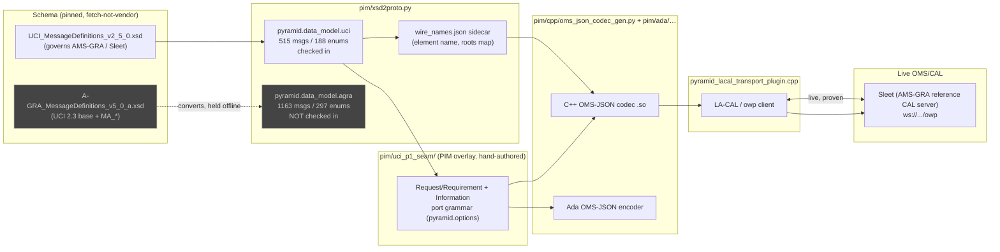

# OMS / AMS-GRA / A-GRA Compatibility

## Purpose

This page is the single, current-state answer to "how compatible is this
repo with OMS/CAL, AMS-GRA, and A-GRA?" It exists because that answer spans
several plans (`la_cal_integration_plan.md`, `uci_mms_conversion_plan.md`,
`kitty_hawk_pcl_consumer_plan.md`) and none of them alone gives the full
picture. Detailed design rationale stays in those plans and in
[`pim/test_harness/FINDINGS.md`](../../pim/test_harness/FINDINGS.md); this
page is the map, kept current as those plans progress.

Three terms, not interchangeable:

- **OMS / CAL** — the wire protocol (OMS JSON over a WebSocket "Language
  Agnostic CAL" server, OMSC-SPC-013). This repo speaks it via the LA-CAL
  transport plugin, against the reference CAL server implementation
  ("Sleet").
- **AMS-GRA** — the open-source reference implementation and demo stack
  (Kitty Hawk scenario: Supercell/JSBSim ground truth, Squall RF/IR sensor
  sim, `rf-fm-demod`/`ir-search-and-track` Skills, Sleet, Graupel/Worldview
  visualization). Runs UCI **2.5**.
- **A-GRA** — the formal compliance standard (UCI **2.3** base + ~123
  `MA_*` planning extensions, EXI/DMS wire encoding offboard, OMS/CAL
  onboard). A different, larger message set on a different schema drop.

## One-page status

| | UCI 2.5 / AMS-GRA (profile **P1**) | A-GRA 5.0a formal MMS (profile **P2**) |
|---|---|---|
| Schema conversion (`xsd2proto`) | **Done, checked in.** 515 messages, 188 enums, 6 roots (`pim/uci_generated/uci_2_5_0/`) | **Done, not checked in.** 1,163 messages, 297 enums, 18 roots — converts strict-clean but held back pending deliberate closure pruning (Phase 4) |
| OMS-JSON codec (C++) | **Done, live-proven** | Not generated — the P2 tree exists only as an offline conversion artifact |
| OMS-JSON codec (Ada) | **Done, object-compiles, byte-parity with C++** | Not attempted |
| Interaction facade (Request/Requirement + Information ports) | **Done, live-proven** (`pim/uci_p1_seam/`) | Not attempted |
| Validation tier ([D4](../../../../doc/plans/PYRAMID/uci_mms_conversion_plan.md#4-design-decisions-fixed-up-front)) | **(a)+(b)+(c)**: offline XSD shape, byte-equivalence golden, **live Sleet** | **(a) only**: offline XSD-instance validation — no live leg, no compliance claim |
| Live environment | **Persistent Kitty Hawk stack** (`external/ams-gra/`, podman), both the command seam and all four information topics decode real, physics-driven traffic | None |
| EXI/DMS, OMS/CAL onboard adapter, `agra_c2_bridge` | Out of scope everywhere | Out of scope everywhere — no compliance tasking exists |

**In one sentence:** this repo is a live, working OMS/CAL peer for the
UCI-2.5 AMS-GRA reference stack today; it has *not* attempted A-GRA formal
compliance, and the tooling that would scale to it (the XSD→proto
converter) is proven to work on the A-GRA drop but stops at the offline
conversion step by design.

## Pipeline and where each stage currently stands



Solid path (UCI 2.5 / P1) is live end to end against real Sleet inside the
persistent Kitty Hawk stack. The greyed A-GRA (P2) path converts cleanly
through `xsd2proto.py` and stops there — no codec, no facade, no live leg,
by design (Phase 4 of the conversion plan, unscheduled).

## What "live-proven" actually means today

Two harnesses, both re-run from a clean build as part of closing this out,
both green:

```
$ SLEET_URL=ws://<sleet> build_lacal_generated_seam_test.sh
PASS: generated UCI facade LA-CAL seam over Sleet

$ KITTYHAWK_SLEET_URL=ws://<sleet> build_kittyhawk_consumer_test.sh
PositionReport: PASS (11 valid samples)
ObservationMeasurementReport: PASS (3 valid samples)
ServiceStatus: PASS (rf-fm-demod=1 ir-search-and-track=1)
SignalReport: PASS (16 decoded samples)
PASS: Kitty Hawk generated-P1 consumer over Sleet
```

- The **command seam** (`ActionCommand`/`ActionCommandStatus`) is a full
  correlated Request/Requirement round trip: a PCL process publishes an
  `ActionCommand`, a PCL provider receives it and publishes `RECEIVED`/
  `ACCEPTED` status transitions, the original process observes both,
  correlated by `CommandID`.
- The **information topics** (`PositionReport`, `ObservationMeasurementReport`,
  `ServiceStatus`, `SignalReport`) are consumed from the *actual* Kitty
  Hawk simulation (Supercell/Squall/the two Skills) — not a fixture.
  `SignalReport` is scenario-intermittent (the pentagon flight pattern
  genuinely gains/loses RF lock) and is correctly treated as
  inconclusive-not-failing when zero arrive in a run, rather than a flake.
- Both run against the **XSD-converted P1 tree**
  (`pim/uci_generated/uci_2_5_0/` via the `pim/uci_p1_seam/` overlay), not
  a hand-authored stand-in. The hand-authored contract
  (`pim/uci_seam_example/`) and its codec (`pyramid_oms_json_codec_uci.cpp`)
  are retired to permanent golden fixtures — frozen, byte-equivalence
  witnesses only, never extended with new messages.

## Quirks a maintainer needs to know

These are load-bearing, non-obvious details the live proof above depended
on. Each was a real, silent failure mode before being understood.

### 1. `wire_names.json` is the *only* source of wire names — and it's a sidecar, not inline

The XSD converter deliberately does not guess wire names from proto field
names (a `snake_case` → `PascalCase` heuristic exists only as a fallback for
hand-authored contracts). Every field's real XSD element name lives in a
sidecar `wire_names.json` next to the generated `.proto` tree. **A proto
overlay that imports a generated data-model tree must also make that
tree's `wire_names.json` resolvable at the path the codec generator
expects** (directly beside the importing tree's own root, not nested under
`pyramid/data_model/`) — a wrong symlink target here fails *silently at the
wire level*: generation succeeds, compilation succeeds, and only a live
Sleet rejection (`schema validation failed: UnknownGlobalElement`) reveals
it, because the codec quietly falls back to using the raw type name as the
wire key instead of the real element name.

### 2. Root message *types* and XSD *elements* are not the same name

`xsd2proto.py` suffixes converted root message types with `MT` to record
the element→type indirection XSD extension composition requires
(`ActionCommand` the element → `ActionCommandMT` the type — see
[`pim/uci_generated/README.md`](../../pim/uci_generated/README.md)'s
"Root naming" row). `wire_names.json`'s `roots` map is the only place this
reverse mapping (type name → element name) is recorded; both the OMS-JSON
codec's outer wrapper key and the LA-CAL transport plugin's OWP `SUB`
message name must resolve through it, or Sleet's schema validator rejects
the frame by the type name instead of accepting it by the element name.

### 3. Thin service wrappers are unwrapped at two different layers, and the codec generator has to recognize *both* shapes

PYRAMID's port grammar wraps each UCI root in a small PIM-only oneof
message (`ActionCommand_Service_Request`, `PositionReport_Service_Information`,
etc.) that never appears on the wire — it exists to give the interaction
facade a typed Request/Requirement/Information port. The codec generator
detects these wrappers and emits encode/decode dispatch cases that unwrap
straight to the bare UCI root JSON key. It originally only recognized the
two-variant **command** wrapper shape
(`oneof { CommandType a=1; StatusType b=2; }`); the one-variant
**information** wrapper shape this repo's four PUBLISH-pattern topics use
(`oneof payload { XMT x=1; }`) needed the same detection generalized to
single-variant wrappers (`_resolve_wrappers()` in
`pim/cpp/oms_json_codec_gen.py`). Missing this shape fails **silently**:
decode falls through every dispatch case to `PCL_ERR_NOT_FOUND`, the
generated facade's trampoline just doesn't invoke the user callback — no
exception, no log, the subscription looks perfectly healthy and simply
never delivers anything.

### 4. Port-grammar helper types can't reopen a checked-in generated package

`Ack`, `Identifier`, and `Query` are PIM port-grammar plumbing, not XSD
content, so they don't exist in the converted tree. Adding them by
reopening the checked-in tree's own `pyramid.data_model.uci` package from
a second `.proto` file silently **clobbers** that package's generated C++
types header — the emitter keys one header per package *name*, not per
source file, so whichever file processes last wins and the other's types
vanish without a compile error (until something references them). The
fix used here: give the three helpers their own distinct package
(`pyramid.data_model.uci_port_grammar`) instead of reopening the checked-in
one.

### 5. The A-GRA (P2) drop is real, pinned, and converts clean — but has no live leg anywhere in this repo

`pim/uci_profiles/p2_agra_planning_core.json` and the pinned
`agra_5_0a` schema drop
([`pim/schemas/schema_manifest.json`](../../pim/schemas/schema_manifest.json))
are both checked in and `xsd2proto.py --check` is byte-stable against them
today. The generated P2 proto tree itself is deliberately **not** checked
in (Phase-4 closure-pruning gate — the raw closure balloons on hub types
like `ID_Type` and `ForeignKeyType`), and no codec, facade, or transport
work has been done against it. Redistribution posture for both XSD drops
is recorded as **fetch-not-vendor, unresolved** (a "Government Owned"
license marker upstream) — the raw XSDs are never checked in, only their
sha256 pins.

## Live infrastructure notes

The Kitty Hawk stack lives at `external/ams-gra/` (git-ignored, podman,
persistent local checkout) — see
[`ams_gra_starter_kit_bringup.md`](../guides/ams_gra_starter_kit_bringup.md)
for bring-up. Two operational gotchas worth knowing before debugging a
"why isn't my message arriving" symptom against it:

- **Sleet only scans `services.d.local/` at container startup.** Adding or
  editing a service registration (e.g. a new consumer's `.toml`) needs
  `podman-compose up -d --force-recreate sleet`, and that restart leaves
  the Squall OMS adapters (`squall-rf-oms-adapter`, `squall-ir-oms-adapter`)
  wedged emitting `owp publish error: Operation canceled` until an explicit
  `podman restart` — they don't reconnect on their own.
- **The top-level `include:`-based `getting-started/compose.yaml` can hang
  indefinitely** on at least one observed podman-compose version, with zero
  diagnostic output and no child process spawned. Bringing each
  sub-project's own `compose.yaml` up individually (`sleet/`, `supercell/`,
  `squall/`, `rf-fm-demod/`, `ir-search-and-track/`) avoids it and is the
  more reliable path when the combined form stalls.

## Where the detail lives

| Topic | Document |
|-------|----------|
| Full XSD→proto conversion design, profile ladder, phase-by-phase status | [`doc/plans/PYRAMID/uci_mms_conversion_plan.md`](../../../../doc/plans/PYRAMID/uci_mms_conversion_plan.md) |
| LA-CAL transport plugin design, `owp` protocol, QoS/reliability decisions | [`doc/plans/PYRAMID/la_cal_integration_plan.md`](../../../../doc/plans/PYRAMID/la_cal_integration_plan.md) |
| Kitty Hawk PCL-consumer proof design and exit gate | [`doc/plans/PYRAMID/kitty_hawk_pcl_consumer_plan.md`](../../../../doc/plans/PYRAMID/kitty_hawk_pcl_consumer_plan.md) |
| Dated live-run evidence, exact PASS output, bugs found and fixed | [`pim/test_harness/FINDINGS.md`](../../pim/test_harness/FINDINGS.md) |
| Converter internals, checked-in tree status, `wire_names.json` schema | [`pim/uci_generated/README.md`](../../pim/uci_generated/README.md) |
| Schema pinning, redistribution posture | [`pim/schemas/README.md`](../../pim/schemas/README.md) |
| Kitty Hawk stack bring-up, podman gotchas | [`ams_gra_starter_kit_bringup.md`](../guides/ams_gra_starter_kit_bringup.md) |
