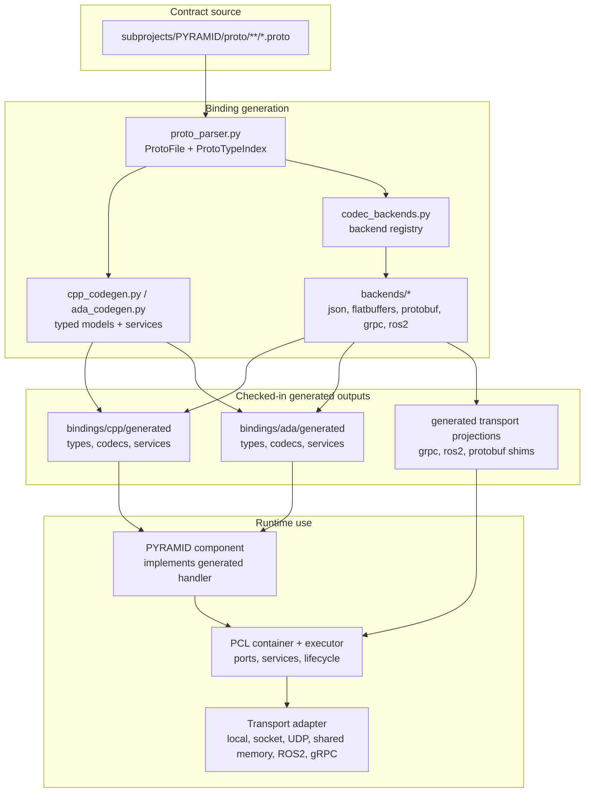
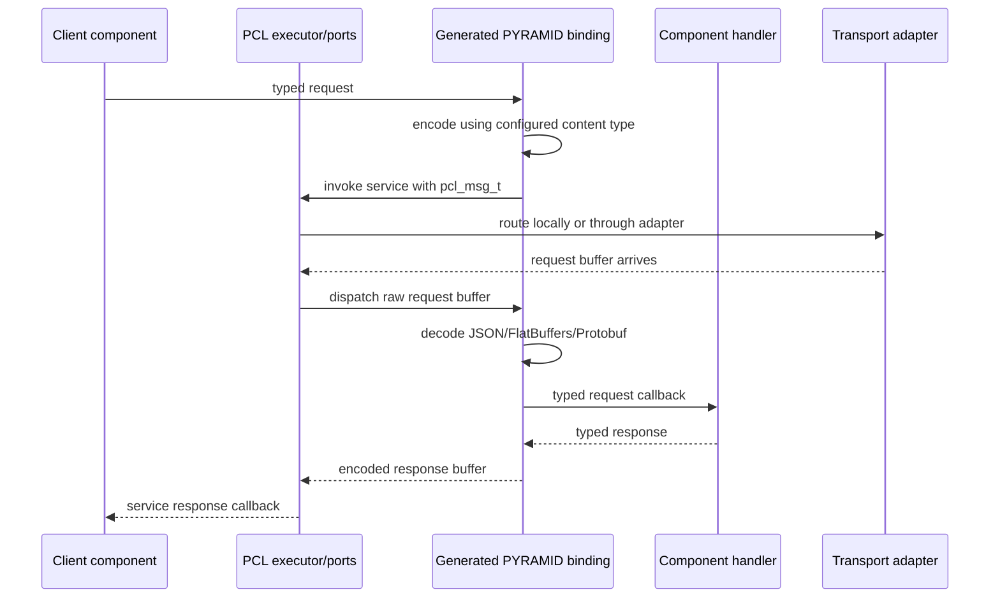
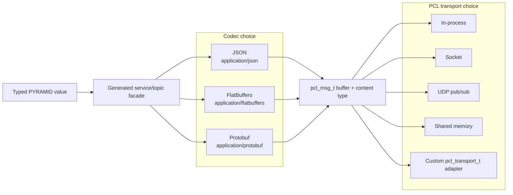
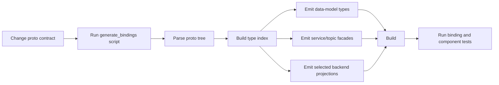
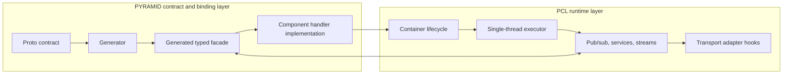

# PCL/PYRAMID Binding Generation Overview

## Purpose

This page is a short architectural overview for engineers who need to explain
how PYRAMID contracts become runnable PCL components.

The key idea is simple: PYRAMID owns the typed component contracts, the
generator turns those contracts into language and codec facades, and PCL moves
opaque messages and service calls through lifecycle-managed components. PCL does
not know the PYRAMID data model; generated PYRAMID bindings adapt typed
component code to the generic PCL runtime.

For detailed binding usage and regeneration commands, see
[generated_bindings.md](generated_bindings.md).

## One Page Summary

| Layer | Owns | Does not own |
|-------|------|--------------|
| PYRAMID proto contracts | Message, service, topic, and package meaning | Runtime scheduling or transport threads |
| Binding generator | C++/Ada typed facades, codecs, and transport projections | Component business state |
| Generated bindings | Decode/encode, typed handler interfaces, content-type selection | Mission logic or tactical-object state |
| PCL | Lifecycle, executor, ports, service routing, transport adapter hooks | PYRAMID schemas or codec semantics |
| Components | Business behavior behind generated handler APIs | Wire-format branching in normal paths |

Component authors should normally work with generated typed APIs. The generated
facade is the boundary where JSON, FlatBuffers, Protobuf, gRPC, ROS2, and PCL
message buffers meet.

## Architectural Shape



The `.proto` files are the source of truth below any upstream MBSE/SysML
process. The generated files are checked in because they are part of the current
component-facing contract and are consumed by production code, examples, and
tests.

## Runtime Boundary

At runtime, PCL carries messages and service requests as generic buffers. The
generated PYRAMID binding is what turns those buffers into typed values and back
again.



This is why handler signatures stay stable when the configured content type or
transport changes. Codec choice affects the generated binding boundary, not the
component's business logic.

## Transport And Codec Options

The architecture has two related but different extension points:

- **Codec selection** chooses how typed PYRAMID values are serialized into a
  payload buffer.
- **Transport selection** chooses how PCL routes that payload buffer between
  components, processes, machines, or middleware systems.

In the normal PCL path, these are intentionally separate. The same generated
service facade can encode a request as JSON, FlatBuffers, or Protobuf, then hand
the resulting `pcl_msg_t` to an in-process route, socket transport, UDP
transport, shared-memory transport, or another PCL transport adapter.



Generated gRPC and ROS2 support are different from the baseline PCL route: they
are transport projections generated from the same `.proto` contracts.

| Option | What is selected | Payload/codecs | Current role |
|--------|------------------|----------------|--------------|
| PCL local or adapter path | Runtime PCL ports plus `content_type` | JSON, FlatBuffers, or Protobuf through generated facade helpers | Main component-facing path and easiest path for tests, simulation, and embedded composition |
| PCL socket/UDP/shared memory | Runtime PCL transport implementation plus `content_type` | Same generated payload codecs as the local path | PCL-owned transport paths for process or host boundaries; UDP is pub/sub-oriented |
| gRPC bundle | Generated gRPC projection from `--backends grpc` | gRPC/protobuf service framing, bridged onto the generated service facade and PCL executor | Use when an external peer expects gRPC service APIs |
| ROS2 bundle | Generated ROS2 facade hooks and support layer from `--backends ros2` | ROS2 envelopes carry `content_type` plus payload bytes, so JSON/FlatBuffers/Protobuf can remain codec choices | Use when the component surface needs ROS2 topic/service/stream naming and executor-thread handoff |

The component handler should not change across these options. It receives typed
requests and returns typed responses; generated code owns the buffer and
transport boundary.

## ROS2 Current State

The ROS2 path is covered in detail by
[ros2_transport_semantics.md](ros2_transport_semantics.md). In short, ROS2 is
currently a generated transport projection plus shared support layer, not a
replacement for PCL.

The mapping is:

- PCL topics become ROS2 topics under `/pyramid/topic/...`.
- PCL unary services become ROS2 services under `/pyramid/service/...`.
- PCL streaming services become an `open` service plus correlated `frames` and
  `cancel` topics under `/pyramid/stream/...`.
- Every ROS2 envelope carries `content_type`, `correlation_id`, `payload`,
  `end_of_stream`, and `status`.
- ROS2 callback threads hand work back to the PCL executor before business logic
  runs.

Implemented today:

- generated Tactical Objects ROS2 transport projection
- generated `bindRos2(...)` C++ facade hooks
- generated Ada ROS2 endpoint constants/specs
- generic `pyramid_ros2_transport` envelope package
- direct `rclcpp` runtime adapter
- standalone fake-adapter and `rclcpp` runtime proofs for pub/sub, unary
  service, streaming service, and outbound publish
- tests that assert executor-thread handoff for business logic

Not yet implemented:

- ROS2 action mapping
- Ada ROS2 runtime beyond generated constants/specs
- top-level plain-CMake integration for the ament package build

## Generation Pipeline

The normal entry points are:

- `subprojects/PYRAMID/scripts/generate_bindings.bat`
- `subprojects/PYRAMID/scripts/generate_bindings.sh`
- `subprojects/PYRAMID/pim/generate_bindings.py`

The wrapper scripts generate C++ and Ada by default, with JSON and FlatBuffers
enabled by default. The Python entry point can select languages and backends
directly.



The generator intentionally avoids hardcoded knowledge of Tactical Objects or
other individual services. It works from the parsed proto tree and backend
registry.

## Build-Local CMake Artifacts

CMake produces build-local C++ binding artifacts before it defines targets that
compile generated sources. With the default monorepo settings,
`PYRAMID_GENERATE_CPP_BINDINGS=ON` and configure runs the generator into:

- `build/generated/pyramid_cpp_bindings` for the `default` preset
- `build-all-enabled/generated/pyramid_cpp_bindings` for `all-on`
- `build-all-off/generated/pyramid_cpp_bindings` for `all-off`

The generated directory is controlled by `PYRAMID_CPP_BINDINGS_DIR`. CMake then
globs that directory for generated service facades, data-model codecs,
FlatBuffers schemas/codecs, and generated gRPC transport projections. It also
globs supporting delivered generated sources under `subprojects/PYRAMID/bindings/`
for the Tactical Objects Protobuf shim, gRPC C shim, and ROS2 support layer.
The `pyramid_cpp_bindings_codegen` target owns the build-time refresh and
reruns the generator when proto or generator inputs change.

For repositories that receive PYRAMID contracts separately, configure with
`PYRAMID_GENERATE_CPP_BINDINGS=OFF` and set `PYRAMID_CPP_BINDINGS_DIR` to the
delivered generated C++ binding tree. In that mode the build consumes the
delivered artifacts directly.

## What Gets Generated

| Output | Role |
|--------|------|
| `bindings/cpp/generated/pyramid_data_model_*_types.hpp` | C++ data-model structs and enums |
| `bindings/cpp/generated/pyramid_data_model_*_codec.*` | C++ JSON data-model codecs |
| `bindings/cpp/generated/pyramid_services_*_{provided,consumed}.*` | C++ typed service/topic facades |
| `bindings/cpp/generated/flatbuffers/cpp/*` | FlatBuffers backend projection |
| `bindings/cpp/generated/protobuf/cpp/*` | Protobuf backend projection stubs |
| `bindings/cpp/generated/grpc/cpp/*` | gRPC transport projection |
| `bindings/cpp/generated/ros2/cpp/*` | ROS2 transport projection |
| `bindings/ada/generated/pyramid-*.ads/.adb` | Ada data-model, codec, and service facades |
| `bindings/protobuf/cpp/*` | Tactical Objects Protobuf C++ shim used by the active PCL path |

The generated service facades are the important component-facing artifact. They
provide typed handlers, `dispatch(...)` helpers, client invocation helpers, topic
encode/decode/publish helpers, and content-type capability metadata.

## PCL And PYRAMID Responsibilities



PCL gives generated bindings a stable place to plug in:

- `pcl_container_t` owns lifecycle and component callbacks.
- `pcl_executor_t` serializes ingress and ticks components on the executor
  thread.
- `pcl_port_t` carries publications, service requests, service responses, and
  stream traffic.
- `pcl_transport_t` lets transport adapters move the same generic buffers across
  local, socket, UDP, shared-memory, ROS2, or gRPC boundaries.

PYRAMID generated bindings sit above this and supply the domain knowledge PCL
intentionally lacks.

## Adding Or Changing A Contract

1. Update the relevant `.proto` file under `subprojects/PYRAMID/proto/`.
2. Regenerate C++ and/or Ada bindings with the wrapper script.
3. Implement or update component handler code against the generated typed API.
4. Register PCL ports/services/topics in the component lifecycle setup.
5. Run focused generated-binding tests, then the affected component or transport
   tests.

Useful focused tests include:

```bat
ctest --test-dir build -C Release -R "ProtoBindings" --output-on-failure
ctest --test-dir build -C Release -R "(ProtoBindings|CodecDispatch|TacticalObjectsE2E|tobj_cpp_bridge|tobj_cpp_app)" --output-on-failure
```

## Design Rules To Keep In Mind

- Treat `.proto` as the contract source of truth for generator input.
- Keep component business logic on typed generated data-model values.
- Keep codec branching inside generated bindings or narrowly scoped tests.
- Keep PCL schema-neutral. It should move `pcl_msg_t` buffers, not understand
  PYRAMID message fields.
- Keep transport projections free of business semantics. Transports route,
  frame, and hand off work; generated facades own payload meaning.
- Regenerate checked-in outputs whenever generator behavior or proto contracts
  change.

## Key Files

| Area | Files |
|------|-------|
| PCL runtime API | `subprojects/PCL/include/pcl/pcl_container.h`, `subprojects/PCL/include/pcl/pcl_executor.h`, `subprojects/PCL/include/pcl/pcl_transport.h` |
| PCL architecture | `subprojects/PCL/doc/architecture/08-pcl-component-system.md`, `subprojects/PCL/doc/architecture/component_container_design.md` |
| PYRAMID contracts | `subprojects/PYRAMID/proto/` |
| Generator entry point | `subprojects/PYRAMID/pim/generate_bindings.py` |
| Generator parser/index | `subprojects/PYRAMID/pim/proto_parser.py` |
| Language emitters | `subprojects/PYRAMID/pim/cpp_codegen.py`, `subprojects/PYRAMID/pim/ada_codegen.py` |
| Backend registry | `subprojects/PYRAMID/pim/codec_backends.py`, `subprojects/PYRAMID/pim/backends/` |
| Generated outputs | `subprojects/PYRAMID/bindings/` |
| Detailed binding guide | `subprojects/PYRAMID/doc/architecture/generated_bindings.md` |
