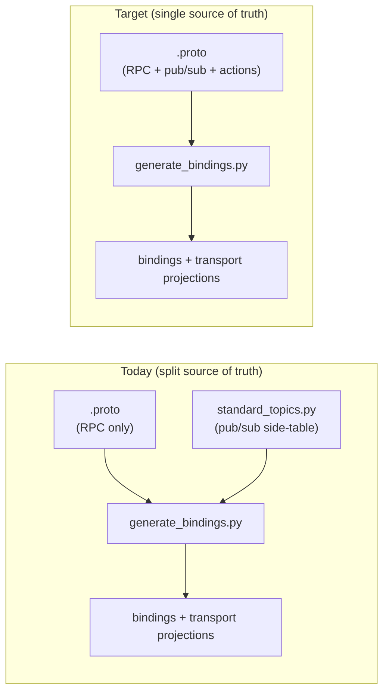

# PYRAMID Interaction Semantics

This page defines how interaction patterns — publish, subscribe, unary RPC,
server-streaming RPC, and (future) actions — are expressed **inside the
`.proto` contract**, so that every transport projection (PCL, gRPC, ROS2, …)
can derive the full interaction surface from one source of truth.

It is the design reference for the contract convention; the parser
(`pim/proto_parser.py`), the generator (`pim/cpp_codegen.py`,
`pim/ada_codegen.py`), and the transport projections
([generated_bindings.md](generated_bindings.md),
[ros2_transport_semantics.md](ros2_transport_semantics.md)) implement it.

## The Problem

Today the contract carries only **half** of the interaction surface:

- **RPC is in the contract.** Each `rpc` is parsed in `proto_parser.py` and
  classified purely by signature: the `stream` keyword on the request/response
  sets `client_streaming` / `server_streaming`. Unary vs server-streaming is
  therefore already a *signature convention* derived from `.proto`.
- **Pub/sub is not in the contract.** Topics live in a hand-maintained Python
  side-table, `pim/standard_topics.py`. `topics_for_service()` decides a
  component's topics by substring-matching the package name
  (`if 'tactical_objects' not in pkg_lower: return {}, {}`). The generator reads
  pub/sub topics from that table, never from the `.proto`.

The consequence: transport projections faithfully reproduce whatever the
contract says, but the contract is **silent on topics**. So the heterogeneous
middleware mapping (the value of the ROS2 work) is driven for pub/sub by a
Python lookup table that must be edited per component, out of band from the
contract it is supposed to project.



## Design Principle

The `.proto` contract is the single source of truth for **payload meaning and
interaction pattern**. A transport projects the contract; it never redefines
the pattern and never carries pattern information the contract lacks.

Concretely, given only the `.proto`, the generator must be able to answer for
every operation: *is this publish, subscribe, unary, server-stream,
client-stream, bidi, or action — and on what topic, with what QoS?*

## Two-Layer Convention

Pattern is resolved in two layers. The signature layer keeps the common case
decoration-free; the annotation layer is authoritative and removes ambiguity.

### Layer 1 — signature convention (the default)

The signature shape sets the **inferred** pattern. This generalizes the rule
already in use for streaming and extends it to topics:

| request | response | inferred pattern |
|---------|----------|------------------|
| `T` (non-empty) | `U` (non-empty) | unary RPC |
| `T` | `stream U` | server-streaming RPC |
| `stream T` | `U` | client-streaming RPC |
| `stream T` | `stream U` | bidi RPC |
| `T` | `Empty` | **publish** |
| `Empty` | `stream T` | **subscribe** |

This is the `operation(type) -> Empty == publish` convention, made symmetric
with a `subscribe` shape. `google.protobuf.Empty` is already imported by the
service protos, so no new dependency is required for the convention itself.

### Layer 2 — method option (the source of truth)

Pure signature inference is ambiguous in exactly two places, both live in the
current contract:

- `rpc Foo(T) returns (Empty)` — a **publish**, or a **void unary command**
  (e.g. a delete that does not ack)? Identical shapes.
- `rpc Sub(Empty) returns (stream T)` — a **subscribe**, or a
  **server-streaming RPC** that happens to take no argument? Identical shapes.

So a proto custom option is the authoritative layer. It is the proto-idiomatic
mechanism (same pattern as `google.api.http` and gRPC's own method options),
it is machine-readable, and — critically — it carries the transport metadata
that a bare signature cannot: the **topic wire-name** and **QoS**.

```proto
// pyramid/options/pyramid.options.proto
syntax = "proto3";
package pyramid.options;
import "google/protobuf/descriptor.proto";

extend google.protobuf.MethodOptions {
  pyramid.options.Interaction pyramid_op = 50001;  // provisional field number
}

message Interaction {
  Pattern pattern = 1;   // overrides Layer-1 inference; INFER defers to signature
  string  topic   = 2;   // wire name for PUBLISH/SUBSCRIBE, e.g. "standard.entity_matches"
  Qos     qos     = 3;   // reliability / durability / history depth
}

enum Pattern {
  INFER         = 0;   // resolve from signature (Layer 1)
  UNARY         = 1;
  SERVER_STREAM = 2;
  CLIENT_STREAM = 3;
  BIDI          = 4;
  PUBLISH       = 5;
  SUBSCRIBE     = 6;
  ACTION        = 7;   // ROS2 goal / feedback / result (see below)
}

message Qos {
  Reliability reliability = 1;   // RELIABLE | BEST_EFFORT
  Durability  durability  = 2;   // VOLATILE | TRANSIENT_LOCAL
  uint32      depth       = 3;    // history depth; 0 = transport default
  enum Reliability { RELIABILITY_DEFAULT = 0; RELIABLE = 1; BEST_EFFORT = 2; }
  enum Durability  { DURABILITY_DEFAULT = 0; VOLATILE = 1; TRANSIENT_LOCAL = 2; }
}
```

Resolution rule: `pattern == INFER` (or no option) ⇒ use Layer 1; any other
value ⇒ use the option and ignore the inference. Where Layer 1 is ambiguous
(`-> Empty`, or `Empty -> stream`), the generator **requires** an explicit
option and fails the build otherwise, so an ambiguous shape can never silently
resolve the wrong way.

## Canonical Pattern Matrix

| Pattern | request | response | option needed? | topic? | notes |
|---------|---------|----------|----------------|--------|-------|
| Unary RPC | `T` | `U` | no | no | existing path |
| Void command | `T` | `Empty` | **yes** (`UNARY`) | no | else inferred as PUBLISH |
| Server-stream RPC | `T` | `stream U` | no | no | existing path |
| Client-stream RPC | `stream T` | `U` | no | no | |
| Bidi RPC | `stream T` | `stream U` | no | no | |
| Publish | `T` | `Empty` | recommended (`PUBLISH` + `topic`) | yes | topic name from option |
| Subscribe | `Empty` | `stream T` | recommended (`SUBSCRIBE` + `topic`) | yes | topic name from option |
| Action | goal | feedback + result | **yes** (`ACTION`) | n/a | ROS2 action mapping |

Worked examples:

```proto
service Object_Of_Interest_Service {
  // Unary — inferred, no option.
  rpc CreateRequirement(tactical.ObjectInterestRequirement)
      returns (base.Identifier);

  // Void command — Empty response is ambiguous, so annotate.
  rpc DeleteRequirement(base.Identifier) returns (google.protobuf.Empty) {
    option (pyramid.options.pyramid_op) = { pattern: UNARY };
  }
}

service Tactical_Objects_Topics {
  // Publish — topic name and QoS come from the contract, not standard_topics.py.
  rpc PublishObjectEvidence(tactical.ObjectDetail) returns (google.protobuf.Empty) {
    option (pyramid.options.pyramid_op) = {
      pattern: PUBLISH
      topic: "standard.object_evidence"
      qos: { reliability: RELIABLE durability: VOLATILE depth: 10 }
    };
  }

  // Subscribe — array payload via stream of the element type.
  rpc SubscribeEntityMatches(google.protobuf.Empty)
      returns (stream tactical.ObjectMatch) {
    option (pyramid.options.pyramid_op) = {
      pattern: SUBSCRIBE
      topic: "standard.entity_matches"
    };
  }
}
```

## Topic Modelling Notes

Pub/sub is many-to-many and decoupled, while an `rpc` lives inside a `service`
and reads as point-to-point. Two rules keep the contract honest:

- **Topic identity is the wire name, not the method.** The `topic` option is the
  identity that `PublishX` and `SubscribeX` (in different components / packages)
  share. Two methods with the same `topic` are the two ends of one topic. The
  method name remains the binding/codegen handle.
- **Array topics use streaming element types, not repeated wrappers.** Today
  `standard.entity_matches` is `std::vector<ObjectMatch>` via `is_array` in the
  topic spec. Under this convention an array topic is `stream ElementType` in
  the `SUBSCRIBE` shape, so the element type stays the canonical data-model
  message and the generator keeps emitting the vector payload helper.

## Migration: Retire `standard_topics.py`

Once topics are expressed in the contract, the Python side-table becomes
redundant and is removed. Migration in order:

1. **Add the options proto** (`pyramid/options/pyramid.options.proto`) and parse
   method options. The current rpc regex in `proto_parser.py` stops at the
   `returns(...)` clause and discards the trailing `{ option … }` body — extend
   it (or add a second pass over the method block) to capture the option, and
   add `pattern`, `topic`, and `qos` fields to `ProtoRpc`.
2. **Author topic methods** for each entry currently in
   `TACTICAL_OBJECTS_TOPIC_SPECS`, with `PUBLISH` / `SUBSCRIBE` and the existing
   wire names, preserving direction (`*_SUBSCRIBE_TOPICS` vs
   `*_PUBLISH_TOPICS`).
3. **Switch the generator** to derive `(sub_topics, pub_topics)` from parsed
   methods instead of `topics_for_service()`; keep the emitted
   `subscribe*` / `publish*` / `kTopic*` surface byte-for-byte so existing
   components and tests are unaffected.
4. **Delete `standard_topics.py`** and its imports in `cpp_codegen.py` /
   `ada_codegen.py` once the generated output matches the pre-migration
   snapshot.
5. **Regenerate and diff.** The checked-in bindings for the proving path
   (Tactical Objects) must be unchanged; that diff is the migration's
   correctness proof.

## Transport Projection Hooks

Each projection consumes the resolved pattern uniformly:

| Pattern | PCL | gRPC | ROS2 |
|---------|-----|------|------|
| Unary / void | service request/response | unary rpc | `srv/PclService` |
| Server-stream | streamed service | server-streaming rpc | open service + `frames` topic |
| Client-stream / bidi | (future) | native streaming rpc | (future) |
| Publish / subscribe | port pub/sub on topic wire-name | n/a (or wrapped) | `msg/PclEnvelope` on mapped topic |
| Action | (future) | n/a | ROS2 action (currently unimplemented) |

This closes two gaps called out in
[ros2_transport_semantics.md](ros2_transport_semantics.md): **QoS** now has a
contract home (`Interaction.qos`), and **actions** have a reserved pattern
(`ACTION`) so the projection has something concrete to map when the first
production user arrives.

## Status

| Item | State |
|------|-------|
| Convention defined (this doc) | proposed |
| Streaming inference (Layer 1, RPC subset) | already implemented in `proto_parser.py` |
| Topic inference (Layer 1, pub/sub) | not implemented |
| Method option (Layer 2) | not implemented |
| `standard_topics.py` retirement | not started |
| QoS / action projection | reserved, not implemented |

This is a design proposal. No generator or contract behavior changes until the
migration steps above are taken and the Tactical Objects binding snapshot is
shown unchanged.
