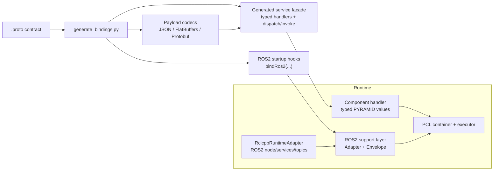
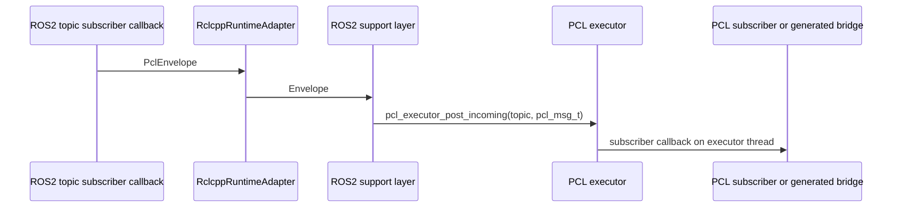
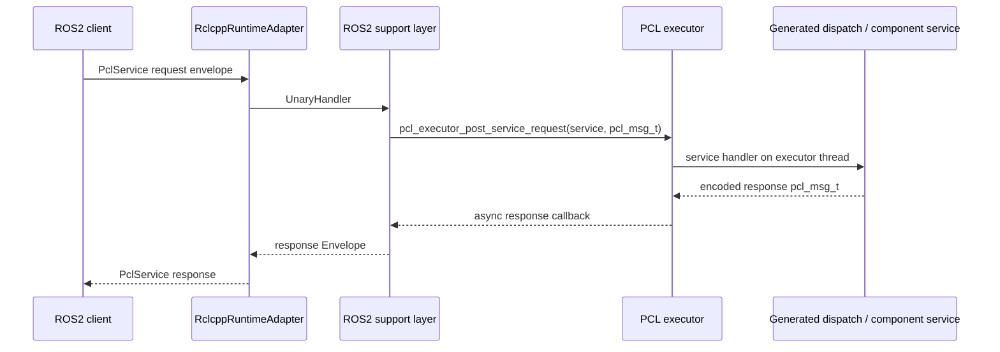
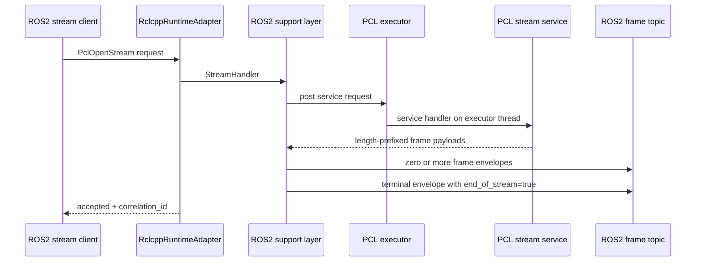

# ROS2 Transport Semantics

This page defines the canonical ROS2 mapping for PYRAMID/PCL transport
semantics.

It is the design reference for the generated `ros2` backend and the shared
support layer under `${PYRAMID_CPP_BINDINGS_DIR}/ros2/cpp`.

## Purpose

ROS2 does not match the full PCL surface one-to-one:

- PCL has opaque pub/sub messages with `content_type`
- PCL has unary service calls
- PCL has server-streaming service calls
- PCL requires business logic to run only on the executor thread

The ROS2 backend therefore needs both:

- straight generated bindings from canonical `.proto`
- an explicit semantic mapping for the parts that are transport-specific

## How ROS2 Fits

ROS2 is selected as a transport projection. It is not a payload codec.

The generated PYRAMID service facade still owns typed service/topic APIs and
payload encode/decode. ROS2 owns endpoint naming, envelope transport, ROS2
message/service creation, and handoff onto the PCL executor.



The generated binding layer is the bridge between typed component code and
PCL's generic buffers. The ROS2 support layer then transports those buffers
inside ROS2 envelopes.

## Selecting Transport And Codec

There are two choices to make:

1. Select the **transport projection** by enabling the `ros2` backend.
2. Select the **payload codec** by enabling and configuring JSON, FlatBuffers,
   or Protobuf.

With CMake, `PYRAMID_ENABLE_ROS2=ON` adds `ros2` to the C++ generator backend
list. `PYRAMID_ENABLE_FLATBUFFERS=ON` and `PYRAMID_ENABLE_PROTOBUF=ON` add
additional payload codecs. The `all-on` preset enables ROS2, FlatBuffers,
Protobuf, and gRPC together.

For direct generator use, include `ros2` alongside the payload codecs you want:

```bat
python subprojects\PYRAMID\pim\generate_bindings.py ^
  subprojects\PYRAMID\proto ^
  build\generated\pyramid_cpp_bindings ^
  --languages cpp ^
  --backends json,flatbuffers,protobuf,ros2
```

Important distinction:

- `application/json`, `application/flatbuffers`, and `application/protobuf`
  are payload content types carried inside PCL messages and ROS2 envelopes.
- `application/ros2` is the transport support layer's marker. It is not the
  payload format passed to generated service `dispatch(...)`.

At runtime, the envelope `content_type` must match the payload bytes. For
example, a ROS2 client sending Protobuf bytes sets
`content_type = "application/protobuf"`.

## Generated Binding Surface

When the service facade is generated with ROS2 enabled, it exposes a startup
hook for each service package:

```cpp
namespace provided = pyramid::components::tactical_objects::services::provided;

provided::bindRos2(adapter, executor);
```

That hook binds generated service and topic wire names to ROS2 routes by calling
support functions such as:

- `bindTopicIngress(adapter, executor, kTopic...)`
- `bindUnaryServiceIngress(adapter, executor, kSvc...)`
- `bindStreamServiceIngress(adapter, executor, kSvc...)`

Component code still uses the same generated typed APIs as the PCL path:

- implement the generated handler interface
- dispatch raw service ingress through generated `dispatch(...)`
- publish topics through generated `encode*` / `publish*` helpers
- invoke services through generated `invoke*` helpers
- validate payload codec with `supportsContentType(...)`

ROS2 therefore changes the external endpoint surface, not the component-facing
contract.

## Runtime Implementation Pieces

| Piece | Location | Role |
|-------|----------|------|
| Generated service facade | `${PYRAMID_CPP_BINDINGS_DIR}/pyramid_services_*_{provided,consumed}.*` | Typed handler APIs, codec dispatch, `bindRos2(...)` hooks |
| ROS2 support layer | `${PYRAMID_CPP_BINDINGS_DIR}/ros2/cpp/pyramid_ros2_transport_support.*` | Transport-neutral ROS2 binding model, envelope helpers, PCL executor handoff |
| ROS2 ament package | `subprojects/PYRAMID/ros2/` | `PclEnvelope`, `PclService`, `PclOpenStream`, and `RclcppRuntimeAdapter` |
| Runtime adapter | `subprojects/PYRAMID/ros2/include/pyramid_ros2_transport/rclcpp_runtime_adapter.hpp` | Implements the support-layer `Adapter` interface using `rclcpp` |
| Tests | `tests/test_ros2_transport_semantics.cpp`, `ros2/test/test_rclcpp_runtime_adapter.cpp` | Fake-adapter and real `rclcpp` proofs for naming, handoff, services, streams, and publishing |

The support layer defines a small abstract adapter:

```cpp
class Adapter {
 public:
  virtual void subscribe(const TopicBinding&, TopicHandler) = 0;
  virtual void advertise(const UnaryServiceBinding&, UnaryHandler) = 0;
  virtual void advertise(const StreamServiceBinding&, StreamHandler) = 0;
  virtual void publish(const TopicBinding&, const Envelope&) = 0;
};
```

Tests can use a fake adapter. Deployment uses `RclcppRuntimeAdapter`, which
creates the corresponding `rclcpp` subscriptions, publishers, and services.

## Canonical Naming

PCL names are normalized into lowercase ROS2 path segments.

Examples:

- PCL topic `standard.object_evidence`
  -> ROS2 topic `/pyramid/topic/standard/object_evidence`
- PCL unary service `object_of_interest.create_requirement`
  -> ROS2 service `/pyramid/service/object_of_interest/create_requirement`
- PCL streaming service `matching_objects.read_match`
  -> ROS2 open service `/pyramid/stream/matching_objects/read_match/open`
  -> ROS2 frame topic `/pyramid/stream/matching_objects/read_match/frames`
  -> ROS2 cancel topic `/pyramid/stream/matching_objects/read_match/cancel`

## Envelope Model

> **Fallback wire.** The envelope below is the *fallback* ROS2 wire model: a
> generic transport that carries opaque codec bytes. The *default* wire for
> topics is native ROS2 IDL — typed `pyramid_msgs` messages generated from
> the `.proto` contracts — so ROS2 tooling and non-PYRAMID nodes interoperate
> directly (see "Current Scope"). The envelope remains selectable via
> `RclcppRuntimeAdapter::Options::use_envelope_wire` and still carries array
> topics and the unary/stream service framing described in this section.

The shared support layer carries PCL payloads inside a transport envelope with:

- `content_type`
- `correlation_id`
- `payload`
- `end_of_stream`
- `status`

This keeps codec selection independent from ROS2 transport selection. The ROS2
transport carries JSON, FlatBuffers, or Protobuf bytes without changing the
handler surface.

The ROS2 package represents that envelope as:

| Field | Meaning |
|-------|---------|
| `content_type` | Payload codec, such as `application/protobuf` |
| `correlation_id` | Request/response or stream correlation key |
| `payload` | Serialized PYRAMID payload bytes |
| `end_of_stream` | Marks final stream frame |
| `status` | PCL status code projected across ROS2 |

Unary service requests and responses use the same fields. Streaming open
requests carry the request payload and return `accepted`, `status`, and the
stream `correlation_id`; frames then flow on the mapped frame topic.

## End-To-End Flows

### Topic Ingress



### Unary Service Ingress



### Streaming Service Ingress

ROS2 has no direct equivalent of PCL/gRPC server-streaming services, so stream
responses are projected as an open service plus frame topic:



### Outbound Publish

Generated component code can encode a typed topic payload with the selected
payload codec and then publish it through PCL. When the ROS2 adapter is the
outbound route, the support layer wraps the `pcl_msg_t` in a ROS2 envelope and
publishes it to the mapped ROS2 topic.

## Streaming Rule

ROS2 has no direct equivalent of PCL/gRPC server-streaming unary RPCs.

The canonical mapping is:

1. client calls the stream `open` service with the request envelope
2. server emits zero or more frame envelopes on the mapped `frames` topic
3. all frame envelopes carry the same `correlation_id`
4. the final envelope sets `end_of_stream = true`
5. clients may publish cancellation on the mapped `cancel` topic

The current `RclcppRuntimeAdapter` creates the cancel subscription and stops
emitting frames for a cancelled correlation ID. The standalone semantic tests
cover the open plus frames path; cancellation is represented in the runtime
adapter and should be covered more directly as the first production ROS2 user
is integrated.

## Threading Rule

ROS2 callback threads must never call PCL business logic directly.

Required handoff:

- inbound topic traffic posts through `pcl_executor_post_incoming(...)`
- inbound unary/stream-open service traffic posts through
  `pcl_executor_post_service_request(...)`
- outbound async responses are delivered back onto the executor thread before
  any business-logic callback runs

The generated ROS2 support layer and standalone tests enforce this rule.

## Typical Use

1. Generate the service facade with `ros2` and the desired payload codecs.
2. Implement component behavior against the generated typed service/topic APIs.
3. Configure PCL ports and services with the selected payload `content_type`.
4. Create a `pcl_executor_t` and add the configured component containers.
5. Create a ROS2 adapter:
   - fake `Adapter` in tests
   - `RclcppRuntimeAdapter` in ROS2 runtime deployments
6. Call the generated `bindRos2(adapter, executor)` hook for the service
   package.
7. Spin ROS2 and the PCL executor. ROS2 callbacks may run on ROS2 executor
   threads, but PCL business logic runs on the PCL executor thread.

Minimal shape:

```cpp
namespace provided = pyramid::components::tactical_objects::services::provided;

auto executor = pcl_executor_create();
// Create/configure/activate containers and add them to executor.

pyramid::transport::ros2::RclcppRuntimeAdapter adapter(node);
provided::bindRos2(adapter, executor);
```

The generated `bindRos2(...)` hook is package-specific. Tactical Objects
provided bindings, for example, bind standard topics plus the generated
Object-of-Interest and Matching-Objects service routes.

## Current Scope

Implemented:

- generated Tactical Objects ROS2 transport projection, with canonical name
  mapping for topics, unary services, and streaming services
- **typed `pyramid_msgs` wire (default for topics).** Native ROS2 IDL is
  generated from the contract: `pim/ros2_idl_codegen.py` emits the
  `pyramid_msgs` ament package (`.msg`/`.srv`), and
  `pim/ros2_marshal_codegen.py` emits the `domain_model` ↔ `pyramid_msgs`
  marshalling + `rclcpp` wire codec (round-trip verified). The
  `RclcppRuntimeAdapter` publishes/subscribes typed messages keyed by
  `TopicBinding::ros2_message_type`; a plain `rclcpp` peer that links only
  `pyramid_msgs` interoperates in both directions with no PYRAMID-specific
  framing (proven by `PlainRclcppPeerRoundTripsGeneratedTypedIdl`).
  `application/ros2` is a registry codec (generated `*_ros2_codec_plugin.cpp`
  targets, built inside the ament package).
- generic envelope package `pyramid_ros2_transport` (`msg/PclEnvelope`,
  `srv/PclService`, `srv/PclOpenStream`) — the selectable fallback wire
  (`RclcppRuntimeAdapter::Options::use_envelope_wire`), still carrying array
  topics and unary/stream service framing
- direct `rclcpp` runtime adapter
  (`ros2/include/pyramid_ros2_transport/rclcpp_runtime_adapter.hpp`), with
  runtime cancel subscription for stream correlation IDs and executor-thread
  handoff enforced by tests (fake-adapter and live `rclcpp` proofs cover
  pub/sub, unary, streaming, and outbound publish)
- **coupled ROS2 target plugin** (`libpyramid_ros2_coupled_plugin`, content
  type `application/ros2`): one MODULE `.so` exposing both a PCL transport
  vtable and a PCL codec vtable through the generic plugin loader, wrapping
  the `RclcppRuntimeAdapter` (rclcpp node + background spin thread). It is
  complete both ways: provided-side topic/service/stream advertising plus
  consumed `invoke_async` (unary) and `invoke_stream` (open-stream service +
  frame topic). Lifecycle is process-safe (refcounted rclcpp init/shutdown,
  `pcl_transport_plugin_teardown` before `dlclose`), and the ament build is
  reproducible from a fresh tree (`scripts/build_ros2_transport.sh`; no
  generated files committed). Verified by `test_ros2_coupled_plugin_load` and
  `test_rclcpp_runtime_adapter`.

Not yet implemented:

- **ROS2 action mapping** (`RPC_ACTION`); `.action` files are not generated
- **typed service framing and typed array topics.** Unary/stream services use
  the envelope-based `PclService`/`PclOpenStream`, and array topics use the
  envelope wire, so non-PCL nodes can consume typed topics but not PYRAMID
  services natively
- **remote-source dispatch for manifest-routed ROS2 ingress.** The generated
  ingress helpers (`bindTopicIngress`, `bindUnaryServiceIngress`,
  `bindStreamServiceIngress` in `pim/backends/ros2_backend.py`) post into the
  executor as a *local* source, and the plugin's private bind/advertise
  symbols carry no peer id, so a manifest *remote* route (e.g.
  `route standard.object_evidence subscriber ros2`) would drop routed remote
  ingress. The routing loader does not wire endpoints to these binds yet, so
  the path is latent rather than broken. Closing it requires threading a
  `peer_id` through the bind helpers and plugin ABI, posting via the
  `*_remote` executor APIs, and wiring the manifest routing flow to the
  binds. This is the ROS2 half of a cross-cutting gap — see
  [`transport_codec_plugin_system.md`](transport_codec_plugin_system.md)
  (§ "Known gap — manifest-routed remote ingress / peer identity").
- **staging the ROS2 plugin's shared runtime dependency.** The coupled plugin
  links the shared `libpyramid_ros2_transport_lib.so`, but
  `scripts/stage_plugin_deploy.sh` copies only the plugin `.so`, so a
  deployment assembled outside the colcon install tree cannot `dlopen` it.
  Fix: stage the runtime lib beside the plugin with an `$ORIGIN` rpath, or
  make the MODULE self-contained. Until then the coupled plugin is
  colcon/ament-only.
- Ada ROS2 runtime beyond generated constants/specs
- a top-level (non-ament) CMake target for the coupled plugin: rclcpp is only
  discoverable under ament, so the plugin is built via colcon inside the
  ament package (`scripts/build_ros2_transport.sh`) rather than the
  ament-free `pyramid_plugins` aggregate

## Deployment / runtime environment (dlopen-only clients)

A client that links only `pcl_core` and `dlopen()`s `libpyramid_ros2_coupled_plugin.so`
still needs the ROS2 runtime present and discoverable at run time — the plugin
bundles the adapter and typesupport, but not the rmw/DDS implementation or the
message typesupport libraries. Before launching such a client:

- **Source the ROS2 environment** (e.g. `source /opt/ros/humble/setup.bash`), or
  otherwise put the ROS2 `lib/` on `LD_LIBRARY_PATH` and the package on
  `AMENT_PREFIX_PATH`. Without this, plugin load fails (missing `librclcpp`,
  `librmw_implementation`) or service/subscription creation throws
  `invalid allocator` at runtime.
- **Expose the package install dir** from `scripts/build_ros2_transport.sh`
  (`build-ros2-ament/install/pyramid_ros2_transport`) on `AMENT_PREFIX_PATH` /
  `LD_LIBRARY_PATH` so the generated `PclEnvelope`/`PclService`/`PclOpenStream`
  typesupport `.so`s resolve.
- **Select an rmw** if the default is unavailable (`RMW_IMPLEMENTATION`), matching
  the one the package was built against.
- The plugin `.so` itself is found via the path passed to
  `pcl_plugin_load_transport`; only the ROS2 *runtime* deps come from the
  environment above.

Symptom map: `cannot open shared object librclcpp.so` → ROS2 not sourced;
`could not create subscription: invalid allocator` → typesupport/rmw libs not on
the runtime path (the package install dir is not on `AMENT_PREFIX_PATH`).

## AME Note

AME is the clearest in-repo ROS2 deployment example, but it does not yet expose
its external interface through canonical PYRAMID `.proto` contracts.

That means the new ROS2 semantic mapping can inform the AME Phase 6 transport
adapter immediately, but AME cannot yet consume the generated PYRAMID ROS2
bindings directly until its contract is canonicalized.
