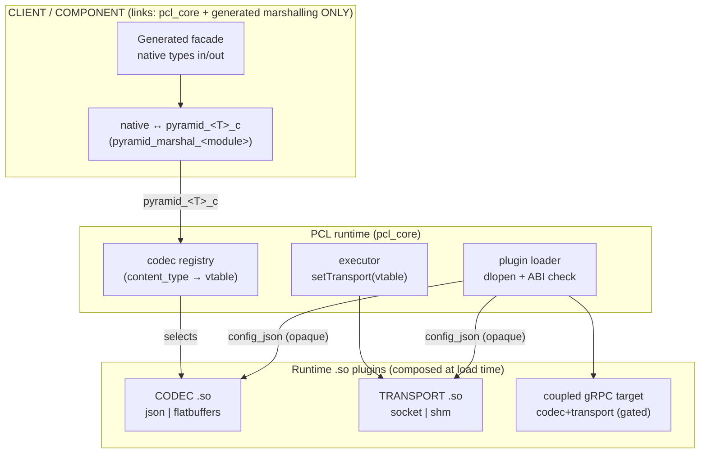
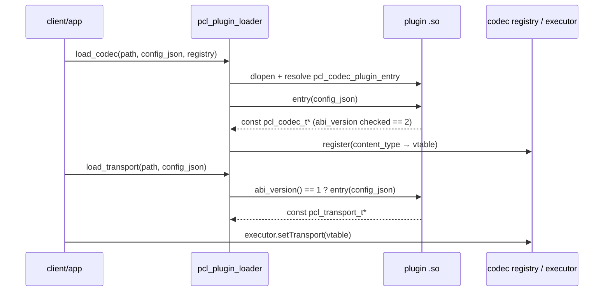
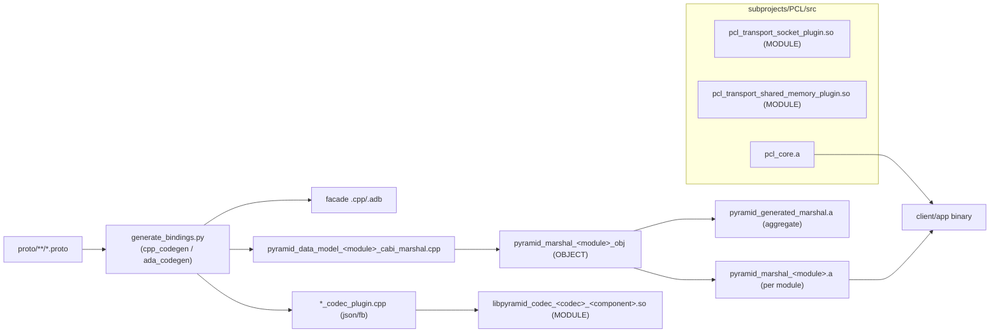
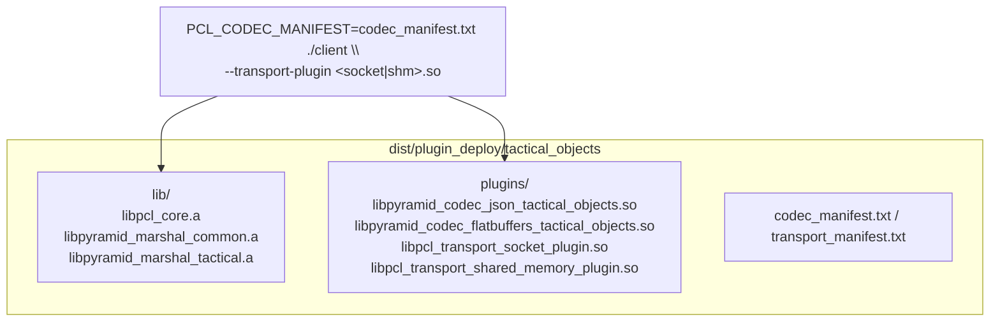

# Transport & Codec Plugin System

## Purpose

PYRAMID components and clients run against the generic PCL runtime through
**runtime-loaded plugins**. A client links only the framework (`pcl_core`) and
the generated contract (typed facade + native↔C-struct marshalling). Everything
on the wire — the **codec** (JSON / FlatBuffers, and the coupled gRPC target)
and the **transport** (socket, shared-memory) — arrives as a `.so` loaded and
composed at run time.

This isolates churn (a wire-format or transport change ships as a new plugin, not
a client rebuild), keeps client binaries minimal, and lets one cross-language
codec `.so` serve both C++ and Ada over a frozen C-ABI struct boundary.

See also [generated_bindings.md](generated_bindings.md),
[pcl_pyramid_binding_generation_overview.md](pcl_pyramid_binding_generation_overview.md),
and the v1 plan `doc/plans/PYRAMID/plugin_binding_v1_plan.md`.

## Runtime composition



Key properties:

- **Fail closed.** With no codec registered for a `content_type`, encode/decode
  return an error rather than falling back to a built-in codec (C++ today; Ada
  transport today — Ada codec fail-closed is the remaining v1 item).
- **Uniform config pass-through.** A client switch flows as an opaque
  `config_json` string through the loader into both codec and transport entry
  points (transport carries role/host/port/bus + the executor pointer).
- **One cross-language codec.** The codec consumes the frozen `pyramid_<T>_c`
  C struct, so the same `.so` is loaded from C++ and Ada.

## Code mechanism — ABI contracts

| Contract | Symbol | Signature | Header |
|----------|--------|-----------|--------|
| Codec | `pcl_codec_plugin_entry` | `const pcl_codec_t* (const char* config_json)` | `pcl/pcl_codec.h` (`PCL_CODEC_ABI_VERSION = 2`) |
| Transport | `pcl_transport_abi_version` + `pcl_transport_plugin_entry` | `uint32_t (void)` + `const pcl_transport_t* (const char* config_json)` | `pcl/pcl_plugin.h` (`PCL_TRANSPORT_ABI_VERSION = 1`) |
| Loader | `pcl_plugin_load_codec` / `pcl_plugin_load_transport` | `(path, config_json, …)` | `pcl/pcl_plugin_loader.h` |



The opaque `config_json` is stored and exposed to the codec via `codec_ctx`
(generated plugins) or consumed directly by the transport (e.g. the socket
plugin reads `{"role","host","port","executor"}`; shm reads
`{"bus_name","participant_id","executor"}`). Default-plugin auto-load is
config-driven: `pcl_codec_registry_load_plugins_from_manifest(registry, path)`
loads every codec listed in a manifest (transport entries are skipped).

## Build mechanism



- Codec plugins and transport plugins are CMake `MODULE` libraries (`.so`).
- Marshalling is compiled **once per data-model module** as an `OBJECT` library,
  exposed both as a standalone `pyramid_marshal_<module>.a` (for per-component
  deployment) and bundled into the aggregate `pyramid_generated_marshal.a` (the
  name C++ and Ada consumers link by, unchanged).
- C++ bindings are regenerated into the build tree on configure/build; the Ada
  build compiles the committed `bindings/ada/generated` sources. Regenerate the
  committed artifacts with `scripts/generate_bindings.sh`.

## Deployment

`scripts/stage_plugin_deploy.sh` stages a per-component deployment dir:

```
<out>/<component>/
  plugins/                codec .so(s) + transport .so(s)
  include/  src/          PCL headers + generated facade the client compiles
  lib/                    libpcl_core.a + libpyramid_marshal_<module>.a  (closure only)
  codec_manifest.txt      codec .so paths  → PCL_CODEC_MANIFEST auto-loads them
  transport_manifest.txt  transport .so paths → pass via --transport-plugin
  MANIFEST.txt  README.md
```



**Module-closure staging (churn isolation).** Only the data-model modules a
component actually marshals are staged (derived from the component's codec
plugin's `*_cabi_marshal.hpp` includes): `tactical_objects` → `common`,
`tactical`; `autonomy_backend` → `common`, `autonomy`. An edit to an unrelated
module (`sensors`, `radar`, …) therefore produces no diff in an unrelated
component's deployment dir.

## Status

| Capability | C++ | Ada |
|------------|-----|-----|
| Client links core libs only (no transport/codec/wire deps) | ✅ | ✅ |
| Transport via runtime plugin (socket + shm) | ✅ | ✅ |
| Codec via runtime plugin (cross-language `.so`) | ✅ | ✅ |
| Codec config pass-through (`config_json`) | ✅ | ✅ |
| Fail closed with no transport plugin | ✅ | ✅ |
| Fail closed with no codec plugin | ✅ | ◑ (static fallback still present; see v1 plan W4) |

The remaining v1 item (`doc/plans/PYRAMID/plugin_binding_v1_plan.md`, W4) is
making the Ada codec facade strictly plugin-only: marshal scalar aliases across
the C-ABI boundary (string → `pyramid_str_t`, numeric → scalar pointer) and
remove the Ada facade's static no-plugin fallback so it fails closed like C++.
