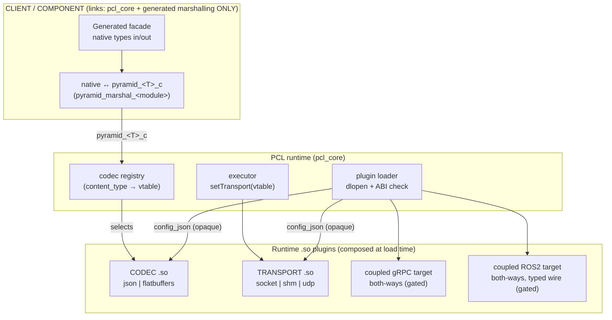
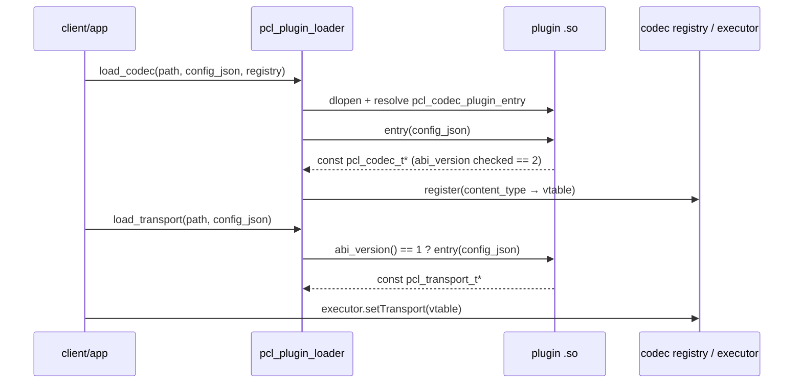
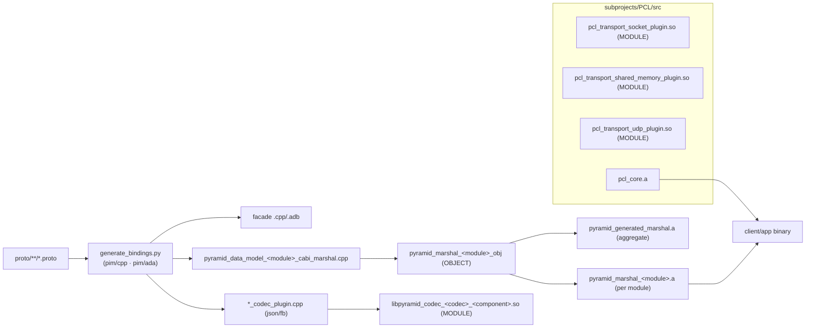
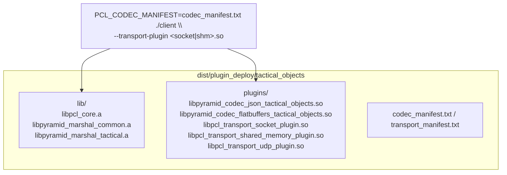

# Transport & Codec Plugin System

## Purpose

PYRAMID components and clients run against the generic PCL runtime through
**runtime-loaded plugins**. A client links only the framework (`pcl_core`) and
the generated contract (typed facade + native↔C-struct marshalling). The
plugin path covers JSON / FlatBuffers / Protobuf codecs; the socket,
shared-memory, and UDP transports; and two **coupled** (codec+transport)
targets — gRPC (`pyramid_grpc_coupled_plugin`) and ROS2
(`libpyramid_ros2_coupled_plugin`) — both implementing the transport contract
in both directions (server ingress and client `invoke_async`/`invoke_stream`).
The transport **capability model** (caps declaration, compose-time
validation, QoS floor, manifest-driven per-endpoint routing) is in place. The
typed `pyramid_msgs` wire is the default live ROS2 topic path, with the
pass-through envelope selectable as a fallback (see
[ros2_transport_semantics.md](ros2_transport_semantics.md)). Remaining
transport work is tracked in `doc/todo/PYRAMID/TODO.md` (WS-D).

This isolates churn (a wire-format or transport change ships as a new plugin, not
a client rebuild), keeps client binaries minimal, and lets one cross-language
codec `.so` serve both C++ and Ada over a frozen C-ABI struct boundary.

See also [generated_bindings.md](generated_bindings.md) and
[pcl_pyramid_binding_generation_overview.md](pcl_pyramid_binding_generation_overview.md).

## Runtime composition



Key properties:

- **Fail closed.** With no codec registered for a `content_type`, encode/decode
  return an error (C++) or raise (Ada) rather than falling back to a built-in
  codec; likewise with no transport plugin. This holds for **both languages**,
  including Ada scalar aliases (`Identifier` etc.).
- **Uniform config pass-through.** A client switch flows as an opaque
  `config_json` string through the loader into both codec and transport entry
  points (transport carries role/host/port/bus + the executor pointer).
- **One cross-language codec.** The codec consumes the frozen `pyramid_<T>_c`
  C struct, so the same `.so` is loaded from C++ and Ada.

## Plugin directionality — the core contract

A transport plugin **must implement the full PCL transport contract in both
directions**. It is not enough to implement "certain bits" (e.g. only inbound
server ingress): a plugin shall provide everything a component needs to use
**both provided and consumed** services.

```
  PCL provider  <- plugin (server / ingress) <-  remote peer (client)
  PCL consumer  -> plugin (client / egress)  ->  remote peer (server)
```

The **core requirement is `PCL <-> plugin <-> PCL` both ways**: a PYRAMID
component on each side, with the plugin bridging the chosen middleware. Concretely
a complete plugin implements:

- **Provided (ingress):** accept inbound requests/streams/publishes from the wire
  and dispatch them to the executor's service/subscriber handlers (`serve` /
  `subscribe`, or a middleware server such as the gRPC/ROS2 coupled plugins start
  on load).
- **Consumed (egress):** route a component's outbound calls to a remote peer
  (`invoke_async` for unary, `invoke_stream` for server-streaming, `publish` for
  topics).

A plugin instance may be configured for one side (e.g. the socket plugin's
`role: server|client`, the gRPC plugin's `mode: server|client`), but the plugin
as a whole must cover both so a deployment can compose providers and consumers
freely.

### One-sided interop is also supported

Because each side is just the chosen middleware on the wire, a plugin can equally
bridge a PYRAMID component to a **native, non-PCL** peer — only one side is PCL:

```
  PCL consumer  -> gRPC plugin (client) -> native gRPC server (non-PCL)
  native gRPC client -> gRPC plugin (server) -> PCL provider
```

These one-sided interop cases are first-class use cases, but the **bidirectional
`PCL <-> plugin <-> PCL` path is the core contract** every transport plugin must
satisfy.

### Heterogeneous middleware capabilities (the capability model)

Middleware differ in which interaction primitives they provide. The capability
model makes that explicit so the framework can validate endpoint↔transport fit at
compose time (fail closed, early, precise) and deployments can mix middleware
per endpoint.

**Capabilities.** A capability is a named bundle of transport-vtable slots an
endpoint kind requires:

| Capability | Endpoint kinds | Vtable slots |
|------------|----------------|--------------|
| `PUBSUB`     | PUBLISHER / SUBSCRIBER          | `publish` / `subscribe` |
| `RPC_UNARY`  | PROVIDED / CONSUMED (service)   | server ingress + `respond` / `invoke_async` |
| `RPC_STREAM` | STREAM_PROVIDED / stream consume | server stream + `stream_send`/`stream_end` / `invoke_stream` (+ `stream_cancel`) |
| `RPC_ACTION` | (ROS2 actions; future)          | goal + feedback stream + result + cancel |

Orthogonal **QoS** (reliability `UNSPECIFIED < BEST_EFFORT < RELIABLE`, ordering,
durability, max size) is part of the profile, not a capability gate; an endpoint
may pin a minimum (e.g. a command service must be `RELIABLE`).

**Per-middleware matrix** (declared by each plugin; the test oracle):

| Transport | `PUBSUB` | `RPC_UNARY` | `RPC_STREAM` | `RPC_ACTION` | Reliability | Codec |
|-----------|:---:|:---:|:---:|:---:|---|---|
| gRPC      | ✗ | ✓ | ✓ | ⟂ | RELIABLE | coupled (protobuf) |
| ROS2      | ✓ | ✓ | ✓ | ✓ (native) | configurable QoS | coupled (ROS2 IDL) |
| TCP socket| ✓ | ✓ | ✗ | ✗ | RELIABLE | decoupled |
| shared mem| ✓ | ✓ | ✓ | ✗ | RELIABLE | decoupled |
| UDP       | ✓ | ✗ | ✗ | ✗ | BEST_EFFORT | decoupled |
| LA-CAL (owp/asb) | ✓ | ✗ | ✗ | ✗ | BEST_EFFORT (RELIABLE opt-in) | decoupled (OMS JSON) |
| DDS/MQTT  | ✓ | ⟂/✗ | ✗ | ✗ | configurable | decoupled |

✓ native · ⟂ via an explicit adapter (not in v1) · ✗ unsupported. A component
whose contract has both topics and services cannot be carried by gRPC *or* UDP
alone — it needs ROS2/socket/shm, or per-endpoint routing across two transports.

**Declaration.** A plugin exports `pcl_transport_plugin_caps(config_json)` (a
`PCL_CAP_*` bitmask) and optional `pcl_transport_plugin_qos`; the loader exposes
them via `pcl_plugin_transport_caps()` / `_qos()`. If the symbol is absent the
loader derives the mask from non-NULL vtable slots (declaration is authoritative,
derivation is the fallback — coupled plugins whose vtables carry fail-closed stubs
**must** declare).

**Compose-time validation.** `pcl_executor_validate_endpoint_route()` checks each
routed endpoint's required cap (`pcl_endpoint_required_caps`) and QoS floor against
the routed transport's recorded caps/QoS, failing closed (`PCL_ERR_NOT_FOUND`
missing peer, `PCL_ERR_STATE` missing cap/QoS) with a precise diagnostic like
`endpoint "x" needs RPC_UNARY but peer "telemetry" (udp) provides {PUBSUB}`.

**Mixed-middleware routing.** The `pcl_transport_routing` manifest (line-based:
`transport <peer> <plugin> [config]` / `route <endpoint> <kind> <peers>
[reliability]`) loads each transport plugin (injecting the executor), records its
caps + QoS, registers it as a named peer, then installs and validates every route.
So one component can route its services over gRPC and its telemetry topics over
DDS/UDP. Route kinds distinguish unary from streaming on the consumer side
(`consumed` vs `stream_consumed`), so a unary-only transport is rejected for a
streaming endpoint at compose time, not at first call. An `exclusive
<group> <side_a_endpoints> <side_b_endpoints>` stanza declares two
mutually-exclusive realizations of one interaction leg (e.g. a Request port's
command rpcs vs its `.request` topic): routing endpoints from both sides of one
group fails closed with a precise diagnostic, in either declaration order.
Validation-harness manifests (`pim/test_harness/contract_routing_manifest.py`, from
`binding_manifest.json`'s `interactions` section) emit these groups and route
exactly one side per leg — see the
[pub/sub & interaction facade guide](../guides/pubsub_interaction_guide.md).
That helper currently emits stub-plugin config; production transport config is
authored per the table below.
Components *serving* RPC over a manifest-routed transport must retrieve and
activate the transport's gateway container via
`pcl_transport_routing_get_gateway()` after load, or inbound requests are
dropped. Capability *gaps* are **fail-closed by default**; for
grammar-conforming ports the old `RPC_UNARY over PUBSUB` adapter idea is
subsumed by the interaction facade (running the interaction over a PUBSUB-only
transport is a route-line realization choice); opt-in adapters remain a
deferred idea for free-form services only.

## Code mechanism — ABI contracts

| Contract | Symbol | Signature | Header |
|----------|--------|-----------|--------|
| Codec | `pcl_codec_plugin_entry` | `const pcl_codec_t* (const char* config_json)` | `pcl/pcl_codec.h` (`PCL_CODEC_ABI_VERSION = 2`) |
| Transport | `pcl_transport_abi_version` + `pcl_transport_plugin_entry` | `uint32_t (void)` + `const pcl_transport_t* (const char* config_json)` | `pcl/pcl_plugin.h` (`PCL_TRANSPORT_ABI_VERSION = 1`) |
| Loader | `pcl_plugin_load_codec` / `pcl_plugin_load_transport` | `(path, config_json, …)` | `pcl/pcl_plugin_loader.h` |



The opaque `config_json` is stored and exposed to the codec via `codec_ctx`
(generated plugins) or consumed directly by the transport (e.g. the socket
plugin reads `{"role","host","port","executor"}`; shm reads
`{"bus_name","participant_id","executor"}`; UDP reads
`{"remote_host","remote_port","local_port","peer_id","executor"}`; the coupled ROS2 plugin reads
`{"node_name","executor"}` and stands up an rclcpp node + spin thread). Coupled
targets are intended to be loadable twice against the same `.so` -- once via
`pcl_plugin_load_transport`, once via `pcl_plugin_load_codec` -- presenting both
vtables under one `content_type`. Both coupled targets implement this
functionally: the gRPC plugin adapts the `pyramid_grpc_transport` runtime
(server + `invoke_async`/`invoke_stream`), and the ROS2 plugin wraps the
`RclcppRuntimeAdapter`. Default-plugin auto-load is
config-driven: `pcl_codec_registry_load_plugins_from_manifest(registry, path)`
loads every codec listed in a manifest (transport entries are skipped).

## Build mechanism



- Codec plugins and transport plugins are CMake `MODULE` libraries (`.so`).
- `pyramid_grpc_transport` is built as a static library when gRPC is enabled.
  `pyramid_grpc_coupled_plugin` (PIC MODULE) is a real both-ways plugin: a config
  contract (`role`/`address`/aggregated component set), lifecycle (`shutdown` +
  private destroy), real server + `invoke_async`/`invoke_stream` wiring, and
  plugin-loaded round-trip tests (`test_grpc_coupled_plugin_e2e`).
- Marshalling is compiled **once per data-model module** as an `OBJECT` library,
  exposed both as a standalone `pyramid_marshal_<module>.a` (for per-component
  deployment) and bundled into the aggregate `pyramid_generated_marshal.a` (the
  name C++ and Ada consumers link by, unchanged).
- C++ and Ada bindings are regenerated into the build tree on configure/build:
  `${binaryDir}/generated/pyramid_cpp_bindings` and
  `${binaryDir}/generated/pyramid_ada_bindings`. Generated source-tree binding
  outputs are ignored and are not the source of truth.
- **End-to-end proto→plugins:** `scripts/build_plugins.sh` runs the whole
  pipeline (regenerate bindings from `.proto`, then build every codec/transport
  `.so` via the CMake `pyramid_plugins` aggregate target), suitable as a CI/CD
  stage or a manual engineer step. `--grpc` additionally builds protobuf + the
  coupled gRPC target plugin; `--stage` chains `stage_plugin_deploy.sh`.
- **Ada consumes, it does not produce, plugins.** The codec/transport `.so`s are
  language-neutral C-ABI artifacts; Ada clients and the Ada bridge load the same
  files at run time (`PYRAMID_CODEC_PLUGINS` / `PCL_TRANSPORT_PLUGIN`).
  `scripts/build_ada.sh` is the Ada counterpart to `build_plugins.sh`: it builds
  the Ada *binaries* via GNAT `gprbuild` (the `pyramid_ada_all` target, which also
  builds the GNAT FlatBuffers archive) plus `pyramid_plugins` so the `.so`s they
  load are present. `--regen` refreshes the build-local Ada binding tree from
  `.proto`.

## Deployment

`scripts/stage_plugin_deploy.sh` stages a per-component deployment dir:

```
<out>/<component>/
  plugins/                codec .so(s) + transport .so(s)
  include/  src/          PCL headers + generated facade the client compiles
  lib/                    libpcl_core.a + libpyramid_marshal_<module>.a  (closure only)
  codec_manifest.txt      codec .so paths  → PCL_CODEC_MANIFEST auto-loads them
  transport_manifest.txt  transport .so paths → pass via --transport-plugin
  MANIFEST.txt  README.md
```



**Module-closure staging (churn isolation).** Only the data-model modules a
component actually marshals are staged (derived from the component's codec
plugin's `*_cabi_marshal.hpp` includes): `tactical_objects` → `common`,
`tactical`; `autonomy_backend` → `common`, `autonomy`. An edit to an unrelated
module (`sensors`, `radar`, …) therefore produces no diff in an unrelated
component's deployment dir.

## Using & extending the plugin system

**1. Author a component/client.** Compile once against the generated typed facade;
link only `pcl_core` + `pyramid_generated_marshal`. Call the typed
provided/consumed APIs with native types — no `pcl_msg_t`, codec, or transport in
the call path. Select a payload `content_type` (e.g. `application/json`) when
configuring ports/services.

**2. Configure a deployment.** Load a codec and, for remote peers, a transport
plugin at runtime. The directional/wiring knobs travel as one opaque
`config_json` per plugin:

| Plugin | Key `config_json` fields |
|--------|--------------------------|
| socket | `role: provided\|consumed` (aliases `server`/`client`), `host`, `port`, `executor` |
| shared memory | `bus_name`, `participant_id`, `executor` |
| udp | `remote_host`, `remote_port`, optional `local_port`/`peer_id`, `executor` (symmetric pub/sub) |
| gRPC coupled | `role: provided\|consumed` (alias `mode: server\|client`), `address`, aggregated component set, `executor` |
| ROS2 coupled | `role: provided\|consumed`, `node_name`, `executor` |

Local in-process communication is the no-plugin case. Generated C++ facades use
the same opaque JSON convention for endpoint route selection:
`{"transport":"local"}` routes generated services/topics through the local
executor only, while `{"transport":"remote"}` or
`{"transport":"remote","peer":"peer_id"}` selects an already-installed default
or named transport. Generated Ada facades expose the same route selection through
`Transport_Config`, `Configure_Consumed_Transport`, and
`Configure_Publisher_Transport`.

Codecs auto-load from a manifest (`PCL_CODEC_MANIFEST` →
`pcl_codec_registry_load_plugins_from_manifest`); transports are passed via
`--transport-plugin` or a `pcl_transport_routing` manifest for mixed middleware.
`scripts/stage_plugin_deploy.sh` produces a ready per-component deploy dir.

**3. Author a new plugin.** Build a CMake `MODULE` (`.so`) exporting the ABI
symbols above:
- **Codec:** `pcl_codec_plugin_entry(config_json) -> const pcl_codec_t*`
  (`PCL_CODEC_ABI_VERSION == 2`). Operate on the frozen `pyramid_<T>_c` struct so
  one `.so` serves C++ and Ada.
- **Transport:** `pcl_transport_abi_version() == 1` +
  `pcl_transport_plugin_entry(config_json) -> const pcl_transport_t*`. Implement
  both directions (§ directionality). Declare `pcl_transport_plugin_caps` (+
  `pcl_transport_plugin_qos`) so compose-time validation is accurate; export
  `pcl_transport_plugin_teardown` if the plugin owns threads/contexts to release
  before `dlclose`.

**4. ROS2 native typing.** Generate the ROS2 IDL + wire codec
(`PYRAMID_ENABLE_ROS2=ON`; `scripts/build_ros2_transport.sh`); see
[ros2_transport_semantics.md](ros2_transport_semantics.md) for the canonical
mapping and the `pyramid_msgs` interface package.

## Status

| Capability | C++ | Ada |
|------------|-----|-----|
| Client links core libs only (no transport/codec/wire deps) | ✅ | ✅ |
| Transport via runtime plugin (socket + shm + udp) | ✅ | ✅ |
| Codec via runtime plugin (cross-language `.so`) | ✅ | ✅ |
| Codec config pass-through (`config_json`) | ✅ | ✅ |
| Fail closed with no transport plugin | ✅ | ✅ |
| Fail closed with no codec plugin (incl. scalar aliases) | ✅ | ✅ |
| Coupled target plugin (codec+transport, one content_type) | gRPC both-ways; ROS2 both-ways (typed wire default, envelope fallback) | — |
| Transport capability model (caps + compose-time validation + QoS + manifest routing) | ✅ | ✅ |

Clients link core libs only; transport + codec are runtime plugins with
uniform `config_json`, default-plugin manifests, per-module marshalling, and
both languages fail closed.

The **direct generated gRPC C++ transport** is built and runtime-verified on
Linux (`test_grpc_transport_smoke`, `BindingPerformanceTest.Grpc_Tcp`);
enable with `-DPYRAMID_ENABLE_GRPC=ON -DPYRAMID_ENABLE_PROTOBUF=ON` or
`scripts/build_plugins.sh --grpc`. The loadable **coupled gRPC target
plugin** implements the transport contract both ways: server mode starts a
gRPC server (via the proto-driven `pyramid_grpc_plugin_aggregator`) that
routes inbound RPCs to the executor; client mode dials a remote endpoint and
implements `invoke_async` (unary) and `invoke_stream` (server-streaming)
through the generated typed stubs. `test_grpc_coupled_plugin_e2e` proves both
directions through the dlopen'd `.so` (PCL ↔ plugin ↔ plugin ↔ PCL).

The **coupled ROS2 target plugin** (`libpyramid_ros2_coupled_plugin`, content
type `application/ros2`) follows the same one-`.so`-two-vtables contract,
wrapping the `RclcppRuntimeAdapter` (rclcpp node + background spin thread).
Its vtable implements `publish` / `subscribe`, consumed `invoke_async` and
`invoke_stream`, and a process-safe `spin_once` shutdown, with a reproducible
fresh-tree ament build and `pcl_transport_plugin_teardown` unload discipline.
The typed `pyramid_msgs` wire is the live default for topics; the
pass-through envelope remains selectable and still carries array topics and
unary/stream service framing. Details and remaining ROS2 work (actions,
typed service framing) are in
[ros2_transport_semantics.md](ros2_transport_semantics.md).

**Architectural note — gRPC protobuf marshalling and Ada.** Ada consumes gRPC
the same way it consumes socket/shm: the gRPC coupled plugin is loaded as the PCL
transport, and the `application/protobuf` codec plugin is loaded through the
codec registry. There is no Ada-specific gRPC JSON shim in the active path.
`application/grpc` remains a wire-level gRPC transport detail; the Ada facade
uses the standard generated service API with `application/protobuf` payload
encoding.

**Remaining transport work** (ROS2 actions, deferred capability adapters)
is tracked in
[`doc/todo/PYRAMID/TODO.md`](../../../../doc/todo/PYRAMID/TODO.md) (WS-D).

### Known gap — manifest-routed *remote* ingress / peer identity (deferred)

Compose-time routing (caps + QoS + `pcl_transport_routing_load`) works, and a
route to a named peer **validates**. The *runtime ingress* leg for a **remote**
peer-filtered route is not yet wired end-to-end, in two linked places:

1. **Peer id is not threaded from the manifest into the transport.**
   `pcl_transport_routing.c` injects only the executor pointer into a transport's
   `config_json`; it does not pass the manifest `peer` token. A loaded transport
   (UDP/socket today) therefore keeps its default source id (`"default"`), and the
   socket plugin has no manifest-peer parser. Inbound filtering
   (`peer_is_allowed` / `source_peer_id`) then never matches the route's peer
   list, so a route such as `route object_evidence subscriber topic_udp`
   validates but drops all remote ingress. The fix is to thread the manifest
   `peer` through to the transport/bind layer rather than relying on per-plugin
   config to duplicate it.

2. **Coupled-plugin ingress posts as a *local* source.** Even with a peer id
   available, the generated/loaded server paths post inbound traffic with the
   local APIs (`pcl_executor_post_incoming` /
   `pcl_executor_post_service_request`). A remote-only routed endpoint rejects
   local ingress (`dispatch_incoming_now`) or misses the service (`find_service`
   runs `PCL_ROUTE_LOCAL`). Routed remote requests are dropped or return an
   empty/default response. This affects:
   - **gRPC** coupled plugin (`pyramid_grpc_coupled_plugin.cpp`): the server is
     started with only the executor; it must dispatch via
     `pcl_executor_post_service_request_remote` keyed by the routed peer id.
   - **ROS2** coupled plugin: the generated `bindTopicIngress` /
     `bindUnaryServiceIngress` / `bindStreamServiceIngress` helpers
     (`pim/backends/ros2_backend.py`) and the private bind/advertise ABI symbols
     must carry the peer id and use `pcl_executor_post_remote_incoming` /
     `pcl_executor_post_service_request_remote`. See the matching item in
     [`ros2_transport_semantics.md`](ros2_transport_semantics.md) (§ "Not yet
     implemented").

These bind/server paths are exercised only by tests today (the routing loader
does not yet invoke them for an endpoint), so the gap is **latent** rather than a
regression. Closing it spans the PCL routing layer, the generated ROS2 support
codegen, and both coupled-plugin ABIs; deferred pending a build/test
environment for the coupled ROS2/gRPC runtime.

## High-efficiency in-process (native) payload contract

When two components run in the **same operating-system process on the same PCL
executor**, a message can be handed over as the live native object (the
generated C++ struct) instead of a serialized buffer. This is the "Tier-A
native" path. It is **opt-in and strictly additive**: the default is still the
serialized path, byte-for-byte unchanged. The full design, rationale, and
staged work are in
[`doc/plans/PYRAMID/high_efficiency_process_bindings_plan.md`](../../../doc/plans/PYRAMID/high_efficiency_process_bindings_plan.md);
this section is the normative runtime contract the rest of the system
implements against.

### The sentinel

A native message sets `pcl_msg_t::data` to the address of a live object and
`pcl_msg_t::type_name` to the sentinel content type
`PCL_NATIVE_CONTENT_TYPE` (`"application/x-pcl-native"`), optionally followed by
`;<SchemaShortName>` so the receiver can sanity-check the type it casts to (for
example `application/x-pcl-native;WorldState`). The helpers
`pcl_type_name_is_native()` and `pcl_msg_is_native()` (in
[`pcl_types.h`](../../../subprojects/PCL/include/pcl/pcl_types.h)) recognise
both forms by prefix. `pcl_msg_t::size` is informational for native messages;
the payload is the object, not `size` bytes.

### Rules the runtime enforces (not assumptions)

1. **Same process, same compiled types.** Publisher and subscriber must share
   the identical struct layout (same generated headers, same build/ABI). The
   first cut is C++-to-C++ only; cross-language (C++↔Ada) native handoff is out
   of scope and falls back to serialization.
2. **Tier-A borrow lifetime.** The native object is borrowed for the duration
   of the synchronous dispatch call. A subscriber must not retain the pointer
   past its callback. The one exception is a unary/deferred service response,
   which is consumed after the handler returns and therefore needs an object
   that outlives the handler (an owned response slot), not a handler-stack
   borrow.
3. **Read-only sharing.** One publish fans out to several subscribers sharing
   one `const` object; a subscriber that needs to keep or mutate the value must
   copy it.
4. **Fail closed to the wire, before any local side effect.** A native payload
   must never reach a transport adapter. The PCL runtime rejects a native
   message on any publish/request/response/stream-frame path that would hand it
   to a transport (`PCL_ERR_INVALID`). Because the executor delivers the local
   leg of a publish *before* the remote leg, a native publish on a mixed
   `PCL_ROUTE_LOCAL|PCL_ROUTE_REMOTE` (or remote-only) route is refused **up
   front**, before the local delivery runs, so no local side effect leaks past
   the guard. Native routing is same-executor **local only**.
5. **Trusted inbound provenance.** A native sentinel that reaches a subscriber
   or handler callback is guaranteed to be a live, locally originated object,
   never wire bytes. The runtime refuses a native-tagged message on every
   transport-ingress path — the cross-thread pub/sub, service-request, and
   response queues, and the shared-memory gateway's direct handler dispatch —
   so a forged wire frame carrying the sentinel can never be cast as a native
   object.

These rules are covered by the PCL tests in
[`test_pcl_native_binding.cpp`](../../../subprojects/PCL/tests/test_pcl_native_binding.cpp).
The generated C++ facades emit the opt-in native pub/sub fast path only when the
binding generator is run with `--native-inprocess`; without it, output is
identical to the serialized baseline.

### Known gap — capability model does not encode plugin direction/mode (deferred)

`pcl_transport_caps_t` describes *interaction patterns* (`PUBSUB`, `RPC_UNARY`,
`RPC_STREAM`, `RPC_ACTION`), not *direction*. A coupled plugin advertises the
same caps regardless of whether it was configured as a `provided`/server or
`consumed`/client instance, but its vtable only wires one direction live (the
other side is a fail-closed stub). `pcl_executor_validate_endpoint_route` checks
only the cap bits, so a route like `route create_requirement consumed svc_grpc`
passes compose-time validation against a **server-mode** gRPC plugin even though
that instance's `invoke_async`/`invoke_stream` are stubs (and symmetrically for a
`provided` endpoint on a client-only instance). The capability model therefore
cannot fail closed on a direction/mode mismatch today. Closing it needs either
directional capability bits (e.g. provided-vs-consumed) or a route-validation
hook that consults the plugin's `config_json` role/mode against the endpoint
kind. This is a cross-cutting capability-model change affecting the coupled gRPC
and ROS2 plugins; deferred pending that design plus a gRPC/ROS2 build
environment.
