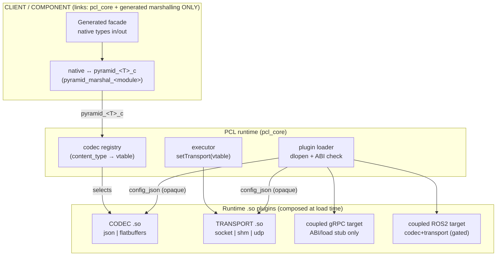
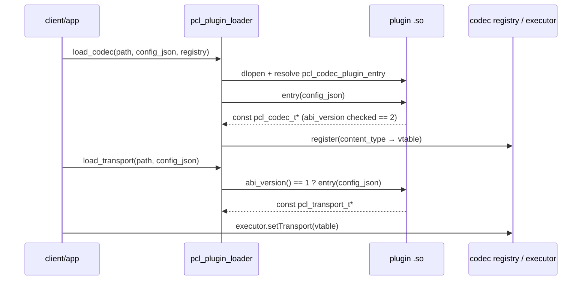
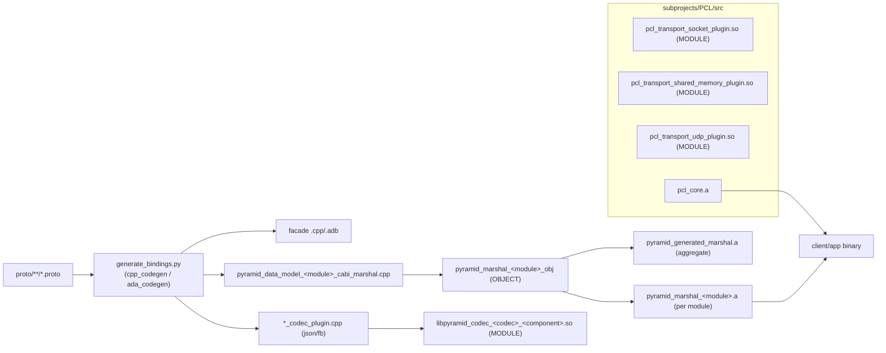
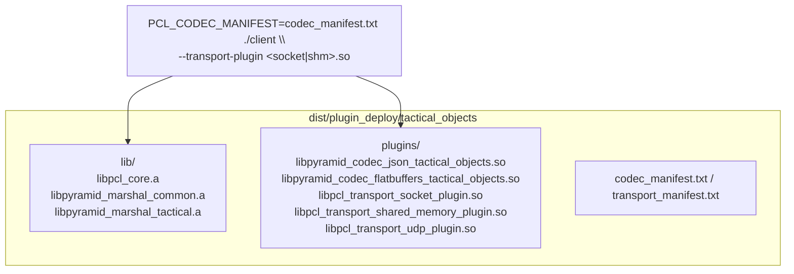

# Transport & Codec Plugin System

## Purpose

PYRAMID components and clients run against the generic PCL runtime through
**runtime-loaded plugins**. A client links only the framework (`pcl_core`) and
the generated contract (typed facade + native↔C-struct marshalling). The
production plugin path currently covers JSON / FlatBuffers codecs and the
socket, shared-memory, and UDP transports. gRPC is generated and runtime-tested
as a direct C++ transport library, and its loadable coupled plugin
(`pyramid_grpc_coupled_plugin`) is now a real runtime plugin implementing the
transport contract in both directions (server-mode ingress and client-mode
`invoke_async`/`invoke_stream`). ROS2 has a real rclcpp-backed coupled plugin,
but it still has production-closure gaps tracked in `doc/todo/PYRAMID/TODO.md`.

This isolates churn (a wire-format or transport change ships as a new plugin, not
a client rebuild), keeps client binaries minimal, and lets one cross-language
codec `.so` serve both C++ and Ada over a frozen C-ABI struct boundary.

See also [generated_bindings.md](generated_bindings.md),
[pcl_pyramid_binding_generation_overview.md](pcl_pyramid_binding_generation_overview.md),
and the v1 plan `doc/plans/PYRAMID/plugin_binding_v1_plan.md`.

## Runtime composition



Key properties:

- **Fail closed.** With no codec registered for a `content_type`, encode/decode
  return an error (C++) or raise (Ada) rather than falling back to a built-in
  codec; likewise with no transport plugin. This holds for **both languages**,
  including Ada scalar aliases (`Identifier` etc.).
- **Uniform config pass-through.** A client switch flows as an opaque
  `config_json` string through the loader into both codec and transport entry
  points (transport carries role/host/port/bus + the executor pointer).
- **One cross-language codec.** The codec consumes the frozen `pyramid_<T>_c`
  C struct, so the same `.so` is loaded from C++ and Ada.

## Plugin directionality — the core contract

A transport plugin **must implement the full PCL transport contract in both
directions**. It is not enough to implement "certain bits" (e.g. only inbound
server ingress): a plugin shall provide everything a component needs to use
**both provided and consumed** services.

```
  PCL provider  <- plugin (server / ingress) <-  remote peer (client)
  PCL consumer  -> plugin (client / egress)  ->  remote peer (server)
```

The **core requirement is `PCL <-> plugin <-> PCL` both ways**: a PYRAMID
component on each side, with the plugin bridging the chosen middleware. Concretely
a complete plugin implements:

- **Provided (ingress):** accept inbound requests/streams/publishes from the wire
  and dispatch them to the executor's service/subscriber handlers (`serve` /
  `subscribe`, or a middleware server such as the gRPC/ROS2 coupled plugins start
  on load).
- **Consumed (egress):** route a component's outbound calls to a remote peer
  (`invoke_async` for unary, `invoke_stream` for server-streaming, `publish` for
  topics).

A plugin instance may be configured for one side (e.g. the socket plugin's
`role: server|client`, the gRPC plugin's `mode: server|client`), but the plugin
as a whole must cover both so a deployment can compose providers and consumers
freely.

### One-sided interop is also supported

Because each side is just the chosen middleware on the wire, a plugin can equally
bridge a PYRAMID component to a **native, non-PCL** peer — only one side is PCL:

```
  PCL consumer  -> gRPC plugin (client) -> native gRPC server (non-PCL)
  native gRPC client -> gRPC plugin (server) -> PCL provider
```

These one-sided interop cases are first-class use cases, but the **bidirectional
`PCL <-> plugin <-> PCL` path is the core contract** every transport plugin must
satisfy.

### Heterogeneous middleware capabilities

Middleware differ in which primitives they provide — gRPC is RPC-only, UDP/MQTT
are pub/sub-only, ROS2/socket/shm are mixed. A plugin must declare the primitives
it supports (`PUBSUB`, `RPC_UNARY`, `RPC_STREAM`, `RPC_ACTION`) so the framework
can validate, at compose time, that each contract endpoint's required primitive is
carried by its routed transport — failing closed with a precise diagnostic instead
of a late per-call error — and so deployments can route different endpoints over
different transports. The capability model, the per-middleware matrix, and the
staged plan are in
[`doc/plans/PYRAMID/transport_capability_model_plan.md`](../../../../doc/plans/PYRAMID/transport_capability_model_plan.md).

## Code mechanism — ABI contracts

| Contract | Symbol | Signature | Header |
|----------|--------|-----------|--------|
| Codec | `pcl_codec_plugin_entry` | `const pcl_codec_t* (const char* config_json)` | `pcl/pcl_codec.h` (`PCL_CODEC_ABI_VERSION = 2`) |
| Transport | `pcl_transport_abi_version` + `pcl_transport_plugin_entry` | `uint32_t (void)` + `const pcl_transport_t* (const char* config_json)` | `pcl/pcl_plugin.h` (`PCL_TRANSPORT_ABI_VERSION = 1`) |
| Loader | `pcl_plugin_load_codec` / `pcl_plugin_load_transport` | `(path, config_json, …)` | `pcl/pcl_plugin_loader.h` |



The opaque `config_json` is stored and exposed to the codec via `codec_ctx`
(generated plugins) or consumed directly by the transport (e.g. the socket
plugin reads `{"role","host","port","executor"}`; shm reads
`{"bus_name","participant_id","executor"}`; the coupled ROS2 plugin reads
`{"node_name","executor"}` and stands up an rclcpp node + spin thread). Coupled
targets are intended to be loadable twice against the same `.so` -- once via
`pcl_plugin_load_transport`, once via `pcl_plugin_load_codec` -- presenting both
vtables under one `content_type`. That contract is implemented structurally for
gRPC today, but not functionally: the gRPC plugin vtables do not yet adapt the
working `pyramid_grpc_transport` runtime. Default-plugin auto-load is
config-driven: `pcl_codec_registry_load_plugins_from_manifest(registry, path)`
loads every codec listed in a manifest (transport entries are skipped).

## Build mechanism



- Codec plugins and transport plugins are CMake `MODULE` libraries (`.so`).
- `pyramid_grpc_transport` is built as a static library when gRPC is enabled.
  `pyramid_grpc_coupled_plugin` is also built, but is currently a structural
  plugin stub. A working gRPC plugin still needs a config contract, lifecycle
  management, real `invoke_async`/server wiring, and plugin-loaded round-trip
  tests.
- Marshalling is compiled **once per data-model module** as an `OBJECT` library,
  exposed both as a standalone `pyramid_marshal_<module>.a` (for per-component
  deployment) and bundled into the aggregate `pyramid_generated_marshal.a` (the
  name C++ and Ada consumers link by, unchanged).
- C++ bindings are regenerated into the build tree on configure/build; the Ada
  build compiles the committed `bindings/ada/generated` sources. Regenerate the
  committed artifacts with `scripts/generate_bindings.sh`.
- **End-to-end proto→plugins:** `scripts/build_plugins.sh` runs the whole
  pipeline (regenerate bindings from `.proto`, then build every codec/transport
  `.so` via the CMake `pyramid_plugins` aggregate target), suitable as a CI/CD
  stage or a manual engineer step. `--grpc` additionally builds protobuf + the
  coupled gRPC target plugin; `--stage` chains `stage_plugin_deploy.sh`.
- **Ada consumes, it does not produce, plugins.** The codec/transport `.so`s are
  language-neutral C-ABI artifacts; Ada clients and the Ada bridge load the same
  files at run time (`PYRAMID_CODEC_PLUGINS` / `PCL_TRANSPORT_PLUGIN`).
  `scripts/build_ada.sh` is the Ada counterpart to `build_plugins.sh`: it builds
  the Ada *binaries* via GNAT `gprbuild` (the `pyramid_ada_all` target, which also
  builds the GNAT FlatBuffers archive) plus `pyramid_plugins` so the `.so`s they
  load are present. Ada bindings are committed and compiled from source, so
  refreshing them from `.proto` is opt-in (`--regen`).

## Deployment

`scripts/stage_plugin_deploy.sh` stages a per-component deployment dir:

```
<out>/<component>/
  plugins/                codec .so(s) + transport .so(s)
  include/  src/          PCL headers + generated facade the client compiles
  lib/                    libpcl_core.a + libpyramid_marshal_<module>.a  (closure only)
  codec_manifest.txt      codec .so paths  → PCL_CODEC_MANIFEST auto-loads them
  transport_manifest.txt  transport .so paths → pass via --transport-plugin
  MANIFEST.txt  README.md
```



**Module-closure staging (churn isolation).** Only the data-model modules a
component actually marshals are staged (derived from the component's codec
plugin's `*_cabi_marshal.hpp` includes): `tactical_objects` → `common`,
`tactical`; `autonomy_backend` → `common`, `autonomy`. An edit to an unrelated
module (`sensors`, `radar`, …) therefore produces no diff in an unrelated
component's deployment dir.

## Status

| Capability | C++ | Ada |
|------------|-----|-----|
| Client links core libs only (no transport/codec/wire deps) | ✅ | ✅ |
| Transport via runtime plugin (socket + shm + udp) | ✅ | ✅ |
| Codec via runtime plugin (cross-language `.so`) | ✅ | ✅ |
| Codec config pass-through (`config_json`) | ✅ | ✅ |
| Fail closed with no transport plugin | ✅ | ✅ |
| Fail closed with no codec plugin (incl. scalar aliases) | ✅ | ✅ |
| Coupled target plugin (codec+transport, one content_type) | gRPC both-ways; ROS2 partial | — |

**v1 is complete** (`doc/plans/PYRAMID/plugin_binding_v1_plan.md`, W1–W6): clients
link core libs only, transport + codec are runtime plugins with uniform
`config_json`, default-plugin manifests, per-module marshalling, and both
languages fail closed. The **direct generated gRPC C++ transport** is built and
runtime-verified on Linux (`test_grpc_transport_smoke`,
`BindingPerformanceTest.Grpc_Tcp`); enable with `-DPYRAMID_ENABLE_GRPC=ON
-DPYRAMID_ENABLE_PROTOBUF=ON` or `scripts/build_plugins.sh --grpc`. The
loadable **coupled gRPC target plugin** is now a real runtime plugin implementing
the transport contract **both ways**: server mode starts a gRPC server (via a
proto-driven aggregator, `pyramid_grpc_plugin_aggregator`) that routes inbound
RPCs to the executor; client mode dials a remote endpoint and implements
`invoke_async` (unary) and `invoke_stream` (server-streaming) through the
generated typed stubs. `test_grpc_coupled_plugin_e2e` proves both directions
through the dlopen'd `.so` (PCL ↔ plugin ↔ plugin ↔ PCL).

The **coupled ROS2 target plugin** (`libpyramid_ros2_coupled_plugin`, content type
`application/ros2`) follows the same one-`.so`-two-vtables contract, but -- unlike
the structural gRPC stub -- its transport vtable is wired to the real
`RclcppRuntimeAdapter`. Loading it constructs an rclcpp node and background spin
thread, and plugin-private symbols expose topic binding plus unary/stream service
advertising. The underlying adapter has live rclcpp tests, and the plugin has an
ABI/load + pass-through codec test. Production closure (consumed/client side,
reproducible ament build, live E2E, process-safe lifecycle, staged deployment) is
still open.

**Architectural note — gRPC protobuf marshalling and the Ada shim.** Ada still
consumes gRPC through a bespoke JSON shim (`pyramid_grpc_c_shim`) that bypasses
the PCL transport. The intended end-state is for Ada (and C++) to consume gRPC
**identically to socket/shm** — gRPC coupled plugin as the PCL transport, standard
facade, no shim, no JSON detour. The blocker is the wire codec: `application/grpc`
carries protobuf, and **C-ABI marshalling alone is not sufficient** — it produces
the frozen `pyramid_<T>_c` struct, but something must still turn that struct into
protobuf wire bytes. The clean home is the coupled plugin's own codec (or a
standalone `application/protobuf` codec plugin).

**Live status, pending work, and decisions** for all of the above (gRPC, ROS2
closure, protobuf codec, shim retirement, the transport capability model) are
tracked in the single WIP doc:
[`doc/plans/PYRAMID/transport_plugins_wip.md`](../../../../doc/plans/PYRAMID/transport_plugins_wip.md).
