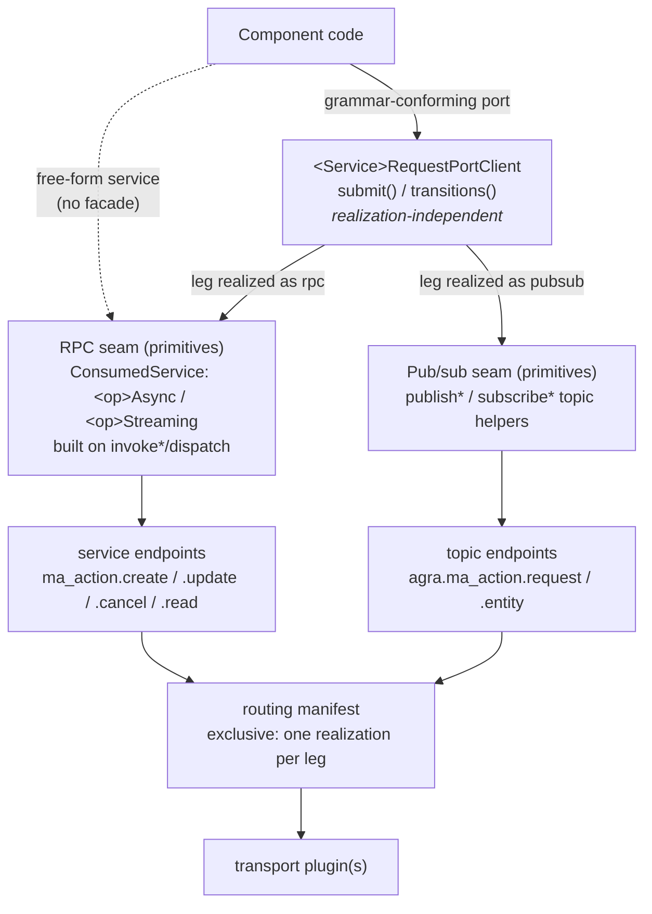
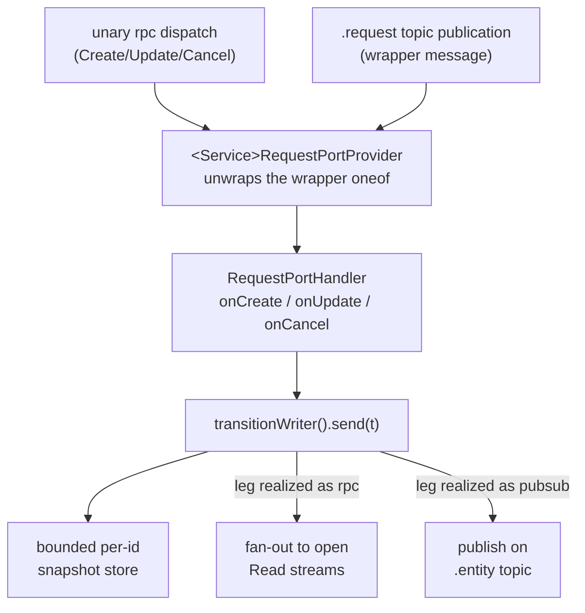

# PYRAMID Pub/Sub & the Interaction Facade — Developer Guide

This is the developer-facing guide to **contract-driven pub/sub** in PYRAMID
and the **interaction facade** that makes RPC and pub/sub interchangeable
realizations of the same contract. It is the sub-document of the
[PYRAMID user guide](pyramid_user_guide.md); the architecture pages it links
to carry the full design detail.

**Audience:** component authors who want to task, observe, or publish data
through a generated PYRAMID contract, and deployers who choose how those
interactions run on the wire.

**TL;DR:** you write component code against a transaction-shaped API
(`submit()`, `transitions()`, `publish()`, `subscribe()`); whether that runs
as RPC calls or as pub/sub topics — per direction, per deployment — is
configuration, not code. The same compiled component runs unmodified either
way.

---

## 1. The mental model

### Ports, not methods

Every grammar-conforming contract service is one of two **port** shapes
(see [`pyramid_interaction_semantics.md`](../architecture/pyramid_interaction_semantics.md)):

- **Request port** — the 4-rpc shape `Create` / `Read` / `Update` / `Cancel`.
  One logical transaction: *submit a command, observe correlated status
  transitions*.
- **Information port** — the 1-rpc shape `Read(Empty) → stream T`. One
  logical publication stream.

The unit you program against is the **interaction** (the port's
transaction), not the individual rpc.

### Every port has two realizations

For each port the generator emits both:

1. an **RPC seam** — typed `invoke*`/`dispatch*` helpers, service endpoints
   keyed by rpc wire name (e.g. `ma_action.create`);
2. a **pub/sub seam** — typed `publish*`/`subscribe*` helpers, topic
   endpoints keyed by the contract topic (e.g. `agra.ma_action.request`).

These are **declared, mutually-exclusive realizations of one interaction**
(design intent summarised in
[`doc/plans/PYRAMID/README.md`](../../../../doc/plans/PYRAMID/README.md)):
component code targets the facade, the wire realization is chosen at compose
time, and routing *both* realizations of one leg is a compose-time error.

### Topics come from the contract

Topic names and QoS are stamped into the `.proto` as
`pyramid.options.pyramid_op` options (by the MBSE generator, or by hand in a
hand-authored tree). Nothing is hardcoded in the generators. The naming
scheme is:

```
<project>.<interface_snake>.<role>      role ∈ { request, entity, information }
```

| Port kind × side | request topic | entity topic | information topic |
|---|---|---|---|
| Request, provided | subscribe | publish | — |
| Request, consumed | publish | subscribe | — |
| Information, provided | — | — | publish |
| Information, consumed | — | — | subscribe |

QoS in the contract is **intent** (a floor: `reliable` / `best_effort`);
each transport plugin declares **capability** (a ceiling). Compose-time
validation reconciles the two and fails closed on a mismatch — e.g. a
RELIABLE-stamped topic cannot be routed over the BEST_EFFORT UDP plugin
unless the deployer explicitly writes a `best_effort` floor into the route.

### The correlated-pair pattern

A Request port realized as pub/sub uses **two topics on a flat namespace**
(the A-GRA pattern):

- `<...>.request` — consumer → provider. Carries the service's `_Request`
  wrapper message (command variants + `cancel`).
- `<...>.entity` — provider → consumer. Carries entity
  transitions (status objects with an acceptance layer:
  RECEIVED / REJECTED / IN_PROGRESS / COMPLETED / CANCELLED …).

Correlation is by `Entity.id`/`source` **in the payload**, not by topic
instance — everyone shares the flat topics and filters by id. There is no
synchronous acknowledgement in this realization; acceptance is itself a
entity transition.

### Legs

A Request-port interaction has two independent directed **legs**, and each
leg's realization is chosen independently:

- **request leg** (consumer → provider): `Create`/`Update`/`Cancel` as RPC,
  *or* the `.request` topic.
- **entity leg** (provider → consumer): the `Read` stream, *or* the
  `.entity` topic.

A deployment can therefore run commands as RPC (point-to-point, transport
acks) while status flows as pub/sub (observable by any authorized
subscriber) — from the same component code.

---

## 2. Writing a consumer — `RequestPortClient`

For every Request-shape service the generated components header
(`*_components.hpp`) emits a `<Service>RequestPortClient` **alongside**
`ConsumedService` — both surfaces are generated and both work. They are
layers, not alternatives at the same level:

- `ConsumedService` (`<op>Async`/`<op>Streaming`, built on the low-level
  `invoke*`/`dispatch` helpers) and the raw `publish*`/`subscribe*` topic
  helpers are the **primitives**. They are realization-specific: calling
  `<op>Async()` is an RPC, calling `publish*` is a topic publish.
- `RequestPortClient` is the **facade composed from those primitives**. Its
  `submit()`/`transitions()` API is realization-independent: whether a call
  runs as RPC or pub/sub is inferred from the loaded routing manifest, not by
  which method you called.



Prefer the facade for grammar-conforming ports; use the primitives directly
for free-form services (which get no facade) or when you need per-call
control. Compose the facade into your `pcl::Component` exactly like the
other bindings
(see [`cpp_component_authoring.md`](../architecture/cpp_component_authoring.md)):

```cpp
namespace c2 = pyramid::components::agra::c2_station::services::consumed;

class C2Component final : public pcl::Component {
 public:
  explicit C2Component(pcl::Executor& executor)
      : pcl::Component("c2_station"), client_(*this, executor) {}

  c2::MaactionRequestPortClient& client() { return client_; }

 protected:
  pcl_status_t on_configure() override { return client_.bind(); }

 private:
  c2::MaactionRequestPortClient client_;
};
```

### Selecting the realization

For a routed deployment, use one configuration record per logical port. It
contains the interaction mode, transport plugin, plugin-specific configuration,
and peer identity. The A-GRA P3 example uses this compact text form:

```text
port action_command_request rpc    mission_autonomy plugins/libpcl_transport_shared_memory_plugin.so {"bus_name":"c2_ma","participant_id":"c2"}
port action_information     pubsub mission_autonomy plugins/libpcl_transport_shared_memory_plugin.so {"bus_name":"c2_ma","participant_id":"c2"}
```

Each facade class exposes `deploymentDescriptor()`. It supplies the generated
RPC and topic endpoint names and whether each endpoint is consumed, provided,
published, or subscribed. The deployment layer combines that descriptor with
the port record and installs PCL's validated endpoint routes before the
component enters `on_configure()`. `bind()` then selects the routed realization.
The component sees none of the plugin, endpoint, or routing data.

The P3 example's `ProcessRuntime` is the reference implementation of this
composition. It compiles the compact record to PCL's low-level routing model in
an internal temporary manifest, preserving the complete plugin configuration,
peer, reliable QoS floor, endpoint direction, and mutual-exclusion checks.

`configureInteractionBinding()` remains available as an explicit override
for an in-process test or an embedded setup that does not load endpoint
routes. Its default is RPC. Do not combine it with a routed deployment; the
loaded endpoint route is authoritative.

Transport routing for the underlying primitives is unchanged: the facade
exposes its composed binding via `client.consumedService()`, so in-process
tests call `consumedService().routeAllLocal()` /
`configurePubSubTransport(R"({"transport":"local"})")`, while real
deployments load a routing manifest (§5).

### Submitting commands

One `submit()` overload per command rpc, returning
`std::future<SubmitResult>`:

```cpp
c2::MAAction_Service_Request command{};
pyramid::domain_model::agra::MA_Action action{};
action.id = "action-1";
action.action_type = dm_agra::ActionType::FindSearch;
command.ma_action = action;

auto result = client.submit(command).get();
if (!result.accepted) { /* handle result.status */ }
```

`SubmitResult` means **accepted for transfer**, deliberately the weaker of
the two realizations' guarantees:

- under RPC it reflects the remote `Ack`, and `result.remoteAck()` (an
  `optional<Ack>`) is populated;
- under pub/sub it reflects local publish success, and `remoteAck()` is
  empty — pub/sub has no synchronous ack, and the facade never fakes one.

Code that reads `remoteAck()` is therefore *visibly*
realization-dependent. Authoritative acceptance (RECEIVED / REJECTED +
reason) always arrives as a entity transition, under either
realization.

> **Waiting on the future:** `submit()` returns a *deferred* future —
> `.get()` runs the wait, and `wait_for()` will always report `deferred`,
> never `ready`. Under local routing `.get()` completes synchronously; for
> a bounded cross-process wait, run `.get()` on a helper thread while the
> calling thread keeps spinning the executor (see `await_submit()` in
> `agra_seam_interchange_test.cpp` for the canonical pattern).

### Observing transitions

`transitions(query, on_frame, on_end)` subscribes the correlated status
stream and returns a move-only `SubscriptionHandle` (one type under either
realization; destroying or `cancel()`ing it unsubscribes):

```cpp
c2::Query query{};
query.id.push_back("action-1");            // empty id list = all
auto handle = client.transitions(
    query,
    [&](const c2::MAAction_Service_Entity& t) {
      // RECEIVED -> IN_PROGRESS -> COMPLETED, correlated by id
    },
    [&](pcl_status_t end_status) { /* stream ended */ });
```

- Under RPC this is a server-streaming `Read`; the provider can serve
  current state immediately.
- Under pub/sub it subscribes the `.entity` topic and filters
  client-side by `query.id`. A late-joining subscriber sees only future
  publications (VOLATILE, no history) — mitigated by the provider's
  snapshot re-publication (§3), not by durability.
- `query.one_shot` completes after the first delivery batch; over pub/sub
  it is best-effort ("what is observable now").

### Non-projectable commands

A command is **projectable** to pub/sub only if its request type *is* the
service's `_Request` wrapper or matches exactly one wrapper `oneof` variant.
Projectability is computed at generation time and recorded in the manifest.
Calling `submit()` for a non-projectable command on a pub/sub-realized
request leg fails at the facade (`SubmitResult{accepted=false,
status=PCL_ERR_STATE}`) before touching the wire, naming the command and the
missing wrapper variant. The same command remains fully usable when the leg
is RPC-realized.

---

## 3. Writing a provider — `RequestPortHandler` + `RequestPortProvider`

The provider side is a handler with **one callback per command** — there is
deliberately no `onRead`: the `Read` stream, its per-query fan-out, and the
open-stream registry are facade-internal.

The same layering applies in reverse — commands arrive through either
primitive, transitions leave through either primitive, and your handler
never knows which:



```cpp
namespace ma = pyramid::components::agra::mission_autonomy::services::provided;

class MissionAutonomyHandler final : public ma::MaactionRequestPortHandler {
 public:
  ma::Ack onCreate(const ma::MAAction_Service_Request& request) override {
    // start tracking the action; emit transitions later via the writer
    return ma::Ack{true};
  }
  ma::Ack onUpdate(const ma::MAAction_Service_Entity& r) override { /* ... */ }
  ma::Ack onCancel(const ma::Identifier& id) override { /* ... */ }
};

class MissionAutonomyComponent final : public pcl::Component {
 public:
  MissionAutonomyComponent(pcl::Executor& executor,
                           MissionAutonomyHandler& handler)
      : pcl::Component("mission_autonomy"),
        provider_(*this, executor, handler) {}

  ma::MaactionRequestPortProvider& provider() { return provider_; }

 protected:
  pcl_status_t on_configure() override { return provider_.bind(); }

 private:
  ma::MaactionRequestPortProvider provider_;
};
```

The same `on<Command>()` methods fire whether the command arrived as a
unary RPC dispatch or as a `.request`-topic publication — the facade
unwraps the wrapper's oneof and routes to the right callback. (Under
pub/sub the `Ack` return value is discarded: no synchronous ack exists to
carry it.)

### Emitting transitions — `TransitionWriter`

`transitionWriter().send(t)` is the provider's single way to emit a status
transition, regardless of realization:

```cpp
ma::MAAction_Service_Entity t{};
dm_common::Requirement req{};
req.id = "action-1";                        // the correlation id
// ... acceptance/progress state ...
t.ma_action_status = req;
provider.transitionWriter().send(t);
```

- Under RPC it fans out to every open `Read` stream whose query matches the
  transition's id.
- Under pub/sub it publishes on the `.entity` topic.
- In both modes it updates a **bounded per-id snapshot store** (latest
  transition per `Entity.id`, insertion-order evicted). The snapshot serves
  RPC `Read` initial state, is replayed to late-joining RPC `Read` streams,
  and — under pub/sub — is **re-published when a command for that id
  arrives**, which is the documented late-join mitigation (idempotent
  re-publication, the cost A-GRA accepts).

On the provider, the loaded route selects the **entity leg's**
realization. The request leg has nothing to configure: both the RPC service
ports and the request-topic subscriber are always bound and listening, and
which one actually delivers is the routing manifest's decision. An
in-process test without endpoint routes can use
`configureInteractionBinding()` as an explicit entity-leg override.

---

## 4. Information ports — `InformationPortSource` / `InformationPortSink`

The one-leg analogue, same pattern:

```cpp
// Provider side
source.publish(info);          // topic publish, or fan-out to open Read streams

// Consumer side
auto handle = sink.subscribe(
    [&](const c2::MAActionPlan_Service_Information& msg) { ... });
```

Under RPC, `publish()` fans out to open `Read` streams and `subscribe()` is
a streaming `Read` invoke; under pub/sub both map to the `.information`
topic. `bind()` infers the choice from the loaded `stream_provided` /
`stream_consumed` or `publisher` / `subscriber` route. No correlation
filtering is involved — it is a plain publication stream.

---

## 5. Choosing the realization at deployment

### Per-port deployment configuration

Prefer a per-port record as shown in §2. The logical port's generated
`deploymentDescriptor()` is the authoritative endpoint list, so a deployer does
not repeat `Create`, `Update`, `Cancel`, `Read`, topic names, or endpoint
directions. This also prevents a mode string in component code from drifting
away from its routes.

### PCL's compiled routing form

PCL ultimately composes transports and per-endpoint routes from a
`pcl_transport_routing` manifest
(grammar in `subprojects/PCL/include/pcl/pcl_transport_routing.h`; system
overview in
[`transport_codec_plugin_system.md`](../architecture/transport_codec_plugin_system.md)):

```
transport ma  libpcl_transport_shared_memory_plugin.so {"bus_name":"agra_run1","participant_id":"c2"}

# request leg realized as RPC: route the service endpoints...
route ma_action.create  consumed        ma  reliable
route ma_action.update  consumed        ma  reliable
route ma_action.cancel  consumed        ma  reliable
route ma_action.read    stream_consumed ma  reliable

# ...or realized as pub/sub: route the topic instead
# route agra.ma_action.request  publisher  ma  reliable

# the two realizations of one leg are declared mutually exclusive:
exclusive ma_action.request_leg ma_action.create,ma_action.update,ma_action.cancel agra.ma_action.request
```

This is the lower-level form produced from a logical port configuration. The
`exclusive` stanza is the enforcement of "one realization per leg":
routing at least one endpoint from **each** side of a group fails closed at
`pcl_transport_routing_load()` (`PCL_ERR_STATE`, diagnostic naming the group
and one endpoint from each side). Any number of same-side endpoints route
together freely; endpoints in no group are unaffected.

### Generated validation manifests

`binding_manifest.json` carries an
`interactions` section (each leg's service endpoints, topic endpoint, and
per-command projectability), and
`subprojects/PYRAMID/pim/test_harness/contract_routing_manifest.py` derives
a routing manifest from it — routing exactly one side per leg (default:
rpc), emitting the `exclusive` groups, and carrying each endpoint's QoS
floor:

```sh
python3 contract_routing_manifest.py binding_manifest.json plugin.so out.pcl \
    --realize request=rpc --realize entity=pubsub
```

This helper is currently scoped to the routing validation harness: it emits
`{"mode":"rpc"}` / `{"mode":"pubsub"}` for the harness's stub transport.
It is useful for checking endpoint selection and exclusivity, but it does not
emit production SHM, UDP, socket, gRPC, or ROS2 configuration. For those
plugins, prefer a deployment layer that combines the generated interaction
descriptor with per-port plugin configuration, as the P3 three-process example
does. Directly authored `transport`, `exclusive`, and `route` lines remain the
low-level escape hatch.

### Transport notes worth knowing

- **QoS reconciliation** happens at load: a `reliable`-floored route over a
  BEST_EFFORT transport (e.g. UDP) fails closed with a precise diagnostic.
  Carrying a RELIABLE-stamped topic over UDP anyway is an explicit
  deploy-time decision — write `best_effort` as the route's floor.
- **Serving RPC over a routed SHM/socket transport:** a provider must
  retrieve and activate its transport's *gateway* container after loading
  the manifest — `pcl_transport_routing_get_gateway(routing, peer, &gw)` —
  or inbound requests are silently dropped.
- **Shared-bus peer naming (SHM):** a route's peer alias must match both a
  locally-registered transport peer *and* the remote sender's
  `participant_id`; the working convention is to register each side's
  transport under its **counterpart's** participant id. Point-to-point
  transports (UDP) can use the same arbitrary label on both sides.

---

## 6. Semantics you must not assume

The facade promises only what the weaker realization can honour — it never
papers over the difference:

| Topic | The honest rule |
|---|---|
| Acks | `SubmitResult` = accepted for transfer. `remoteAck()` populated under RPC only; pub/sub never fakes one; RPC never synthesizes acceptance transitions from acks. |
| Acceptance | Authoritative acceptance (RECEIVED/REJECTED + reason) is a entity transition, under both realizations. |
| Late join | Pub/sub subscribers see only future publications (VOLATILE). Mitigation: provider snapshot re-publication on command arrival. Durability/history replay is out of scope (deferred with DDS). |
| `one_shot` | Best-effort under pub/sub: "what is observable now". |
| Non-projectable commands | Exist in the RPC realization only; `submit()` on a pub/sub leg fails closed at the facade. |
| Dual routing | Routing both realizations of one leg is a compose-time error, not a silent double delivery path. |

---

## 7. Runnable examples

| Example | What it shows | Where |
|---|---|---|
| `agra_interaction_facade_example` | A runnable in-process facade showcase (`RequestPortProvider`/`RequestPortClient`) against the A-GRA-vocabulary fixture. Because it does not load endpoint routes, its command-line `--binding=rpc`\|`pubsub` option demonstrates the explicit test/embedded override. | `subprojects/PYRAMID/examples/cpp/agra_interaction_facade_example.cpp` |
| `test_pcl_generated_interaction_facade` | The facade API in-process: submit/transitions/TransitionWriter under both bindings, remoteAck honesty, D2 fail-closed, query filtering, snapshot re-publication | `subprojects/PYRAMID/tests/` |
| `agra_seam_interchange_test` | **The terminal proof**: one compiled component pair, cross-process over real SHM, run as rpc/rpc, pubsub/pubsub, and mixed rpc/pubsub purely by the loaded manifests; dual-routing negative gate | `subprojects/PYRAMID/pim/test_harness/build_agra_seam_interchange_test.sh` |
| `agra_shm_comms_test` | The correlated pair over cross-process SHM via raw `publish*`/`subscribe*` primitives (pre-facade; shows what the facade owns for you) | `pim/test_harness/build_agra_shm_comms_test.sh` |
| `agra_udp_proof_test` | BEST_EFFORT information topic over real UDP + the RELIABLE-over-UDP fail-closed negative | `pim/test_harness/build_agra_udp_proof_test.sh` |
| `agra_mixed_route_test` | One deployment, two transports: reliable pair over SHM, best-effort data over UDP, all contract-derived | `pim/test_harness/build_agra_mixed_route_test.sh` |
| A-GRA-vocabulary port-grammar fixture | The hand-authored, options-stamped non-OMS contract used to exercise the APIs above | `subprojects/PYRAMID/pim/agra_example/README.md` |

## 8. Ada

The generated Ada consumed (client) service packages
(`Pyramid.Services.<Component>.Consumed`) declare a real, runtime-dispatching
client surface as flat procedures, one set per Request-shape service. The
provided (server) packages declare a matching handler + provider surface
(`<Prefix>_Interaction_Handlers`, `<Prefix>_Provider_Bind`,
`<Prefix>_Send_Transition`) — the Ada analogue of the C++ facade's
`RequestPortClient`/`RequestPortProvider` split. For `MAAction_Service` the
client-side surface is:

```ada
--  Bind pub/sub ports + remember the executor for RPC calls. Call once
--  from on_configure().
MA_Action_Client_Bind (Container, Executor);

--  Realization selection, same JSON contract as the C++ facade.
MA_Action_Configure_Interaction_Binding
  (Config_Json => "{""request_leg"":""rpc"",""entity_leg"":""pubsub""}");

--  One Submit per command rpc. Result_Has_Ack is only ever True under
--  the RPC realization -- no ack is synthesized under pub/sub.
MA_Action_Submit_Create
  (Request         => Command,
   Result_Accepted => Accepted,
   Result_Status   => Status,
   Result_Has_Ack  => Has_Ack,
   Result_Ack      => Remote_Ack);

--  Correlated transition stream.
procedure On_Transition (Item : MAAction_Service_Entity);
MA_Action_Transitions
  (Filter   => Query,
   Callback => On_Transition'Access);
```

The provider side binds unary Create/Update/Cancel RPC ports, a streaming
Read RPC port (real live push via `Pcl_Bindings.Invoke_Stream`/
`Add_Stream_Service`, not a poll), and the pub/sub request/entity probe
ports from one call:

```ada
MA_Action_Provider_Bind (Container, Executor, Handlers => (
   On_Create => On_Create'Access,
   On_Update => On_Update'Access,
   On_Cancel => On_Cancel'Access));

--  D6: the provider's single way to emit a transition -- fans out to
--  every open Read stream matching the transition's id, or publishes on
--  the entity topic, per MA_Action_Configure_Interaction_Binding.
MA_Action_Send_Transition (Frame);
```

**Status: real runtime dispatch, single-process scope verified.** Both
realizations (`rpc`, `pubsub`) run end to end — `submit()`/`transitions()`
dispatching through `Pcl_Bindings.Invoke_Async`/`Invoke_Stream` (RPC) or
`Add_Publisher`/`Add_Subscriber`/`Port_Publish` (pub/sub) directly (there is
no pre-generated `Publish_*`/`Subscribe_*` wrapper layer for Request-shape
topics in Ada, so the facade builds its own, independent of
`Register_Services`), D2 fails closed for non-projectable pub/sub commands,
D3 never synthesizes an ack under pub/sub, and a bounded per-id snapshot
store replays state to late-joining RPC Read streams (D4). Proof:
`pim/test_harness/agra_ada_interaction_facade_proof.adb` /
`build_agra_ada_interaction_facade_proof.sh` — a single-process,
single-executor proof (the Ada analogue of
`test_pcl_generated_interaction_facade.cpp`'s scope), object-compiled across
both the A-GRA and `pim/test` trees and passing at runtime for both
realizations. `examples/ada/agra_interaction_facade_example.adb` /
`build_agra_interaction_facade_example.sh` is the copied example for new
Ada components — the analogue of `examples/cpp/agra_interaction_facade_example.cpp`.

Not yet covered (follow-ups, not blockers): a cross-process/real-transport
proof the way `agra_seam_interchange_test.cpp` is for C++ (`Client_Bind`/
`Provider_Bind` currently always route locally — remote routing would need
a `Config_Json`/`Transport_Config` parameter threaded through, mechanically);
the narrower D4 case where an *already-open* RPC stream misses a state
change because a late pub/sub-realized command doesn't independently
trigger a re-send (C++'s `republishSnapshotFor()` on the inbound-command
path has no Ada equivalent yet); wiring the proof into CTest/CI (currently a
standalone script, matching the other `pim/test_harness/build_*.sh` proofs
that aren't CTest-registered either).

## 9. See also

- [`cpp_component_authoring.md`](../architecture/cpp_component_authoring.md) — the component-facade authoring guide this builds on (`ProvidedService`, `ConsumedService`, generated pub/sub primitives).
- [`pyramid_interaction_semantics.md`](../architecture/pyramid_interaction_semantics.md) — how interaction patterns, topics, and QoS are expressed in the contract.
- [`transport_codec_plugin_system.md`](../architecture/transport_codec_plugin_system.md) — transport/codec plugins, the capability model, and compose-time validation.
- [`generic_contract_layout.md`](../architecture/generic_contract_layout.md) — `binding_manifest.json`, including the `interactions` section.
- [`doc/plans/PYRAMID/README.md`](../../../../doc/plans/PYRAMID/README.md) — design-intent summary of the retired plans behind this work (interaction facade D1–D7, topic derivation/correlated-pair pattern, SHM/UDP data-plane proofs); full text in git history.
