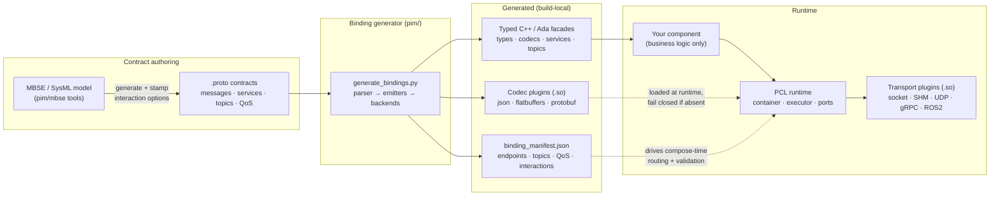
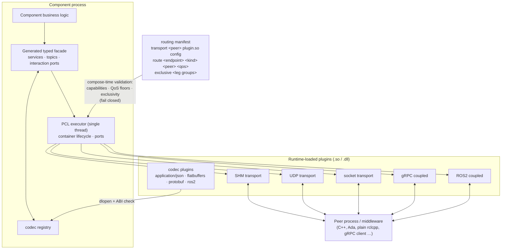
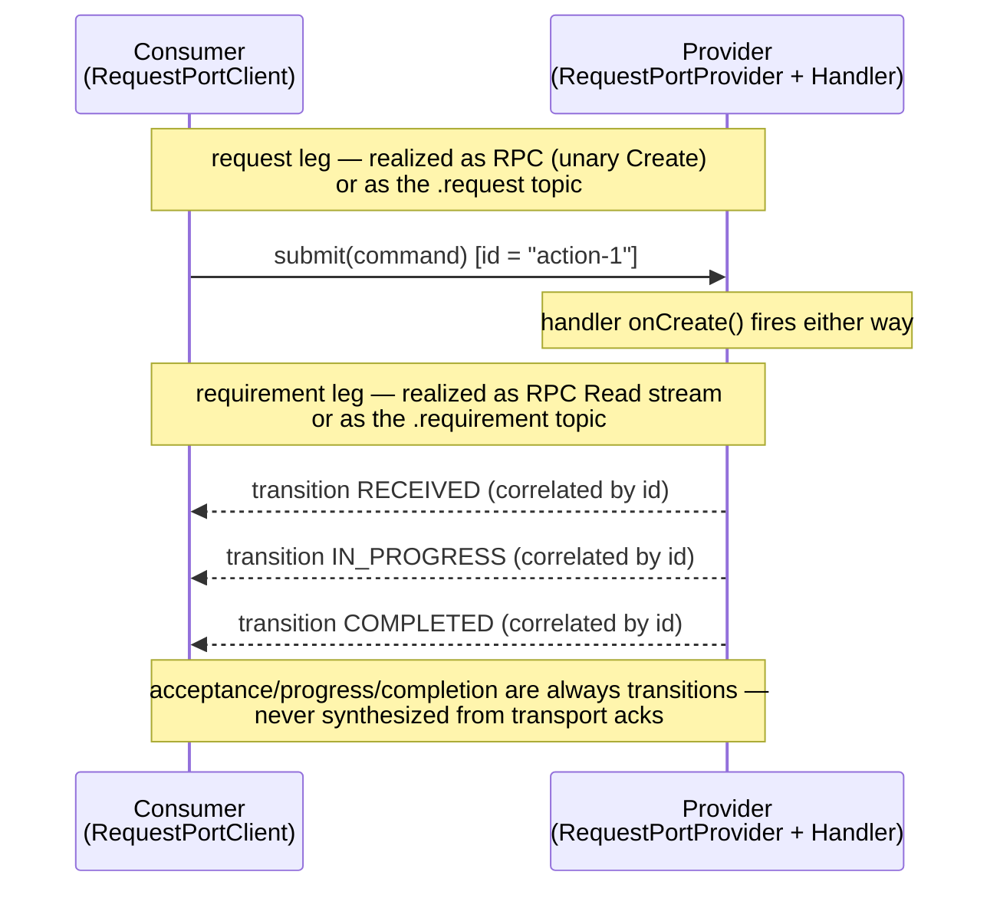

# PYRAMID User Guide

**This is the single entry point for understanding and using PYRAMID in this
repository.** It explains the design at a high level, shows how the pieces
fit, and points at the deeper references. If you read only one PYRAMID
document, read this one.

**Audience:** engineers writing components against generated PYRAMID
contracts, deployers composing codecs/transports, and reviewers who need the
design intent in one place.

Outstanding work is tracked in a single place:
[`doc/todo/PYRAMID/TODO.md`](../../../../doc/todo/PYRAMID/TODO.md).

---

## 1. What PYRAMID is here

`subprojects/PYRAMID` turns **formal component contracts** (`.proto` files,
optionally produced from an upstream MBSE/SysML model) into **typed C++ and
Ada bindings** that run on the generic PCL runtime, with serialization
(codecs) and movement (transports) supplied by **runtime-loaded plugins**
selected at deployment time.



The layering rule that makes this work:

| Layer | Owns | Never owns |
|-------|------|------------|
| `.proto` contract | Payload meaning, interaction pattern, topic names, QoS intent | Runtime or wire mechanics |
| Generator (`pim/`) | Typed facades, codecs, transport projections, the manifest | Component business state |
| Generated bindings | Encode/decode, typed handler surfaces, interaction facade | Mission logic |
| PCL runtime | Lifecycle, single-thread executor, ports, routing | PYRAMID schemas or codec semantics |
| Plugins | One codec or transport each, behind a frozen C ABI | Contract meaning |
| Your component | Business behaviour behind typed APIs | Wire-format or transport branching |

## 2. Design intent (the short version)

These are the intents the delivered system embodies. The retired plans that
established them are summarised in
[`doc/plans/PYRAMID/README.md`](../../../../doc/plans/PYRAMID/README.md);
full text in git history.

1. **The contract is the single source of truth.** Payload types,
   interaction pattern (publish / subscribe / unary / stream), topic names,
   and QoS are all expressed in the `.proto` tree
   (`pyramid.options.pyramid_op`). Every transport projection derives from
   it; nothing is hardcoded per domain.
2. **Fail closed, everywhere.** No codec plugin → encode/decode fails. No
   matching transport capability or QoS floor → composition fails with a
   precise diagnostic. Both realizations of one interaction leg routed →
   compose-time error. Nothing degrades silently.
3. **Codec and transport are deployment choices, not code.** Handler
   signatures never change when JSON becomes FlatBuffers or a socket becomes
   shared memory; components link only `pcl_core` + their generated
   contract, and plugins arrive via `dlopen` behind an ABI-versioned C
   boundary that C++ and Ada share.
4. **RPC and pub/sub are interchangeable realizations of one interaction.**
   Grammar-conforming ports (Request = Create/Read/Update/Cancel;
   Information = streamed Read) get a facade —
   `submit()`/`transitions()`/`publish()`/`subscribe()` — and the wire
   realization is chosen per leg, per deployment. The facade promises only
   the weaker realization's guarantee (no synthesised acks).
5. **Correlation by payload id, not by topic instance** (the A-GRA pattern):
   request/requirement topic pairs on a flat namespace, acceptance and
   progress as observable status transitions, cancel as another message.
6. **Business logic runs only on the PCL executor thread.** Transports may
   own worker threads, but ingress is queued to the executor and egress
   never blocks it (contract documented in `pcl/pcl_transport.h`).
7. **Domain neutrality.** Any valid `.proto` tree generates bindings
   (`--contract-layout generic`); PYRAMID naming survives only as an
   explicit compat policy. The default `pyramid` layout output is held
   **byte-for-byte identical** across generator changes.
8. **Deployable offline.** The packaged SDK lets a downstream, firewalled
   project generate and build bindings for its own contracts without this
   monorepo.

## 3. The runtime, in one picture

At runtime everything composes from configuration — the component code in
the middle is identical in every deployment:



Key behaviours to know:

- **Capability model.** Each transport plugin declares which primitives it
  provides (`PUBSUB`, `RPC_UNARY`, `RPC_STREAM`, offered QoS). The routing
  manifest assigns endpoints to transports; loading validates every route
  against the declared capabilities and QoS floors and fails closed on any
  gap. Mixed middleware in one process is normal (e.g. reliable command
  pair over SHM, best-effort telemetry over UDP).
- **QoS is intent vs capability.** The contract stamps a floor
  (`reliable`/`best_effort`); the plugin declares a ceiling. Carrying a
  RELIABLE-stamped topic over UDP requires the deployer to *write*
  `best_effort` into the route — an explicit decision, never a default.
- **One codec `.so` serves C++ and Ada** over the frozen `pyramid_<T>_c`
  C-ABI struct boundary.

Reference: [`transport_codec_plugin_system.md`](../architecture/transport_codec_plugin_system.md)
(plugin model, capability matrix, ABI, deployment staging) and
[`ros2_transport_semantics.md`](../architecture/ros2_transport_semantics.md)
(ROS2 topic/service/stream mapping, typed `pyramid_msgs` wire).

## 4. Build, load, and configure plugins

Plugins are the deployment boundary between generated component code and the
wire. There are three kinds:

| Kind | What it supplies | Typical artifacts |
|------|------------------|-------------------|
| Codec | Native/C-ABI payload to wire bytes, registered by content type | `pyramid_codec_json_<component>`, `pyramid_codec_flatbuffers_<component>`, `pyramid_codec_oms_json_uci` |
| Transport | Movement and interaction capabilities; no payload knowledge | `pcl_transport_socket_plugin`, `pcl_transport_shared_memory_plugin`, `pcl_transport_udp_plugin`, `pyramid_lacal_transport_plugin` |
| Coupled | A middleware that must supply both codec and transport vtables | `pyramid_grpc_coupled_plugin`, `pyramid_ros2_coupled_plugin` |

A process normally loads one or more codec plugins and either uses local
in-process routing or loads transport plugins for remote endpoints. A coupled
plugin must be loaded through both loader entry points when both of its
vtable roles are needed. Missing codecs, unsupported endpoint capabilities,
QoS mismatches, and conflicting RPC/pub-sub realizations fail closed.

### Build and stage

From the repository root, build the plugins for the selected contract tree and
optionally create per-component deployment directories:

```bat
subprojects\PYRAMID\scripts\build_plugins.bat --proto-dir subprojects\PYRAMID\pim\agra_example --clean --stage
```

Use the `.sh` counterpart on POSIX. `--gra` forces the OMS JSON codec and
LA-CAL (`owp`) WebSocket transport on; `--grpc` adds protobuf and the coupled
gRPC plugin. ROS2 uses the separate ROS2/ament build described in
[`ros2_transport_semantics.md`](../architecture/ros2_transport_semantics.md).
Staging writes `plugins/`, `codec_manifest.txt`, `transport_manifest.txt`, the
generated client facade, and its required link libraries under
`dist/plugin_deploy/<component>/`.

Per-component staging includes generated component codecs and the generic
transports. The UCI-wide OMS codec and LA-CAL transport are deployment-profile
artifacts rather than codecs owned by the `agra_example` fixture; add them
explicitly or use `create_sdk --gra`, which packages and verifies the pair.

### Load codecs

Codec loading and transport loading are separate operations. For a C++ app,
load the staged newline-separated `codec_manifest.txt` into the process codec
registry with `pcl_codec_registry_load_plugins_from_manifest()`. The supplied
Tactical Objects apps also accept `PCL_CODEC_MANIFEST` or their
`--codec-manifest` option. Those are application conveniences, not universal
PCL command-line options.

For Ada apps in this repository, set `PYRAMID_CODEC_PLUGINS` to a path-separated
list (`;` on Windows, `:` on POSIX). Code can instead call
`pcl_plugin_load_codec()` / `Pcl_Plugin_Load_Codec` directly when it needs to
pass codec-specific `config_json`. Keep every returned plugin handle alive as
long as its registry entry can be used.

### Load and configure transports

For one process-wide transport, call `pcl_plugin_load_transport(path,
config_json, ...)`, install the returned vtable on the executor, and unload it
with `pcl_plugin_unload_transport()` during shutdown. `PCL_TRANSPORT_PLUGIN` is
used by the supplied Ada examples and test harnesses, but is not automatically
consumed by every C++ application.

For per-endpoint or mixed-middleware routing, prefer
`pcl_transport_routing_load()`. Its line-based manifest both loads the plugins
and validates every route against capabilities, QoS, and interaction-leg
exclusivity:

```text
# transport <peer> <plugin-path> [plugin config JSON]
transport command_bus plugins/pcl_transport_shared_memory_plugin.dll {"bus_name":"agra","participant_id":"ma"}
transport telemetry plugins/pcl_transport_udp_plugin.dll {"remote_host":"127.0.0.1","remote_port":19002,"local_port":19001,"peer_id":"c2"}

# route <endpoint> <kind> <peer>[,<peer>...] [reliability]
route agra.ma_action.request subscriber command_bus reliable
route agra.ma_action.requirement publisher command_bus reliable
route agra.ma_action_plan.information publisher telemetry best_effort
```

The routing loader injects the executor pointer; do not put an `executor` value
in a hand-written manifest. Common plugin-owned fields are:

| Transport | Configuration fields |
|-----------|----------------------|
| Socket | `role` (`provided`/`consumed`), `port`, and `host` for a consumer |
| Shared memory | `bus_name`, `participant_id` |
| UDP | `remote_host`, `remote_port`; optional `local_port`, `peer_id` |
| LA-CAL WebSocket | `url`, `service_id`; optional `schema` (default `002.5.0`), `content_type` (must be `application/oms-json`), `peer_id`, `verbose`, `connect_timeout_ms`, `declare_reliability` (`reliable` opt-in) |
| gRPC coupled | `role`, `address`, component aggregation fields |
| ROS2 coupled | `role`, `node_name` |

Keep the routing handle alive while routes are active and destroy it before the
executor. A provider serving RPC through socket or shared memory must also get
the peer gateway with `pcl_transport_routing_get_gateway()`, configure and
activate that container, and add it to the executor. The routing loader cannot
infer that lifecycle step.

### Choose endpoint routes in component code

Generated facades accept opaque endpoint routing configuration. Use
`{"transport":"local"}` for same-executor delivery,
`{"transport":"remote"}` for the default transport, or
`{"transport":"remote","peer":"command_bus"}` for a named manifest peer.
This selects an installed route; it does not load the transport plugin.

For interaction ports, declare `exclusive` groups and route only the RPC side
or the pub/sub side of each logical leg. The generated `binding_manifest.json`
contains the endpoint names, kinds, QoS floors, and interaction groups. The
current `pim/test_harness/contract_routing_manifest.py` is a validation-harness
helper that emits stub-plugin configuration; real SHM/UDP/gRPC deployments
must supply the plugin configuration shown above. See the
[`pub/sub interaction guide`](pubsub_interaction_guide.md#5-deployment-choose-rpc-or-pubsub-per-leg)
for the full route grammar and realization rules.

### Diagnose a failed composition

1. Confirm the codec plugin for the selected content type is loaded.
2. Confirm the plugin ABI matches and the dynamic library dependencies resolve.
3. Check the transport declares the route's required capability
   (`PUBSUB`, `RPC_UNARY`, or `RPC_STREAM`).
4. Check the route reliability does not exceed the transport's offered QoS.
5. Check no `exclusive` group has endpoints routed from both realizations.
6. For provided RPC, confirm the transport gateway container is active.

The authoritative ABI, capability matrix, teardown rules, platform artifact
names, and known routing limitations are in
[`transport_codec_plugin_system.md`](../architecture/transport_codec_plugin_system.md).

### Understand the GRA profile boundary

For a GRA deployment, payload and movement are a pair: load an OMS JSON codec
for `application/oms-json`, then route its pub/sub endpoints through
`pyramid_lacal_transport_plugin` to the CAL server's `ws://` or `wss://` OWP
URL. A minimal routing entry is:

```text
transport gra_bus plugins/pyramid_lacal_transport_plugin.dll {"url":"ws://127.0.0.1:8080/owp","service_id":"mission-autonomy","schema":"002.5.0","content_type":"application/oms-json","declare_reliability":"reliable"}
route mission.position-report subscriber gra_bus reliable
```

The repository's `pim/agra_example` is deliberately only an
**A-GRA-vocabulary port-grammar example**. Its generated JSON/FlatBuffers
plugins are useful SDK parity coverage, but are not formal A-GRA OMS wire
codecs. The shipped `pyramid_codec_oms_json_uci` plugin is the frozen UCI 2.5
starter subset used by the OMS/CAL harness. The live, generated UCI 2.5 OMS
path and the current formal A-GRA gap are described precisely in
[`oms_agra_compatibility.md`](../architecture/oms_agra_compatibility.md).

## 5. The interaction model

Grammar-conforming services are **ports**, and the unit you program against
is the port's transaction, not individual RPCs:

- **Request port** — `Create`/`Read`/`Update`/`Cancel`: *submit a command,
  observe correlated status transitions*.
- **Information port** — `Read(Empty) → stream T`: *a publication stream*.

Each port leg can be realized as RPC **or** as correlated pub/sub topics —
same component code, chosen at deployment:



The full developer treatment — facade APIs in C++ and Ada, realization
selection, routing manifests, semantics you must not assume, runnable
examples — is the sub-guide:
[`pubsub_interaction_guide.md`](pubsub_interaction_guide.md).

## 6. Using it

### Generate bindings

```bat
subprojects\PYRAMID\scripts\generate_bindings.bat
```

(or `.sh`; `pim/generate_bindings.py` for language/backend selection).
CMake regenerates build-local bindings automatically via the
`pyramid_cpp_bindings_codegen` target — see
[`pcl_pyramid_binding_generation_overview.md`](../architecture/pcl_pyramid_binding_generation_overview.md)
for the pipeline and
[`generated_bindings.md`](../architecture/generated_bindings.md) for every
generated artifact and regeneration option.

### Write a component

Implement handlers against the generated typed facade; compose ports in
`on_configure()`. Start from
[`cpp_component_authoring.md`](../architecture/cpp_component_authoring.md)
and the copied examples:

| Example | Shows |
|---|---|
| `examples/cpp/agra_interaction_facade_example.cpp` | Request-port provider + client via the interaction facade, realization picked with `--binding=rpc\|pubsub` |
| `examples/ada/agra_interaction_facade_example.adb` | The same, in Ada |
| `tactical_objects/` | A full production-style component (runtime + `StandardBridge` + app) |

### Deploy

Pick codecs and transports per process with plugin config / a routing
manifest — no rebuild. Stage plugins with
`scripts/stage_plugin_deploy.*`; package the offline SDK with
`scripts/package_sdk.*`
(see [`sdk_packaging.md`](../architecture/sdk_packaging.md)).

To package the GRA runtime modules and verify the offline SDK's contract path
against the A-GRA-vocabulary fixture rather than the legacy starter tree:

```bat
subprojects\PYRAMID\scripts\create_sdk.bat --skip-build --no-ada --verify --gra ^
  --proto-dir subprojects\PYRAMID\pim\agra_example ^
  --out dist\pcl_pyramid_sdk_agra
```

`--gra` requires an explicit contract tree, forces OWP support on, requires the
OMS JSON codec and LA-CAL WebSocket transport in the package, and adds an
offline load/ABI smoke test for both. This command uses the non-wire
`agra_example` fixture to exercise downstream contract generation; it tests the
OMS/CAL modules separately and does not prove that the fixture encodes as OMS
JSON. Omit `--skip-build` for a release build from scratch. The `.sh` script
accepts the same options.

### Verify

```bat
ctest --test-dir build --output-on-failure -C Release -R "Tactical|ProtoBindings|CodecDispatch|tobj_|Ros2TransportSemantics"
python3 -m pytest subprojects/PYRAMID/tests -q
```

Cross-process data-plane proofs (SHM/UDP, mixed routes, seam interchange)
live in `pim/test_harness/` (`build_agra_*.sh`, findings in
`pim/test_harness/FINDINGS.md`).

## 7. Document map

| Level | Document | What it covers |
|-------|----------|----------------|
| **Guide (this)** | `pyramid_user_guide.md` | Design intent, high-level architecture, where to go next |
| Guide (sub-doc) | [`pubsub_interaction_guide.md`](pubsub_interaction_guide.md) | Contract-driven pub/sub + the interaction facade, developer-facing |
| Architecture | [`pcl_pyramid_binding_generation_overview.md`](../architecture/pcl_pyramid_binding_generation_overview.md) | How contracts become runnable PCL components (with diagrams) |
| Architecture | [`generated_bindings.md`](../architecture/generated_bindings.md) | Canonical binding/codec/transport reference |
| Architecture | [`cpp_component_authoring.md`](../architecture/cpp_component_authoring.md) | Writing C++ components on the generated facades |
| Architecture | [`build_artefacts.md`](../architecture/build_artefacts.md) | High-level map of all build artefacts (static libs, marshal libs, plugins, executables) and deployment config files |
| Architecture | [`transport_codec_plugin_system.md`](../architecture/transport_codec_plugin_system.md) | Plugin ABI, capability model, routing, deployment |
| Architecture | [`oms_agra_compatibility.md`](../architecture/oms_agra_compatibility.md) | Current OMS/CAL, AMS-GRA, and A-GRA compatibility status, with diagrams and known quirks |
| Architecture | [`ros2_transport_semantics.md`](../architecture/ros2_transport_semantics.md) | ROS2 mapping rules |
| Architecture | [`pyramid_interaction_semantics.md`](../architecture/pyramid_interaction_semantics.md) | Interaction patterns/topics/QoS in the contract |
| Architecture | [`generic_contract_layout.md`](../architecture/generic_contract_layout.md) | Arbitrary proto trees, naming policies, `binding_manifest.json` |
| Architecture | [`sdk_packaging.md`](../architecture/sdk_packaging.md) | Offline SDK for downstream projects |
| Architecture | [`tactical_objects/`](../architecture/tactical_objects/ARCHITECTURE.md) | Tactical Objects component (architecture, design, [standard alignment](../architecture/tactical_objects/standard_alignment.md)) |
| Reference | [`PYRAMID_COMPONENT_RESPONSIBILITIES.md`](../architecture/PYRAMID_COMPONENT_RESPONSIBILITIES.md) | PYRAMID Technical Standard responsibility map (`PYR-RESP-####`) |
| Tracking | [`doc/todo/PYRAMID/TODO.md`](../../../../doc/todo/PYRAMID/TODO.md) | **All outstanding work** |
| Tracking | [`doc/plans/PYRAMID/README.md`](../../../../doc/plans/PYRAMID/README.md) | Design-intent summary of retired plans/reports; live plan index |
