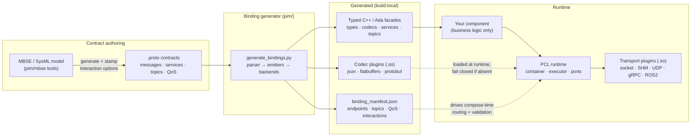
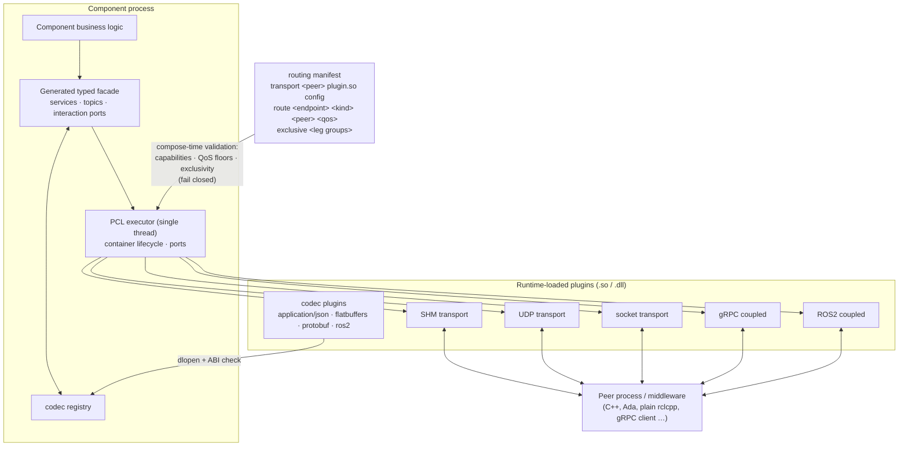
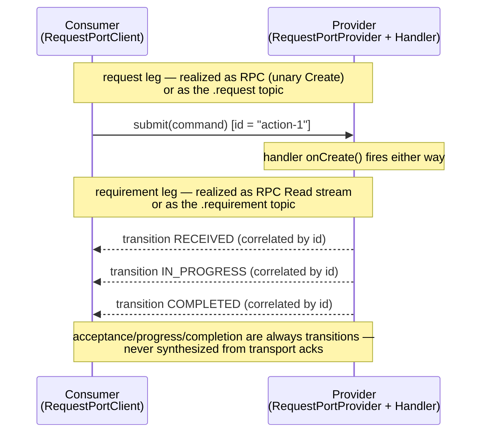

# PYRAMID User Guide

**This is the single entry point for understanding and using PYRAMID in this
repository.** It explains the design at a high level, shows how the pieces
fit, and points at the deeper references. If you read only one PYRAMID
document, read this one.

**Audience:** engineers writing components against generated PYRAMID
contracts, deployers composing codecs/transports, and reviewers who need the
design intent in one place.

Outstanding work is tracked in a single place:
[`doc/todo/PYRAMID/TODO.md`](../../../../doc/todo/PYRAMID/TODO.md).

---

## 1. What PYRAMID is here

`subprojects/PYRAMID` turns **formal component contracts** (`.proto` files,
optionally produced from an upstream MBSE/SysML model) into **typed C++ and
Ada bindings** that run on the generic PCL runtime, with serialization
(codecs) and movement (transports) supplied by **runtime-loaded plugins**
selected at deployment time.



The layering rule that makes this work:

| Layer | Owns | Never owns |
|-------|------|------------|
| `.proto` contract | Payload meaning, interaction pattern, topic names, QoS intent | Runtime or wire mechanics |
| Generator (`pim/`) | Typed facades, codecs, transport projections, the manifest | Component business state |
| Generated bindings | Encode/decode, typed handler surfaces, interaction facade | Mission logic |
| PCL runtime | Lifecycle, single-thread executor, ports, routing | PYRAMID schemas or codec semantics |
| Plugins | One codec or transport each, behind a frozen C ABI | Contract meaning |
| Your component | Business behaviour behind typed APIs | Wire-format or transport branching |

## 2. Design intent (the short version)

These are the intents the delivered system embodies. The retired plans that
established them are summarised in
[`doc/plans/PYRAMID/README.md`](../../../../doc/plans/PYRAMID/README.md);
full text in git history.

1. **The contract is the single source of truth.** Payload types,
   interaction pattern (publish / subscribe / unary / stream), topic names,
   and QoS are all expressed in the `.proto` tree
   (`pyramid.options.pyramid_op`). Every transport projection derives from
   it; nothing is hardcoded per domain.
2. **Fail closed, everywhere.** No codec plugin → encode/decode fails. No
   matching transport capability or QoS floor → composition fails with a
   precise diagnostic. Both realizations of one interaction leg routed →
   compose-time error. Nothing degrades silently.
3. **Codec and transport are deployment choices, not code.** Handler
   signatures never change when JSON becomes FlatBuffers or a socket becomes
   shared memory; components link only `pcl_core` + their generated
   contract, and plugins arrive via `dlopen` behind an ABI-versioned C
   boundary that C++ and Ada share.
4. **RPC and pub/sub are interchangeable realizations of one interaction.**
   Grammar-conforming ports (Request = Create/Read/Update/Cancel;
   Information = streamed Read) get a facade —
   `submit()`/`transitions()`/`publish()`/`subscribe()` — and the wire
   realization is chosen per leg, per deployment. The facade promises only
   the weaker realization's guarantee (no synthesised acks).
5. **Correlation by payload id, not by topic instance** (the A-GRA pattern):
   request/requirement topic pairs on a flat namespace, acceptance and
   progress as observable status transitions, cancel as another message.
6. **Business logic runs only on the PCL executor thread.** Transports may
   own worker threads, but ingress is queued to the executor and egress
   never blocks it (contract documented in `pcl/pcl_transport.h`).
7. **Domain neutrality.** Any valid `.proto` tree generates bindings
   (`--contract-layout generic`); PYRAMID naming survives only as an
   explicit compat policy. The default `pyramid` layout output is held
   **byte-for-byte identical** across generator changes.
8. **Deployable offline.** The packaged SDK lets a downstream, firewalled
   project generate and build bindings for its own contracts without this
   monorepo.

## 3. The runtime, in one picture

At runtime everything composes from configuration — the component code in
the middle is identical in every deployment:



Key behaviours to know:

- **Capability model.** Each transport plugin declares which primitives it
  provides (`PUBSUB`, `RPC_UNARY`, `RPC_STREAM`, offered QoS). The routing
  manifest assigns endpoints to transports; loading validates every route
  against the declared capabilities and QoS floors and fails closed on any
  gap. Mixed middleware in one process is normal (e.g. reliable command
  pair over SHM, best-effort telemetry over UDP).
- **QoS is intent vs capability.** The contract stamps a floor
  (`reliable`/`best_effort`); the plugin declares a ceiling. Carrying a
  RELIABLE-stamped topic over UDP requires the deployer to *write*
  `best_effort` into the route — an explicit decision, never a default.
- **One codec `.so` serves C++ and Ada** over the frozen `pyramid_<T>_c`
  C-ABI struct boundary.

Reference: [`transport_codec_plugin_system.md`](../architecture/transport_codec_plugin_system.md)
(plugin model, capability matrix, ABI, deployment staging) and
[`ros2_transport_semantics.md`](../architecture/ros2_transport_semantics.md)
(ROS2 topic/service/stream mapping, typed `pyramid_msgs` wire).

## 4. The interaction model

Grammar-conforming services are **ports**, and the unit you program against
is the port's transaction, not individual RPCs:

- **Request port** — `Create`/`Read`/`Update`/`Cancel`: *submit a command,
  observe correlated status transitions*.
- **Information port** — `Read(Empty) → stream T`: *a publication stream*.

Each port leg can be realized as RPC **or** as correlated pub/sub topics —
same component code, chosen at deployment:



The full developer treatment — facade APIs in C++ and Ada, realization
selection, routing manifests, semantics you must not assume, runnable
examples — is the sub-guide:
[`pubsub_interaction_guide.md`](pubsub_interaction_guide.md).

## 5. Using it

### Generate bindings

```bat
subprojects\PYRAMID\scripts\generate_bindings.bat
```

(or `.sh`; `pim/generate_bindings.py` for language/backend selection).
CMake regenerates build-local bindings automatically via the
`pyramid_cpp_bindings_codegen` target — see
[`pcl_pyramid_binding_generation_overview.md`](../architecture/pcl_pyramid_binding_generation_overview.md)
for the pipeline and
[`generated_bindings.md`](../architecture/generated_bindings.md) for every
generated artifact and regeneration option.

### Write a component

Implement handlers against the generated typed facade; compose ports in
`on_configure()`. Start from
[`cpp_component_authoring.md`](../architecture/cpp_component_authoring.md)
and the copied examples:

| Example | Shows |
|---|---|
| `examples/cpp/agra_interaction_facade_example.cpp` | Request-port provider + client via the interaction facade, realization picked with `--binding=rpc\|pubsub` |
| `examples/ada/agra_interaction_facade_example.adb` | The same, in Ada |
| `tactical_objects/` | A full production-style component (runtime + `StandardBridge` + app) |

### Deploy

Pick codecs and transports per process with plugin config / a routing
manifest — no rebuild. Stage plugins with
`scripts/stage_plugin_deploy.*`; package the offline SDK with
`scripts/package_sdk.*`
(see [`sdk_packaging.md`](../architecture/sdk_packaging.md)).

### Verify

```bat
ctest --test-dir build --output-on-failure -C Release -R "Tactical|ProtoBindings|CodecDispatch|tobj_|Ros2TransportSemantics"
python3 -m pytest subprojects/PYRAMID/tests -q
```

Cross-process data-plane proofs (SHM/UDP, mixed routes, seam interchange)
live in `pim/test_harness/` (`build_agra_*.sh`, findings in
`pim/test_harness/FINDINGS.md`).

## 6. Document map

| Level | Document | What it covers |
|-------|----------|----------------|
| **Guide (this)** | `pyramid_user_guide.md` | Design intent, high-level architecture, where to go next |
| Guide (sub-doc) | [`pubsub_interaction_guide.md`](pubsub_interaction_guide.md) | Contract-driven pub/sub + the interaction facade, developer-facing |
| Architecture | [`pcl_pyramid_binding_generation_overview.md`](../architecture/pcl_pyramid_binding_generation_overview.md) | How contracts become runnable PCL components (with diagrams) |
| Architecture | [`generated_bindings.md`](../architecture/generated_bindings.md) | Canonical binding/codec/transport reference |
| Architecture | [`cpp_component_authoring.md`](../architecture/cpp_component_authoring.md) | Writing C++ components on the generated facades |
| Architecture | [`transport_codec_plugin_system.md`](../architecture/transport_codec_plugin_system.md) | Plugin ABI, capability model, routing, deployment |
| Architecture | [`oms_agra_compatibility.md`](../architecture/oms_agra_compatibility.md) | Current OMS/CAL, AMS-GRA, and A-GRA compatibility status, with diagrams and known quirks |
| Architecture | [`ros2_transport_semantics.md`](../architecture/ros2_transport_semantics.md) | ROS2 mapping rules |
| Architecture | [`pyramid_interaction_semantics.md`](../architecture/pyramid_interaction_semantics.md) | Interaction patterns/topics/QoS in the contract |
| Architecture | [`generic_contract_layout.md`](../architecture/generic_contract_layout.md) | Arbitrary proto trees, naming policies, `binding_manifest.json` |
| Architecture | [`sdk_packaging.md`](../architecture/sdk_packaging.md) | Offline SDK for downstream projects |
| Architecture | [`tactical_objects/`](../architecture/tactical_objects/ARCHITECTURE.md) | Tactical Objects component (architecture, design, [standard alignment](../architecture/tactical_objects/standard_alignment.md)) |
| Reference | [`PYRAMID_COMPONENT_RESPONSIBILITIES.md`](../architecture/PYRAMID_COMPONENT_RESPONSIBILITIES.md) | PYRAMID Technical Standard responsibility map (`PYR-RESP-####`) |
| Tracking | [`doc/todo/PYRAMID/TODO.md`](../../../../doc/todo/PYRAMID/TODO.md) | **All outstanding work** |
| Tracking | [`doc/plans/PYRAMID/README.md`](../../../../doc/plans/PYRAMID/README.md) | Design-intent summary of retired plans/reports; live plan index |
