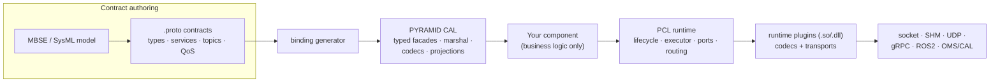
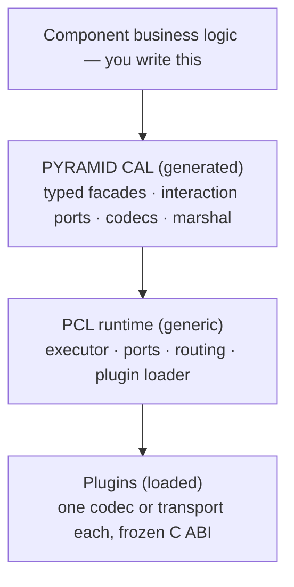
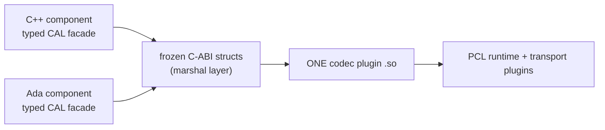

<!--
Slide deck for peer engineers. Render with Marp (VS Code Marp extension or
`marp --pdf`) or read as plain Markdown — GitHub renders the mermaid diagrams
inline. Deliberately artefact-level: no code, no per-API detail. Deep dives
are linked on the final slide.
-->

# PCL & PYRAMID

## …and the **PYRAMID Critical Abstraction Layer (CAL)**

An engineer's tour of the component runtime, the generated contract layer,
and how deployments are composed — **what you link, what you load, what you
configure**.

---

## The problem this stack solves

Building **portable, auditable, safety-arguable** mission-system components:

- Components must survive **middleware churn** — socket today, shared memory
  or ROS2 or gRPC tomorrow — *without rebuilding component code*.
- Components must survive **wire-format churn** — JSON ↔ FlatBuffers ↔
  Protobuf — likewise.
- One contract must serve **C++ and Ada** with identical semantics.
- Behaviour must **fail closed**: a missing codec or transport is a precise
  error, never a silent fallback.
- The interface **contract**, not the code, is the source of truth
  (MBSE/SysML → `.proto`).

---

## Three names to keep straight

| Name | What it is |
|------|-----------|
| **PCL** — PYRAMID Composition Library | The generic **runtime**: component lifecycle container, single-threaded executor, ports (pub/sub, unary & streaming services), plugin loader, transport routing. Pure C, zero dependencies, schema-neutral. |
| **PYRAMID** | The **contract & component layer**: `.proto` interface contracts, the binding generator, generated typed facades/codecs, and real components (e.g. Tactical Objects). |
| **PYRAMID Critical Abstraction Layer (CAL)** | The **generated bindings** between the two: typed facades, marshalling, codecs, and transport projections generated from the contract. Your component talks to the CAL; the CAL talks to PCL. |

> Naming caution: OMS/CAL ("Language-Agnostic CAL", LA-CAL) is an **external
> wire protocol** this stack can speak via a transport plugin. It is *not*
> the PYRAMID CAL described here.

---

## The big picture

- The **contract** owns meaning (payloads, interaction patterns, topics, QoS intent).
- The **CAL** owns translation (typed ↔ encoded ↔ C-ABI).
- **PCL** owns mechanics (threading, lifecycle, routing).
- **Plugins** own the wire — chosen at deployment, not compile time.

---

## PCL: the runtime in five bullets

- **Lifecycle container** — configure / activate / tick / deactivate /
  cleanup / shutdown, same state machine for every component.
- **Single-threaded executor** — all business logic runs on one executor
  thread; transports may own worker threads but *must queue ingress* to the
  executor. Component state needs no locks.
- **Ports** — publishers, subscribers, unary services, streaming services,
  consumed (client) endpoints.
- **Plugin loader** — `dlopen` with ABI version checks, uniform opaque
  JSON config pass-through to every plugin.
- **Fail closed** — no codec for a content type ⇒ error; no capable
  transport for a route ⇒ compose-time error with a precise diagnostic.

Pure C11, zero external dependencies — small enough to argue about.

---

## The CAL: what gets generated for you

From one `.proto` contract, per component:

| CAL artefact | Gives you |
|--------------|-----------|
| **Typed data model** | Native structs/enums in C++ and Ada |
| **Marshalling** | Native ↔ frozen C-ABI structs — the language-neutral boundary |
| **Service facades** | Typed handler interfaces (provider) and async-shaped clients (consumer) |
| **Topic helpers** | Typed publish/subscribe per contract topic |
| **Interaction facade** | Transaction-shaped ports: *submit a command, observe correlated status transitions* |
| **Wire codecs** | JSON / FlatBuffers / Protobuf encode–decode, shipped as plugins |
| **Transport projections** | gRPC service surface, ROS2 topics/services, typed ROS2 messages |
| **Artefact manifest** | Machine-readable record of endpoints, topics, QoS, interactions |

Your component implements typed handlers and calls typed APIs. **No wire
format, no transport, no threading appears in component code.**

---

## The CAL layering rule

| Layer | Owns | Never owns |
|-------|------|------------|
| Component | business behaviour | wire/transport branching |
| CAL | encode/decode, typed surfaces | mission logic |
| PCL | lifecycle, threading, routing | schemas, codec semantics |
| Plugins | one codec or transport | contract meaning |

---

## Codec ≠ transport: two independent deployment choices

- **Codec** — *how* a typed value becomes payload bytes
  (`application/json`, `application/flatbuffers`, `application/protobuf`, …).
- **Transport** — *how* those bytes move
  (in-process, TCP socket, shared memory, UDP, gRPC, ROS2, OMS/CAL).

Any codec rides any transport (coupled targets like gRPC/ROS2 bundle both).
Handler signatures are identical in every combination — swap either by
configuration, never by code.

One codec plugin `.so` serves **both C++ and Ada**, because it consumes the
frozen C-ABI structs rather than language types.

---

## The interaction model (what component authors actually see)

Grammar-conforming services are **ports**, programmed as transactions:

- **Request port** — submit a command, observe correlated status
  transitions (received → in-progress → completed/cancelled).
- **Information port** — a publication stream.

Each port leg can be realized as **RPC** *or* as **correlated pub/sub
topics** — chosen per leg, per deployment, in configuration:

- Same compiled component either way.
- The facade never fakes guarantees: no synthesized acks under pub/sub.
- Routing *both* realizations of one leg is a compose-time error.

---

## The capability model: composing transports safely

Every transport plugin **declares** what it can do; every contract endpoint
**requires** what it needs; composition validates the two and fails closed.

| Transport | pub/sub | unary RPC | stream RPC | reliability |
|-----------|:---:|:---:|:---:|---|
| TCP socket | ✓ | ✓ | ✗ | reliable |
| shared memory | ✓ | ✓ | ✓ | reliable |
| UDP | ✓ | ✗ | ✗ | best-effort |
| gRPC (coupled) | ✗ | ✓ | ✓ | reliable |
| ROS2 (coupled) | ✓ | ✓ | ✓ | configurable |
| OMS/CAL (LA-CAL) | ✓ | ✗ | ✗ | best-effort |

QoS is **intent vs capability**: the contract stamps a floor, the plugin
declares a ceiling; carrying a reliable-stamped topic over UDP requires an
explicit deployer decision, never a default.

---

## Build artefacts 1/3 — core static libraries

**What a process links.**

- **PCL**: the runtime library plus static transport implementations
  (socket, shared memory, UDP, an extendable template, APOS) — pure C,
  rebuildable for GNAT/Ada toolchains.
- **PYRAMID runtime**: shared services (logging, UUIDs, events, jobs), the
  LA-CAL WebSocket client, and component libraries (e.g. Tactical Objects
  domain runtime + its PCL component wrapper).

The defining property: a **plugin-only client links the runtime + its
marshal closure and nothing else** — no wire codec, no transport library.

---

## Build artefacts 2/3 — CAL marshal & codec libraries

**Generated static libraries, versioned by contract churn.**

- **Per-module marshal libraries** — one per data-model module (common,
  tactical, autonomy, sensors, …). Marshalling only: native ↔ C-ABI. A
  deployment ships only the modules its component actually uses, so an edit
  to an unrelated module changes nothing it ships (**churn isolation**).
- **Aggregate marshal library** — the single name existing C++/Ada
  consumers link.
- **Codec libraries** — the wire encoders (JSON/FlatBuffers/Protobuf
  service codecs), linked *into codec plugins*, not into clients.
- **Transport projection libraries** — generated gRPC/ROS2 support,
  absorbed by the corresponding coupled plugins.

---

## Build artefacts 3/3 — plugin dynamic libraries

**What a process loads. Never linked; `dlopen` behind a versioned C ABI.**

| Family | Artefacts | Changes when… |
|--------|-----------|---------------|
| Codec plugins | one per component × content type (JSON, FlatBuffers, Protobuf, OMS-JSON) | the contract changes |
| Transport plugins | socket, shared memory, UDP, LA-CAL | never (proto-agnostic) |
| Coupled plugins | gRPC (both directions), ROS2 (typed topic wire) | the contract changes |

Plus executables: component apps, bridge demos, examples, Ada binaries, and
the test suite. One aggregate build target produces every runtime plugin —
one CI stage from `.proto` to deployable `.so` set.

---

## Deployment configuration — the complete set

| Config | Role |
|--------|------|
| **Per-plugin config JSON** | wiring knobs per plugin instance (role, host/port, bus/participant, node name) |
| **Routing manifest** | declares transports + per-endpoint routes + one-realization-per-leg exclusivity; validated fail-closed at load |
| **Codec manifest** | list of codec plugins to auto-load (env var or flag) |
| **Transport manifest** | staged list of transport plugins to pass at launch |
| **Endpoint route config** | per-endpoint local vs remote (vs named peer) dispatch |
| **Interaction binding config** | RPC vs pub/sub realization per port leg |
| **Environment** | codec plugin lists for Ada; ROS2 runtime paths for the coupled plugin |

**The component binary is identical in every deployment** — all variation
lives in these files.

---

## Deployment staging & the offline SDK

**Per-component staging** produces a reviewable deployment directory:
plugins to load, headers + generated facade to compile, static libraries to
link (marshal *closure only*), and the codec/transport manifests to point
the runtime at.

**The offline SDK** goes further: generator, schema compiler, vendored
headers, prebuilt PCL for both toolchains, standalone C++/Ada project
templates — so a downstream, **firewalled** project builds codec plugins
from **its own contracts** without this monorepo or network access.

---

## Multi-language by construction

- Ada links **only** PCL + the marshal layer — never wire-format code.
- The same codec/transport `.so` files are loaded from both languages.
- Fail-closed semantics are verified in **both** languages.

---

## Interop reach today

- **gRPC** — coupled plugin, both directions; a stock gRPC peer needs no
  PCL knowledge.
- **ROS2** — coupled plugin; typed messages on the topic wire by default, so
  a plain `rclcpp` node interoperates directly (services still enveloped).
- **OMS/CAL (LA-CAL)** — live, proven peer of the AMS-GRA "Kitty Hawk"
  reference stack over the UCI 2.5 message set: real command round-trips
  and real sensor-sim telemetry.
- **Offline** — the SDK path for firewalled downstream projects.

---

## Where to read more

| Topic | Document (in `subprojects/PYRAMID/doc/`) |
|-------|-------------------------------------------|
| Single entry point | `guides/pyramid_user_guide.md` |
| **All build artefacts + deployment config** | `architecture/build_artefacts.md` |
| Plugin system, capability model, ABI | `architecture/transport_codec_plugin_system.md` |
| Generated bindings (the CAL) in depth | `architecture/generated_bindings.md` |
| Writing a component | `architecture/cpp_component_authoring.md` |
| Pub/sub & the interaction facade | `guides/pubsub_interaction_guide.md` |
| OMS / AMS-GRA / A-GRA compatibility | `architecture/oms_agra_compatibility.md` |
| Offline SDK | `architecture/sdk_packaging.md` |

*PCL details live in `subprojects/PCL/doc/`.*
